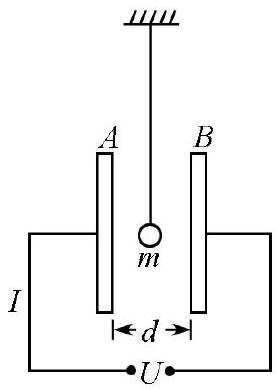

六、（15分）如图，两块大金属板 $A$ 和 $B$ 沿坚直方向平行放置，相距为 $d$ ，两板间加有恒定电压 $U$ ，一表面涂有金属膜的乒乓球垂吊在两板之间，其质量为 $m$ 。轻推乒乓球，使之向其中一金属板运动，乒乓球与该板碰撞后返回，并与另一板碰撞，如此不断反复。假设乒乓球与两板的碰撞为非弹性碰撞，其恢复系数为 $e$ ，乒乓球与金属板接触的时间极短，并在这段时间内达到静电平衡。达到静电平衡时，乒乓球所带的电荷量 $q$ 与两极板间电势差的关系可表示为 $|q|=C_{0} U$ ，其中 $C_{0}$ 为一常量。同时假设乒乓球半径远小于两金属板间距$d$ ，乒乓球上的电荷不影响金属板上的电荷分布；连接乒乓球的绳子足够长，乒乓球的运动可近似为沿水平方向的直线运动；乒乓球第一次与金属板碰撞时的初动能可忽略，空气阻力可忽略。试求：

1． 乒乓球运动过程中可能获得的最大动能；
2． 经过足够长时间后，通过外电路的平均电流。

