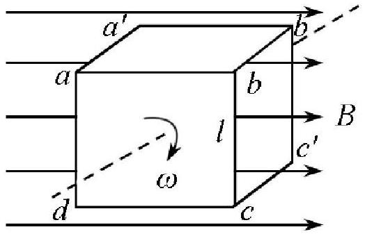
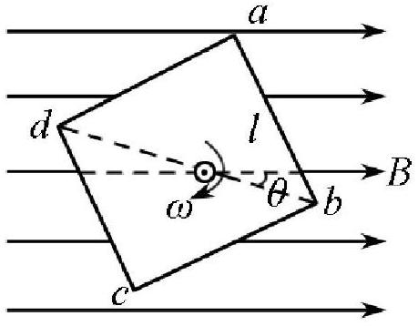

七、（20 分）如图（a）所示，十二根均匀的导线杆联成一边长为 $l$ 的刚性正方体，每根导线杆的电阻均为 $R$ 。该正方体在匀强磁场中绕通过其中心且与 $a b c d$ 面垂直的转动轴作匀速转动，角速度为 $\omega$ ，已知磁感应强度大小为 $B$ ，方向与转动轴垂直。忽略电路的自感。当正方体转动到如图（ $b$ ）所示位置（对角线 $b d$ 与磁场方向夹角为 $\theta$ ）时，求

1． 通过导线 $b a 、 a d 、 b c$ 和 $c d$ 的电流强度。
2． 为维持正方体作匀速转动所需的外力矩。

（a）

（b）
