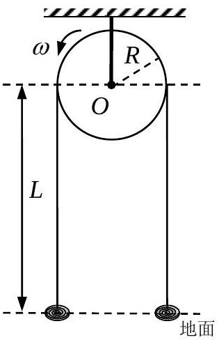

三、如图，质量线密度为 $\lambda$ 、不可伸长的软细绳跨过一盘状定滑轮，定滑轮半径为 $R$ ，轴离地面高度为 $L$ 。系统原处于静止状态。在 $t=0$ 时，滑轮开始以恒定角速度 $\omega$ 逆时针转动，绳子在滑轮带动下开始运动，绳子与滑轮间的动摩擦因数为 $\mu$ 。滑轮两侧的绳子在运动过程中始终可视为沿坚直方向，绳的两端在运动过程中均没有离开地面，地面上的绳子可视为集中在一点。已知重力加速度大小为 $g$ 。记绳子在与滑轮左、右侧相切处的张力大小分别为 $T_{1} 、 T_{2}$ 。
（1）分别列出在绳子速度达到最大值之前，滑轮两侧绳子的坚直部分及滑轮上任意一小段绳子的运动所满足的动力学方程组；
（2）求绳子可达到的最大速度的大小。

可参考的数学关系式：

$$
\begin{aligned}
& \frac{\mathrm{d} y}{\mathrm{~d} x}+\alpha y=\mathrm{e}^{-\alpha x} \frac{\mathrm{~d}\left(y \mathrm{e}^{\alpha x}\right)}{\mathrm{d} x} ; \\
& \int \mathrm{e}^{\alpha x} \cos x \mathrm{~d} x=\frac{\mathrm{e}^{\alpha x}}{1+\alpha^{2}}(\alpha \cos x+\sin x)+C_{1}, C_{1} \text { 为积分常数; } \\
& \int \mathrm{e}^{\alpha x} \sin x \mathrm{~d} x=\frac{\mathrm{e}^{\alpha x}}{1+\alpha^{2}}(\alpha \sin x-\cos x)+C_{2}, C_{2} \text { 为积分常数。 }
\end{aligned}
$$

参考答案：
（1）考虑滑轮左右两侧绳子的坚直部分及滑轮上任意一小段绳子的运动。对于滑轮左侧绳子的坚直部分，取向下为正。 $\mathrm{d} t$ 时间段由滑轮转入 $\mathrm{d} x=v \mathrm{~d} t$ 一小段，同样长度的另一小段落到地面，传入的静动量为零，从而动量的改变为 $\lambda L \mathrm{~d} v$ 。软绳落到地面的一段对绳没有反作用，所以，作用在这一段上的力为 $\lambda L g-T_{1}$ ，冲量是 $\left(\lambda L g-T_{1}\right) \mathrm{d} t$ 。由动量定理得

$$
-T_{1}+\lambda L g=\lambda L \frac{\mathrm{~d} v}{\mathrm{~d} t}
$$

对于右侧绳子的坚直部分，取向上为正。先考虑 $\mathrm{d} t$ 时间从地面上提升的一小段 $\mathrm{d} x=v \mathrm{~d} t$ ，其动量由 0 变为 $\lambda \mathrm{d} x v=\lambda v^{2} \mathrm{~d} t$ ，右侧绳子的坚直部分受力 $T^{\prime}-\lambda \mathrm{d} x g$ ，$T^{\prime}$ 是绳在地面处的张力。由动量定理得

$$
T^{\prime}-\lambda \mathrm{d} x g=\lambda v^{2}
$$

略去无穷小量后得

$$
T^{\prime}=\lambda v^{2}
$$

右侧绳子的坚直部分动量的变化为 $\lambda L \mathrm{~d} v$ ，作用于其上的力为 $T_{2}-\lambda L g-T^{\prime}=T_{2}-\lambda L g-\lambda v^{2}$ 。由动量定理得

$$
T_{2}-\lambda v^{2}-\lambda L g=\lambda L \frac{\mathrm{~d} v}{\mathrm{~d} t}
$$

对于滑轮上角度为 $\varphi$（取逆时针方向为正）处 $R \Delta \varphi$ 小段的软绳（见图 a），其质量为 $\lambda R \Delta \varphi$ ，两端所受的张力分别为 $T(\varphi+\Delta \varphi)$ 和$T(\varphi)$ ，滑轮对其支撑力为 $N R \Delta \varphi$ ，其中 $N$ 为 $\varphi$ 处对单位长度软绳的支撑力。分别沿切向和法向按牛顿第二定律列出方程

$$
\begin{aligned}
& T(\varphi+\Delta \varphi) \cos \frac{\Delta \varphi}{2}-T(\varphi) \cos \frac{\Delta \varphi}{2}+\mu N R \Delta \varphi-\lambda R \Delta \varphi g \cos \varphi \\
& =\lambda R \Delta \varphi \frac{\mathrm{~d} v}{\mathrm{~d} t} \\
& T(\varphi+\Delta \varphi) \sin \frac{\Delta \varphi}{2}+T(\varphi) \sin \frac{\Delta \varphi}{2}-N R \Delta \varphi+\lambda R \Delta \varphi g \sin \varphi \\
& =\lambda R \Delta \varphi \frac{v^{2}}{R}
\end{aligned}
$$

当 $\Delta \varphi$ 趋于 0 时，以上两式成为

$$
\begin{aligned}
& \frac{\mathrm{d} T}{\mathrm{~d} \varphi}+\mu N R-\lambda R g \cos \varphi=\lambda R \frac{\mathrm{~d} v}{\mathrm{~d} t} \\
& T-N R+\lambda R g \sin \varphi=\lambda R \frac{v^{2}}{R}
\end{aligned}
$$

从（3）（4）式消去 $N$ 得到

$$
\frac{\mathrm{d} T}{\mathrm{~d} \varphi}+\mu T-\lambda R g(\cos \varphi-\mu \sin \varphi)=\lambda R\left(\frac{\mathrm{~d} v}{\mathrm{~d} t}+\mu \frac{v^{2}}{R}\right)
$$

（1）（2）（3）（4）式或者（1）（2）（5）式构成了软绳运动所满足的动力学方程组。
（2）由于 $\omega$ 的取值不同，可以有两种情况；其一是 $\omega$ 足够大，在绳子达到最大速度值时，绳子和滑轮之间仍然有滑动；其二是 $\omega$ 较小，在绳子达到最大速度值时，绳子和滑轮之间没有滑动，则绳子速度的最大值就是 $R \omega$ 。
（解法一）
注意到（1）（2）式中只出现 $T_{1}$ 和 $T_{2}$ ，所以只需要由（5）式得到 $T_{1}$ 和 $T_{2}$ 的关系，而无需求出 $T(\varphi)$ 。借助于关系式

$$
\frac{\mathrm{d} T}{\mathrm{~d} \varphi}+\mu T=e^{-\mu \varphi} \frac{\mathrm{d}\left(T e^{\mu \varphi}\right)}{\mathrm{d} \varphi}
$$

（5）式可写为

$$
\frac{\mathrm{d}\left(T e^{\mu \varphi}\right)}{\mathrm{d} \varphi}=\lambda R g e^{\mu \varphi}(\cos \varphi-\mu \sin \varphi)+e^{\mu \varphi} \lambda R\left(\frac{\mathrm{~d} v}{\mathrm{~d} t}+\mu \frac{v^{2}}{R}\right)
$$

两边积分后得

$$
T_{1} e^{\mu \pi}-T_{2}=\lambda R g\left(\int_{0}^{\pi} e^{\mu \varphi} \cos \varphi \mathrm{d} \varphi-\mu \int_{0}^{\pi} e^{\mu \varphi} \sin \varphi \mathrm{d} \varphi\right)+\lambda R\left(\frac{\mathrm{~d} v}{\mathrm{~d} t}+\mu \frac{v^{2}}{R}\right) \int_{0}^{\pi} e^{\mu \varphi} \mathrm{d} \varphi
$$

此即

$$
T_{2}-T_{1} e^{\mu \pi}=\lambda R g \frac{2 \mu}{1+\mu^{2}}\left(e^{\mu \pi}+1\right)-\frac{\lambda R}{\mu}\left(e^{\mu \pi}-1\right)\left(\frac{\mathrm{d} v}{\mathrm{~d} t}+\mu \frac{v^{2}}{R}\right)
$$

［（解法二）
令

$$
T=\bar{T}+C_{1} \sin \varphi+C_{2} \cos \varphi+C_{3}
$$

代入⑤式，令等式左右两边三角函数项系数和常数项相同，得

$$
\begin{aligned}
& C_{1}=\lambda R g \frac{1-\mu^{2}}{1+\mu^{2}} \\
& C_{2}=\lambda R g \frac{2 \mu}{1+\mu^{2}} \\
& C_{3}=\frac{\lambda R}{\mu}\left(\frac{\mathrm{~d} v}{\mathrm{~d} t}+\mu \frac{v^{2}}{R}\right)
\end{aligned}
$$

方程变为

$$
\frac{\mathrm{d} \bar{T}}{\bar{T}}=-\mu \mathrm{d} \varphi
$$

积分得

$$
\bar{T}=\bar{T}_{0} e^{-\mu \varphi}
$$

即

$$
T=\bar{T}_{0} e^{-\mu \varphi}+\lambda R g \frac{1-\mu^{2}}{1+\mu^{2}} \sin \varphi+\lambda R g \frac{2 \mu}{1+\mu^{2}} \cos \varphi+\frac{\lambda R}{\mu}\left(\frac{\mathrm{~d} v}{\mathrm{~d} t}+\mu \frac{v^{2}}{R}\right)
$$

在滑轮两边与软绳相切处，对应于 $\varphi=0$ 和 $\varphi=\pi$ ，张力分别为 $T_{2}=T(0)$ 和 $T_{1}=T(\pi)$ 。

$$
\begin{aligned}
& T_{2}=\bar{T}_{0}+\lambda R g \frac{2 \mu}{1+\mu^{2}}+\frac{\lambda R}{\mu}\left(\frac{\mathrm{~d} v}{\mathrm{~d} t}+\mu \frac{v^{2}}{R}\right) \\
& T_{1}=\bar{T}_{0} e^{-\mu \pi}-\lambda R g \frac{2 \mu}{1+\mu^{2}}+\frac{\lambda R}{\mu}\left(\frac{\mathrm{~d} v}{\mathrm{~d} t}+\mu \frac{v^{2}}{R}\right)
\end{aligned}
$$

由此得到

$$
T_{2}-T_{1} e^{\mu \pi}=\lambda R g \frac{2 \mu}{1+\mu^{2}}\left(e^{\mu \pi}+1\right)-\frac{\lambda R}{\mu}\left(e^{\mu \pi}-1\right)\left(\frac{\mathrm{d} v}{\mathrm{~d} t}+\mu \frac{v^{2}}{R}\right)
$$

］
由（1）和（2）式得到

$$
T_{2}-T_{1} e^{\mu \pi}=\lambda v^{2}-\lambda L g\left(e^{\mu \pi}-1\right)+\lambda L\left(e^{\mu \pi}+1\right) \frac{\mathrm{d} v}{\mathrm{~d} t}
$$

由（9）（10）式得

$$
L g\left(e^{\mu \pi}-1\right)+R g \frac{2 \mu}{1+\mu^{2}}\left(e^{\mu \pi}+1\right)-e^{\mu \pi} v^{2}=\left(L\left(e^{\mu \pi}+1\right)+\frac{R}{\mu}\left(e^{\mu \pi}-1\right)\right) \frac{\mathrm{d} v}{\mathrm{~d} t}
$$

假设绳子与滑轮之间一直有滑动。当 $\frac{\mathrm{d} v}{\mathrm{~d} t}=0$ 时，绳子达到最大速度值 $v_{\text {max }}$ ，由（12）式得

$$
v_{\max }^{2}=L g\left(1-e^{-\mu \pi}\right)+R g \frac{2 \mu}{1+\mu^{2}}\left(1+e^{-\mu \pi}\right)
$$

即

$$
v_{\max }=\sqrt{L g\left(1-e^{-\mu \pi}\right)+R g \frac{2 \mu}{1+\mu^{2}}\left(1+e^{-\mu \pi}\right)}
$$

在此情况下，必有

$$
R \omega>\sqrt{L g\left(1-e^{-\mu \pi}\right)+R g \frac{2 \mu}{1+\mu^{2}}\left(1+e^{-\mu \pi}\right)}
$$

如果上式不满足，绳子达到最大速度值时与滑轮之间已经没有相对滑动，对应于

$$
v_{\max }=R \omega
$$

［在第（2）问中，由于只求最大速度，可在开始时令（1）（2）（5）式中的 $\frac{\mathrm{d} v}{\mathrm{~d} t}=0$ 计算。］
