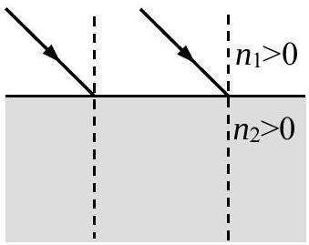
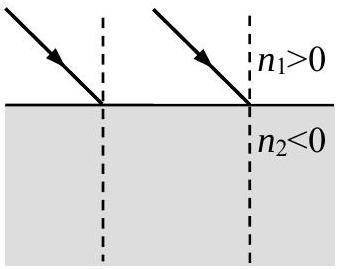
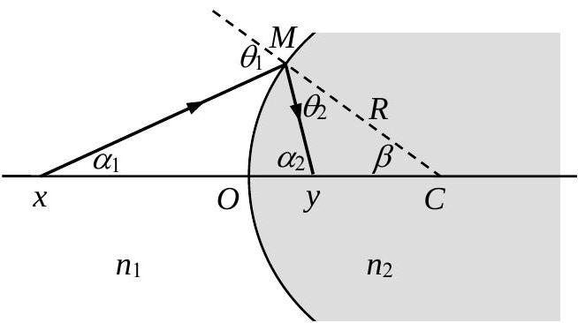
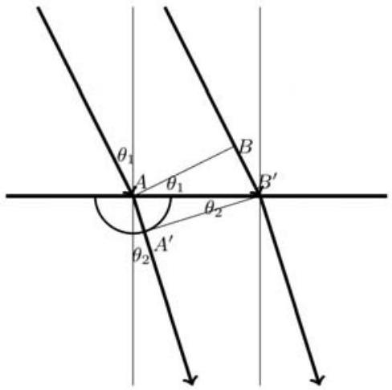
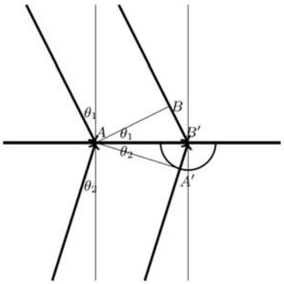
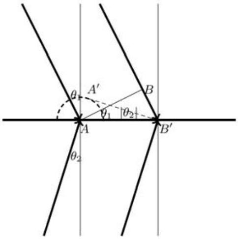
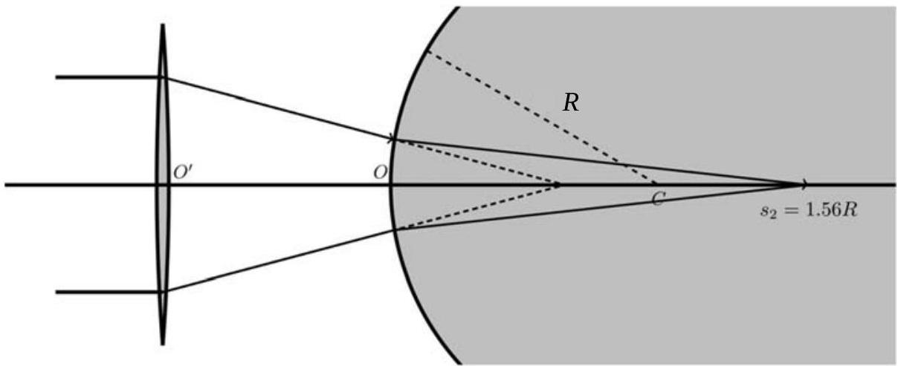

六、介质的折射率 $n$ 可以大于0，也可以小于0 。 $n$ 小于 0 的介质称为负折射介质。光在负折射介质内传播，其光程为负值（相位随传播距离的变化规律与在折射率为正的介质中的相反）。如果定义折射角与入射角在界面法线同侧时折射角为负，可以证明折射定律在介面两边有负折射介质时仍然成立，即

图 a

图 b

$n_{1} \sin \theta_{1}=n_{2} \sin \theta_{2}$ ，其中的 $n_{1}$ 和 $n_{2}$ 均可以大于0 或小于 $0, \theta_{2}$ 为折射角。
（1）设想一束平行光入射到界面上，根据惠更斯原理，在答题纸上画出图a 和图b所示情况下进入介质2的光线及对应的子波的示意图，并依此证明折射定律成立；
（2）如图 c 所示，半径为 $R$ 的球面将空间隔开为两个区域，其折射率分别记为 $n_{1}$（ $n_{1}>0$ ）、 $n_{2}\left(n_{2}<0\right)$ ，$C$ 点是球面的球心，

图 c

取某一光轴与球面的交点 $O$ 为原点。图中已画出此情形下一段入射光线和折射光线，$x$ 和 $y$ 分别为入射光线、折射光线与光轴的交点坐标。记物距为 $s_{1}$ ，像距为 $s_{2}$ 。在傍轴近似下导出球面的成像公式和横向放大率公式。请明确指出最后结果中各个量的正负号约定。
（3）设介质1为空气，即 $n_{1} \approx 1, n_{2}$ 可大于 0 也可小于 0 。在球面（参考图 c）前放置一普通薄凸透镜，透镜的光轴通过球心 $C$ ，焦点位于负折射介质区域内，透镜的焦距 $f=1.5 R$ ，透镜中心 $O^{\prime}$ 点与 $O$ 点的距离为 $d$ 。一束沿光轴传播的平行光入射到薄透镜。分别就表中四组参数计算入射光在光轴上会聚点离 $O$ 点的距离，并在答题纸上画出序号4 情形的光路示意图。

| 序号 | $n_{2}$ | $d$ |
| :--- | :--- | :--- |
| 1 | 1.5 | $0.35 R$ |
| 2 | 1.5 | $0.85 R$ |
| 3 | －1．5 | $0.35 R$ |
| 4 | －1．5 | $0.85 R$ |

参考解答：
（1）当 $n_{1}>0, n_{2}>0$ 时，如图 1a 所示，$A B$ 为入射光的等光程（等相位）面，当 $B$ 点到达 $B^{\prime}$ 时，$A$ 点发出的子波的波前在介质2中位于一个以 $A$ 点为球心的半球面上，此球面在光线的入射面上是半径为 $r$ 的半圆，半径 $r$ 由下式确定

$$
n_{2} r=n_{1}\left|B B^{\prime}\right|
$$

做直线 $B^{\prime} A^{\prime}$ 与子波相位面的圆相切于 $A^{\prime}$ 点，则 $B^{\prime} A^{\prime}$ 是等光程（等相位）面。由几何关系

$$
\begin{aligned}
& \left|B B^{\prime}\right|=\left|A B^{\prime}\right| \sin \theta_{1} \\
& r=\left|A B^{\prime}\right| \sin \theta_{2}
\end{aligned}
$$

由以上方程得到

$$
n_{1} \sin \theta_{1}=n_{2} \sin \theta_{2}
$$

当 $n_{1}>0, n_{2}<0$ 时，在介质 2 中传播的光的光程为负。
（解法一）
如图1b所示，在 $B^{\prime}$ 发出的子波的波前是半径为 $r$ 的半圆，对应于光程 $n_{2} r<0$ 。因此，在介质2中与 $A$ 点等相位的面由通过 $A$ 点与圆相切的线确定，切点为 $A^{\prime}$ 。圆的半径由下式确定

$$
n_{1}\left|B B^{\prime}\right|+n_{2}\left|B^{\prime} A^{\prime}\right|=0
$$

由几何关系

$$
\left|B B^{\prime}\right|=\left|A B^{\prime}\right| \sin \theta_{1}, \quad\left|B^{\prime} A^{\prime}\right|=\left|A B^{\prime}\right| \sin \left|\theta_{2}\right|
$$

由以上方程得到

$$
n_{1}\left|A B^{\prime}\right| \sin \theta_{1}=-n_{2}\left|A B^{\prime}\right| \sin \left|\theta_{2}\right|=n_{2}\left|A B^{\prime}\right| \sin \theta_{2}
$$

即

$$
n_{1} \sin \theta_{1}=n_{2} \sin \theta_{2}
$$

［（解法二）
如图1b＇所示，$A B$ 为入射光的等光程（等相位）面，当 $B$ 点到达 $B^{\prime}$ 时，$A$ 点发出的子波的波前在介质2中的入射面上是以 $A$点为圆心，半径为 $r$ 的圆，对应于光程 $n_{2} r<0$ 。半径 $r$ 由下式确定

$$
\left|n_{2}\right| r=n_{1}\left|B B^{\prime}\right|
$$

因光程为负，等效于等光程面反向移动，成为在介质1中以虚线画出的半圆。做直线 $B^{\prime} A^{\prime}$ 与虚线的子波相位面的圆相切于 $A^{\prime}$点，则 $B^{\prime} A^{\prime}$ 是等光程（等相位）面。由几何关系

$$
\left|B B^{\prime}\right|=\left|A B^{\prime}\right| \sin \theta_{1}, \quad r=\left|A B^{\prime}\right| \sin \left|\theta_{2}\right|
$$

由以上方程得到

图1a

图 1b

图 1b＇

$$
n_{1} \sin \theta_{1}=n_{2} \sin \theta_{2}
$$

（2）约定物侧的物距 $s_{1}$ 和像侧的像距 $s_{2}$ 取为正，物侧的像距和像侧的物距取为负。入射角 $\theta_{1}$为正，折射角 $\theta_{2}$ 为负。其余图中标出的角度均取为正。由图c可见

$$
\theta_{1}=\alpha_{1}+\beta, \quad-\theta_{2}=\alpha_{2}-\beta
$$

在傍轴条件下，这些角度均为小角度，有

$$
\sin \theta_{1}=\theta_{1}, \quad \sin \theta_{2}=\theta_{2}
$$

以及

$$
\begin{aligned}
& \tan \alpha_{1}=\sin \alpha_{1}=\alpha_{1}=\frac{h}{s_{1}} \\
& \tan \alpha_{2}=\sin \alpha_{2}=\alpha_{2}=\frac{h}{s_{2}} \\
& \tan \beta=\sin \beta=\beta=\frac{h}{R}
\end{aligned}
$$

这里，$h$ 是折射点 $M$ 与光轴的距离。由折射定律

$$
n_{1} \sin \theta_{1}=n_{2} \sin \theta_{2}
$$

即

$$
n_{1}\left(\frac{h}{s_{1}}+\frac{h}{R}\right)=-n_{2}\left(\frac{h}{s_{2}}-\frac{h}{R}\right)
$$

整理得到

$$
\frac{n_{1}}{s_{1}}+\frac{n_{2}}{s_{2}}=\frac{n_{2}-n_{1}}{R}
$$

注意到 $n_{2}<0, n_{1}>0$ ，上式右方为负。
为计算横向放大率，如图2所示，考虑物 $Q_{1} P_{1}$ ，设像为 $Q_{2} P_{2}$ 。设想光轴绕 $C$ 点转过一个小角，使得 $P_{1}$ 点位于光轴上，原 $Q_{1}$ 转到 $Q_{1}^{\prime}, Q_{2}$ 转到 $Q_{2}^{\prime}, P_{1}$ 的像为 $P_{2}$ ，在傍轴近似下，因转角很小

$$
\begin{aligned}
& Q_{1} P_{1}=Q_{1} Q_{1}^{\prime} \\
& Q_{2} P_{2}=Q_{2} Q_{2}^{\prime}
\end{aligned}
$$

由图2的几何关系有

$$
\begin{aligned}
& \left|Q_{1} P_{1}\right|=s_{1} \theta_{1} \\
& \left|Q_{2} P_{2}\right|=-s_{2} \theta_{2}
\end{aligned}
$$

由此得到横向放大率公式

$$
\frac{\left|Q_{2} P_{2}\right|}{\left|Q_{1} P_{1}\right|}=\frac{-s_{2} \theta_{2}}{s_{1} \theta_{1}}=-\frac{s_{2} n_{1}}{s_{1} n_{2}}
$$

（3）（12分）如图3所示，如果没有球面隔开的介质2，平行光经过薄凸透镜后将汇聚于焦点，如图中虚线所示。在引入介质2后，虚线所示的汇聚点是球面的虚物，对应的物距是

$$
s_{1}=-(f-d)
$$

如果 $n_{2}>0$ ，已知球面的成像公式为

$$
\frac{n_{1}}{s_{1}}+\frac{n_{2}}{s_{2}}=\frac{n_{2}-n_{1}}{R}
$$

形式上与（2）中求出的成像公式完全相同，在 $n_{2}>0$ 和 $n_{2}<0$ 的情况下像距 $s_{2}$ 都可以解出为

$$
s_{2}=\frac{n_{2} s_{1} R}{n_{2} s_{1}-n_{1}\left(s_{1}+R\right)}=\frac{n_{2} R(f-d)}{\left(n_{2}-n_{1}\right)(f-d)+n_{1} R}
$$

对于题中给出的数据，求得各自的 $s_{2}$ ，如下表所示：

| 序号 | $n_{2}$ | $d$ | $s_{2}$ |
| :--- | :--- | :--- | :--- |
| 1 | 1.5 | $0.35 R$ | $1.10 R$ |
| 2 | 1.5 | $0.85 R$ | $0.74 R$ |
| 3 | －1．5 | $0.35 R$ | $0.92 R$ |
| 4 | －1．5 | $0.85 R$ | $1.56 R$ |

按照表中结果，画出的示意图由图3给出。

图3
