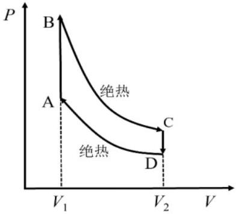

三、量子热机是利用量子物质作为工作物质进行循环的热机。下面以二能级原子系统为例描述量子热机的工作原理。二能级原子的平均能量定义为

$$
\langle E\rangle=p_{0} \cdot E_{0}+p_{1} \cdot E_{1},
$$

其中 $E_{0} 、 p_{0}$ 和 $E_{1} 、 p_{1}$ 分别表示原子处于基态和激发态的能量、概率。为简单起见，假设$E_{0}=0$ ，在循环过程中激发态与基态的能量差是一个可调参量。该原子处于能量为 $E$ 的能态的概率满足玻尔兹曼分布

$$
p \propto \mathrm{e}^{-E /\left(k_{\mathrm{B}} T\right)},
$$

其中 $T$ 为热力学温度，$k_{\mathrm{B}}$ 为玻尔兹曼常量。在准静态过程中，平均能量的变化为

$$
\mathrm{d}\langle E\rangle=p_{1} \mathrm{~d} E_{1}+E_{1} \mathrm{~d} p_{1},
$$

其中 $p_{1}\,\mathrm{d}E_{1}$ 为能级变化引起的能量变化，对应外界对二能级原子系统所做的功；$E_{1}\,\mathrm{d}p_{1}$ 为概率变化引起的能量变化，对应外界对二能级原子系统的传热。
（1）将二能级原子系统与一个温度为 $T$ 的热源接触，求热平衡时二能级原子系统处在基态的概率 $p_{0}$ 和激发态的概率 $p_{1}$ 。
（2）经典奥托循环的 $P-V$ 图如图2a所示，其中 $\mathrm{A} \rightarrow \mathrm{B}$ 和 $\mathrm{C} \rightarrow \mathrm{D}$是等容过程，B → C 和 D → A 是绝热过程。试画出量子奥托循环过程中二能级的能量差 $E_{1}$ 与激发态概率 $p_{1}$ 的关系示意图，并计

图2a

算量子奥托循环四个过程中的传热、内能增量和对外做功。
（3）类似地，计算量子卡诺循环各个过程中的传热、内能增量和对外做功。假设量子卡诺循环中高温热源温度 $T_{h}$ 和低温热源温度 $T_{l}$ 分别与量子奥托循环的最高温度和最低温度相同，试比较量子奥托热机和量子卡诺热机的工作效率。
