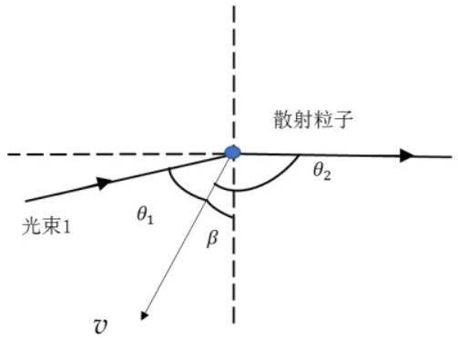
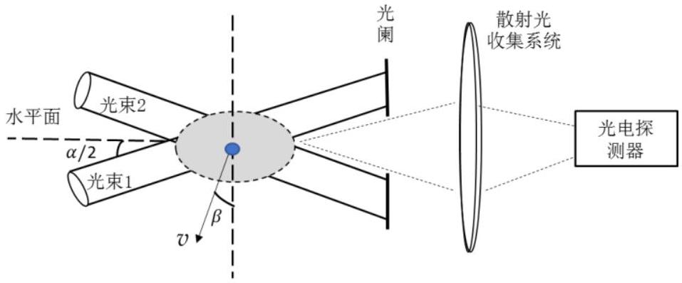

四、自1964年 Yeh 和 Cummins 观察到水流中粒子的散射光多普勒频移至今，激光多普勒测速技术已获得了广泛应用。为了得到足够的散射光强，通常在流体中散播尺寸和浓度适当的示踪散射粒子，激光照射到运动粒子上时发生散射，从而获得粒子（和流体）的速度信息。设粒子速度 $v$ 与坚直方向的夹角为 $\beta$ 。
（1）如图4a 所示，一束频率为 $f$ 的光被流体中的运动粒子所散射。光在流体中的传播速率为 $c / n ~(n$ 为流体的折射率），粒子以速度 $v$ 运动（ $v \ll c / n$ ）。入射光和观测到的散射光的传播方向与粒子速度的夹角分别为 $\theta_{1}$ 和 $\theta_{2}$ 。求散射光相对于入射光的频移量 $\Delta f$ 与散射光方向的关系。设粒子的速率 $v=1 \mathrm{~m} / \mathrm{s}$ ，光的频率 $f=10^{14} \mathrm{~Hz}, ~ \Delta f$ 能否可以

图4a

直接用分辨率为5MHz 的光谱仪进行检测？
（2）如图4b所示，用频率为 $f$ 的两束相干平行光（其传播方向在同一坚直平面内）照射流体中同一粒子，两束光与水平面的夹角均为$\alpha / 2$（ $\alpha$ 比较小）。两束光的散射光到达光电探测器的相位分别为 $\phi_{1}$ 和 $\phi_{2}$ ，散射光的

图4b

电场矢量方向近似相同且振幅均为 $E_{0}$ 。光电探测器输出的电流强度正比于它接收到的光强，比例常量为 $k$ 。假设光电探测器的频率响应范围为$10^{2} \sim 10^{7} \mathrm{~Hz}$ ，求光电探测器的输出电流表达式。为简单起见，假设粒子速度处于照射在粒子上的两束入射光所在平面内。
（3）设 $X O Z$ 平面内两束相干平行光相对于 $X$ 轴对称入射到达相交区域（见图4c），求干涉条纹间距；粒子（其速度在 $X O Z$ 平面内）经过明暗相间的干涉条纹区将散射出光脉冲，求光脉冲的频率。五、在恒星之间的广阔宇宙空间中存在星际介质。在宇宙射线的作用下，星际介质中的分子失去部分电子成为正离子，电子则游离在外，成为等离子态。脉冲星是高速旋转、具有超强磁场的中子星，地球上所观测到其发出的电磁辐射是脉冲信号。脉冲星信号可用于星际导航和高精度计时，为此需要获得脉冲信号到达地球的精确时间，研究其电磁辐射的相位变化与色散。

一脉冲星到地球的距离为 $d$ ，星际介质中的电子平均数密度为 $n_{\mathrm{e}}$（数量级为 $10^{4} \mathrm{~m}^{-3}$ ）；假设介质中存在匀强静磁场 $B$（数量级为 $10^{-10} \mathrm{~T}$ ），其方向平行于电磁波的传播方向。已知电子质量为 $m_{\mathrm{e}}$ ，电荷为 $-e \quad(e>0)$ ，真空介电常量为 $\varepsilon_{0}$ ，真空中光速为 $c$ 。
（1）取该脉冲星到地球的电磁辐射方向为 $z$ 轴正向，对于频率为 $f$ 的电磁波，其电场为$E_{x}=E_{0} \cos (k z-2 \pi f t), E_{\mathrm{y}}=E_{0} \cos \left(k z-2 \pi f t \pm \frac{\pi}{2}\right)$ ，式中 $E_{0}$ 和 $k$ 分别为电磁波的振幅和波数。为简单起见，设 $E_{0}$ 为常量、且电磁波本身的磁场对电子的作用可忽略，求电子运动的回旋半径 $R_{\mathrm{e}}$ 。
（2）脉冲星信号在星际介质中传播时会发生色散，其传播速度大小（群速度的大小 $v_{\mathrm{g}}$ ）依赖于电磁波频率相对于波数的变化率：$v_{\mathrm{g}}=2 \pi \frac{\mathrm{~d} f}{\mathrm{~d} k}$ 。求能通过介质到达地球的脉冲星信号电磁波的最低频率 $f_{\mathrm{c}}$ 。
（3）假设在脉冲星信号的传播路径上，星际介质中的电子平均数密度 $n_{\mathrm{e}}$ 保持不变，问脉冲星信号中频率为 $f$ 的电磁波到达地球的时间比其在真空中传播的时间延迟了多少？
（4）观测发现，从脉冲星同时出发的频率为 $f$ 的电磁波到达地球时出现了相位差，求该相位差（可取近似：$\frac{e}{2 \pi} \sqrt{\frac{n_{\mathrm{e}}}{\varepsilon_{0} m_{\mathrm{e}}}} \ll f, \frac{e B}{2 \pi m_{\mathrm{e}}} \ll f$ ）。
（5）如果在传播途中长度为 $a$ 的区间内电子数密度出现涨落 $\Delta n_{\mathrm{e}}$ ，求脉冲星信号中频率为$f$ 的电磁波通过该区间后由电子数密度涨落引起的相位移动。
