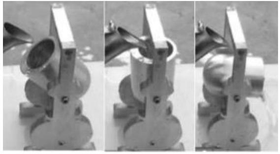
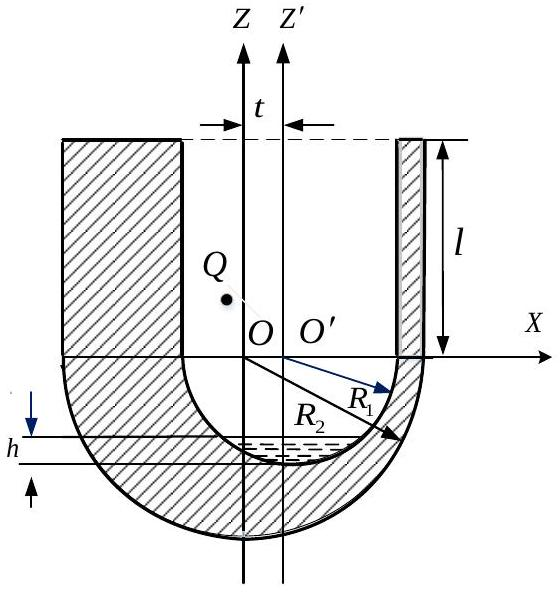

七、据《荀子•宥坐篇》记载，孔子观于鲁桓公之庙，有欹（ $\mathrm{q} \overline{1}$ ）器焉。欹器者，＂虚则欹，中则正，满则覆。＂悬挂式欹器实物如图7a所示：欹器空时，器身倾斜；注水适中，器身正立；注水过满，器身倾覆。图7b为悬挂式欹器的正视剖面图。整个歌器的外轮廓是相对于 $Z$ 轴的回转面，$Z^{\prime}$ 轴为内部镗腔的对称轴，容器内壁与外壁的半球壳半径分别为 $R_{1}=R$ 和$R_{2}=\sqrt{3} R$ ，两半球的球心 $O$ 和 $O^{\prime}$ 均位于 $X$ 轴上。 $Z^{\prime}$轴和 $Z$ 轴相距 $t=3 R / 10$ ，欹器圆柱部分的长度$l=2 R$ 。歌器的一对悬挂点所在直线与 $X O Z$ 平面交于$Q$ 点，其坐标为（ $x_{Q}=-R / 10, z_{Q}=2 \sqrt{3} R / 11$ ）。欹器材质均匀，其密度 $\rho_{1}$ 为水的密度 $\rho_{2}$ 的3倍。不计摩擦。
（1）求空欹器自由悬挂平衡时 $Z$ 轴与坚直方向的夹角。
（2）求空欹器绕一对悬挂点所在轴的转动惯量及

图7a

图7b

其在平衡位置附近微振动的角频率（已知密度为 $\rho$ 、半径为 $R$ 的匀质球体绕过其质心的轴的转动惯量为 $I_{1}=\frac{8}{15} \pi \rho R^{5}$ ；半径为 $R$ 、长度为 $L$ 的匀质圆柱体绕过其质心且平行于圆柱底面的轴的转动惯量为 $I_{2}=\frac{\pi \rho R^{2} L\left(3 R^{2}+L^{2}\right)}{12}$ ）。
（3）让空歌器自由悬挂，并开始往欹器内缓慢注水，问歌器内水面到底部的距离 $h$ 为多少时器身正立？
（4）简述欹器＂满则覆＂的临界条件。
