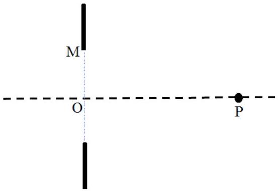

一、（64 分）一个不透明薄片上的小圆孔如图1a 中黑色之间的部分所示，半径 OM 为 1.00 mm 。用波长$\lambda=632.8 \mathrm{~nm}$ 的氦氛激光作为光源从小孔左侧平行正入射。在垂直于小孔的对称轴上右侧有某个点 P ；相对于 P 点，小孔处的波面可视为半波带的组合：以 P点为球心， P 点到小孔中心 O 的距离为 $r_{0}\left(r_{0} \gg \lambda\right)$ ，分别以 $r_{0}+\frac{\lambda}{2} 、 r_{0}+2 \times \frac{\lambda}{2} 、 r_{0}+3 \times \frac{\lambda}{2} 、 \cdots$ 为半径做球

图1a

面，将小孔所在平面的波面划分成 $N$ 个环带（ $N$ 为自然数）， P 点到小孔边缘 M 的距离为 $r_{0}+N \frac{\lambda}{2}$ ，半径最小的环带则是一个圆面，这样划分出的环带称为半波带（因为相邻环带的相应边缘到 P 点的光程差为 $\frac{\lambda}{2}$ ）。显然，环带的数目 $N$决定了 P 点的位置。在需要将原有半波带重新划分或合并时，只考虑将已有的每个半波带重新划分为若干个新的半波带，或者将已有的若干个半波带重新合并为一个新的半波带。
（1）（8 分）若 $N=2 n+1$ ，试分别求相应于 $n=0$ 和 $n=1$ 时 P 点的位置 $\mathrm{P}_{0}$（ $\mathrm{P}_{0}$ 为轴上最右侧的亮点，称为主焦点）和 $\mathrm{P}_{1}$（ $\mathrm{P}_{1}$ 也为亮点，称为次焦点）。
（2）（24 分）若 $N=4$（4 级波带片），且在第 1、3半波带放置透明材料（图1b中灰色部分），使通过该透明材料的光增加 $\frac{\lambda}{2}$ 光程。求

（i） （8 分）此4级波带片的主焦点 $\mathrm{P}_{0}^{\prime}$ 的位置；
（ii） （8 分）紧邻主焦点 $\mathrm{P}_{0}^{\prime}$ 左侧暗点 $\mathrm{P}_{-1}^{\prime}$ 的位置；
（iii） （8 分）紧邻主焦点 $\mathrm{P}_{0}^{\prime}$ 右侧暗点 $\mathrm{P}_{+1}^{\prime}$ 的位置。

（3）（32 分）波带片不仅可以实现平行光的聚焦，还可以成像。以上的 4 级波带片平行光的聚焦过程，相当于物距无穷远、像距等于焦距的情形。将一个点光源（物）置于轴上O 点左侧 3 m 处的 S 点，其像点为 $\mathrm{S}^{\prime}$ ，如图 1c 所示。
（i）（10分）4级波带片主焦点对应的像距 $\mathrm{OS}^{\prime}$ 是多少？并验证成像公式是否满足。
（ii）（8 分）如果该波带片所成的像不是唯一的，轴上还有其他像点，那么距离第（3）（i）问所得到的像点最近的另一个像点在哪里？与此成像过程对应的次焦点的焦距是多少？（不能应用成像公式）
（iii）（14分）如果将物放置于此波带片左侧，与 O 点距离为 $\mathrm{OP}_{0}^{\prime} / 2$ ，求分别将4级波带片的主焦点和（3）（ii）所述的次焦点作为焦点而成的像的类型（虚像或实像）与位置。（不能应用成像公式）

参考解答：
（1）（8分）对于焦点 P ，固定点 PO 和 PM 的距离差为 $1 / 2$ 波长。设 P 到小孔中心的距离为$r_{0}$（ P 点位置坐标为 $x$ ），由半波带法有

$$
\sqrt{R^{2}+r_{0}^{2}}=r_{0}+\frac{\lambda}{2}
$$

式中 $R$ 是小圆孔半径。利用题给数据得

$$
1.00^{2}+x_{0}^{2}=\left(x_{0}+0.3164 \times 10^{-3}\right)^{2},
$$

式中 $r_{0}=x_{0} \mathrm{~mm}$ 。由此得

$$
r_{0}=1580 \mathrm{~mm}
$$

设 3 波带焦点 $\mathrm{P}_{1}$ 到小孔中心的距离为 $r_{1}$（ $\mathrm{P}_{1}$ 位置坐标为 $x_{1}$ ），由半波带法有

$$
\sqrt{R^{2}+r_{1}^{2}}=r_{1}+(2 \times 1+1) \frac{\lambda}{2}
$$

利用题给数据得

$$
1.00^{2}+x_{1}^{2}=\left(x_{1}+3 \times 0.3164 \times 10^{-3}\right)^{2},
$$

式中 $r_{1}=x_{1} \mathrm{~mm}$ 。由此得

$$
r_{1}=527 \mathrm{~mm}
$$

（2）（i）（8分）由于灰色部分增加了1／2波长，导致所有波带到达固定点 $\mathrm{P}_{0}^{\prime}$ 时，其光程差同中心波带的光程差变为 $0, \lambda, \lambda$ ，因此四个波带在固定点 $\mathrm{P}_{0}^{\prime}$ 处并非两两相消，而是共同增强，形成焦点。在计算几何长度时，最外侧波带外缘的几何长度与中心轴线的几何长度相比，增加 $2 \lambda$ ，故

$$
\sqrt{R^{2}+r_{0}^{\prime 2}}=r_{0}+2 \lambda
$$

利用题给数据得

$$
1.00^{2}+x^{\prime 2}=\left(x^{\prime}+4 \times 0.3164 \times 10^{-3}\right)^{2},
$$

式中 $r_{0}^{\prime}=x^{\prime} \mathrm{mm}$ 。由此得

$$
r_{0}^{\prime}=395 \mathrm{~mm}
$$

（ii）（8 分）紧邻焦点 $\mathrm{P}_{0}^{\prime}$ 左侧的暗点 $\mathrm{P}_{-1}^{\prime}$ 出现于进一步划分波带片为 8 个波带结构，

$$
\sqrt{R^{2}+r_{-1}^{\prime 2}}=r_{0}+4 \lambda
$$

利用题给数据得

$$
1.00^{2}+x_{-1}^{\prime 2}=\left(x_{-1}^{\prime}+8 \times 0.3164 \times 10^{-3}\right)^{2},
$$

式中 $r_{-1}^{\prime}=x_{-1}^{\prime} \mathrm{mm}$ 。由此得到暗点 $\mathrm{P}_{-1}^{\prime}$ 坐标为

$$
r_{-1}^{\prime}=198 \mathrm{~mm}
$$

（iii）（8 分）紧邻焦点 $\mathrm{P}_{0}^{\prime}$ 右侧的暗点 $\mathrm{P}_{+1}^{\prime}$ 出现于四个波带两两归并，整体视为两个波带时出现：

$$
\sqrt{R^{2}+r_{+1}^{\prime 2}}=r_{0}+\lambda
$$

利用题给数据得

$$
1.00^{2}+x_{+1}^{\prime 2}=\left(x_{+1}^{\prime}+2 \times 0.3164\right)^{2},
$$

式中 $r_{+1}^{\prime}=x_{+1}^{\prime} \mathrm{mm}$ 。得到暗点 $\mathrm{P}_{+1}^{\prime}$ 坐标为

$$
r_{+1}^{\prime}=790 \mathrm{~mm}
$$

（3）（i）（10分）光线从波带片最外侧经转折到达像点时，其几何路径长度和轴线相比，增加了 $2 \lambda$ 。方程为

$$
\sqrt{s_{\text {物 }}^{2}+R^{2}}+\sqrt{s_{\text {像 }}^{2}+R^{2}}=s_{\text {物 }}+s_{\text {像 }}+4 \times \frac{\lambda}{2}
$$

式中 $s_{\text {物 }}=\mathrm{OS}, s_{\text {像 }}=\mathrm{OS}^{\prime}$ 。利用题给数据得

$$
\sqrt{3000^{2}+1.00^{2}}+\sqrt{x_{2}^{2}+1.00^{2}}=3000+x_{2}+2 \lambda
$$

式中 $s_{\text {像 }}=x_{2} \mathrm{~mm}$ 。由此解出

$$
s_{\text {像 }}=455 \mathrm{~mm}
$$

成像公式为

$$
\frac{1}{s_{\text {物 }}}+\frac{1}{s_{\text {像 }}}=\frac{1}{f}
$$

代入题给数据得

$$
f=395 \mathrm{~mm}
$$

和4级波带片焦距 $r_{0}^{\prime}$ 即（6）式一致，成像公式成立。
（ii）（8 分）下一个像点，需要将4级波带片拆解为12级波带片。因此上一问中所表述的路径差即为 $6 \lambda$ ，方程为

$$
\sqrt{s_{\text {物 }}^{2}+R^{2}}+\sqrt{s_{\text {像 }}^{\prime 2}+R^{2}}=s_{\text {物 }}+s_{\text {像 }}^{\prime}+3 \times 4 \times \frac{\lambda}{2}
$$

利用题给数据得

$$
\sqrt{3000^{2}+1.00^{2}}+\sqrt{x_{3}^{2}+1.00^{2}}=3000+x_{3}+6 \lambda
$$

式中 $s_{\text {像 }}^{\prime}=x_{3} \mathrm{~mm}$ 。由此解出

$$
s_{\text {像 }}^{\prime}=137 \mathrm{~mm}
$$

对应的次焦点是将4级波带片拆解为12级波带片时对应的焦点。每个波带片按照奇数次拆分时可获得对应的新的次级焦点，因此4级波带片中的每个波带需拆分为3个波带才能获得此次焦点。

$$
\sqrt{f^{\prime 2}+R^{2}}=f^{\prime}+3 \times 4 \times \frac{\lambda}{2}
$$

其中 $f^{\prime}$ 为次焦点的焦距。利用题给数据得

$$
\sqrt{f^{\prime 2}+1.00^{2}}=f^{\prime}+6 \lambda
$$

由此解出：

$$
f^{\prime}=132 \mathrm{~mm}
$$

即次焦距为132mm。
（iii）（14分）考虑将4级波带片的主焦点作为焦点而成的像。由于物点在左侧主焦点和波带片之间，仍然在左侧。由（6）式或（14）式知

$$
f=r_{0}^{\prime}=395 \mathrm{~mm},
$$

据题意知物距为

$$
s_{\text {物 }}=\frac{f}{2}=198 \mathrm{~mm}
$$

设像距为 $s_{\text {像 }}^{\prime \prime}$ ，则

$$
\sqrt{s_{\text {物 }}^{2}+R^{2}}+\sqrt{s_{\text {像 }}^{\prime \prime 2}+R^{2}}=s_{\text {物 }}+s_{\text {像 }}^{\prime \prime}+4 \times \frac{\lambda}{2}
$$

利用题给数据得

$$
\sqrt{198^{2}+1.00^{2}}+\sqrt{x_{4}^{2}+1.00^{2}}=198+x_{4}+2 \lambda
$$

式中 $s_{\text {像 }}^{\prime \prime}=x_{4} \mathrm{~mm}$ 。由此解出

$$
s_{\text {像 }}^{\prime \prime}=-396 \mathrm{~mm},
$$

即该像点为虚像，在左侧焦点位置。

考虑将在第（3）（ii）小问中所述的次焦点作为焦点所成的像。设像距为 $s_{\text {像 }}^{\prime \prime \prime}$ ，则

$$
\sqrt{s_{\text {物 }}^{2}+R^{2}}+\sqrt{s_{\text {像 }}^{\prime \prime \prime 2}+R^{2}}=s_{\text {物 }}+s_{\text {像 }}^{\prime \prime \prime}+3 \times 4 \times \frac{\lambda}{2}
$$

利用题给数据得

$$
\sqrt{198^{2}+1^{2}}+\sqrt{x_{5}^{2}+1^{2}}=198+x_{5}+6 \lambda
$$

式中 $s_{\text {像 }}^{\prime \prime \prime}=x_{5} \mathrm{~mm}$ 。由此解出

$$
s_{\text {像 }}^{\prime \prime \prime}=393 \mathrm{~mm},
$$

即该像点为实像，在波带片右侧393mm处的位置。

评分标准：
第（1）问8分，（2）（4）式各4分；
第（2）问24分，
第（i）小问8分，（5）（6）式各4分；
第（ii）小问8分，（7）（8）式各4分；
第（iii）小问8分，（9）（10）式各4分；
第（3）问32分，
第（i）小问10分，（11）（12）式各4分，（14）式2分；
第（ii）小问8分，（15）（16）（17）（18）式各2分；
第（iii）小问14分，（20）式3分，（21）（22）式各2分，（23）式3分，（24）式2分，结论（25）式2分。
