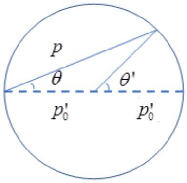
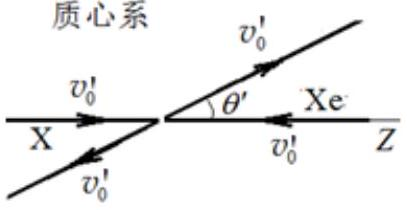
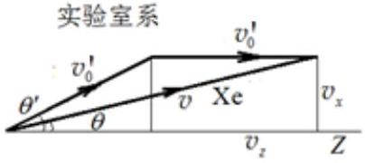
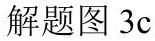
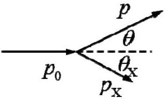
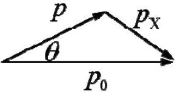

三、（64分）宇宙中可能有四分之一的物质是以暗物质的形式存在的。暗物质可能是由一种新的基本粒子构成的。人们一直在寻找暗物质粒子和已知的粒子之间的相互作用，其中一类重要的实验是寻找暗物质粒子和原子核之间的相互作用。这类实验一般是以某种材料作为靶物质，当暗物质粒子飞入探测器时会和靶物质的原子核发生碰撞。在这个过程中原本几乎静止的原子核会从暗物质粒子得到一部分动能，从而在靶物质中运动，产生光信号和电信号。暗物质探测器可以探测到这些信号从而对暗物质进行观测。
（1）（35分）选取靶物质为氙同位素原子核 ${ }^{132} \mathrm{Xe}$ ，假设暗物质粒子 X 和 ${ }^{132} \mathrm{Xe}$ 核的质量都是质子质量 $m_{\mathrm{p}}$ 的 132 倍；在粒子 X 和 ${ }^{132} \mathrm{Xe}$ 核的质心系中，散射是各向同性的（出射粒子在各个方向上出现的概率相等）。设有一个暗物质粒子 X 以大小为 $200 \mathrm{~km} / \mathrm{s}$ 的速度沿 $z$ 方向进入探测器，与静止的靶核 ${ }^{132} \mathrm{Xe}$ 碰撞。试推导实验室系（碰撞前相对于靶核 ${ }^{132} \mathrm{Xe}$ 静止的参考系）中碰撞后，

（i） （12分）${ }^{132} \mathrm{Xe}$ 核的动量与其出射角的关系；
（ii） （16分）${ }^{132} \mathrm{Xe}$ 核的角分布（按其出射角的概率分布）；
（iii） （7分）${ }^{132} \mathrm{Xe}$ 核动能的分布。

（2）（11分）人们常常用散射截面来表示两个粒子之间相互作用的大小，散射截面类似于某种横截面积，而横截面积可理解为两个粒子之间发生碰撞时的有效面积。例如，两个半径分别为 $r_{1}$ 和 $r_{2}$ 的刚性小球之间碰撞的横截面积为 $\pi\left(r_{1}+r_{2}\right)^{2}$ ，这就是两小球碰撞的散射截面。现在探测器中有 1.0 t 氙原子，暗物质粒子 X 和 ${ }^{132} \mathrm{Xe}$ 核之间碰撞的散射截面为 $1.0 \times 10^{-38} \mathrm{~cm}^{2}$ ；假设所有的暗物质粒子X的速度大小都是 $200 \mathrm{~km} / \mathrm{s}$ ，假设在地球附近的暗物质的密度为$0.40 m_{\mathrm{p}} / \mathrm{cm}^{3}$ 。试求这个探测器里每年能发生多少次暗物质粒子 X 和 ${ }^{132} \mathrm{Xe}$ 核之间的碰撞？阿佛加德罗常数 $N_{\mathrm{A}}=6.023 \times 10^{23}$ 。为简化起见，假设质子静质量为 $1.0 \mathrm{~g} / \mathrm{mol}$ 。
（3）（7分）探测器探测到的信号是由 ${ }^{132} \mathrm{Xe}$ 核在碰撞过程中所得到的动能产生的。然而，只有当该动能超出探测器的阈值时这个信号才能被记录下来。假设这个阈值为10 keV，试估算这个探测器每年可以探测到多少个暗物质粒子 X 与 ${ }^{132} \mathrm{Xe}$ 核发生了碰撞？质子的静质量为$0.94 \mathrm{GeV} / c^{2}$ ，$c$ 是真空中的光速。
（4）（3分）银河系中的暗物质粒子的速率服从一定的分布 $f(v)$ ，暗物质粒子的速率有一个上限，$v_{\text {max }}$ ，即当 $v>v_{\text {max }}$ 时，$f(v)=0$ 。请回答这个上限是由什么造成的？
（5）（8分）对于地球上的实验室参考系，暗物质粒子速度分布的上限是真空中光速的0．002倍。另外，我们实际上也不知道暗物质粒子的质量是多少。请问当暗物质粒子的质量小于多少时，上面的探测器将不可能探测到暗物质的信号？

参考解答
（1）（i）
（解法一）
注意到暗物质粒子和原子核的质量是相等的，那么在暗物质粒子和原子核在质心系中的动量都是 $p_{0}^{\prime}=M v_{0}^{\prime}$ 。

$$
\boldsymbol{p}_{\mathrm{X}}^{\prime}=-\boldsymbol{p}_{\mathrm{Xe}}^{\prime} \quad\left|\boldsymbol{p}_{\mathrm{X}}^{\prime}\right|=p_{0}^{\prime}
$$

粒子动量从质心系（其中的量加撇）到实验室系（其中的量不加撇）有

$$
p_{x}=p_{x}^{\prime}, p_{y}=p_{y}^{\prime}, p_{z}=p_{z}^{\prime}+p_{0}=p_{z}^{\prime}+M v_{0}^{\prime}
$$

质心系到实验室系的动量关系如解题图3a所示。从该图中容易看

解题图3a

到，在质心系中的散射角为 $\theta^{\prime}$ ，在实验室系的散射角为 $\theta$ ，则易

知，在实验室系有

$$
\theta=\frac{\theta^{\prime}}{2},
$$

于是，${ }^{132} \mathrm{Xe}$ 核的动量与其出射角的关系为

$$
\begin{aligned}
& p(\theta)=2 p_{0}^{\prime} \cos \theta=2 M v_{0}^{\prime} \cos \theta=M v_{0} \cos \theta, \quad 0 \leq \theta \leq \frac{\pi}{2}, v_{0}=2 v_{0}^{\prime} ; \\
& p(\theta)=0, \quad \frac{\pi}{2}<\theta \leq \pi .
\end{aligned}
$$

（解法二）
在质心系中，X与Xe以相同的速率 $v_{0}=100 \mathrm{~km} / \mathrm{s}$ 迎头相撞，再以同样的速率彼此分开，如解题图3b所示。

记 Xe 粒子反冲速度的方向与X粒子入射方向（设为 $Z$ 轴）之间的夹角是 $\theta^{\prime}$（质心系中的量带撇，实验室系中的量不带撇）。换到实验室系，设碰撞后 Xe 粒子速度的大小是 $v$ ，方向与 $Z$ 轴间夹角 $\theta$ ，如解题图3c所示。那么

$$
\begin{aligned}
& v=\sqrt{v_{z}^{2}+v_{x}^{2}} \\
& =v_{0}^{\prime} \sqrt{\left(1+\cos \theta^{\prime}\right)^{2}+\sin ^{2} \theta^{\prime}} \\
& =2 v_{0}^{\prime} \sqrt{\cos ^{4} \frac{\theta^{\prime}}{2}+\sin ^{2} \frac{\theta^{\prime}}{2} \cos ^{2} \frac{\theta^{\prime}}{2}} \\
& =2 v_{0}^{\prime} \cos \frac{\theta^{\prime}}{2}
\end{aligned}
$$

解题图3b

$v_{0}^{\prime}=100 \mathrm{~km}$

因而，

$$
\cos \theta=\frac{v_{z}}{v}=\frac{1+\cos \theta^{\prime}}{2 \cos \frac{\theta^{\prime}}{2}}=\cos \frac{\theta^{\prime}}{2},
$$

由此得，

$$
\theta=\frac{\theta^{\prime}}{2},
$$

于是，${ }^{132} \mathrm{Xe}$ 核的动量与其出射角的关系为

$$
\begin{array}{ll}
p(\theta)=2 M v_{0}^{\prime} \cos \theta=M v_{0} \cos \theta, & 0 \leq \theta \leq \frac{\pi}{2}, v_{0}=2 v_{0}^{\prime} ; \\
p(\theta)=0, & \frac{\pi}{2}<\theta \leq \pi .
\end{array}
$$

（解法三）
依题意，在实验室参考系中，入射暗物质粒子 X 的初速度

解题图3d

$v_{0}=200 \mathrm{~km} / \mathrm{s}$ ，动量大小为 $p_{0}=M v_{0}, ~ M$ 是暗物质粒子 X 的质量；
设碰撞后 ${ }^{132} \mathrm{Xe}$ 核的动量大小为 $p$ ，与初速度 $v_{0}$ 的夹角为 $\theta$ ，如解题图3d所示。暗物质粒子 X 的动量大小为 $p_{\mathrm{X}}$ ，与初速度 $v_{0}$ 的夹角为 $\theta_{\mathrm{X}}$ 。由动量守恒得

$$
\begin{aligned}
& p_{0}=p \cos \theta+p_{\mathrm{X}} \cos \theta_{\mathrm{X}} \\
& p \sin \theta=p_{\mathrm{X}} \sin \theta_{\mathrm{X}}
\end{aligned}
$$

解题图3e

由（1）（2）式（或直接根据矢量三角形，见解题图3e）得

$$
p_{\mathrm{X}}^{2}=p^{2}+p_{0}^{2}-2 p p_{0} \cos \theta
$$

由能量守恒得

$$
\frac{p_{0}^{2}}{2 M}=\frac{p^{2}}{2 M}+\frac{p_{\mathrm{x}}^{2}}{2 M}
$$

将前一式等号两边同除以 $2 M$ ，并利用（3）式得，${ }^{132} \mathrm{Xe}$ 核的动量与其出射角 $\theta$ 的关系为

$$
\begin{array}{ll}
p(\theta)=p_{0} \cos \theta=M v_{0} \cos \theta, & 0 \leq \theta \leq \frac{\pi}{2} ; \\
p(\theta)=0, & \frac{\pi}{2}<\theta \leq \pi .
\end{array}
$$

这里，已将 $p$ 在 $\theta$ 的值记为 $p(\theta)$ 。
（ii）
（解法一）
在质心系中散射是各向同性的，即每一个方向的散射概率相等。从解题图3a可看出，在质心系中散射角为 $\theta^{\prime}$ 的位置，绕 $z$ 轴（如解题图3a中虚线所示）一圈的周长是

$$
2 \pi p_{0}^{\prime} \sin \theta^{\prime},
$$

因此在单位 $\theta^{\prime}$ 角上的散射概率一定是正比于 $\sin \theta^{\prime}$ 的。因此，在质心系中，散射概率 $P$ 的角度分布为

$$
\frac{\mathrm{d} P}{\mathrm{~d} \theta^{\prime}}=a \sin \theta^{\prime}
$$

比例常数 $a$ 由概率的归一化条件

$$
\int_{0}^{\pi} \frac{\mathrm{d} P}{\mathrm{~d} \theta^{\prime}} \mathrm{d} \theta^{\prime}=1
$$

得到，即

$$
a=\frac{1}{2}
$$

于是

$$
\frac{\mathrm{d} P}{\mathrm{~d} \cos \theta^{\prime}}=\frac{\mathrm{d} P}{\mathrm{~d} \theta^{\prime}}\left|\frac{\mathrm{d} \theta^{\prime}}{\mathrm{d} \cos \theta^{\prime}}\right|=a \sin \theta^{\prime} \frac{1}{\sin \theta^{\prime}}=\frac{1}{2}
$$

其中，$\left|\frac{\mathrm{d} \theta^{\prime}}{\mathrm{d} \cos \theta^{\prime}}\right|$ 是概率积分测度变化因子。
换到实验室系有

$$
\mathrm{d} \cos \theta^{\prime}=\mathrm{d} \cos 2 \theta=\mathrm{d}\left(2 \cos ^{2} \theta-1\right)=4 \cos \theta \mathrm{~d} \cos \theta
$$

可得，

$$
\frac{\mathrm{d} P}{\mathrm{~d} \cos \theta}=2 \cos \theta, \quad 0 \leq \theta \leq \frac{\pi}{2}
$$

（注：角分布（10）式可以有如下等价写法，即写成

$$
\frac{\mathrm{d} P}{\mathrm{~d} \theta}=\sin (2 \theta), \quad 0 \leq \theta \leq \frac{\pi}{2}
$$

或

$$
\frac{\mathrm{d} P}{\mathrm{~d} \Omega}=\frac{\mathrm{d} P}{\mathrm{~d} \cos \theta \mathrm{~d} \phi}=\frac{1}{\pi} \cos \theta, \quad 0 \leq \theta \leq \frac{\pi}{2}
$$

均可，其中 $\Omega$ 为立体角。）
（解法二）
在质心系中，Xe粒子在碰撞后是完全各向同性地射出的，也就是说它的角分布函数是常数 $C$

$$
\rho^{\prime}\left(\theta^{\prime}, \phi^{\prime}\right)=C
$$

由归一化条件

$$
\int_{0}^{2 \pi} \int_{-1}^{1} \rho^{\prime}\left(\theta^{\prime}, \phi^{\prime}\right) \mathrm{d} \cos \theta^{\prime} \mathrm{d} \phi^{\prime}=1
$$

有

$$
C \int_{0}^{2 \pi} \int_{-1}^{1} \mathrm{~d} \cos \theta^{\prime} \mathrm{d} \phi^{\prime}=4 \pi C=1
$$

故

$$
\rho^{\prime}\left(\theta^{\prime}, \phi^{\prime}\right)=C=\frac{1}{4 \pi}
$$

一个特定事件发生的概率与参考系无关，所以，在球坐标系中有

$$
\rho^{\prime}\left(\theta^{\prime}, \phi^{\prime}\right) \mathrm{d} \cos \theta^{\prime} \mathrm{d} \phi^{\prime}=\rho(\theta, \phi) \mathrm{d} \cos \theta \mathrm{~d} \phi
$$

又由于体系相对于 $z$ 轴的轴对称性，$\rho(\theta, \phi)$ 与 $\phi$ 无关，因而

$$
\rho(\theta, \phi)=\rho(\theta)
$$

从质心系到实验室系（沿 $z$ 轴）的变换中，方位角保持不变

$$
\phi^{\prime}=\phi
$$

由（7）（8）式和上式可知

$$
\rho(\theta)=\frac{1}{4 \pi} \frac{d \cos \theta^{\prime} d \phi^{\prime}}{d \cos \theta d \phi}=\frac{1}{4 \pi} \frac{d \cos \theta^{\prime}}{d \cos \theta}
$$

由 $\theta=\frac{\theta^{\prime}}{2}$ 和上式得

$$
\begin{aligned}
& \rho(\theta)=\frac{1}{4 \pi} \frac{\mathrm{~d} \cos (2 \theta) / \mathrm{d} \theta}{\mathrm{~d} \cos \theta / \mathrm{d} \theta}=\frac{1}{4 \pi} \frac{2 \sin (2 \theta)}{\sin \theta}=\frac{1}{\pi} \cos \theta, \quad\left(0 \leq \theta \leq \frac{\pi}{2}\right) \\
& \rho(\theta)=0, \quad\left(\frac{\pi}{2}<\theta \leq \pi\right)
\end{aligned}
$$

（解法三）
出射粒子的动量分布函数可写为 $\rho^{\prime}\left(p_{x}^{\prime}, p_{y}^{\prime}, p_{z}^{\prime}\right)$ ，它满足归一化条件

$$
\int \mathrm{d} p_{x}^{\prime} \mathrm{d} p_{y}^{\prime} \mathrm{d} p_{z}^{\prime} \rho^{\prime}\left(p_{x}^{\prime}, p_{y}^{\prime}, p_{z}^{\prime}\right)=1
$$

由于散射是各向同性的，这里概率密度 $\rho$ 只是动量的大小 $p^{\prime}$ 的函数。因此有

$$
\rho^{\prime}\left(p_{x}^{\prime}, p_{y}^{\prime}, p_{z}^{\prime}\right)=\rho^{\prime}\left(p^{\prime}\right)
$$

对于二体弹性碰撞，出射的粒子的动量大小在质心系中是确定的，设为 $p_{0}$ 。在球坐标系中，对于立体角的积分可立即积出，有

$$
\int p^{\prime 2} \mathrm{~d} p^{\prime} \mathrm{d} \phi^{\prime} \mathrm{d} \cos \theta^{\prime} \rho^{\prime}\left(p^{\prime}\right)=4 \pi \int \rho^{\prime}\left(p^{\prime}\right) p^{\prime 2} \mathrm{~d} p^{\prime}=1
$$

于是，在质心系中

$$
\rho^{\prime}\left(p^{\prime}\right)=\frac{1}{4 \pi p_{0}^{2}} \delta\left(p^{\prime}-p_{0}\right)
$$

或

$$
\rho^{\prime}\left(p^{\prime}\right)=\frac{1}{4 \pi p^{\prime 2}} \delta\left(p^{\prime}-p_{0}\right)
$$

（由于 $\delta$－函数是在积分中定义的，上述两种形式实际上是等效的。）从质心系（其中的量不加撇）到实验室系（其中的量加撇），我们有

$$
p_{x}=p_{x}^{\prime}, p_{y}=p_{y}^{\prime}, p_{z}=p_{z}^{\prime}+p_{0}
$$

换成实验室球坐标系，有

$$
\phi=\phi^{\prime}, p \sin \theta=p^{\prime} \sin \theta^{\prime}, p \cos \theta=p^{\prime} \cos \theta^{\prime}+p_{0}
$$

由上式得

$$
p^{\prime}=\left(p^{2}-2 p p_{0} \cos \theta+p_{0}^{2}\right)^{1 / 2}
$$

或

$$
\cos \theta^{\prime}=\frac{p \cos \theta-p_{0}}{\left(p^{2}-2 p p_{0} \cos \theta+p_{0}^{2}\right)^{1 / 2}}
$$

一个特定事件发生的概率与参考系无关，所以

$$
\rho^{\prime}\left(p_{x}^{\prime}, p_{y}^{\prime}, p_{z}^{\prime}\right) \mathrm{d} p_{x}^{\prime} \mathrm{d} p_{y}^{\prime} \mathrm{d} p_{z}^{\prime}=\rho\left(p_{x}, p_{y}, p_{z}\right) \mathrm{d} p_{x} \mathrm{~d} p_{y} \mathrm{~d} p_{z}
$$

在球坐标系中可化为

$$
\rho^{\prime}\left(p^{\prime}\right) p^{\prime 2} \mathrm{~d} p^{\prime} \mathrm{d} \phi^{\prime} \mathrm{d} \cos \theta^{\prime}=\rho(p) p^{2} \mathrm{~d} p \mathrm{~d} \phi \mathrm{~d} \cos \theta
$$

积分测度 $\mathrm{d} p_{x} \mathrm{~d} p_{y} \mathrm{~d} p_{z}$ 是伽利略变换不变的，即

$$
\mathrm{d} p_{x}^{\prime} \mathrm{d} p_{y}^{\prime} \mathrm{d} p_{z}^{\prime}=\mathrm{d} p_{x} \mathrm{~d} p_{y} \mathrm{~d} p_{z}
$$

它可在球坐标系中表出

$$
p^{\prime 2} \mathrm{~d} p^{\prime} \mathrm{d} \cos \theta^{\prime} \mathrm{d} \phi^{\prime}=p^{2} \mathrm{~d} p \mathrm{~d} \cos \theta \mathrm{~d} \phi
$$

利用（5）（6）（7）（8）式可得，在实验室系中

$$
\rho(p, \cos \theta)=\frac{1}{4 \pi p_{0}^{2}} \delta\left[\left(p^{2}-2 p_{0} p \cos \theta^{\prime}+p_{0}^{2}\right)^{1 / 2}-p_{0}\right]
$$

因此，在实验室系中，原子核被撞概率 $P$ 的角分布为

$$
\begin{aligned}
\frac{\mathrm{d} P}{\mathrm{~d} \cos \theta} & =\int p^{2} \mathrm{~d} p \mathrm{~d} \phi \rho(p, p \cos \theta) \\
& =\int p^{2} \mathrm{~d} p \mathrm{~d} \phi \frac{1}{4 \pi p_{0}^{2}} \delta\left[\left(p^{2}-2 p_{0} p \cos \theta+p_{0}^{2}\right)^{1 / 2}-p_{0}\right] \\
& =\int p^{2}\left|\frac{\mathrm{~d} p}{\mathrm{~d} p^{\prime}}\right| \mathrm{d} p^{\prime} \frac{1}{2 p_{0}^{2}} \delta\left(p^{\prime}-p_{0}\right) \quad, 0 \leq \theta \leq \frac{\pi}{2} \\
& =\int p^{2}\left|\frac{p^{\prime}}{p-p_{0} \cos \theta}\right| \mathrm{d} p^{\prime} \frac{1}{2 p_{0}^{2}} \delta\left(p^{\prime}-p_{0}\right) \\
& =\left(2 p_{0} \cos \theta\right)^{2}\left|\frac{p_{0}}{2 p_{0} \cos \theta-p_{0} \cos \theta}\right| \frac{1}{2 p_{0}^{2}} \\
& =2|\cos \theta|
\end{aligned}
$$

这里应用了（6）式与

$$
\frac{\partial p}{\partial p^{\prime}}=\frac{p^{\prime}}{p-p_{0} \cos \theta}
$$

以及当 $p^{\prime}=p_{0}$ 时，

$$
p=0,2 p_{0} \cos \theta
$$

但前者没有贡献。注意，在实验室系中，原子核的出射 $\theta^{\prime}$ 的取值范围是 $[0, \pi / 2]$ ，而不是 $[0, \pi]$ ，见图1所标明的运动学限制条件 $\theta^{\prime}=\theta / 2$ 。
（iii）
（解法一）考虑出射粒子的动能分布。由 $p=2 p_{0}^{\prime} \cos \theta=p_{0} \cos \theta$ 可以得到

$$
\cos \theta=\frac{p}{p_{0}}
$$

于是

$$
\mathrm{d} \cos \theta=\frac{\mathrm{d} p}{p_{0}}
$$

代入（10）式可得，被撞原子核的动量分布为

$$
\frac{\mathrm{d} P}{\mathrm{~d} p}=\frac{2 p}{p_{0}^{2}}
$$

实验室系中出射 Xe 核的动能为

$$
E_{\mathrm{k}}=\frac{p^{2}}{2 m_{\mathrm{Xe}}},
$$

其中 $m_{\mathrm{Xe}}$ 是 Xe 核的质量。由上式有

$$
\frac{\mathrm{d} P}{\mathrm{~d} E_{\mathrm{k}}}=\frac{2 m_{\mathrm{Xe}}}{p_{0}^{2}}=\frac{2 M}{p_{0}^{2}}=\frac{1}{E_{\mathrm{k}}^{\text {in }}}=\frac{2 M}{p_{0}^{2}}=\frac{1}{\frac{1}{2} M v_{0}^{2}}
$$

这里利用了

$$
m_{\mathrm{Xe}}=M
$$

而

$$
E_{\mathrm{k}}^{\mathrm{in}}=\frac{p_{0}^{2}}{2 m_{\mathrm{X}}}=\frac{p_{0}^{2}}{2 M}
$$

是在实验室系中入射的暗物质粒子的动能。可见，根据题设的暗物质模型，在实验室系中，出射的原子核的动能是从 0 到 $E_{\mathrm{k}}^{\mathrm{in}}$ 之间的均匀分布。
（解法二）
Xe粒子的动能分布函数满足

$$
\rho(\theta) 2 \pi \sin \theta \mathrm{~d} \theta=\rho\left(E_{\mathrm{k}}\right) \mathrm{d} E_{\mathrm{k}}
$$

Xe粒子的动能 $E_{\mathrm{k}}$ 与其出射角 $\theta$ 的关系是

$$
\begin{array}{ll}
E_{\mathrm{k}}(\theta)=\frac{1}{2} M v_{0}^{2} \cos ^{2} \theta, & \left(0 \leq \theta \leq \frac{\pi}{2}\right) \\
E_{\mathrm{k}}(\theta)=0, & \left(\frac{\pi}{2}<\theta \leq \pi\right)
\end{array}
$$

由（11）（12）式得

$$
\rho\left(E_{\mathrm{k}}\right)=\frac{2 \cos \theta \sin \theta}{M v_{0}^{2} \cos \theta \sin \theta}=\frac{1}{\frac{1}{2} M v_{0}^{2}}, \quad\left(0 \leq E_{\mathrm{k}} \leq \frac{1}{2} M v_{0}^{2}\right)
$$

因此，Xe粒子的动能在 $0 \leq E_{\mathrm{k}} \leq \frac{1}{2} M v_{0}^{2}$ 的范围内（对应于 $0 \leq \theta \leq \frac{\pi}{2}$ ）的分布是均匀的。
（2）总的原子核的个数为

$$
N_{\mathrm{Xe}}=\frac{M_{\text {total }}}{m_{\mathrm{Xe}}}=\frac{1.0 \mathrm{t}}{132 \mathrm{~g} / \mathrm{mol}} \times N_{\mathrm{A}} \approx 4.6 \times 10^{27}
$$

这里 $N_{\mathrm{A}}$ 是阿佛加德罗常数。在一年中一个原子核被暗物质粒子碰撞的概率为

$$
P_{1}=\sigma v t \frac{\rho_{\mathrm{x}}}{m_{\mathrm{x}}}
$$

其中 $\sigma$ 为碰撞的截面，$v$ 为暗物质的速度，$t$ 为总的时间，$\rho_{\mathrm{X}}$ 和 $m_{\mathrm{X}}$ 分别为暗物质的密度和暗物质粒子 X 的质量。代入具体数据得，

$$
P_{1} \approx 1.9 \times 10^{-26}
$$

这个概率远远小于 1 ，因此我们可以忽略一个原子核被两个暗物质粒子碰撞的情况。所以一年里，这个探测器发生的总的碰撞次数可以估计为

$$
N_{\mathrm{C}}=P_{1} N_{\mathrm{Xe}} \approx 87
$$

所以，大概会发生 87 次碰撞。
（3）由于碰撞产生的出射的原子核的动能分布为从 0 到 $E_{\mathrm{k}}^{\mathrm{in}}$ 之间的均匀分布，出射动能大于某一阈值 $E_{\text {阈 }}$ 的数目为

$$
N_{\mathrm{s}}=N_{\mathrm{C}} \frac{E_{\mathrm{k}}^{\mathrm{in}}-E_{\text {间 }}}{E_{\mathrm{k}}^{\mathrm{in}}}
$$

将题给数据代入（14）式得

$$
E_{\mathrm{k}}^{\mathrm{in}} \approx 28 \mathrm{keV}
$$

由题设

$$
E_{\text {娦 }}=10 \mathrm{keV}
$$

由（17）（18）（19）式得，

$$
N_{\mathrm{S}}=56
$$

这个探测器中每年产生的暗物质的信号的数目为56个。
（4）这个截断是由逃逸速率造成的，
（22）（3 分）
速度大小超过逃逸速率的暗物质粒子可能逃逸出银河系引力的束缚。
（5）设暗物质粒子的质量是 $m_{\mathrm{X}}$ ，它在实验室系中速度大小为 $v_{\mathrm{X}}$ ，则暗物质粒子和静止的

氙原子核的质心 c 相对于实验室系的速度为

$$
v_{\mathrm{c}}=v_{\mathrm{X}} \frac{m_{\mathrm{X}}}{m_{\mathrm{X}}+m_{\mathrm{Xe}}} .
$$

在实验室系中，氙原子核可以从与暗物质粒子碰撞中获得的最大的反冲速度为

$$
v_{\mathrm{r} \max }=2 v_{\mathrm{c}}=2 v_{\mathrm{X}} \frac{m_{\mathrm{X}}}{m_{\mathrm{X}}+m_{\mathrm{Xe}}} .
$$

氙原子核能获得的最大的反冲动能为

$$
E_{\mathrm{r} \max }=\frac{1}{2} m_{\mathrm{Xe}} v_{\mathrm{r} \max }^{2}=\frac{1}{2} m_{\mathrm{X}} v_{\mathrm{X}}^{2} \frac{4 m_{\mathrm{X}} m_{\mathrm{Xe}}}{\left(m_{\mathrm{X}}+m_{\mathrm{Xe}}\right)^{2}}
$$

实验室中不可能探测到暗物质信号的条件是

$$
E_{\mathrm{r} \max }<E_{\text {阈 }} \text {, 当 } v_{\mathrm{X}}=v_{\max } \text {, }
$$

由（24）（25）式得，当

$$
m_{\mathrm{X}}<\frac{m_{\mathrm{Xe}}}{v_{\max } \sqrt{\frac{2 m_{\mathrm{Xe}}}{E_{\text {阅 }}}-1}}=\frac{m_{\mathrm{Xe}}}{\frac{v_{\max }}{c} \sqrt{\frac{2 m_{\mathrm{Xe}} c^{2}}{E_{\text {间 }}}}-1}=14 \mathrm{GeV} / c^{2}
$$

时，探测器不可能探测到暗物质的信号。

## 评分标准：

第（1）问35分，
第（i）小问12分，（1）（2）（3）（4）式各3分；
第（ii）小问16分，
（解法一）（5）（6）（7）（9）式各3分，（10）式4分；
（解法二）（6）（7）（8）（9）式各3分，（10）式4分；
（解法三）（5）式各3分，（6）（7）（8）式各2分，（9）式3分，（10）式4分；
第（iii）小问7分，（12）式3分，（13）式4分；
第（2）问11分，（15）式3分，（16）式4分，（17）（18）式各2分；
第（3）问7分，（19）式3分，（20）（21）式各2分。
第（4）问3分，（22）正确的给3分；
第（5）问8分，（23）（24）（25）（27）式各2分。
