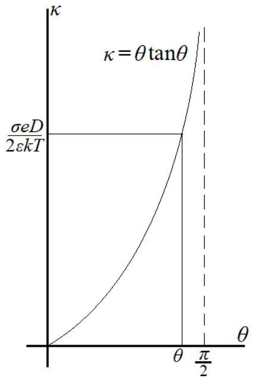

四、（64 分）在生物体中电相互作用起着很重要的作用。将一个类 DNA 的酸性分子放入水中，分子上一些松散附着的原子可能解离，正离子漂走，留下一些电子，使这个大分子带负电。类似地，水中的细胞膜也会因此而带上负电，它们之间的静电排斥作用可使这些大分子或细胞避免＂结块＂。由于物质本身是电中性的，溶液中漂浮着的大量正离子，会使这些大分子之间的静电力随距离衰减。在常温 $T$ 下考察以下问题：
（1）（31 分）（i）（7 分）考虑带负电的细胞膜外侧（朝向正离子漂浮的区域）附近靠近其表面的区域。此时细胞膜可视为无限大平面。取 $x$ 轴垂直于细胞膜外表面，方向指向膜外侧，原点在膜外表面上。膜周围溶液的介电常量为 $\varepsilon$ ，膜外表面上均匀分布的面电荷密度为 $-\sigma$（ $\sigma>0$ ）。系统与环境保持热平衡。由于静电作用，溶液中各处正离子的密度并不均匀，但可认为各局域部分都是平衡态。此时正离子的行为与地面上大气分子的行为类似，只是这里正离子受到静电场作用，而大气分子受到重力场作用。取紧靠膜外表面处正离子数密度 $n_{0}$为待定常量。试写出膜外表面附近电势 $\varphi$ 满足的微分方程。已知电子电量为 $-e$ ，正离子电量为 $+e$ ，玻尔兹曼常量为 $k$ ；忽略重力和水的浮力。提示：玻尔兹曼统计认为，粒子处于能量为 $E$ 的状态的几率正比于 $\exp \left(-\frac{E}{k T}\right), T$ 为粒子所处平衡态的绝对温度。
（ii）（3 分）细胞膜表面内的液状组织可认为是导电的；选取膜表面上的电势为零。试写出在膜外表面上电势 $\varphi$ 满足的边界条件。
（iii）（10 分）在给定的边界条件下，取对数函数 $\varphi(x)=A \ln (1+B x)$ 作为第（1）（i）问中得到的微分方程的试探解。试定出常量 $n_{0} 、 A 、 B$ 的值，并将 $\varphi(x)$ 和 $n(x)$（在 $x$ 处的正离子数密度）用 $\sigma 、 \varepsilon 、 T 、 e 、 k$ 表出；
（iv）（3 分）试验证，所求得的 $n(x)$ 保证了整个系统是电中性的。
（v）（8 分）求以带电的膜外表面单位面积为底的足够高的柱形体积内的静电场能 $U_{\mathrm{f}}$ ，以及同一体积中的所有正离子在静电场中的总电势能 $U_{\mathrm{e}}$ 。
（2）（33 分）考虑两个细胞彼此靠近的情形。两个细胞膜外侧及它们之间的这个系统，可用这样的简化模型研究：已知两个均匀带负电的无限大平行平板各带面电荷密度 $-\sigma$ ，相互之间距离为 $2 D$ 。两板正中间处选为坐标原点，$x$ 轴垂直于平板，原点电势选为零，原点处的正离子数密度 $n_{0}$ 作为待定参量。取函数 $\varphi(x)=A \ln [\cos (B x)]$ 作为微分方程的试探解。
（i）（4 分）由 $\varphi(x)$ 满足的微分方程定出常量 $A 、 B$ ，用 $T 、 \varepsilon 、 e 、 k 、 n_{0}$ 表出。
（ii）（8 分）求 $n_{0}$ ，用 $D 、 \sigma 、 \varepsilon 、 T 、 e 、 k 、 \theta$（若遇到超越方程，不必求解，该方程在物理区域的解记为 $\theta$ ）表出。
（iii）（5 分）给出正离子在细胞外表面处与两膜中心处的粒子数密度之差$\Delta n \equiv n( \pm D)-n_{0}$ ，用 $\sigma 、 \varepsilon 、 T 、 k$ 表出。
（iv）（3 分）试验证，所求得的 $n(x)$ 保证了整个系统是电中性的。
（v）（5 分）试给出带电平面（细胞膜）单位面积上所受的作用力的合力。已知细胞膜内外都充满了密度相同的水。提示：正离子在水中的行为与理想气体类似，且局域地处于热平衡。
（vi）（8 分）如果其它条件不变，在两平板仍可视为无限大的前提下，试讨论在近距离和远距离两种不同的极限情形下，带电平面单位面积上所受的作用力的合力大小如何随距离$D$ 而改变？

参考解答：
（1）
（i）在生物膜表面外 $x$ 点附近取一个单位面积为底、厚度为 $x+\mathrm{d} x$ 的小体积（上、下底均

与膜表面平行）。由对称性，生物膜表面外电场强度只与 $x$ 有关，因而小体积上、下底处的电场强度可分别记为 $E(x+\mathrm{d} x) 、 E(x)$ ，以 $x$ 轴正向为正方向。由高斯定理有

$$
E(x+\mathrm{d} x)-E(x)=\frac{1}{\varepsilon} e n(x) \mathrm{d} x,
$$

而

$$
E(x)=-\frac{\mathrm{d} \varphi}{\mathrm{~d} x}
$$

由以上两式得

$$
\frac{\mathrm{d}^{2} \varphi}{\mathrm{~d} x^{2}}=-\frac{e}{\varepsilon} n(x) .
$$

电荷 $+e$ 的正离子在上述静电场中的电势能是 $e \varphi$ 。根据玻尔兹曼统计有

$$
n(x)=n_{0} \mathrm{e}^{-\frac{e \varphi(x)}{k T}},
$$

其中 $n_{0}$ 是 $\varphi=0$ 处的正离子的数密度，所以 $\varphi(x)$ 满足的方程是

$$
\frac{\mathrm{d}^{2} \varphi}{\mathrm{~d} x^{2}}=-\frac{e n_{0}}{\varepsilon} \mathrm{e}^{-\frac{e \varphi}{k T}} .
$$

（ii）$\varphi(x)$ 的边界条件是

$$
\begin{aligned}
& \left.\varphi\right|_{x=0}=0 \\
& \left.\frac{\mathrm{~d} \varphi}{\mathrm{~d} x}\right|_{x=0}=-\left.E\right|_{x=0}=-\frac{(-\sigma)}{\varepsilon},(\sigma>0)
\end{aligned}
$$

这里，已注意到膜外表面的面电荷密度为 $-\sigma$ ，膜内部可认为是导体。
（iii）将试探解 $\varphi(x)=A \ln (1+B x)$（已满足（4）式）代入（3）式得

$$
-\frac{A B^{2}}{(1+B x)^{2}}=-\frac{e n_{0}}{\varepsilon}(1+B x)^{-\frac{e A}{k T}},
$$

比较上式两边 $(1+B x)$ 的幂和系数得

$$
\begin{aligned}
A & =\frac{2 k T}{e}, \\
B & =\sqrt{\frac{n_{0} e^{2}}{2 \varepsilon k T}},
\end{aligned}
$$

再将试探解 $\varphi(x)=A \ln (1+B x)$ 代入（5）式得

$$
A B=\frac{\sigma}{\varepsilon},
$$

所以

$$
B=\frac{\sigma e}{2 \varepsilon k T},
$$

由（7）（8）式得

$$
n_{0}=\frac{\sigma^{2}}{2 \varepsilon k T} .
$$

由试探解 $\varphi(x)=A \ln (1+B x)$ 和（6）（8）式得

$$
\varphi(x)=\frac{2 k T}{e} \ln \left(1+\frac{\sigma e}{2 \varepsilon k T} x\right),
$$

由（2）（9）式得

$$
n(x)=\frac{\sigma^{2}}{2 \varepsilon k T} \frac{1}{\left(1+\frac{\sigma e}{2 \varepsilon k T} x\right)^{2}} .
$$

（iv） 以膜外表面单位面积为底的无限高柱形体积内的总电荷是
$$
Q=e \int_{0}^{\infty} n(x) \mathrm{d} x=\frac{\sigma^{2} e}{2 \varepsilon k T} \int_{0}^{\infty} \frac{1}{\left(1+\frac{\sigma e}{2 \varepsilon k T} x\right)^{2}} \mathrm{~d} x=\sigma \int_{0}^{\infty} \frac{1}{(1+y)^{2}} \mathrm{~d} y=\sigma .
$$
所以，整个系统（包括膜外表面）是电中性的。

（v）静电场能密度满足

$$
u_{\mathrm{f}}=\frac{1}{2} \varepsilon E^{2}=\frac{1}{2} \varepsilon\left(\frac{\mathrm{~d} \varphi}{\mathrm{~d} x}\right)^{2},
$$

式中

$$
\frac{\mathrm{d} \varphi}{\mathrm{~d} x}=\frac{2 k T}{e} \frac{\frac{\sigma e}{2 \varepsilon k T}}{1+\frac{\sigma e}{2 \varepsilon k T} x},
$$

总的静电场能是

$$
\begin{aligned}
U_{\mathrm{f}} & =\frac{1}{2} \varepsilon \int_{0}^{\infty}\left(\frac{\mathrm{d} \varphi}{\mathrm{~d} x}\right)^{2} \mathrm{~d} x=\frac{\sigma k T}{e} \int_{0}^{\infty} \frac{\frac{\sigma e}{2 \varepsilon k T}}{\left(1+\frac{\sigma e}{2 \varepsilon k T} x\right)^{2}} \mathrm{~d} x \\
& =\frac{\sigma k T}{e} \int_{0}^{\infty} \frac{1}{(1+y)^{2}} \mathrm{~d} y=\frac{\sigma k T}{e}
\end{aligned}
$$

另一方面，正离子云在静电场中的总电势能是

$$
\begin{aligned}
U_{\mathrm{e}} & =\int_{0}^{\infty} e n(x) \varphi(x) \mathrm{d} x=\frac{\sigma^{2}}{2 \varepsilon k T} 2 k T \int_{0}^{\infty} \frac{\ln \left(1+\frac{\sigma e}{2 \varepsilon k T} x\right)}{\left(1+\frac{\sigma e}{2 \varepsilon k T} x\right)^{2}} \mathrm{~d} x=\frac{2 \sigma k T}{e} \int_{0}^{\infty} \frac{\ln (1+y)}{(1+y)^{2}} \mathrm{~d} y \\
& =-\frac{2 \sigma k T}{e} \int_{0}^{\infty} \ln (1+y) \mathrm{d} \frac{1}{1+y}=\frac{2 \sigma k T}{e} \int_{0}^{\infty} \frac{1}{(1+y)^{2}} \mathrm{~d} y=\frac{2 \sigma k T}{e}
\end{aligned}
$$

所以

$$
U_{\mathrm{f}}=\frac{1}{2} U_{\mathrm{e}} .
$$

（2）

（i） 类比（3）式，$\varphi$ 满足的微分方程是
$$
\frac{\mathrm{d}^{2} \varphi}{\mathrm{~d} x^{2}}=-\frac{e n_{0}}{\varepsilon} \mathrm{e}^{-\frac{e \varphi}{k T}},\left(-D<x<+D,\left.\varphi\right|_{x=0}=0\right)
$$
以试探函数 $\varphi(x)=A \ln [\cos (B x)]$（满足边界 $\left.\varphi\right|_{x=0}=0$ ）代入，得
$$
A B^{2} \frac{1}{\cos ^{2} B x}=\frac{e n_{0}}{\varepsilon}(\cos B x)^{-\frac{e A}{k T}},
$$
因而
$$
\begin{aligned}
A & =\frac{2 k T}{e}, \\
B & =\sqrt{\frac{n_{0} e^{2}}{2 \varepsilon k T}} .
\end{aligned}
$$
（ii） 类比⑤式，另一边界条件是
$$
\left.\frac{\mathrm{d} \varphi}{\mathrm{~d} x}\right|_{x=-D}=-\frac{(-\sigma)}{\varepsilon},(\sigma>0)
$$
以试探解 $\varphi(x)=A \ln [\cos (B x)]$ 代入，得
$$
\frac{\mathrm{d} \varphi}{\mathrm{~d} x}=-A B \tan B x,
$$

所以得

$$
A B \tan B D=\frac{\sigma}{\varepsilon},
$$

代入 $A$ 的表达式（18），得

$$
B D \tan B D=\frac{\sigma e D}{2 \varepsilon k T} . \quad \text { (21) (2 分) }
$$

记 $\theta \equiv B D$ ，则它满足超越方程

$$
\theta \tan \theta=\frac{e \sigma D}{2 \varepsilon k T} \equiv \kappa, \quad 0<\theta<\frac{\pi}{2} .
$$

在 $D 、 \sigma 、 \varepsilon 、 T$ 给定后，$\kappa \equiv \frac{\sigma e D}{2 \varepsilon k T}$ 是一个确定的常量。在本题所考虑的情形下，$\sigma$ 很小，甚至等于0；而当 $\sigma=0$ 时，上述超越方程显然有解 $\theta=0$ 。物理的解应是连续的，不能跨越奇点。因此，所考虑的超越方程的物理区域是 $0 \leq \theta<\frac{\pi}{2}$ 。由解题图4a可知，在所考虑的超越方程在物理区域 $0 \leq \theta<\frac{\pi}{2}$ 中有且只有一个根 $\theta$（事实上，由于 $\theta$ 和 $\tan \theta$ 在区域 $0 \leq \theta<\frac{\pi}{2}$ 中都是 $\theta$ 的单调函数，两者的乘积 $\kappa(\theta)$ 也是 $\theta$ 的单调函数），这正好符合静电唯一性定理。确定 $\theta$ 后，有

解题图4a

$$
B=\frac{\theta}{D},
$$

因此

$$
n_{0}=\frac{2 \varepsilon k T}{e^{2}} B^{2}=\frac{2 \varepsilon k T \theta^{2}}{e^{2} D^{2}} .
$$

可见给定了 $D 、 \sigma 、 \varepsilon 、 T$ 就决定了 $\theta$ ，也就完全决定了 $n_{0}$ 。
（iii）类比（2）式并利用试探解形式 $\varphi(x)=A \ln [\cos (B x)]$ 以及（18）式有

$$
n(x)=n_{0} \mathrm{e}^{-\frac{e \varphi(x)}{k T}}=n_{0}[\cos (B x)]^{-\frac{e A}{k T}}=n_{0} \frac{1}{\cos ^{2} B x},
$$

其中 $n_{0}$ 和 $B$ 如前所示，所以

$$
n( \pm D)=n_{0} \frac{1}{\cos ^{2} B D}=n_{0}\left(1+\tan ^{2} B D\right)=n_{0}+n_{0} \tan ^{2} \theta
$$

而

$$
n_{0} \tan ^{2} \theta=\frac{2 \varepsilon k T}{D^{2} e^{2}}(\theta \tan \theta)^{2}=\frac{2 \varepsilon k T}{D^{2} e^{2}}\left(\frac{\sigma e D}{2 \varepsilon k T}\right)^{2}=\frac{\sigma^{2}}{2 \varepsilon k T},
$$

所以

$$
n( \pm D)-n_{0}=\frac{\sigma^{2}}{2 \varepsilon k T} .
$$

（iv）根据前面 $n(x)$ 的表达式（23），有

$$
\int_{-D}^{D} e n(x) \mathrm{d} x=e n_{0} \int_{-D}^{D} \frac{\mathrm{~d} x}{\cos ^{2} B x}=\frac{2 e}{B} \frac{2 \varepsilon k T \theta^{2}}{e^{2} D^{2}} \tan \theta=\frac{2 e}{B} \frac{2 \varepsilon k T \theta}{e^{2} D^{2}} \frac{\sigma e D}{2 \varepsilon k T}=2 \sigma,
$$

其中 $\theta \tan \theta=\frac{\sigma e D}{2 \varepsilon k T}$ 和 $\theta=B D$ 。由于两个均匀带负电无限大平行平面各带面电荷密度 $-\sigma$ ，所以整个系统是电中性的。
（v）对于两个带电平面中的一个平面，系统里的其它电荷包括另一个平面上的负电荷和正

离子云的正电荷，而它们的总电荷量恰好与这个平面的总电量大小相等、符号相反，等价于平行板电容器的另一个极板，所以这个平面上单位面积受到的它们所施加的静电力是

$$
f_{\mathrm{e}}=\frac{\sigma^{2}}{2 \varepsilon},
$$

方向指向生物膜外，即指向另一个平面。至于正离子碰撞形成的压强，根据题目的提示，完全类似于理想气体（或称为正离子气）的压强，因此

$$
f_{\mathrm{h}}=n( \pm D) k T=\left(n_{0}+\frac{\sigma^{2}}{2 \varepsilon k T}\right) k T=\frac{2 \varepsilon k^{2} T^{2} \theta^{2}}{e^{2} D^{2}}+\frac{\sigma^{2}}{2 \varepsilon},
$$

方向指向生物膜内。合力是

$$
f=f_{\mathrm{h}}-f_{\mathrm{e}}=n_{0} k T=\frac{2 \varepsilon k^{2} T^{2} \theta^{2}}{e^{2} D^{2}},
$$

方向指向生物膜内。这就是说，静电力与正离子气压力的合力是在两个带电平面之间产生斥力。值得指出的是，膜内外充满了水，膜内外所受到的水的压强相互抵消，不予考虑。
（解法二）
平面 $x=0$ 将两带电平面之间的正离子（包括相应的液体）体系分成体系 I 和 II。对于平面$x=0$ 和两个带电平面之一的平面之间的正离子（包括相应的液体）体系 I，体系 II 相当于面电荷密度为 $+\sigma$ 的平板，它对于 I 的作用正好被其邻接的电荷密度为 $-\sigma$ 的带电平板对于 I的作用抵消，可以不予考虑。因此，I 除了受到带电平面对它的指向 I 内的作用力（其在单位面积上的大小 $f$ 等于带电平面所受到的静电力与正离子气压力的合力在单位面积上的大小）之外，还受到平面 $x=0$ 处的正离子气的压力（方向指向 I 内），其在单位面积上的大小为

$$
f_{\mathrm{h} 0}=n_{0} k T
$$

由于体系 I 处于力平衡状态，故

$$
f=f_{\mathrm{h} 0}
$$

于是

$$
f=n_{0} k T=\frac{2 \varepsilon k^{2} T^{2} \theta^{2}}{e^{2} D^{2}}
$$

值得指出的是，膜内外充满了水，膜内外所受到的水的压强相互抵消，不予考虑。
（vi）由（26）式知

$$
f \propto\left(\frac{\theta}{D}\right)^{2},
$$

注意到 $\theta$ 满足

$$
\theta \tan \theta=\frac{\sigma e D}{2 \varepsilon k T},
$$

因而也与 $D$ 有关。在近距离极限下

$$
\frac{\sigma e D}{2 \varepsilon k T} \ll 1,
$$

因而可以认为 $\tan \theta \approx \theta$ ，于是

$$
\theta \approx \sqrt{\frac{\sigma e D}{2 \varepsilon k T}} \propto \sqrt{D},
$$

所以

$$
f \propto\left(\frac{\sqrt{D}}{D}\right)^{2} \propto \frac{1}{D} .
$$

而在远距离极限下

$$
\frac{\sigma e D}{2 \varepsilon k T} \gg 1,
$$

因而可以认为

$$
\theta \approx \frac{\pi}{2}=\text { 常数, }
$$

于是

$$
f \propto \frac{1}{D^{2}},
$$

（30）（3 分）
（29）（30）式表明，$f$ 是随距离的增加而衰减的。

评分标准：
第（1）问31分，
第（i）小问7分，（1）式3分，（2）（3）式各2分；
第（ii）小问3分，（4）式1分，（5）式2分；
第（iii）小问 10 分，（6）（7）式各 2 分，（8）式 1 分，（9）式 2 分，（10）式 1 分，（11）式 2 分；
第（iv）小问3分，（12）式3分；
第（v）小问8分，（13）式2分，（15）（16）式各3分；
第（2）问33分，
第（i）小问 4 分，（18）式 2 分，（19）式。 2 分；
第（ii）小问8分，（20）式3分，（21）式2分，（22）式3分；
第（iii）小问5分，（23）式2分，（24）式3分；
第（iv）小问3分，（25）式3分；
第（v）小问 5 分，（26）式 2 分，（27）式 3 分；
第（vi）小问8分，（28）式2分，（29）式3分，（30）式3分。
