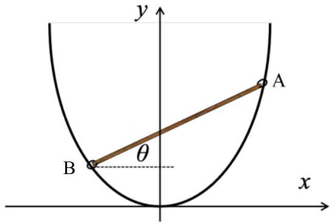
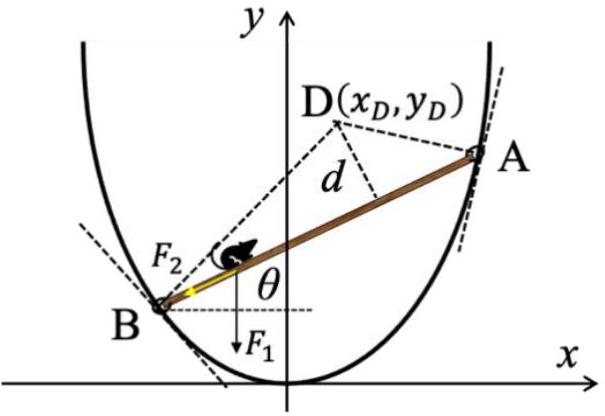

一、（40分）如图1a，一段抛物线形状的刚性金属丝固定在坚直平面内，抛物线方程为 $y=a x^{2}(y$ 轴坚直向上，$a$ 为待定常量）；一长度为 $2 l$ 的匀质刚性细杆的两端 A、B 各有一个小圆孔，两圆孔都套在金属丝上。圆孔和金属丝之间非常光滑，摩擦力非常小，在问题（1）、（2）和（3）中可忽略。若给细杆一个冲量，使其运动；经过足够长的时间，细杆静止于平衡位置，此时细杆和水平方向之间的夹角 $\theta=30^{\circ}$ 。已知重力加速度大小为 $g$ 。（1）求待定常量 $a$ ；
（2）若杆在上述平衡位置附近小幅振动，求振动的频

图1a

（3）细杆静止在上述平衡位置。现有一只小白鼠，从静止开始由杆底端沿杆往上爬。在爬杆的过程中，细杆始终保持静止；假设小白鼠可视为质点，且小白鼠在杆端不接触金属丝。求小白鼠在时刻 $t$（以小白鼠开始爬杆的时刻为时刻零点）沿细杆的位移 $s(t)$ ，小白鼠是否可以爬到细杆顶端？如果可以，小白鼠爬到细杆顶端，最少用时多少？

解答：
（1）设细杆的质心的坐标为 $\left(x_{c}, y_{c}\right)$ ，细杆的长度为 $2 l$ ，则杆的 A 和 B 端的坐标为：

$$
\left\{\begin{array}{l}
x_{A}=x_{C}+l \cos \theta \\
y_{A}=y_{C}+l \sin \theta
\end{array} .\left\{\begin{array}{l}
x_{B}=x_{C}-l \cos \theta \\
y_{B}=y_{C}-l \sin \theta
\end{array}\right.\right.
$$

代入抛物线方程得：

$$
\begin{aligned}
& y_{C}+l \sin \theta=a\left(x_{C}+l \cos \theta\right)^{2} \\
& y_{C}-l \sin \theta=a\left(x_{C}-l \cos \theta\right)^{2}
\end{aligned}
$$

联立（2）（3）式得：

$$
\begin{aligned}
& x_{C}=\frac{\sin \theta}{2 a \cos \theta} \\
& y_{C}=\frac{\sin ^{2} \theta}{4 a \cos ^{2} \theta}+a l^{2} \cos ^{2} \theta
\end{aligned}
$$

细杆重力势能为：

$$
E_{p}=m g y_{C}=m g \frac{\sin ^{2} \theta}{4 a \cos ^{2} \theta}+m g a l^{2} \cos ^{2} \theta
$$

平衡点为势能极值点：

$$
\begin{aligned}
\frac{d E_{p}}{d \theta} & =m g \frac{\cos ^{3} \theta \sin \theta+\cos \theta \sin ^{3} \theta}{2 a \cos ^{4} \theta}-2 m g a l^{2} \cos \theta \sin \theta \\
& =m g \sin \theta\left(\frac{1}{2 a \cos ^{3} \theta}-2 a l^{2} \cos \theta\right)=0
\end{aligned}
$$

解为：
I、

$$
\sin \theta=0 \text {, 即 } \theta=0 \text {, 不符题意, 舍去。 }
$$

II、

$$
\frac{1}{2 a \cos ^{3} \theta}-2 a l^{2} \cos \theta=0
$$

得：

$$
\cos \theta=\sqrt{\frac{1}{2 a l}}
$$

已知 $\theta=30^{\circ}$ ，所以：

$$
\sqrt{\frac{1}{2 a l}}=\frac{\sqrt{3}}{2}
$$

即：

$$
a=\frac{2}{3 l}
$$

（12）2分
（2）细杆在平衡位置附近小幅振动，由机械能守恒得：

$$
\frac{1}{2} m\left(\dot{x}_{C}^{2}+\dot{y}_{C}^{2}\right)+\frac{1}{2} I_{c} \dot{\theta}^{2}+m g \frac{\sin ^{2} \theta}{4 a \cos ^{2} \theta}+m g a l^{2} \cos ^{2} \theta=\text { 常量 }
$$

（13）4分
即：

$$
\begin{aligned}
& \frac{1}{2} m\left[\left(\frac{1}{2 a \cos ^{2} \theta}\right)^{2}+\left(\frac{\sin \theta}{2 a \cos ^{3} \theta}-2 a l^{2} \sin \theta \cos \theta\right)^{2}\right] \dot{\theta}^{2}+\frac{1}{6} m l^{2} \dot{\theta}^{2} \\
& +m g \frac{\sin ^{2} \theta}{4 a \cos ^{2} \theta}+m g a l^{2} \cos ^{2} \theta=\text { 常量 }
\end{aligned}
$$

（14）2分
令：$\theta=\theta_{0}+\Delta \theta\left(|\Delta \theta| \ll \theta_{0}\right), \theta_{0}=30^{\circ}$ 为平衡位置，于是⑭式在 $\theta_{0}$ 附近做小量 $\Delta \theta$ 展开，并且质心动能、相对质心转动动能和势能三部分都保留至（不是常量的）最大一项，得到近似式：

$$
\frac{1}{2} m\left[\left(\frac{1}{2 a \cos ^{2} \theta_{0}}\right)^{2}\right] \dot{\Delta \theta^{2}}+\frac{1}{6} m l^{2} \dot{\Delta} \theta^{2}+\frac{m g}{2} \sin ^{2} \theta_{0}\left(\frac{3}{2 a \cos ^{4} \theta_{0}}+2 a l^{2}\right) \Delta \theta^{2}=\text { 常量 }
$$

（15） 6 分
两边对时间求导得：

$$
\left\{\left[\left(\frac{1}{2 a \cos ^{2} \theta_{0}}\right)^{2}\right]+\frac{1}{3} l^{2}\right\} \ddot{\Delta \theta}+g \sin ^{2} \theta_{0}\left(\frac{3}{2 a \cos ^{4} \theta_{0}}+2 a l^{2}\right) \Delta \theta=0
$$

（16） 2 分
或

$$
\ddot{\Delta \theta}+\frac{g}{l} \Delta \theta=0
$$

小幅振动可以近似为简谐运动，角频率为：

$$
\omega=\sqrt{\frac{g}{l}}
$$

振动频率：

$$
f=\frac{1}{2 \pi} \sqrt{\frac{g}{l}}
$$

（3）设白鼠的质量为 $m_{\mathrm{s}}$ ，沿细杆的位移为 $s$ ，B 点 $s=0$ ，加速度为 $d^{2} s / d t^{2}$ ，则白鼠对细杆的作用力：

$$
F_{1}=m_{\mathrm{s}} g \text {, 坚直向下; } F_{2}=m_{s} \frac{d^{2} s}{d t^{2}} \text {, 沿细杆。 }
$$

（19）4分
细杆保持平衡要求细杆所受合力矩为零。为了避免分析约束力的力矩，我们选择一个特定的参考点，在 A 和 B 点处，分别做抛物线的切线和法线，两条法线相交于 D 点，选择 D 点为参考点，如解题图1a所示。下面求 D 点坐标。所述的两个法线方程为：

$$
\begin{aligned}
& y-y_{B}=-\frac{1}{2 a x_{B}}\left(x-x_{B}\right) \\
& y-y_{A}=-\frac{1}{2 a x_{A}}\left(x-x_{A}\right)
\end{aligned}
$$

解题图1a

求解得两个法线的交点 D 的坐标：

$$
\begin{aligned}
& x_{D}=x_{c}=\frac{\sqrt{3}}{4} l \\
& y_{D}=\frac{13}{8} l
\end{aligned}
$$

细杆的直线方程：

$$
y-y_{A}=\frac{1}{\sqrt{3}}\left(x-x_{A}\right)
$$

即：

$$
y=\frac{1}{\sqrt{3}} x+\frac{3}{8} l
$$

$D$ 点到细杆（ $A y+B y+C=0$ ）的距离为

$$
d=\frac{\left|A x_{\mathrm{D}}+B y_{\mathrm{D}}+C\right|}{\sqrt{A^{2}+B^{2}}}
$$

由上式与（25）式得

$$
d=\frac{\left|\frac{1}{\sqrt{3}} x_{\mathrm{D}}-y_{\mathrm{D}}+\frac{3}{8} l\right|}{\sqrt{\left(\frac{1}{\sqrt{3}}\right)^{2}+(-1)^{2}}}=\frac{\left.\left\lvert\, \frac{1}{\sqrt{3}} \frac{\sqrt{3}}{4} l-\frac{13}{8} l+\frac{3}{8} l\right.\right) \mid}{\sqrt{\left(\frac{1}{\sqrt{3}}\right)^{2}+(-1)^{2}}}=\frac{\sqrt{3}}{2} l
$$

【或：
由（22）式知 D 点和杆的质心 C 在同一坚直线上。设从 D 点到杆的垂线与杆的交于 E 点，则

$$
\angle \mathrm{CDE}=\theta
$$

从而有

$$
d=\left(y_{\mathrm{D}}-y_{\mathrm{C}}\right) \cos \theta=\left(\frac{13}{8} l-\frac{5}{8} l\right) \frac{\sqrt{3}}{2}=\frac{\sqrt{3}}{2} l
$$

】
以 D 点为参考点，因为细杆的重力过 D 点，抛物线对 A 和 B 点的支撑力沿其法线方向，即过 D 点，这样它们的力矩为零，因而细杆的力矩平衡条件可写为：

$$
L=m_{s} \frac{d^{2} s}{d t^{2}} d-m_{s} g(l-s) \cos \theta_{0}=0
$$

由（26）（27）式得：

$$
\frac{d^{2} s}{d t^{2}}+\frac{g}{l}(s-l)=0
$$

解为：

$$
s=l+A \cos \left(\sqrt{\frac{g}{l}} t+\varphi_{0}\right)
$$

式中 $A$ 和 $\varphi_{0}$ 是待定常量。由初始条件，$t=0$ 时，$s=0$ 和 $\dot{s}=0$ ：知

$$
\begin{aligned}
l+A \cos \varphi_{0} & =0 \\
-\sqrt{\frac{g}{l}} \sin \varphi_{0} & =0
\end{aligned}
$$

由此得：

$$
\varphi_{0}=0, A=-l
$$

或

$$
\varphi_{0}=\pi, A=l
$$

于是得到：

$$
s=l-l \cos \left(\sqrt{\frac{g}{l}} t\right)
$$

值得注意的是，解（34）式在 $0 \leq s \leq 2 l$ 的范围内都满足平衡条件（27）。这说明白鼠可以一直爬到细杆的顶端。
当 $s=2 l$ 时，白鼠爬到细杆的顶端，设全程所用时间为 $t$ ，由（34）式得：

$$
\cos \left(\sqrt{\frac{g}{l}} t\right)=-1
$$

即

$$
t=\pi \sqrt{\frac{l}{g}}
$$

值得注意的是：解（34）是一个周期函数，其周期为

$$
T^{\prime}=\frac{2 \pi}{\sqrt{g / l}}=2 \pi \sqrt{\frac{l}{g}}=2 T
$$

振幅为 $l$ ，白鼠在 $s=0$ 与 $s=2 l$ 之间往复运动。白鼠到达细杆顶端的时间 $t$ 为

$$
t=T, 3 T, 5 T, \cdots
$$

因此，白鼠爬到细杆顶端，最少用时为 $T$ 。

评分标准：总40分
（1）10分
（1） 2 分，（4） 1 分，（5） 1 分，（6） 2 分，（7） 2 分，（12） 2 分
（2）16分
（13）4分，（14）2分（若无⑬，直接给出⑭得6分），⑮6分，⑯2分，⑱2分 （3）14分
（19） 2 分，（22）（23）各 1 分，（26）（或（26）＇） 2 分，（27） 2 分，（29） 2 分，（34） 2 分，（36） 2 分
