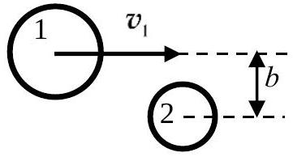
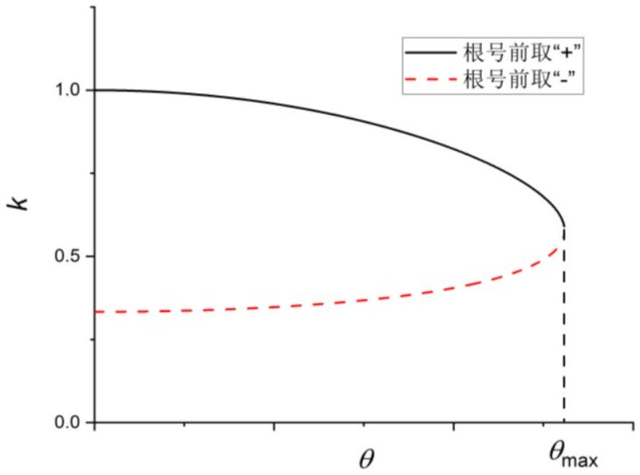
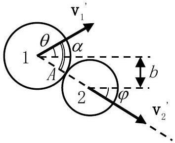

二、（60 分）动能为 $K_{1}$ 的粒子1（入射粒子）从无穷远处入射，与静止的粒子2（靶粒子）发生弹性碰撞，碰撞后粒子 1 的动能和运动方向都发生了变化。不考虑重力。
（1）散射后（无穷远处）粒子 1 的动能为 $K_{1}^{\prime}, k=\frac{K_{1}^{\prime}}{K_{1}}$ 称为运动学因子。试给出 $k$ 的取值范围。
（2）本问采用牛顿力学理论。
（i）将散射后粒子 1 的运动方向（散射方向）与入射方向之间的夹角（散射角）记为 $\theta$ 。将粒子 2 与粒子 1 的质量之比记为 $R$ 。对于任意给定的 $R, k$ 是 $\theta$ 的函数。分别在 $R>1 、 R=1$和 $R<1$ 三种情形下，导出 $k$ 对 $\theta$ 的依赖关系 $k(\theta)$ ，并给出 $\theta$ 的取值范围。
（ii）在某些 $R$ 取值范围中，$k$ 可能是 $\theta$ 的多值函数（每种函数形式称为 $k$ 函数的一个分支）。要确定 $k$ 的值，需要补充描述两粒子相互作用部分细节的参量。采用最简单的硬球模型，即把发生碰撞的两个粒子都视为表面光滑的匀质刚球，它们只在碰撞时有相互作用。设两粒

图2a．瞄准距离 $b$ 的几何示意图

子半径之和为 $A$ ，靶粒子 2 的质心到入射粒子 1 中心的速度所在直线的距离为 $b$（瞄准距离），如图2a 所示。试求 $k$（用 $R 、 A$ 和 $b$ 表出），并用＂擦边而过＂和＂对心碰撞＂这两种特殊情形来验证可由 $b$ 的取值判断同一个 $\theta$ 下 $k(\theta)$ 所在的分支。求出 $k(\theta)$ 各分支所对应的 $b$ 的取值范围。
（3）设两粒子（可视为质点）的静止质量均为 $m_{0}$ 。粒子1的入射速度很快，以至于需要考虑相对论效应。真空中的光速为 $c$ 。
（i）求散射角为 $\theta$ 时的运动学因子 $k(\theta)$ ，并与牛顿力学的结果进行比较。
（ii）求碰后粒子1、2速度之间的夹角 $\alpha$ 与 $K_{1}^{\prime}$ 的关系，$\alpha$ 在何种情况下取极值？并判断极值的性质（极大或极小），给出该极值以及相应的 $\theta$ 值。
（注：解题涉及到需要进行区分的物理量时，用脚标1和2区分粒子，用不加＂＇＂、加＂＇＂分别表示碰撞前、后的物理量。最终表达式中涉及到的三角函数一律采用余弦函数，且不含半角、倍角表示。）

解：（1）弹性碰撞前后体系总动能不变，即

$$
K_{1}=K_{1}{ }^{\prime}+K_{2}{ }^{\prime} \text { (1) } 2 \text { 分 }
$$

由 $k$ 的定义式可知

$$
0 \leq k=\frac{K_{1}{ }^{\prime}}{K_{1}} \leq 1 \quad \text { (2) } \quad 2 \text { 分 }
$$

（2）（i）由于粒子 2 静止，且有散射角，可以处理成二维碰撞。将粒子动量表示为 $\mathbf{p}$ ，碰撞过程满足动量守恒定律：

$$
\mathbf{p}_{1}=\mathbf{p}_{1}{ }^{\prime}+\mathbf{p}_{2}{ }^{\prime} \text { ③ } 2 \text { 分 }
$$

$\mathbf{p}_{\mathbf{1}}{ }^{\prime}$ 与 $\mathbf{p}_{\mathbf{1}}$ 的夹角即为散射角 $\theta$ 。故（3）式可以写成

$$
p_{2}{ }^{\prime 2}=p_{1}^{2}+p_{1}{ }^{\prime 2}-2 p_{1} p_{1}{ }^{\prime} \cos \theta \text { (4) } 2 \text { 分 }
$$

由动量和动能的定义可以给出二者的关系为

$$
p^{2}=2 m K
$$

将（5）代入（4），并联立（1）消去 $K_{2}{ }^{\prime}$ ，可得

$$
\begin{gathered}
K_{1}-2 \sqrt{K_{1} K_{1}^{\prime}} \cos \theta+K_{1}^{\prime}=R\left(K_{1}-K_{1}^{\prime}\right) \\
\frac{K_{1}^{\prime}}{K_{1}}(1+R)-2 \cos \theta \sqrt{\frac{K_{1}^{\prime}}{K_{1}}}+1-R=0
\end{gathered}
$$

解出

$$
\begin{gathered}
\sqrt{k}=\frac{\cos \theta \pm \sqrt{\cos ^{2} \theta-\left(1-R^{2}\right)}}{1+R} \\
k=\left[\frac{\cos \theta \pm \sqrt{\cos ^{2} \theta-\left(1-R^{2}\right)}}{R+1}\right]^{2}
\end{gathered}
$$

显然，这里需要对（6）式或（7）式的多值问题及其相应的自变量 $\theta$ 的定义域进行讨论。
由（2）式和（6）式得

$$
0 \leq \frac{\cos \theta \pm \sqrt{\cos ^{2} \theta-\left(1-R^{2}\right)}}{1+R} \leq 1
$$

讨论：

a． 若 $R>1$ ，靶粒子 2 质量比入射粒子 1 质量大，有
$$
\sqrt{\cos ^{2} \theta-\left(1-R^{2}\right)}>|\cos \theta|
$$

必须舍掉（6）式或（7）式根号前为负号的结果，才能满足（8）式前半个不等式，而（8）式后半不等式由于 $\cos \theta \leq 1$ 自动满足，故有

$$
\begin{gathered}
\sqrt{k}=\frac{\cos \theta+\sqrt{\cos ^{2} \theta-\left(1-R^{2}\right)}}{1+R} \\
k=\left[\frac{\cos \theta+\sqrt{\cos ^{2} \theta-\left(1-R^{2}\right)}}{R+1}\right]^{2}
\end{gathered}
$$

从碰撞几何对称性和（10）式可以看出，在这种情况下，有

$$
0 \leq \theta \leq \pi \quad \text { (11) } 2 \text { 分 }
$$

b．若 $R=1$ ，靶粒子 2 与入射粒子 1 质量相等，代入（7）式，解出：

$$
k=\cos ^{2} \theta \text { 和0 (12) } 2 \text { 分 }
$$

其中的 $k=0$ 解意味着粒子 1 停在了碰撞处，没有散射出来，也就没有散射角。而第一个解需要 $\cos \theta>0, ~ \theta$ 局限于第 I 象限，即

$$
0 \leq \theta<\frac{\pi}{2} \quad \text { (13) } 2 \text { 分 }
$$

因此实际可以探测到的散射粒子的运动学因子只有一个分支，即 $k=\cos ^{2} \theta$ 。

c． 若 $R<1$ ，靶粒子 2 的质量小于入射粒子 1 的质量，有
$$
\sqrt{\cos ^{2} \theta-\left(1-R^{2}\right)}<|\cos \theta|
$$
由上式可知 $\theta \neq \frac{\pi}{2}$ 。当 $\theta>\frac{\pi}{2}$ ，不能满足（8）式；对于 $\theta<\frac{\pi}{2}$ ，则要求
$$
\cos ^{2} \theta-\left(1-R^{2}\right) \geq 0
$$
即
$$
\cos \theta \geq \sqrt{1-R^{2}}
$$
如此，则（8）式得以满足。故

$$
k=\left[\frac{\cos \theta \pm \sqrt{\cos ^{2} \theta-\left(1-R^{2}\right)}}{R+1}\right]^{2} \quad \text { (14) } \quad 2 \text { 分 }
$$

相应地有

$$
0 \leq \theta \leq \arccos \sqrt{1-R^{2}} \quad \text { (15) } 2 \text { 分 }
$$

即存在最大散射角 $\theta_{\text {max }}=\arccos \sqrt{1-R^{2}}$ 。

题解图2a $R<1$ 时的 $k-\theta$ 关系图

（ii）结论（14）意味着在 $R<1$ 时，在一个散射角上可能出现两个 $k$ 值。仅靠能量和动量守恒无法确定 $k$ 取哪一个值，需要考虑碰撞时相互作用的细节。这里采用硬球相互作用模型，已知两粒子半径之和 $A$ ，以瞄准距离 $b$ 作为参量来确定 $k$ 所处的分支。

由于 $b>A$ 时没有散射，故只讨论 $0 \leq b \leq A$ 的情形。

题解图2b 硬球模型下的斜碰撞粒子出射方向示意图

设碰撞后粒子2（反冲粒子）的动量 $\mathbf{p}_{2}{ }^{\prime}$ 与入射粒子动量 $\mathbf{p}_{1}$ 的夹角为 $\varphi$ 。有

$$
b=A \sin \varphi \quad \text { (16) } 1 \text { 分 }
$$

由（3）式得

$$
p_{1}{ }^{\prime 2}=p_{1}{ }^{2}+p_{2}{ }^{\prime 2}-2 p_{1} p_{2}{ }^{\prime} \cos \varphi
$$

将①和⑤代入⑰式，得到

$$
(1+R) \sqrt{(1-k)}=2 \sqrt{R} \cos \varphi
$$

将（16）式代入（18），整理得

$$
k=1-\frac{4 R \cos ^{2} \varphi}{(1+R)^{2}}=1-\frac{4 R\left(1-\sin ^{2} \varphi\right)}{(1+R)^{2}}=\frac{(1-R)^{2}+4 R\left(\frac{b}{A}\right)^{2}}{(1+R)^{2}}
$$

显然 $k$ 随 $b$ 的增加而单调增加。
对于硬球模型，$b=A$ 时，为擦边过，此时有 $\theta=0$ ，但二粒子并未真正发生相互作用，散射粒子动能不变，$k=1$ ，这对应着（14）式根号前取＂＋＂号。
（20） 1 分
$b=0$ 为对心碰，此时也有 $\theta=0, k=\left(\frac{1-R}{1+R}\right)^{2}$ ，对应于（14）式根号前取＂－＂号。（21）1分
由上述分析可知，从擦边过到对心碰的变化过程对应着 $b$ 从 $A$ 单调减小至 0 ，相应地 $k$ 从1 单调减小至 $\left(\frac{1-R}{1+R}\right)^{2}$ 的过程。

下面考察 $\theta$ 随 $b$ 的变化：
【解法一】：由（14）式和（15）式可知，$\theta=\theta_{\text {max }}=\sqrt{1-R^{2}}$ 是 $k(\theta)$ 的分支点，此处 $k(\theta)$ 的两个分支合二为一。将 $k\left(\theta_{\text {max }}\right)$ 记为 $k_{\mathrm{c}}$ ，有

$$
\sqrt{k_{\mathrm{c}}}=\frac{\cos \theta_{\max }}{1+R}=\sqrt{\frac{1-R}{1+R}} \quad \text { (22) } \quad 1 \text { 分 }
$$

对应的瞄准距离为

$$
b_{\mathrm{c}}=\sqrt{\frac{1-R}{2}} A \text { (23) 2分 }
$$

考虑到 $\theta<\theta_{\text {max }}$ ，（14）式的分子部分有

$$
\left\{\begin{array}{l}
\cos \theta+\sqrt{\cos ^{2} \theta-\left(1-R^{2}\right)}>\cos \theta_{\max } \\
\cos \theta-\sqrt{\cos ^{2} \theta-\left(1-R^{2}\right)}<\sqrt{1-R^{2}}=\cos \theta_{\max }
\end{array} \text { (24) } 2\right. \text { 分 }
$$

（将 $\cos \theta 、 \sqrt{\cos ^{2} \theta-\left(1-R^{2}\right)}$ 和 $\sqrt{1-R^{2}}$ 分别看作为直角三角形的三个边长，可得第二个不等式）

由（20）和（21）的分析可知，（24）中第一式对应着 $A \geq b \geq b_{c}$ ，第二式对应着 $b_{c}>b \geq 0$ 。因此有

$$
\left\{\begin{array}{ll}
\sqrt{k}=\frac{\cos \theta+\sqrt{\cos ^{2} \theta-\left(1-R^{2}\right)}}{1+R} & A \geq b \geq \sqrt{\frac{1-R}{2}} A \\
\sqrt{k}=\frac{\cos \theta-\sqrt{\cos ^{2} \theta-\left(1-R^{2}\right)}}{1+R} & \sqrt{\frac{1-R}{2}} A>b \geq 0
\end{array}\right. \text { (25) 4分 }
$$

【解法二】：将（6）式对 $\cos \theta$ 求导

$$
\frac{\mathrm{d} \sqrt{k}}{\mathrm{~d}(\cos \theta)}=\frac{1}{R+1}\left(1 \pm \frac{\cos \theta}{\sqrt{\cos ^{2} \theta-\left(1-R^{2}\right)}}\right)
$$

代回（6）式，整理得到

$$
\frac{\mathrm{d}(\cos \theta)}{\mathrm{d} k}=\left\{\begin{array}{lll}
\frac{\sqrt{\cos ^{2} \theta-\left(1-R^{2}\right)}}{2 k}>0 & \text { (6)式根号前取" }+ \text { "号 } & \\
0 & \cos \theta=\cos \theta_{\max }=\sqrt{1-R^{2}} & \text { (22)' } 2 \text { 分 } \\
-\frac{\sqrt{\cos ^{2} \theta-\left(1-R^{2}\right)}}{2 k}<0 & \text { (6)式根号前取"-"号 } &
\end{array}\right.
$$

综合（19）以及（20）（21）和（22）的分析，可以得到，$b=A$ 时，（14）式根号前（6）式同）取＂＋＂号，散射角 $\theta$ 从0开始先随 $b$ 的下降而增加，直至 $\theta=\theta_{\text {max }}$ ，而后（14）式根号前（6）式同）符号反转，取＂- ＂号，$\theta$ 随 $b$ 的下降而减小，直至 $b=0$ 时 $\theta=0$ 。

当 $\theta=\theta_{\text {max }}=\arccos \sqrt{1-R^{2}}$ 时，由（14）式得到在分支点

$$
k_{\mathrm{c}}=\frac{1-R}{1+R} \quad \text { (23)' } 1 \text { 分 }
$$

将（23）＇代入（19），整理得到此时

$$
b_{\mathrm{c}}=\sqrt{\frac{1-R}{2}} A \text { (24)' 2分 }
$$

因此在 $R<1$ 时，运动学因子

$$
k=\left\{\begin{array}{lll}
{\left[\frac{\cos \theta+\sqrt{\cos ^{2} \theta-\left(1-R^{2}\right)}}{1+R}\right]^{2}} & A \geq b \geq \sqrt{\frac{1-R}{2}} A & \\
{\left[\frac{\cos \theta-\sqrt{\cos ^{2} \theta-\left(1-R^{2}\right)}}{1+R}\right]^{2}} & \sqrt{\frac{1-R}{2}} A>b \geq 0 &
\end{array} \quad \text { (25) } 4\right. \text { 分 }
$$

（3）用 $E$ 表示运动粒子能量，$E_{0}$ 表示静止粒子能量。

$$
E_{0}=m_{0} c^{2}
$$

粒子的动能为

$$
K=E-E_{0} \quad \text { (27) } \quad 2 \text { 分 }
$$

在相对论情形下（1）～（4）式都是成立的。但能动量关系变为

$$
p^{2} c^{2}=E^{2}-E_{0}{ }^{2} \text { (28) } 2 \text { 分 }
$$

将（28）式代入（4），得

$$
E_{2}^{\prime 2}=E_{1}^{2}+E_{1}^{\prime 2}-E_{0}^{2}-2 \sqrt{\left(E_{1}^{2}-E_{0}^{2}\right)\left(E_{1}^{\prime 2}-E_{0}^{2}\right)} \cos \theta \text { (29) } 2 \text { 分 }
$$

联立（27）（29），整理得：

$$
\cos \theta=\sqrt{\frac{\left(E_{1}+E_{0}\right)\left(E_{1}{ }^{\prime}-E_{0}\right)}{\left(E_{1}-E_{0}\right)\left(E_{1}{ }^{\prime}+E_{0}\right)}}=\sqrt{\frac{\left(K_{1}+2 m_{0} c^{2}\right) K_{1}{ }^{\prime}}{K_{1}\left(K_{1}{ }^{\prime}+2 m_{0} c^{2}\right)}} \text { (30) 2分 }
$$

整理，得

$$
k=\frac{K_{1}{ }^{\prime}}{K_{1}}=\frac{\cos ^{2} \theta}{K_{1}\left(1-\cos ^{2} \theta\right)+2 m_{0} c^{2}} 2 m_{0} c^{2} \text { (31) 2 分 }
$$

比较③1式和⑫式，可以看到它们的比值

$$
\frac{2 m_{0} c^{2}}{K_{1}\left(1-\cos ^{2} \theta\right)+2 m_{0} c^{2}} \leq 1 \quad \text { (32) } 1 \text { 分 }
$$

即在高能粒子散射情况下，经典模型会高估散射粒子的动能。
或：比较（31）式和（12）式，可以看到当 $K_{1} \ll m_{0} c^{2}$ 时，（31）式会退化成（12）式。（32）＇ 1 分
（4）由（2）式可得：

$$
p_{1}^{2}=p_{1}{ }^{2}+p_{2}{ }^{2}+2 p_{1}{ }^{\prime} p_{2}{ }^{\prime} \cos \alpha \quad \text { (33) } \quad 2 \text { 分 }
$$

将（1）（27）（28）代入（33），得：

$$
\left(E_{1}^{\prime}-E_{0}\right)\left(E_{2}^{\prime}-E_{0}\right)=\sqrt{\left(E_{1}^{\prime 2}-E_{0}^{2}\right)\left(E_{2}^{\prime 2}-E_{0}^{2}\right)} \cos \alpha
$$

$$
\cos \alpha=\sqrt{\frac{\left(E_{1}^{\prime}-E_{0}\right)\left(E_{2}^{\prime}-E_{0}\right)}{\left(E_{1}^{\prime}+E_{0}\right)\left(E_{2}^{\prime}{ }^{2}+E_{0}\right)}}=\sqrt{\frac{K_{1}^{\prime}\left(K_{1}-K_{1}^{\prime}\right)}{\left(K_{1}^{\prime}+2 m_{0} c^{2}\right)\left(K_{1}-K_{1}^{\prime}+2 m_{0} c^{2}\right)}} \quad \text { (34) } \quad 3 \text { 分 }
$$

将（33）对 $K_{1}{ }^{\prime}$ 求导，整理得

$$
\frac{\mathrm{d}(\cos \alpha)}{\mathrm{d} K_{1}^{\prime}}=\frac{\left(K_{1}+2 m_{0} c^{2}\right)\left(K_{1}-2 K_{1}^{\prime}\right) E_{0}}{\sqrt{\left(K_{1}^{\prime}+2 m_{0} c^{2}\right)\left(K_{1}-K_{1}^{\prime}+2 m_{0} c^{2}\right)}}
$$

若要 $\frac{\mathrm{d}(\cos \alpha)}{\mathrm{d} K_{1}{ }^{\prime}}=0$ ，有

$$
K_{1}{ }^{\prime}=\frac{1}{2} K_{1} \quad \text { (35) } \quad 2 \text { 分 }
$$

此时 $\frac{\mathrm{d}^{2}(\cos \alpha)}{\mathrm{d} K_{1}{ }^{2}}<0, \alpha$ 取极小值。将（35）代入（34），得

$$
\begin{gathered}
\cos \alpha_{\min }=\frac{K_{1}}{K_{1}+4 m_{0} c^{2}} \\
\alpha_{\min }=\arccos \frac{K_{1}}{K_{1}+4 m_{0} c^{2}} \quad \text { (36) } 2 \text { 分 }
\end{gathered}
$$

将（35）代入（30）式，得

$$
\begin{aligned}
& \cos ^{2} \theta=\frac{K_{1}+2 m_{0} c^{2}}{K_{1}+4 m_{0} c^{2}}=\frac{1}{2}\left(\cos \alpha_{\min }+1\right) \\
& \theta=\frac{\alpha_{\min }}{2}=\frac{1}{2} \arccos \frac{K_{1}}{K_{1}+4 m_{0} c^{2}} \quad \text { (37) } 2 \text { 分 }
\end{aligned}
$$

说明散射粒子与反冲粒子均分入射粒子动能时，二者速度夹角最小，且两粒子出射方向对称。

【由（34）式可知，当 $K_{1}{ }^{\prime}=0$ 或 $K_{1}$ 时，分别对应着对心碰和擦边过， $\cos \alpha=0, \alpha$ 有最大极限值

$$
\alpha_{\max }=\frac{\pi}{2}
$$

相应地，由（38）可知此时有 $\cos \theta=0$ 或 1 ，即 $\theta=\frac{\pi}{2}$ 或 0 】
评分标准：总60分
（1）（4 分）
（1）（2）各2分
（2）（34分，其中（i）18分，（ii）16分）
（i）③④⑥（或⑦）⑩⑪⑫⑬ 如果写成 $0 \leq \theta \leq \frac{\pi}{2}$ ，不扣分）⑭⑮各2分
（ii）⑯1分，⑲4分，⑳②1各1分，【解法一】：②21分，②3②4各2分；②54分，【解法二】：
（22）＇ 2 分；（23）＇ 1 分，（24）＇ 2 分；（25）＇ 4 分，注：（25）＇式中 $\frac{\mathrm{d}(\cos \theta)}{\mathrm{d} k}=0$ 的取值合并到上下任意一个

分支都可以，只要将相应的不等式中加上等号）
（3）（11 分）
（27）（28）（29）（30）（31）各2分，（32）（或（32）＇）1分
（4）（11 分）
（33）2分，（34）3分，（35）（36）（37）各2分（注：如果在（37）之外还写了【】中内容，即把最大极限值作为极值的，不扣分）
