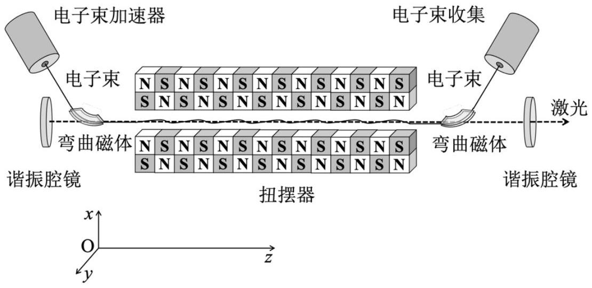
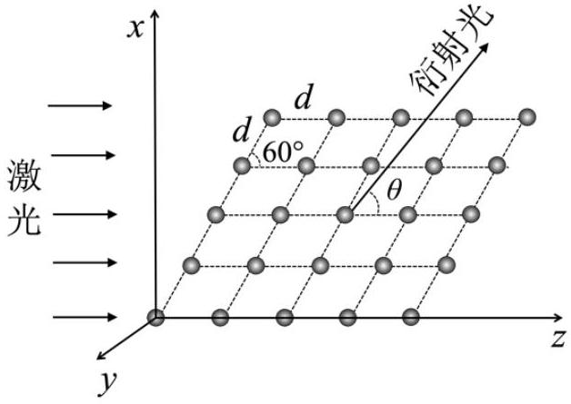
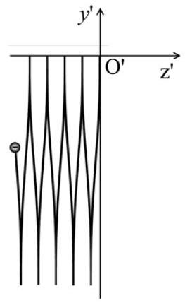
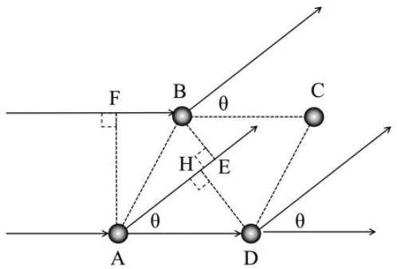

四、（60 分）自由电子激光器是以自由电子束为工作物质，将相对论性电子束的动能转变成相干辐射能的装置，它在科研、生产等领域中都具有重大应用前景。如图4a，自由电子激

图4a
光器的基本结构有三个部分：电子束加速器、扭摆器和光学谐振腔；其中扭摆器是自由电子激光器的核心部分，它由沿 $z$ 方向按空间周期 $\Lambda$ 排列的永磁体组成，产生周期性横向静磁场，磁感应强度方向沿 $x$ 轴，大小为

$$
B=B_{0} \cos \left(\frac{2 \pi}{\Lambda} z\right)
$$

电子束经过加速器加速到预定的速率 $v_{0}$ ，由弯曲磁体引导，沿 $z$ 轴正方向注入扭摆器，高速运动的电子在扭摆器中受到交变磁场的作用做扭摆运动，同时辐射相干电磁波。设 $B_{0}$ 不太强，磁场对电子运动速度的改变量的大小远小于 $v_{0}$ ，且电子束相干辐射电磁波对电子动能的损耗可忽略不计。电子的静止质量为 $m_{\mathrm{e}}$ ，电子所带电量为 $-e$ 。不计重力。
（1）建立参考系 $\mathrm{S}^{\prime}\left(x^{\prime}, y^{\prime}, z^{\prime}\right)$ ，使 $\mathrm{S}^{\prime}$ 相对于实验室参考系 $\mathrm{S}(x, y, z)$ 沿 $z$ 轴正方向以大小为 $v_{0}$ 的速度做匀速直线运动，$x^{\prime}$ 轴和 $x$ 轴、 $y^{\prime}$ 轴和 $y$ 轴两两相互平行，$z^{\prime}$ 轴和 $z$ 轴重合。利用前述近似条件，在参考系 $\mathrm{S}^{\prime}$ 中求出电子在 $t^{\prime}$ 时刻的位置坐标 $\left(x^{\prime}, y^{\prime}, z^{\prime}\right)$ ，并画出电子运动轨迹示意图。
（2）如果扭摆器磁场的空间变化周期 $\Lambda=1 \mathrm{~mm}$（可视为准确值），沿 $z$ 轴正方向辐射 X 激光的波长为 $4.00 \AA$ ，求电子束加速器的加速电压。已知电子静止质量 $m_{\mathrm{e}}=9.11 \times 10^{-31} \mathrm{~kg}$ ，单位电荷量$e=1.60 \times 10^{-19} \mathrm{C}$ 。
（3）用波长为 $4.00 \AA$ 的激光作为入射光（可视为平面波），如图4b所示。在 $x-z$ 平面内有等边菱形组成的共面二维晶体，菱形的边长 $d=8.00 \AA$ ，两顶角各为 $60^{\circ} 、 120^{\circ}$ ，设二维晶体对入射

图4b

波的散射较弱，可忽略散射波再次被散射的影响，试问在 $x-z$ 平面内远处可以观察到多少衍射主级峰？并求相应主级峰的方位（用图4b中的 $\theta$表示）。

已知：在两惯性参考系 $\mathrm{S}^{\prime}\left(x^{\prime}, y^{\prime}, z^{\prime}\right) 、 \mathrm{~S}(x, y, z)$ 中电磁场的变换关系为

$$
\left\{\begin{array} { l }
{ E _ { x ^ { \prime } } = \frac { E _ { x } - v _ { 0 } B _ { y } } { \sqrt { 1 - ( \frac { v _ { 0 } } { c } ) ^ { 2 } } } , } \\
{ E _ { y ^ { \prime } } = \frac { E _ { y } + v _ { 0 } B _ { x } } { \sqrt { 1 - ( \frac { v _ { 0 } } { c } ) ^ { 2 } } } , } \\
{ E _ { z ^ { \prime } } = E _ { z } . }
\end{array} \left\{\begin{array}{c}
B_{x^{\prime}}=\frac{B_{x}+\frac{v_{0}}{c^{2}} E_{y}}{\sqrt{1-\left(\frac{v_{0}}{c}\right)^{2}}}, \\
B_{y^{\prime}}=\frac{B_{y}-\frac{v_{0}}{c^{2}} E_{x}}{\sqrt{1-\left(\frac{v_{0}}{c}\right)^{2}}}, \\
B_{z^{\prime}}=B_{z} .
\end{array}\right.\right.
$$

式中 $c=3.00 \times 10^{8} \mathrm{~m} / \mathrm{s}$ 是真空中的光速。

解答：（1）
【解法一】：
在 S 参考系中求电子的运动：设电子在扭摆器中出发于坐标原点，其初速度为

$$
\boldsymbol{v}_{\mathbf{0}}=v_{0} \boldsymbol{k}
$$

根据相对论性质点动量定理，有

$$
\frac{d \boldsymbol{p}}{d t}=-e \boldsymbol{v} \times \boldsymbol{B}
$$

其中电子的相对论性动量为

$$
\boldsymbol{p}=m \boldsymbol{v}=\frac{m_{e}}{\sqrt{1-\left(\frac{v}{c}\right)^{2}}} \boldsymbol{v}
$$

由（1）式，磁场力不做功，能量不变相应速率不变，故有

$$
v^{2}=v_{x}^{2}+v_{y}^{2}+v_{z}^{2}=v_{0}^{2}
$$

因此也有

$$
m=\frac{m_{e}}{\sqrt{1-\left(\frac{v_{0}}{c}\right)^{2}}}
$$

为常量。将

$$
\boldsymbol{B}=B_{0} \cos \left(\frac{2 \pi}{\Lambda} z\right) \boldsymbol{i}
$$

代入（1），并考虑到 $m$ 为常量，可得

$$
\begin{aligned}
\frac{d v_{x}}{d t} & =0 \\
\frac{d v_{y}}{d t} & =-\frac{e B_{0}}{m} v_{z} \cos \left(\frac{2 \pi}{\Lambda} z\right) \\
\frac{d v_{z}}{d t} & =\frac{e B_{0}}{m} v_{y} \cos \left(\frac{2 \pi}{\Lambda} z\right)
\end{aligned}
$$

由 $\frac{d v_{x}}{d t}=0$ 及初值条件（ $x_{0}=0, v_{x 0}=0$ ）得

$$
v_{x} \equiv 0, \quad x \equiv 0
$$

由（3）式得

$$
d v_{y}=-\frac{e B_{0}}{m} \cos \left(\frac{2 \pi}{\Lambda} z\right) d z
$$

积分得（ $v_{y 0}=0, z_{0}=0$ ）

$$
v_{y}=-\frac{e B_{0} \Lambda}{2 \pi m} \sin \left(\frac{2 \pi}{\Lambda} z\right)
$$

将 $v_{x} \equiv 0$ 及（5）代入（2），得

$$
v_{z}=\sqrt{v_{0}^{2}-\frac{e^{2} B_{0}^{2} \Lambda^{2}}{8 \pi^{2} m^{2}}\left[1-\cos \left(\frac{4 \pi}{\Lambda} z\right)\right]}
$$

【附注：也可以利用微商恒等式 $\frac{d v_{z}}{d t}=\frac{1}{2} \frac{d v_{z}^{2}}{d z}$ ，由（4）式积分得到（6）式】

按题意，磁场不强，对电子速度的改变量大小远远小于 $v_{0}$ ，领头阶近似有

$$
v_{z} \approx v_{0}, \quad z \approx v_{0} t
$$

将此近似条件带入到电子感受到的磁场分布函数（及相应的积分结果）中，由（7）式得

$$
v_{y}=-\frac{e B_{0} \Lambda}{2 \pi m} \sin \left(\frac{2 \pi}{\Lambda} v_{0} t\right)
$$

积分得 $\left(y_{0}=0\right)$

$$
y=\frac{e B_{0} \Lambda^{2}}{4 \pi^{2} v_{0} m}\left[\cos \left(\frac{2 \pi}{\Lambda} v_{0} t\right)-1\right]
$$

此外，准确到小量 $B_{0}^{2}$ 阶，由（6）式得

$$
v_{z}=v_{0}\left(1-\frac{e^{2} B_{0}^{2} \Lambda^{2}}{16 \pi^{2} m^{2} v_{0}^{2}}\left[1-\cos \left(\frac{4 \pi}{\Lambda} v_{0} t\right)\right]\right)
$$

对时间积分得（ $z_{0}=0$ ）

$$
z=v_{0} t-\frac{e^{2} B_{0}^{2} \Lambda^{2}}{16 \pi^{2} m^{2} v_{0}} t+\frac{e^{2} B_{0}^{2} \Lambda^{3}}{64 \pi^{3} m^{2} v_{0}} \sin \left(\frac{4 \pi}{\Lambda} v_{0} t\right)
$$

利用洛伦兹变换，变换到 S＇系，得

$$
\begin{gathered}
x^{\prime}=x=0 \\
y^{\prime}=y=\frac{e B_{0} \Lambda^{2}}{4 \pi^{2} v_{0} m}\left[\cos \left(\frac{2 \pi}{\Lambda} v_{0} \frac{t^{\prime}+\frac{v_{0}}{c^{2}} z^{\prime}}{\sqrt{1-\beta^{2}}}\right)-1\right] \quad \text { (10) (2 分) } \\
z^{\prime}=\frac{-\frac{e^{2} B_{0}^{2} \Lambda^{2}}{16 \pi^{2} m^{2} v_{0}} \frac{t^{\prime}+\frac{v_{0}}{c^{2}} z^{\prime}}{\sqrt{1-\beta^{2}}}+\frac{e^{2} B_{0}^{2} \Lambda^{3}}{64 \pi^{3} m^{2} v_{0}} \sin \left(\frac{4 \pi}{\Lambda} v_{0} \frac{t^{\prime}+\frac{v_{0}}{c^{2}} z^{\prime}}{\sqrt{1-\beta^{2}}}\right)}{\sqrt{1-\beta^{2}}}
\end{gathered}
$$

容易判断，$z^{\prime}$ 的领头阶正比于小量 $B_{0}^{2}$ 。对①⑪分别展开至各自的领头阶，得

$$
\begin{aligned}
& y^{\prime}=\frac{e B_{0} v_{0}}{\omega^{\prime 2} m_{e} \sqrt{1-\beta^{2}}}\left[\cos \left(\omega^{\prime} t^{\prime}\right)-1\right] \\
& z^{\prime}=\frac{e^{2} v_{0} B_{0}^{2}}{8 \omega^{\prime 3} m_{e}^{2}\left(1-\beta^{2}\right)}\left(\sin 2 \omega^{\prime} t^{\prime}-2 \omega^{\prime} t^{\prime}\right)
\end{aligned}
$$

其中

$$
\omega^{\prime}=\frac{2 \pi}{\Lambda} \frac{v_{0}}{\sqrt{1-\beta^{2}}}
$$

【解法二】：参考系 $S^{\prime}\left(x^{\prime}, y^{\prime}, z^{\prime}\right)$ 中电磁场（只写出其非零分量）：

$$
\begin{aligned}
E_{y^{\prime}} & =\frac{v_{0}}{\sqrt{1-\beta^{2}}} B_{0} \cos \left(\frac{2 \pi}{\Lambda} z\right) \\
B_{x^{\prime}} & =\frac{1}{\sqrt{1-\beta^{2}}} B_{0} \cos \left(\frac{2 \pi}{\Lambda} z\right)
\end{aligned}
$$

式中 $\beta=v_{0} / c$ 。
由洛伦兹变换得：

$$
z=\frac{z^{\prime}+v_{0} t^{\prime}}{\sqrt{1-\beta^{2}}}
$$

于是：

$$
\begin{aligned}
E_{y^{\prime}} & =\frac{v_{0}}{\sqrt{1-\beta^{2}}} B_{0} \cos \left(\frac{2 \pi}{\Lambda} \frac{z^{\prime}+v_{0} t^{\prime}}{\sqrt{1-\beta^{2}}}\right) \\
B_{x^{\prime}} & =\frac{1}{\sqrt{1-\beta^{2}}} B_{0} \cos \left(\frac{2 \pi}{\Lambda} \frac{z^{\prime}+v_{0} t^{\prime}}{\sqrt{1-\beta^{2}}}\right)
\end{aligned}
$$

（注：如果直接给出④＇和⑤＇，给8分）
在参考系 $\mathrm{S}^{\prime}\left(x^{\prime}, y^{\prime}, z^{\prime}\right)$ 中，因为磁感应强度 $B_{0}$ 不太大，磁场对电子运动速度的改变远远小于 $v_{0}$ ，所以在参考系 $\mathrm{S}^{\prime}\left(x^{\prime}, y^{\prime}, z^{\prime}\right)$ 中，电子在原点 $\mathrm{O}^{\prime}\left(x^{\prime}=0, y^{\prime}=0, z^{\prime}=0\right)$ 附近运动，沿 $z^{\prime}$ 轴偏离 $\mathrm{O}^{\prime}$ 的位移远远小于 $\Lambda$ ，因此，电子感受的电磁场近似为 $\mathrm{O}^{\prime}$ 处 $\left(x^{\prime}=0, y^{\prime}=0, z^{\prime}=0\right)$ 的电磁场：

$$
\begin{aligned}
& E_{y^{\prime}}=\frac{v_{0} B_{0}}{\sqrt{1-\beta^{2}}} \cos \omega^{\prime} t^{\prime} \\
& B_{x^{\prime}}=\frac{B_{0}}{\sqrt{1-\beta^{2}}} \cos \omega^{\prime} t^{\prime}
\end{aligned}
$$

式中

$$
\omega^{\prime}=\frac{2 \pi v_{0}}{\Lambda \sqrt{1-\beta^{2}}}
$$

｛解法二（2）\}:
设在实验室参考系 $\mathrm{S}(x, y, z)$ 中，沿 $x$ 轴方向的磁场的磁感应强度为 $B_{x}$ ，则在参考系 $\mathrm{S}^{\prime}\left(x^{\prime}, y^{\prime}, z^{\prime}\right)$中，电子所感受到的电磁场（只写出其非零分量）为：

$$
\begin{aligned}
& E_{y^{\prime}}=\frac{v_{0}}{\sqrt{1-\beta^{2}}} B_{x} \\
& B_{x^{\prime}}=\frac{1}{\sqrt{1-\beta^{2}}} B_{x}
\end{aligned}
$$

其中 $\beta=v_{0} / c$ 。
参考系 $\mathrm{S}(x, y, z)$ 中的静磁场，空间周期为 $\Lambda$ ，在参考系 $\mathrm{S}^{\prime}\left(x^{\prime}, y^{\prime}, z^{\prime}\right)$ 观察到的空间周期为

$$
\Lambda^{\prime}=\Lambda \sqrt{1-\beta^{2}}
$$

在参考系 $\mathrm{S}^{\prime}\left(x^{\prime}, y^{\prime}, z^{\prime}\right)$ 中，原点 $\mathrm{O}^{\prime}$ 处测量的电场和磁场为交变场，其角频率为

$$
\omega^{\prime}=\frac{2 \pi}{T^{\prime}}=\frac{2 \pi}{\frac{\Lambda^{\prime}}{v_{0}}}=\frac{2 \pi v_{0}}{\Lambda \sqrt{1-\beta^{2}}}
$$

在参考系 $\mathrm{S}^{\prime}\left(x^{\prime}, y^{\prime}, z^{\prime}\right)$ 中，因为磁感应强度 $B_{0}$ 不太大，磁场对电子运动速度的改变远远小于 $v_{0}$ ，所以在参考系 $\mathrm{S}^{\prime}\left(x^{\prime}, y^{\prime}, z^{\prime}\right)$ 中，电子在 $\mathrm{O}^{\prime}$ 附近运动，沿 $z^{\prime}$ 轴偏离 $\mathrm{O}^{\prime}$ 的位移远远小于 $\Lambda$ ，因此，电子感受的电磁场近似为 $\mathrm{O}^{\prime}$ 处的电磁场：

$$
\begin{aligned}
& E_{y^{\prime}}=\frac{v_{0} B_{0}}{\sqrt{1-\beta^{2}}} \cos \omega^{\prime} t^{\prime} \\
& B_{x^{\prime}}=\frac{B_{0}}{\sqrt{1-\beta^{2}}} \cos \omega^{\prime} t^{\prime}
\end{aligned}
$$

电子在参考系 $\mathrm{S}^{\prime}$ 中的初始位置和初始速度（初始条件）分别为：

$$
\left(x^{\prime}, y^{\prime}, z^{\prime}\right)=(0,0,0), \quad\left(v_{x^{\prime}}(0), v_{y^{\prime}}(0), v_{z^{\prime}}(0)\right)=(0,0,0) \quad \text { (8)' (1 分) }
$$

在参考系 $\mathrm{S}^{\prime}$ 中电子运动的速度远远小于光速，所以电子运动方程满足经典的牛顿力学定律

$$
\begin{aligned}
& m_{\mathrm{e}} \frac{\mathrm{~d}^{2} y^{\prime}}{\mathrm{d} t^{\prime 2}}=-e \frac{v_{0} B_{0}}{\sqrt{1-\beta^{2}}} \cos \left(\omega^{\prime} t^{\prime}\right)-e \frac{B_{0}}{\sqrt{1-\beta^{2}}} \frac{\mathrm{~d} z^{\prime}}{\mathrm{d} t^{\prime}} \cos \left(\omega^{\prime} t^{\prime}\right) \\
& m_{\mathrm{e}} \frac{\mathrm{~d}^{2} z^{\prime}}{\mathrm{d} t^{\prime 2}}=e \frac{B_{0}}{\sqrt{1-\beta^{2}}} \frac{\mathrm{~d} y^{\prime}}{\mathrm{d} t^{\prime}} \cos \left(\omega^{\prime} t^{\prime}\right)
\end{aligned}
$$

因为 $\frac{\mathrm{d} \mathrm{z}^{\prime}}{\mathrm{d} t^{\prime}} \ll v_{0}$ ，所以⑨式右端第二项可忽略。于是

$$
m_{\mathrm{e}} \frac{\mathrm{~d}^{2} y^{\prime}}{\mathrm{d} t^{\prime 2}}=-e \frac{v_{0} B_{0}}{\sqrt{1-\beta^{2}}} \cos \left(\omega^{\prime} t^{\prime}\right)
$$

积分得（同时考虑初始条件）

$$
y^{\prime}=\frac{e v_{0} B_{0}}{\omega^{\prime 2} m_{\mathrm{e}} \sqrt{1-\beta^{2}}}\left[\cos \left(\omega^{\prime} t^{\prime}\right)-1\right]
$$

将（12）＇式代入（10）＇式得：

$$
\begin{aligned}
& z^{\prime}=\frac{e^{2} v_{0} B_{0}^{2}}{8 \omega^{\prime 3} m_{\mathrm{e}}^{2}\left(1-\beta^{2}\right)}\left[\sin \left(2 \omega^{\prime} t^{\prime}\right)-2 \omega^{\prime} t^{\prime}\right] \\
& x^{\prime}=0
\end{aligned}
$$

题解图4a

（如果初始位置没有选择在 $z^{\prime}=0$ ，（13）＇式出现一个常数项，不扣分）

即电子在 $y^{\prime} z^{\prime}$ 平面内做＂$Z$＂字形运动，沿 $z^{\prime}$ 轴为直线匀速运动，如解题图4a所示。（14）（2 分）
（2）沿 $z^{\prime}$ 轴辐射的电磁波来自于沿 $y^{\prime}$ 轴振荡的电子，电磁波的频率等于电子沿 $y^{\prime}$ 轴的振动频率，所以在参考系 $\mathrm{S}^{\prime}$ 中

$$
\omega_{0}=\omega^{\prime}=\frac{2 \pi v_{0}}{\Lambda \sqrt{1-\beta^{2}}}
$$

根据多普勒效应得，在实验室参考系 s 中测量辐射电磁波的频率为

$$
\omega=\frac{2 \pi c}{\lambda}=\sqrt{\frac{1+\beta}{1-\beta}} \omega_{0}=\frac{2 \pi v_{0}}{\Lambda \sqrt{1-\beta^{2}}} \sqrt{\frac{1+\beta}{1-\beta}}=\frac{2 \pi v_{0}}{\Lambda(1-\beta)}
$$

由（16）式和题给数据得

$$
v_{0}=\frac{\Lambda}{\Lambda+\lambda} c \approx \frac{0.1}{0.1+4 \times 10^{-8}} c=\left(1-4.00 \times 10^{-7}\right) c
$$

电子加速器的加速电压满足

$$
e U=\frac{m_{\mathrm{e}} c^{2}}{\sqrt{1-\left(\frac{v_{0}}{c}\right)^{2}}}-m_{\mathrm{e}} c^{2}
$$

由（17）、（18）式和题给数据得

$$
\begin{aligned}
U & =\frac{m_{\mathrm{e}} c^{2}}{e}\left[\frac{1}{\sqrt{1-\left(\frac{v_{0}}{c}\right)^{2}}}-1\right] \\
& \approx \frac{m_{\mathrm{e}} c^{2}}{e} \frac{1}{\sqrt{2 \times 4.00 \times 10^{-7}}} \\
& =\frac{9.11 \times 10^{-31}\left(3.00 \times 10^{8}\right)^{2}}{1.60 \times 10^{-19} \sqrt{2 \times 4.00 \times 10^{-7}}} \mathrm{~V} \\
& \approx 5.73 \times 10^{8} \mathrm{~V}
\end{aligned}
$$

（19）（2 分）
（3）由图4b可知，平行光（X 激光）入射到二维晶面上每一格点，每一个格点都可以看成次波源，向四周发出次波，在 $x z$平面上远处观察与 $z$ 方向成 $\theta$ 角的衍射光。二维晶面对 X 激光的衍射为夫琅禾费衍射。入射光波矢为 $\vec{k}$ ，衍射光波矢 $\vec{k}^{\prime}$ ，设位于坐标原点的格点（ 0,0 ）的夫琅禾费衍射场为 $\widetilde{U}_{0}(\theta)$ ，格点（ 0,0 ）衍射场和格点（ $m, n$ ）衍射场的相位差

$$
\Delta \varphi=\vec{k}^{\prime} \cdot \vec{r}-\vec{k} \cdot \vec{r}
$$

于是 $(m, n)$ 格点的夫琅禾费衍射场为

$$
\widetilde{U}_{m n}(\theta)=\widetilde{U}_{0}(\theta) e^{-i \Delta \varphi}=\widetilde{U}_{0}(\theta) e^{-i\left(\vec{k}^{\prime}-\vec{k}\right) \cdot \vec{r}}
$$

其中 $\vec{r}$ 为格点 $(m, n)$ 的位置矢量：$\vec{r}=\left(\frac{\sqrt{3}}{2} m d, 0, n d+\frac{1}{2} m d\right), \vec{k}=\frac{2 \pi}{\lambda}(0,0,1), \vec{k}^{\prime}=$ $\frac{2 \pi}{\lambda}(\sin \theta, 0, \cos \theta)$ ，于是由以上各式得，格点 $(m, n)$ 的衍射场为

$$
\begin{aligned}
\tilde{U}_{m n}(\theta) & =\tilde{U}_{0}(\theta) \exp \left\{-i \frac{2 \pi}{\lambda}\left[\frac{\sqrt{3}}{2} m d \sin \theta+\left(n+\frac{m}{2}\right) d(\cos \theta-1)\right]\right\} \\
& =\tilde{U}_{0}(\theta) \exp \left\{-i \frac{2 \pi}{\lambda}\left[m d\left(\frac{\sqrt{3}}{2} \sin \theta+\frac{1}{2} \cos \theta-\frac{1}{2}\right)+n d(\cos \theta-1)\right]\right\} \\
& =\tilde{U}_{0}(\theta) \exp \left(-i 2 m \beta_{1}-i 2 n \beta_{2}\right)
\end{aligned}
$$

式中

$$
\beta_{1}=\frac{\pi}{\lambda} d\left(\frac{\sqrt{3}}{2} \sin \theta+\frac{1}{2} \cos \theta-\frac{1}{2}\right), \quad \beta_{2}=\frac{\pi}{\lambda} d(\cos \theta-1)
$$

二维晶面的总的衍射场为各个格点发出次波的相干叠加，即：

$$
\begin{aligned}
\tilde{U}(\theta) & =\sum_{m=0}^{N_{1}-1} \sum_{n=0}^{N_{2}-1} \tilde{U}_{m n}(\theta)=\tilde{U}_{0}(\theta) \sum_{m=0}^{N_{1}-1} \exp \left(-i 2 m \beta_{1}\right) \sum_{n=0}^{N_{2}-1} \exp \left(-i 2 n \beta_{2}\right) \\
& =\widetilde{U}_{0}(\theta) e^{-i\left(N_{1}-1\right) \beta_{1}} e^{-i\left(N_{2}-1\right) \beta_{2}}\left(\frac{\sin N_{1} \beta_{1}}{\sin \beta_{1}}\right)\left(\frac{\sin N_{2} \beta_{2}}{\sin \beta_{2}}\right)
\end{aligned}
$$

「这里，利用了等比级数求和公式 $\sum_{n=0}^{N-1} \mathrm{e}^{-i 2 n \beta}=\frac{1-\mathrm{e}^{-i 2 N \beta}}{1-\mathrm{e}^{-i 2 \beta}}$ ，以及 $\left(1-e^{i \mathrm{~F}}\right)=-2 i \mathbf{x i n}^{\mathrm{F}} \frac{\mathrm{F}}{2} \mathbf{x}^{i \frac{\mathrm{~F}}{2}}$ 」
由（23）式知，衍射光强分布为

$$
I(\theta)=|\widetilde{U}(\theta)|^{2}=\left|\widetilde{U}_{0}(\theta)\right|^{2}\left(\frac{\sin N_{1} \beta_{1}}{\sin \beta_{1}}\right)^{2}\left(\frac{\sin N_{2} \beta_{2}}{\sin \beta_{2}}\right)^{2}
$$

于是主级峰位置：
$\beta_{1}=\frac{\pi}{\lambda} d\left(\frac{\sqrt{3}}{2} \sin \theta+\frac{1}{2} \cos \theta-\frac{1}{2}\right)=k_{1} \pi, \quad \beta_{2}=\frac{\pi}{\lambda} d(\cos \theta-1)=k_{2} \pi \quad$（25）
即

$$
\begin{aligned}
& d\left(\frac{\sqrt{3}}{2} \sin \theta+\frac{1}{2} \cos \theta-\frac{1}{2}\right)=k_{1} \lambda \\
& d(\cos \theta-1)=k_{2} \lambda
\end{aligned}
$$

其中 $k_{1} 、 k_{2}$ 为整数。
（注：（25）中每式 1 分；如果直接给出（26）、（27），每式各1分；如果（25）、（26）、（27）都给出一共2分）
［
解法（二）
平面波入射，二维晶面上每一格点都可以看成次波源，向四周发出次波，主峰的位置要求行上各个格点发出的次波相干相增，同时要求列上各个格点发出的次波相干相增，如解题图5b 所示。主级峰的位置同时满足：

$$
\begin{aligned}
& \Delta L_{\text {行 }}=\overline{A E}-\overline{F B}=d \cos \left(\frac{\pi}{3}-\theta\right)-d \sin \left(\frac{\pi}{6}\right) \\
& =d\left(\frac{\sqrt{3}}{2} \sin \theta+\frac{1}{2} \cos \theta-\frac{1}{2}\right)=k_{1} \lambda \\
& \Delta L_{\text {列 }}=\overline{\mathrm{AH}}-\overline{\mathrm{AD}}=d(\cos \theta-1)=k_{2} \lambda
\end{aligned}
$$

解题图 5b

由（26）式得：

$$
-1 \leq \sin \left(\theta+\frac{\pi}{6}\right)=\frac{1}{2}+k_{1} \frac{\lambda}{d} \leq 1
$$

因为 $d=2 \lambda$ ，所以

$$
k_{1}=+1,0,-1,-2,-3
$$

由（27）式得：

$$
-1 \leq \cos \theta=1+k_{2} \frac{\lambda}{d} \leq 1
$$

因为 $d=2 \lambda$ ，所以

$$
k_{2}=0,-1,-2,-3,-4
$$

（注：（28）、（29）写出其一，得2分；两式不重复给分）

于是

$$
\cos \theta=1, \frac{1}{2}, 0,-\frac{1}{2},-1
$$

将上面求解的符合要求的整数 $k_{2}$ 所对应的 $\cos \theta$ 代入（24）式

$$
k_{1}=2\left(\frac{\sqrt{3}}{2} \sin \theta+\frac{1}{2} \cos \theta-\frac{1}{2}\right)= \pm \sqrt{3-3 \cos ^{2} \theta}+\cos \theta-1
$$

要求上式为 $k_{1}$ 为整数，于是：

$$
k_{2}=0, \cos \theta=1 \text {, 得 } k_{1}=0, \theta=0 \text {, 出现零级主级峰。 }
$$

$k_{2}=-1, \cos \theta=\frac{1}{2}$ ，得 $k_{1}=1, \sin \theta=\frac{\sqrt{3}}{2}, \theta=60^{\circ}$ ；或 $k_{1}=-2, \sin \theta=-\frac{\sqrt{3}}{2}, \theta=-60^{\circ}$ ；
即在 $\theta= \pm 60^{\circ}$ 各出现一个主级峰，共两个主级峰。
（32）（4 分）
（注：两结果各2分）

$$
k_{2}=-2, \cos \theta=0, \text { 得 } k_{1}= \pm \sqrt{3}-1 \text {, 非整数, 无主级峰出现。 }
$$

$k_{2}=-3, \cos \theta=-\frac{1}{2}$ ，得 $k_{1}=0, \sin \theta=\frac{\sqrt{3}}{2}, \theta=120^{\circ}$ ；或 $k_{1}=-3, \sin \theta=-\frac{\sqrt{3}}{2}, \theta=-120^{\circ}$ ；
即在 $\theta= \pm 120^{\circ}$ 各出现一个主级峰，共两个主级峰。
（34）（4 分）
（注：两结果各2分）

$$
k_{2}=-4, \cos \theta=1 \text {, 得 } k_{1}=-2, ~ \sin \theta=0, \theta=180^{\circ} \text {, 出现一个主级峰。 }
$$

结论：可以观察到 6 个主级峰，分别出现在：$\theta=0, \pm 60^{\circ}, \pm 120^{\circ}, 180^{\circ}$
（注：$\theta=0^{\circ}$ 或 $180^{\circ}$ 对应的主级峰无法观测，故不采分。）

评分标准：总60分
(1) 20分
【解法一】：①②⑤⑩⑪各 2 分，③④⑥⑦⑧⑨⑫⑬各 1 分
【解法二】：
（1）＇（2）＇③＇各2分，，各1分（注：如果直接给出④＇和⑤），给8分），（6）${ }^{\prime}(7)$ 各1分｛解法二（2）\}: (1)"4分, (2)"2分, (3)"2分, (4)"2分 (解法二和解法二 (2) 不重复给分)（8）＇1分，（9）＇（10）＇各2分，（11）＇（12）＇（13）＇各 1 分
（14）2分
（2）16分
（15）2分，（16） 5 分，（17） 2 分，（18） 5 分，（19） 2 分
（3）24分
（20） 2 分，（21） 2 分，（22） 2 分，（23） 4 分，（24） 2 分，（25） 2 分，（注：（25）中每式 1 分；如果直接给出（26）、
（27），每式各1分；如果（25）、（26）、（27）都给出一共2分）
「解法二、（20）＇ 7 分，（21）＇ 7 分，两种方法不重复给分。」
（28）（或（29））2分（注：（28）、（29）写出其一，得2分；两式不重复给分），（32） 4 分，（34） 4 分
