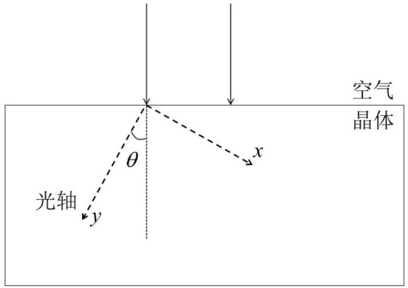
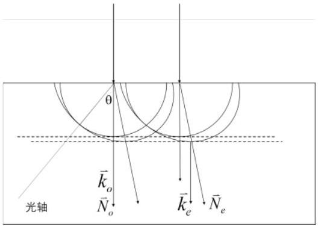
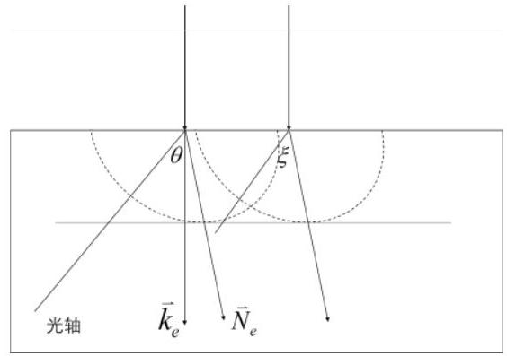

五、（50分）光在单轴晶体内传播呈现各向异性，按照偏振状态，可分为 $o$ 光（寻常光）和$e$ 光（非常光）。单轴晶体内有一特定取向，光沿此方向传播时 $o$ 光和 $e$ 光的传播速度相同，传播方向不发生分离，该方向称为晶体光轴。$o$ 光在晶体内感受到的折射率各向同性，为 $n_{o}$ ，波速各向同性为 $v_{o}=c / n_{o}$（ $c$ 为真空中的光速）；$e$ 光在垂直于光轴的方向传播感受到的折射率为 $n_{e}$ ，波速为 $v_{e}=c / n_{e}$ 。当 $e$ 光的传播方向介于平行于和垂直于光轴之间时，其感受到的折射率随其与光轴的夹角单调变化。对

图5a

于晶体内点源或惠更斯原理中的次波源，其发出的光的波前是以光轴为对称轴的旋转椭球面。如图5a，建立 $y$ 轴与光轴取向重合的直角坐标系，以下对 $o$ 光和 $e$ 光传播过程的分析仅限于在 $y-x$ 截面内的情形。
（1）根据惠更斯原理作图。
在图5a中，真空波长为 $\lambda$ 的平面光波从空气正入射到晶体表面，晶体表面法线方向与光轴的夹角为 $\theta$ 。画出在晶体内传播的 $o$ 光与 $e$ 光的波前。标出分别与 $o$ 光、 $e$ 光对应的波矢 $\boldsymbol{k}_{o} 、 \boldsymbol{k}_{e}$ 的方向（次波等相位面的包络面的法线方向，即等相位面的传播方向），以及由惠更斯原理确定的对应光线的传播方向 $N_{o} 、 N_{e}$ 。取 $n_{o}>n_{e}$ ，将 $o$ 光和 $e$ 光的传播情况示于同一图中。
（2）记 $e$ 光的光线传播方向 $\boldsymbol{N}_{e}$ 与光轴之间的夹角为 $\xi$ ，导出 $\xi$ 和 $\theta$ 两个角度的正切之间的关系。
（3）一种名为 BBO 的单轴晶体的折射率色散曲线方程为（ $\lambda$ 为真空波长，以 $\mu \mathrm{m}$ 为单位）：

$$
\left\{\begin{array}{l}
n_{o}^{2}(\lambda)=2.7359+\frac{0.01878}{\lambda^{2}-0.01822}-0.01354 \lambda^{2} \\
n_{e}^{2}(\lambda)=2.3753+\frac{0.01224}{\lambda^{2}-0.01667}-0.01516 \lambda^{2}
\end{array}\right.
$$

分别求真空波长为800．0 nm 和400．0 nm 时，BBO 单轴晶体中的 $n_{o}$ 和 $n_{e}$ 。
（4）光学晶体的重要作用之一是实现频率转换，例如光学倍频过程，它是指两个同频率的基频光子转换为一个频率加倍的倍频光子，这个过程须满足能量守恒和动量守恒。在晶体中，波矢为 $\boldsymbol{k}$ 的光子的动量也可表示为 $\boldsymbol{p}=\hbar \boldsymbol{k}$ ，其中 $\hbar$ 为约化普朗克常量。
（4．1）试表出倍频过程中基频光子波矢 $\boldsymbol{k}_{1}$ 与倍频光子波矢 $\boldsymbol{k}_{2}$ 之间的关系。
（4．2）利用 BBO 晶体，将真空波长为800．0 nm 的光波倍频为真空波长为400．0 nm 的光波，基频光和倍频光可各自选为 $o$ 光或 $e$ 光，试给出实现此倍频过程的选择方案。
（5）按照图5a 的方式设置 BBO 晶体，使晶体表面法线与光轴夹角为 $\theta$ ，让真空波长为800．0 nm 的基频光以平面波形式垂直入射到此晶体，角度 $\theta$ 取值多大可以满足动量守恒条件，从而产生真空波长为 400.0 nm 的倍频光？
（6）计算（5）中 $e$ 光波矢 $\boldsymbol{k}_{e}$ 和传播方向 $\boldsymbol{N}_{e}$ 之间的夹角 $\alpha$ 。
解答：
（1）（10 分）
作图说明：

29

题解图5a

1） $o$ 光分别以两个入射点为圆心做圆，两个圆的公切面（包络面）平行于表面
2） $e$ 光以光轴为短轴，垂直光轴方向为长轴作椭圆。由两个椭圆获得其公切面（包络面）
3） $e$ 光的椭圆在光轴上外切于 $o$ 光的圆
4） $\vec{k}_{o}, \vec{k}_{e}, \vec{N}_{o}$ 三者具有相同的方向，$\vec{N}_{e}$ 的方向为入射点和随圆包络面切点的连线方向

（2）（9 分）
根据题解（1）中惠更斯原理所作的图，$\xi$ 是 $e$ 光传播方向 $\vec{N}_{e}$ 与光轴的夹角，$\theta$ 是 $e$ 光椭圆上的包络面法向 $\vec{k}_{e}$ 与光轴的夹角（题解图6b）。因此，本问求解椭圆上某一点的 $\vec{N}_{e}$ 与 $y$ 轴夹角和 $\vec{k}_{e}$ 与 $y$ 轴夹角的关系。
$t$ 时刻，点源 $e$ 光等相面（等时面）的椭圆方程为：

$$
\frac{v_{y}^{2} t^{2}}{v_{o}^{2} t^{2}}+\frac{v_{x}^{2} t^{2}}{v_{e}^{2} t^{2}}=1
$$

题解图5b

其中 $v_{x}$ 和 $v_{y}$ 分别为 $e$ 光波速的两个直角坐标分量，上式中若约掉 $t^{2}$ 因子，则得 $e$ 光的速度椭圆（三维情形称为速度椭球）。
在（1）式所表示的椭圆（或速度椭圆）上，由几何关系得

$$
\begin{aligned}
& \tan \xi=\frac{v_{x}}{v_{y}} \\
& \tan \theta=-\frac{d v_{y}}{d v_{x}}
\end{aligned}
$$

对（1）式椭圆方程取微分：

$$
2 v_{y} \frac{d v_{y}}{v_{o}^{2}}+2 v_{x} \frac{d v_{x}}{v_{e}^{2}}=0
$$

化简得

$$
\frac{v_{x}}{v_{y}}=-\frac{v_{e}^{2}}{v_{o}^{2}} \frac{d v_{y}}{d v_{x}}
$$

即有

$$
\therefore \tan \xi=\frac{v_{e}^{2}}{v_{o}^{2}} \tan \theta=\frac{n_{o}^{2}}{n_{e}^{2}} \tan \theta
$$

（3）（4 分）
对于真空波长为 800.0 nm 的光

$$
\begin{aligned}
& n_{0}(800)=n_{0,800}=1.661 \\
& n_{\mathrm{e}}(800)=n_{e, 800}=1.544
\end{aligned}
$$

对于真空波长为 400.0 nm 的光

$$
n_{0}(400)=n_{o, 400}=1.693
$$

$$
n_{\mathrm{e}}(400)=n_{e, 400}=1.568
$$

（4）（6 分）
（4．1）动量守恒要求转换前两个光子的动量等于转换后光子的动量，因此得到

$$
2 \vec{k}_{1}=\vec{k}_{2}
$$

（4．2）倍频关系中，要满足能量守恒，需要保证倍频过程中基频光子的真空波长为倍频光子真空波长的两倍。根据介质中波矢大小的定义 $k=\frac{2 \pi n}{\lambda}$ ，要使得动量守恒，需要使得基频和倍频的折射率一致。该折射率为相速度折射率，这个要求意味着基频光和倍频光在材料中具有相同的相速度。

根据（3）问中计算出的折射率数值，当基频和倍频都为 $o$ 光或者 $e$ 光时，由于色散，他们都无法具有相同的折射率。这种方案需要被排除，因此需要其中一束光为 $o$ 光，另外一束光为 $e$ 光。

取 800 nm 的光为 $o$ 光，其折射率为 $1.661,400 \mathrm{~nm}$ 的光为 $e$ 光，其折射率介于 1.544和1．693之间，随角度变化。因此，可以找到一个角度，使得基频光和倍频光具有相同的折射率，方案可行。

取 400 nm 的光为 $o$ 光，其折射率为 $1.693,800 \mathrm{~nm}$ 的光为 $e$ 光，其折射率介于 1.544和1．661之间，随角度变化。因此，无法找到一个角度，使得基频光和倍频光具有相同的折射率，方案不可行。

结论：该倍频方案取 800 nm 的基频光为 $o$ 光， 400 nm 的倍频光为 $e$ 光。
（附注：写出结论即可，不要求分析过程）
（5）（18 分）
在真空波长为 400 nm 的 $e$ 光的速度椭圆上，按（2）问约定，取 $e$ 光的传播方向 $\vec{N}_{e}$ 与光轴夹角为 $\xi$ ，将该方向的速度记为 $v(400, \xi)$ 。考虑 $e$ 光光束在晶体内的传播，$v(400, \xi)$ 在波矢方向的投影即为相速度 $v_{p}(400)$ ，即有

$$
v_{p}(400)=v(400, \xi) \cos (\xi-\theta)
$$

按照（4．2）中的分析，此相速度应等于真空波长为800nm的 $o$ 光的相速度 $v_{o}$（800）。即

$$
v(400, \xi) \cos (\xi-\theta)=v_{o}(800)=\frac{c}{n_{o, 800}}
$$

对于真空波长为 400 nm 的 $e$ 光，将 $v_{x}=v(400, \xi) \sin \xi, v_{y}=v(400, \xi) \cos \xi$ 代入椭圆方程（1）式中，得

$$
\frac{v(400, \xi)^{2} \cos ^{2} \xi}{v_{o}(400)^{2}}+\frac{v(400, \xi)^{2} \sin ^{2} \xi}{v_{e}(400)^{2}}=1
$$

由此得

$$
v(400, \xi)^{2}=\frac{c^{2}}{n_{o, 400}^{2} \cos ^{2} \xi+n_{e, 400}^{2} \sin ^{2} \xi}
$$

利用三角函数公式得

$$
\begin{aligned}
& \cos ^{2}(\xi-\theta)=(\cos \xi \cos \theta+\sin \xi \sin \theta)^{2} \\
& =\cos ^{2} \xi \cos ^{2} \theta(1+\tan \xi \tan \theta)^{2}
\end{aligned}
$$

因此，联立（14）（15）＇⑯得

$$
\frac{c^{2}}{n_{o, 800}^{2}}=\frac{c^{2}}{n_{0,400}^{2} \cos ^{2} \xi+n_{e, 400}^{2} \sin ^{2} \xi} \cos ^{2} \xi \cos ^{2} \theta(1+\tan \xi \tan \theta)^{2}
$$

将（6）式代入，化简得，

$$
\begin{aligned}
& \frac{1}{n_{o, 800}^{2}}=\frac{\cos ^{2} \theta(1+\tan \xi \tan \theta)^{2}}{n_{0,400}^{2}\left(1+\frac{n_{e, 400}^{2}}{n_{0,400}^{2}} \tan ^{2} \xi\right)} \\
& =\frac{\cos ^{2} \theta}{n_{0,400}^{2}}\left(1+\frac{n_{0,400}^{2}}{n_{e, 400}^{2}} \tan ^{2} \theta\right) \\
& \therefore \frac{1}{n_{0,800}^{2}}=\frac{1}{n_{0,400}^{2}}\left(\cos ^{2} \theta+\frac{n_{0,400}^{2}}{n_{e, 400}^{2}}\left(1-\cos ^{2} \theta\right)\right)
\end{aligned}
$$

代入 $n_{0}(800)=1.661 ; ~ n_{0}(400)=1.693$ 和 $n_{\mathrm{e}}(400)=1.568$ 得

$$
\cos \theta=0.8749
$$

得 $\theta$ 角度为 29.0 度或者 0.506 弧度。 $\square$
（6）（3 分）
根据

$$
\tan (\xi)=\frac{v_{e}^{2}}{v_{o}^{2}} \tan (\theta)=\frac{n_{o}^{2}}{n_{e}^{2}} \tan (\theta)
$$

求得：

$$
\begin{aligned}
& \tan (\xi)=\frac{n_{o}^{2}}{n_{e}^{2}} \tan (\theta)=\frac{1.693^{2}}{1.568^{2}} \tan \left(29.0^{\circ}\right)=0.646 \\
& \xi=32.9^{\circ}
\end{aligned}
$$

得到 $e$ 光波矢 $\vec{k}_{e}$ 和传播方向 $\vec{N}_{e}$ 之间的夹角：

$$
\alpha=\xi-\theta=3.9^{\circ}
$$

评分标准：总 50 分

（1） 问10分
1） 正确作图，由图中得到四个矢量方向，并正确标注，每个标注2分。
2） 图中 $e$ 光的椭圆在光轴上外切于 $o$ 光的圆，得到 2 分。
    （2） 问9分
（1） 式2分，（2）2分，（3）2分，（6）3分
    （3） 问4分
    （7） （8）（9）（10）各 1 分
    （4） 问6分
（11） 式2分。（12）结果4分。结论正确即可，不要求分析。
    （5） 问18分
（13） 4分，（14）4分，（15）（或（15）＇）4分，（18）式4分，（19）式2分
    （6） 问3分
（20） 式 2 分，（21）式 1 分
