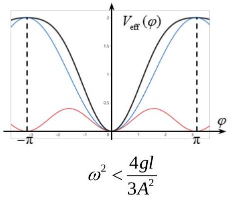
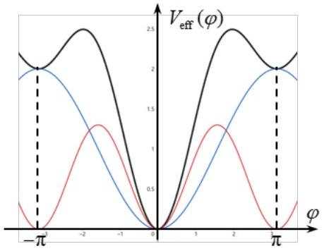

二、（50分）如图2a，一根长度为 $l$ 、质量为 $m$ 的匀质刚性细杆可绕过其一端的水平轴 $O$ 转动。只考虑杆在垂直于转轴 $O$ 的坚直平面内的运动，用杆与坚直向下方向之间的夹角 $\theta(-\pi<\theta \leq \pi$ ，以逆时针方向为正）作为描述杆位置的坐标。忽略空气阻力和转轴的摩擦阻力。重力加速度大小为 $g$ 。

已知杆的转轴 O 在坚直方向上作小振幅高频简谐振动，振动方程为$z(t)=A \cos \omega t$ ，振幅 $A \ll l$ ，圆频率 $\omega \gg \sqrt{\frac{g}{l}}$ 。在随转轴 O 同步运动的平动参考系中讨论杆的运动。

（1） 试写出 $\theta(t)$ 满足的动力学方程。
（2） $\theta(t)$ 可表示为 $\varphi(t)$ 和 $\delta(t)$ 之和，其中 $\varphi(t)$ 表示平稳运动，$\delta(t)$ 表示圆频率为 $\omega$ 的高频

（3）由 $\varphi(t)$ 满足的动力学方程可知，杆的平稳运动等效于杆在一保守场中运动，试求相应的有效势能 $V_{\text {eff }}(\varphi)$（取 $\varphi=0$ 处势能为零）。
（4）根据有效势能 $V_{\text {eff }}(\varphi)$ ，试确定杆的平衡位置 $\varphi_{0}$ ，并讨论各平衡位置的稳定性（不考虑参数取临界值时的情况）；试求杆在各稳定平衡位置附近做小幅振动的频率。
（5）初始时，杆位于转轴 O 的正下方，其初角速度 $\dot{\varphi}(0)=\omega_{0}\left(\omega_{0}>0\right)$ 。要使杆能运动至转轴 O 的正上方，$\omega_{0}$ 应大于一个临界值 $\omega_{\mathrm{c}}$ ，试求 $\omega_{\mathrm{c}}$ ；当 $\omega_{0}<\omega_{\mathrm{c}}$ 时，求杆能运动到的最大角度 $\varphi_{\text {max }}$ 。

## 参考解答：

（1）在转轴 O 平动非惯性系中，引入平动惯性力（以坚直向上为正）

$$
F_{\mathrm{in}}=-m \ddot{z}=m \omega^{2} A \cos \omega t
$$

此平动惯性力等效作用于匀质杆质心，对杆有转动定理

$$
-\left(m g-F_{\text {in }}\right) \frac{l}{2} \sin \theta=\frac{1}{3} m l^{2} \ddot{\theta}
$$

将（1）式代入得 $\theta(t)$ 的动力学方程

$$
-\left(m g-m \omega^{2} A \cos \omega t\right) \frac{l}{2} \sin \theta=\frac{1}{3} m l^{2} \ddot{\theta}
$$

（2）将 $\theta=\varphi+\delta$（ $\delta \ll 1$ ）代入③式并展开至 $\delta$ 的一阶项，得

$$
-\left(m g-m \omega^{2} A \cos \omega t\right) \frac{l}{2}(\sin \varphi+\cos \varphi \cdot \delta)=\frac{1}{3} m l^{2}(\ddot{\varphi}+\ddot{\delta})
$$

即

$$
-m g \frac{l}{2} \sin \varphi-m g \frac{l}{2} \cos \varphi \cdot \delta+m \omega^{2} A \cos \omega t \frac{l}{2} \sin \varphi+m \omega^{2} A \cos \omega t \frac{l}{2} \cos \varphi \cdot \delta=\frac{1}{3} m l^{2}(\ddot{\varphi}+\ddot{\delta})
$$

## 【解法一】

考虑到 $\delta(t)$ 是圆频率为 $\omega \gg \sqrt{g / l}$ 的高频小幅振动，某物理量 $x$ 在一个高频振动周期$T=\frac{2 \pi}{\omega}$ 内的时间平均为

$$
\langle x\rangle=\frac{1}{T} \int_{t}^{t+T} x\left(t^{\prime}\right) \mathrm{d} t^{\prime}
$$

将（4）式在 $\delta(t)$ 的一个周期内对时间取平均，$\varphi 、 \ddot{\varphi}$ 视为不变，得

$$
\begin{aligned}
& -m g \frac{l}{2} \sin \varphi-m g \frac{l}{2} \cos \varphi\langle\delta\rangle+m \omega^{2} A \frac{l}{2} \sin \varphi\langle\cos \omega t\rangle \\
& +m \omega^{2} A \frac{l}{2} \cos \varphi\langle\delta \cdot \cos \omega t\rangle=\frac{1}{3} m l^{2}(\ddot{\varphi}+\langle\ddot{\delta}\rangle)
\end{aligned}
$$

考虑到

$$
\langle\delta\rangle=0,\langle\cos \omega t\rangle=0,\langle\delta \cdot \cos \omega t\rangle \text { 待定, }\langle\ddot{\delta}\rangle=0
$$

得

$$
-m g \frac{l}{2} \sin \varphi+m \omega^{2} A \frac{l}{2} \cos \varphi\langle\delta \cdot \cos \omega t\rangle=\frac{1}{3} m l^{2} \ddot{\varphi}
$$

为了定出 $\langle\delta \cdot \cos \omega t\rangle$ ，将（4）式左右两边同乘 $\cos \omega t$ 得

$$
\begin{aligned}
& -m g \frac{l}{2} \sin \varphi \cos \omega t-m g \frac{l}{2} \cos \varphi \delta \cdot \cos \omega t+m \omega^{2} A \frac{l}{2} \sin \varphi \cos ^{2} \omega t \\
& +m \omega^{2} A \frac{l}{2} \cos \varphi \delta \cdot \cos ^{2} \omega t=\frac{1}{3} m l^{2}(\ddot{\varphi} \cos \omega t+\ddot{\delta} \cos \omega t)
\end{aligned}
$$

考虑到

$$
\ddot{\delta}=-\omega^{2} \delta
$$

代入（6）式后，将（6）式在 $\delta(t)$ 的一个周期内对时间取平均，$\varphi 、 \ddot{\varphi}$ 视为不变，得

$$
\begin{aligned}
& -m g \frac{l}{2} \sin \varphi\langle\cos \omega t\rangle-m g \frac{l}{2} \cos \varphi\langle\delta \cdot \cos \omega t\rangle+m \omega^{2} A \frac{l}{2} \sin \varphi\left\langle\cos ^{2} \omega t\right\rangle \\
& +m \omega^{2} A \frac{l}{2} \cos \varphi\left\langle\delta \cdot \cos ^{2} \omega t\right\rangle=\frac{1}{3} m l^{2}\left(\ddot{\varphi}\langle\cos \omega t\rangle-\omega^{2}\langle\delta \cdot \cos \omega t\rangle\right)
\end{aligned}
$$

考虑到

$$
\langle\cos \omega t\rangle=0, \quad\left\langle\cos ^{2} \omega t\right\rangle=\frac{1}{2}, \quad\left\langle\delta \cdot \cos ^{2} \omega t\right\rangle=0
$$

得

$$
-m g \frac{l}{2} \cos \varphi\langle\delta \cdot \cos \omega t\rangle+m \omega^{2} A \frac{l}{2} \sin \varphi \frac{1}{2}=-\frac{1}{3} m l^{2} \omega^{2}\langle\delta \cdot \cos \omega t\rangle
$$

解得

$$
\langle\delta \cdot \cos \omega t\rangle=\frac{-\frac{3}{4} \omega^{2} A \sin \varphi}{\omega^{2} l-\frac{3}{2} g \cos \varphi} \approx-\frac{3}{4} \frac{A}{l} \sin \varphi \quad\left(\text { 考虑到 } \omega^{2} \gg g / l\right)
$$

代入（5）式得 $\varphi(t)$ 的动力学方程

$$
-m g \frac{l}{2} \sin \varphi-\frac{3}{8} m \omega^{2} A^{2} \sin \varphi \cos \varphi=\frac{1}{3} m l^{2} \ddot{\varphi}
$$

【解法二】
考虑到 $\delta(t)$ 是圆频率为 $\omega \gg \sqrt{g / l}$ 的高频小幅振动，设

$$
\delta(t)=\delta_{0} \cos \omega t, \quad \ddot{\delta}=-\omega^{2} \delta_{0} \cos \omega t
$$

代入（4）式得

$$
\begin{aligned}
& -m g \frac{l}{2} \sin \varphi-m g \frac{l}{2} \cos \varphi \delta_{0} \cos \omega t+m \omega^{2} A \cos \omega t \frac{l}{2} \sin \varphi \\
& +m \omega^{2} A \frac{l}{2} \cos \varphi \delta_{0} \cos ^{2} \omega t=\frac{1}{3} m l^{2}(\ddot{\varphi}+\ddot{\delta})
\end{aligned}
$$

将（6）式在 $\delta(t)$ 的一个周期内对时间取平均，$\varphi 、 \ddot{\varphi}$ 视为不变，考虑到

$$
\langle\cos \omega t\rangle=0,\left\langle\cos ^{2} \omega t\right\rangle=\frac{1}{2}
$$

得

$$
-m g \frac{l}{2} \sin \varphi+m \omega^{2} A \frac{l}{2} \cos \varphi \frac{\delta_{0}}{2}=\frac{1}{3} m l^{2} \ddot{\varphi}
$$

为确定 $\delta_{0}$ ，将（5）式代入（4）式并在左右两边同乘 $\cos \omega t$ 得

$$
\begin{aligned}
& -m g \frac{l}{2} \sin \varphi \cos \omega t-m g \frac{l}{2} \cos \varphi \delta_{0} \cos ^{2} \omega t+m \omega^{2} A \frac{l}{2} \sin \varphi \cos ^{2} \omega t \\
& +m \omega^{2} A \frac{l}{2} \cos \varphi \delta_{0} \cos ^{3} \omega t=\frac{1}{3} m l^{2}\left(\ddot{\varphi} \cos \omega t-\omega^{2} \delta_{0} \cos ^{2} \omega t\right)
\end{aligned}
$$

将（8）式在 $\delta(t)$ 的一个周期内对时间取平均，$\varphi 、 \ddot{\varphi}$ 视为不变，考虑到

$$
\langle\cos \omega t\rangle=\left\langle\cos ^{3} \omega t\right\rangle=0, \quad\left\langle\cos ^{2} \omega t\right\rangle=\frac{1}{2}
$$

可得

$$
-m g \frac{l}{2} \cos \varphi \frac{\delta_{0}}{2}+m \omega^{2} A \frac{l}{2} \sin \varphi \frac{1}{2}=\frac{1}{3} m l^{2}\left(-\omega^{2} \frac{\delta_{0}}{2}\right)
$$

解得

$$
\delta_{0}=\frac{-\frac{3}{2} \omega^{2} A \sin \varphi}{\omega^{2} l-\frac{3}{2} g \cos \varphi} \approx-\frac{3}{2} \frac{A}{l} \sin \varphi \quad\left(\text { 考虑到 } \omega^{2} \gg g / l\right)
$$

将（10）式代入（7）式得 $\varphi(t)$ 的动力学方程

$$
-m g \frac{l}{2} \sin \varphi-\frac{3}{8} m \omega^{2} A^{2} \sin \varphi \cos \varphi=\frac{1}{3} m l^{2} \ddot{\varphi}
$$

【解法三】
考虑到 $\delta(t)$ 是圆频率为 $\omega \gg \sqrt{g / l}$ 的高频小幅振动，$\delta \propto A$ 是小量，$\ddot{\delta} \propto \omega^{2} A$ 并非小量，上式等号左侧第一项与高频微振动无关，第二、第四项含 $\delta$ 均为小量，第三项为决定 $\ddot{\delta}$ 的项，即

$$
m \omega^{2} A \frac{l}{2} \sin \varphi \cos \omega t=\frac{1}{3} m l^{2} \ddot{\delta}
$$

考虑到 $\delta(t)$ 是稳定微振动，可得 $\delta(t)$ 的表达式

$$
\delta(t)=-\frac{3}{2} \frac{A}{l} \sin \varphi \cos \omega t
$$

将 $\delta(t)$ 带回原方程（即④式）得

$$
\begin{aligned}
& -m g \frac{l}{2} \sin \varphi-m g \frac{l}{2} \cos \varphi \cdot \delta+m \omega^{2} A \cos \omega t \frac{l}{2} \cos \varphi \cdot \delta \\
& -\frac{3}{4} m \omega^{2} A^{2} \sin \varphi \cos \varphi \cdot \cos ^{2} \omega t=\frac{1}{3} m l^{2}(\ddot{\varphi}+\ddot{\delta})
\end{aligned}
$$

将（7）式在 $\delta(t)$ 的一个周期内对时间取平均，$\varphi 、 \ddot{\varphi}$ 视为不变，考虑到

$$
\langle\delta\rangle=0, \quad\langle\ddot{\delta}\rangle=0, \quad\left\langle\cos ^{2} \omega t\right\rangle=\frac{1}{2}
$$

可得 $\varphi(t)$ 的动力学方程

$$
-m g \frac{l}{2} \sin \varphi-\frac{3}{8} m \omega^{2} A^{2} \sin \varphi \cos \varphi=\frac{1}{3} m l^{2} \ddot{\varphi}
$$

（3）（11）式左侧可视为保守力矩，与势能的关系为

$$
M(\varphi)=-m g \frac{l}{2} \sin \varphi-\frac{3}{8} m \omega^{2} A^{2} \sin \varphi \cos \varphi=-\frac{\mathrm{d} V_{\text {eff }}(\varphi)}{\mathrm{d} \varphi}
$$

结合 $V_{\text {eff }}(\varphi=0)=0$ 可得

$$
V_{\text {eff }}(\varphi)=\int_{\varphi}^{0} M(\varphi) \mathrm{d} \varphi=\frac{1}{2} m g l(1-\cos \varphi)+\frac{3}{16} m \omega^{2} A^{2}\left(1-\cos ^{2} \varphi\right)
$$

（4）平衡位置 $\varphi_{0}$ 处应为 $V_{\text {eff }}(\varphi)$ 的极值，满足的条件为

$$
V_{\text {eff }}^{\prime}\left(\varphi_{0}\right)=-M\left(\varphi_{0}\right)=\left(\frac{1}{2} m g l+\frac{3}{8} m \omega^{2} A^{2} \cos \varphi_{0}\right) \sin \varphi_{0}=0
$$

解得

$$
\sin \varphi_{0}=0 \text { 或 } \cos \varphi_{0}=-\frac{4 g l}{3 \omega^{2} A^{2}} \text { (要求 } \omega^{2}>\frac{4 g l}{3 A^{2}} \text { ) }
$$

平衡位置分别为

$$
\begin{gathered}
\varphi_{0}=0 \\
\varphi_{0}=\pi \\
\varphi_{0}= \pm \arccos \left(-\frac{4 g l}{3 \omega^{2} A^{2}}\right)= \pm\left(\pi-\arccos \frac{4 g l}{3 \omega^{2} A^{2}}\right) \quad\left(\text { 要求 } \omega^{2}>\frac{4 g l}{3 A^{2}}\right)
\end{gathered}
$$

当杆在平衡位置 $\varphi_{0}$ 附近偏离小角 $\varphi^{\prime}\left(\varphi^{\prime} \ll \varphi_{0}\right)$ 时，杆的能量可表示为

$$
E=\frac{1}{2} \frac{1}{3} m l^{2} \dot{\varphi}^{2}+V_{\text {eff }}\left(\varphi=\varphi_{0}+\varphi^{\prime}\right)=\frac{1}{2} \frac{1}{3} m l^{2} \dot{\varphi}^{\prime 2}+V_{\text {eff }}\left(\varphi_{0}\right)+\frac{1}{2} V_{\text {eff }}^{\prime \prime}\left(\varphi_{0}\right) \varphi^{\prime 2}
$$

其中

$$
V_{\text {eff }}^{\prime \prime}\left(\varphi_{0}\right)=\frac{1}{2} m g l \cos \varphi_{0}+\frac{3}{8} m \omega^{2} A^{2}\left(2 \cos ^{2} \varphi_{0}-1\right)
$$

稳定平衡位置处应为 $V_{\text {eff }}(\varphi)$ 的极小值，$V_{\text {eff }}^{\prime \prime}\left(\varphi_{0}\right)>0$ ；不稳定平衡位置处应为 $V_{\text {eff }}(\varphi)$ 的极大值， $V_{\text {eff }}^{\prime \prime}\left(\varphi_{0}\right)<0$ 。
（1）对于 $\varphi_{0}=0$ ：由（18）式得

$$
V_{\text {eff }}^{\prime \prime}\left(\varphi_{0}=0\right)=\frac{1}{2} m g l+\frac{3}{8} m \omega^{2} A^{2}>0
$$

所以

$$
\varphi_{0}=0 \text { 是稳定平衡位置 }
$$

由（17）式，杆受微扰后平稳小幅振动的频率

$$
f=\frac{1}{2 \pi} \sqrt{\frac{V_{\mathrm{eff}}^{\prime \prime}\left(\varphi_{0}=0\right)}{m l^{2} / 3}}=\frac{1}{2 \pi} \sqrt{\frac{3}{2}\left(\frac{g}{l}+\frac{3}{4} \frac{\omega^{2} A^{2}}{l^{2}}\right)}
$$

（2）对于 $\varphi_{0}=\pi:$ 由（18）式得

$$
V_{\text {eff }}^{\prime \prime}\left(\varphi_{0}=\pi\right)=-\frac{1}{2} m g l+\frac{3}{8} m \omega^{2} A^{2} \begin{cases}<0 & \omega^{2}<\frac{4 g l}{3 A^{2}} \\ >0 & \omega^{2}>\frac{4 g l}{3 A^{2}}\end{cases}
$$

所以

$$
\begin{aligned}
& \text { 当 } \omega^{2}<\frac{4 g l}{3 A^{2}} \text { 时, } \varphi_{0}=\pi \text { 是不稳定平衡位置 } \\
& \text { 当 } \omega^{2}>\frac{4 g l}{3 A^{2}} \text { 时, } \varphi_{0}=\pi \text { 是稳定平衡位置 }
\end{aligned}
$$

（可以看出，原本杆在转轴正上方是不稳定平衡，由于转轴作高频振动，此时杆可以在此位置保持稳定平衡，即平衡的稳定性发生了变化）

当 $\omega^{2}>\frac{4 g l}{3 A^{2}}$ 时，由（17）式，杆受微扰后平稳小幅振动的频率

$$
f=\frac{1}{2 \pi} \sqrt{\frac{V_{\mathrm{eff}}^{\prime \prime}\left(\varphi_{0}=\pi\right)}{m l^{2} / 3}}=\frac{1}{2 \pi} \sqrt{\frac{3}{2}\left(\frac{3}{4} \frac{\omega^{2} A^{2}}{l^{2}}-\frac{g}{l}\right)}
$$

（3）对于 $\varphi_{0}= \pm \arccos \left(-\frac{4 g l}{3 \omega^{2} A^{2}}\right)= \pm\left(\pi-\arccos \frac{4 g l}{3 \omega^{2} A^{2}}\right)$（要求 $\left.\omega^{2}>\frac{4 g l}{3 A^{2}}\right)$ ：由（18）式得

$$
V_{\text {eff }}^{\prime \prime}\left(\varphi_{0}\right)=\frac{1}{2} m g l \cos \varphi_{0}+\frac{3}{8} m \omega^{2} A^{2}\left(2 \cos ^{2} \varphi_{0}-1\right)=\frac{2 m g^{2} l^{2}}{3 \omega^{2} A^{2}}-\frac{3}{8} m \omega^{2} A^{2}<0
$$

所以

$$
\varphi_{0}= \pm \arccos \left(-\frac{4 g l}{3 \omega^{2} A^{2}}\right)= \pm\left(\pi-\arccos \frac{4 g l}{3 \omega^{2} A^{2}}\right) \text { 是不稳定平衡位置 }
$$

（5）$\omega^{2}<\frac{4 g l}{3 A^{2}}$ 和 $\omega^{2}>\frac{4 g l}{3 A^{2}}$ 时的势能曲线 $V_{\text {eff }}(\varphi)$ 分别如下图所示。

$$
\omega^{2}>\frac{4 g l}{3 A^{2}}
$$

（1）当 $\omega^{2}<\frac{4 g l}{3 A^{2}}$ 时：$\varphi=0$ 处是 $V_{\text {eff }}(\varphi)$ 的极小值、 $\varphi=\pi$ 处是 $V_{\text {eff }}(\varphi)$ 的极大值，$V_{\text {eff }}(\varphi)$ 在 $0 \leq \varphi \leq \pi$ 内单调增大，所以要使杆能运动至 $\varphi=\pi$ ，初角速度 $\omega_{0}$ 应满足

$$
\frac{1}{2} \frac{1}{3} m l^{2} \omega_{0}^{2}>V_{\text {eff }}(\varphi=\pi)=m g l
$$

解得

$$
\omega_{0}>\sqrt{\frac{6 g}{l}}=\omega_{\mathrm{c}}
$$

（2）当 $\omega^{2}>\frac{4 g l}{3 A^{2}}$ 时：$\varphi=0$ 和 $\varphi=\pi$ 处是 $V_{\text {eff }}(\varphi)$ 的极小值，$\varphi=\pi-\arccos \frac{4 g l}{3 \omega^{2} A^{2}}$ 处是 $V_{\text {eff }}(\varphi)$ 的极大值，此处是 $0 \leq \varphi \leq \pi$ 内的势垒，所以要使杆能运动至 $\varphi=\pi$ 应越过此势垒，初角速度 $\omega_{0}$ 应满足

$$
\frac{1}{2} \frac{1}{3} m l^{2} \omega_{0}^{2}>V_{\text {eff }}\left(\varphi=\pi-\arccos \frac{4 g l}{3 \omega^{2} A^{2}}\right)=\frac{1}{2} m g l+\frac{3}{16} m \omega^{2} A^{2}+\frac{m g^{2} l^{2}}{3 \omega^{2} A^{2}}
$$

解得

$$
\omega_{0}>\sqrt{\frac{3 g}{l}+\frac{9 \omega^{2} A^{2}}{8 l^{2}}+\frac{2 g^{2}}{\omega^{2} A^{2}}}=\omega_{\mathrm{c}}
$$

综上，临界角速度

$$
\omega_{\mathrm{c}}= \begin{cases}\sqrt{\frac{6 g}{l}} & \omega^{2}<\frac{4 g l}{3 A^{2}} \\ \sqrt{\frac{3 g}{l}+\frac{9 \omega^{2} A^{2}}{8 l^{2}}+\frac{2 g^{2}}{\omega^{2} A^{2}}} & \omega^{2}>\frac{4 g l}{3 A^{2}}\end{cases}
$$

当 $\omega_{0}<\omega_{\mathrm{c}}$ 时，杆能到达的最大角度 $\varphi_{\text {max }}$ 满足

$$
\frac{1}{2} \frac{1}{3} m l^{2} \omega_{0}^{2}=V_{\text {eff }}\left(\varphi_{\max }\right)=\frac{1}{2} m g l\left(1-\cos \varphi_{\max }\right)+\frac{3}{16} m \omega^{2} A^{2}\left(1-\cos ^{2} \varphi_{\max }\right)
$$

即

$$
\cos ^{2} \varphi_{\max }+\frac{8 g l}{3 \omega^{2} A^{2}} \cos \varphi_{\max }+\frac{8 \omega_{0}^{2} l^{2}}{9 \omega^{2} A^{2}}-\frac{8 g l}{3 \omega^{2} A^{2}}-1=0
$$

解得

$$
\cos \varphi_{\max }=\frac{1}{2}\left[-\frac{8 g l}{3 \omega^{2} A^{2}} \pm \sqrt{\left(\frac{8 g l}{3 \omega^{2} A^{2}}\right)^{2}-4\left(\frac{8 \omega_{0}^{2} l^{2}}{9 \omega^{2} A^{2}}-\frac{8 g l}{3 \omega^{2} A^{2}}-1\right)}\right]
$$

注意，此处应取较小的 $\varphi$ 解，应取＂+ ＂号

$$
\varphi_{\max }=\arccos \frac{1}{2}\left[-\frac{8 g l}{3 \omega^{2} A^{2}}+\sqrt{\left(\frac{8 g l}{3 \omega^{2} A^{2}}\right)^{2}-4\left(\frac{8 \omega_{0}^{2} l^{2}}{9 \omega^{2} A^{2}}-\frac{8 g l}{3 \omega^{2} A^{2}}-1\right)}\right]
$$

评分参考：本题50分。
第（1）问3分，（1）式1分，（3）式2分；
第（2）问12分，（4）式1分，【解法一】⑤（6）（9）式各2分，（10）式1分，（11）式4分；
【解法二】（7）＇（8）＇（9）＇式各2分，（10）式1分，（11）＇式4分；
【解法三】⑤＂式6分，⑥＂式1分，⑧＂式4分；
第（3）问4分，（12）（13）式各2分；
第（4）问18分，（14）式1分，（16）－1、（16）－2、（16）－3式各1分，（19）式2分，（20式1分，（21）（22）式各 2分，（23）－1、（23）－2式各1分，（24）（25）式各2分，（26）式1分；
第（5）问13分，（27）（28）式各1分，（29）式4分，（30）（31）式各2分，（33）式3分。
