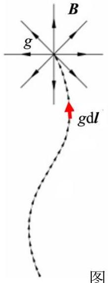
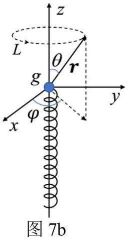
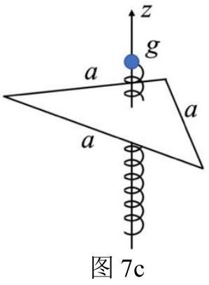
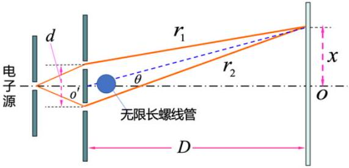

七、（50 分）假设磁单极子（点磁荷）$g$ 的磁场满足所谓的磁荷库仑定律，即

$$
\boldsymbol{B}(\boldsymbol{r})=\frac{\mu_{0}}{4 \pi} \frac{g}{r^{3}} \boldsymbol{r}
$$

其中 $\mu_{0}$ 为真空磁导率， $\boldsymbol{r}$ 是场点相对于该磁荷所在处的位矢。通常的电磁学理论认为磁单极子不存在，且迄今为止实验上也没有发现磁单极子。1931年，狄拉克提出了一个模型，该模型构造了一根由无数个首尾相接的（磁荷）磁偶极子组成的弦（即狄拉克弦），该弦从一个端点延伸至无限远，如图7a左图所示。若将每一个小磁偶极子等效为一个小电流环，则整个狄拉克弦等效为截面相同、均匀密绕的半无限长极细通电螺线管，如图7a 右图所示。这种等效意味着狄拉克弦上的微元磁偶极矩 $g \mathrm{~d} \boldsymbol{I}$ 与螺线管轴线上相应线元 $\mathrm{d} \boldsymbol{l}$ 的微元磁矩 $\mathrm{d} \boldsymbol{m}$ 相等，即$\mathrm{d} \boldsymbol{m}=g \mathrm{~d} \boldsymbol{I}$（见图7a）。在这种图像下，螺线管端点处也等效存在一个＂磁单极子＂，这样引入的磁单极子遵循通常的电磁学规律。以下引入矢势来讨论狄拉克弦及相关问题。

按通常的电磁学理论，磁感应强度 $\boldsymbol{B}$ 的通量可表示为矢势 $\boldsymbol{A}$ 的环量，即

$$
\iint_{S} \boldsymbol{B} \cdot \mathrm{~d} \boldsymbol{S}=\oint_{L} \boldsymbol{A} \cdot \mathrm{~d} \boldsymbol{l}
$$

其中 $L$ 为曲面 $S$ 的边界环路。磁矩为 $\boldsymbol{m}$ 的小电流环所激发的矢势为

$$
\boldsymbol{A}(\boldsymbol{r})=\frac{\mu_{0}}{4 \pi} \frac{\boldsymbol{m} \times \boldsymbol{r}}{r^{3}}
$$

其中 $\boldsymbol{r}$ 是场点相对于电流环所在处的位矢。
（1）如图7b，与狄拉克弦等效的极细通电螺线管端点的磁荷为 $g$ ，从原点沿负 $z$ 轴伸向无穷远。
（i）导出此螺线管在位置 $(r, \theta, \varphi)$ 处 $(0 \leq \theta<\pi)$ 的矢势 $\boldsymbol{A}$ 的表达式。
提示： $\int \frac{\mathrm{d} x}{\sqrt{\left(x^{2}+a^{2}\right)^{3}}}=\frac{x}{a^{2} \sqrt{x^{2}+a^{2}}}+$ 任意常数。
（ii）对于图中以 $z$ 轴为轴线、球坐标 $r, \theta(0 \leq \theta<\pi)$ 固定的有向圆形环路 $L$ ，请先计算矢势 $\boldsymbol{A}$ 的环量 $\Gamma_{L}$ ，再按磁荷库仑定律计算点磁荷 $g$的磁场通过以圆环 $L$ 为边界的圆面的通量 $\Phi_{L}$（面元法向沿 $z$ 轴正向，且与环路绕向成右手螺旋关系。不考虑 $\theta=\frac{\pi}{2}$ 情形），并比较 $\Gamma_{L}$ 与 $\Phi_{L}$ 的异同（如有差异，请分析差异的来源）。
（2）从原点沿负 $z$ 轴延伸的、与狄拉克弦等效的极细通电螺线管中，其电流 $I(t)=I_{0} \cos \omega t$ 为低频交变电流，已知螺线管的横截面积为 $S$ ，单位长度匝数为 $n$ 。
（i）求原点处的等效磁荷 $g(t)$ 。
（ii）将一单位长度电阻为 $R_{0}$ 的导线弯成正三角形回路，其边长为 $a$ 。该三角形位于 $z=-\frac{\sqrt{6}}{12} a$ 的平面上，螺线管穿过其中心，如图7c 所示。求此

图7a

三角形回路的平均热功率。不考虑辐射以及三角形回路的自感。

提示：可考虑正三角形对 $g$ 所张的立体角。
（3）阿哈罗诺夫－玻姆效应（即 A－B 效应）的实验证明：即使在磁感应强度为零的区域，也可能会因为 $\boldsymbol{A} \neq 0$ 出现磁效应。它揭示了磁矢势 $\boldsymbol{A}$ 的物理意义。用自由电子双缝干涉实验可验证 A－B 效应。在该实验中，双缝（缝宽很小）与屏之间的距离为 $D$ ，双缝间距为 $d(d \ll D)$ ；一根无限长的极细直螺线管垂直放置于电子经过双缝后的路径之间，其单位长度匝数为 $n$ ，横截面积为$S$ ，如图7d 所示。电子源发出的自由电子的动量大小为 $p$ 、电荷为 $-e$（ $e>0$ ）。若螺线管中的电流从 0 变化到 $I$ ，求中心亮条纹在屏上移动的距离。已知动量为 $\boldsymbol{p}$ 的电子在矢势场 $\boldsymbol{A}$ 中的波矢为 $\boldsymbol{k}=\frac{1}{\hbar}(\boldsymbol{p}-e \boldsymbol{A})$ ，其

图7d

中 $\hbar$ 为约化普朗克常量。

参考解答：
（1）（i）如题解图 7a，按照题给条件有 $\mathrm{d} \boldsymbol{m}=-g \mathrm{~d} \boldsymbol{r}^{\prime}$ ，其中 $\boldsymbol{r}^{\prime}=z \boldsymbol{e}_{z} \quad(z \in(0,-\infty])$ 。
狄拉克弦在空间 $\boldsymbol{r}$ 处产生的矢量势，可认为是尾（ S 极）首（ N 极）相连的无穷多个小磁矩 $\mathrm{d} \boldsymbol{m}$ 在题解图7a中 $\boldsymbol{r}$ 处产生的矢量势叠加，于是有

$$
\boldsymbol{A}=\frac{\mu_{0}}{4 \pi} \int \mathrm{~d} \boldsymbol{m} \times \frac{\boldsymbol{r}-\boldsymbol{r}^{\prime}}{\left|\boldsymbol{r}-\boldsymbol{r}^{\prime}\right|^{3}}=\frac{\mu_{0} g}{4 \pi} \int \mathrm{~d} \boldsymbol{r}^{\prime} \times \frac{\boldsymbol{r}-\boldsymbol{r}^{\prime}}{\left|\boldsymbol{r}-\boldsymbol{r}^{\prime}\right|^{3}}
$$

其中

$$
\mathrm{d} \boldsymbol{r}^{\prime} \times \frac{\boldsymbol{r}-\boldsymbol{r}^{\prime}}{\left|\boldsymbol{r}-\boldsymbol{r}^{\prime}\right|^{3}}=\frac{-r \sin \theta}{\left(r^{2}+z^{2}-2 r z \cos \theta\right)^{3 / 2}} \mathrm{~d} z \boldsymbol{e}_{\varphi}
$$

将（2）式代入（1）式并化简得

$$
\boldsymbol{A}=\frac{\mu_{0} g r}{4 \pi} \sin \theta \boldsymbol{e}_{\varphi} \int_{0}^{-\infty} \frac{-\mathrm{d} z^{\prime}}{\sqrt{\left[\left(z^{\prime}-r \cos \theta\right)^{2}+r^{2} \sin ^{2} \theta\right]^{3}}}
$$

利用题给不定积分公式

$$
\int \frac{\mathrm{d} x}{\sqrt{\left(x^{2}+a^{2}\right)^{3}}}=\frac{x}{a^{2} \sqrt{x^{2}+a^{2}}}+\text { 任意常数 }
$$

对（3）式积分得

$$
\begin{aligned}
\boldsymbol{A} & =\left.\frac{\mu_{0} g r}{4 \pi} \sin \theta \boldsymbol{e}_{\varphi} \frac{z^{\prime}-r \cos \theta}{r^{2} \sin ^{2} \theta \sqrt{\left(z^{\prime}-r \cos \theta\right)^{2}+r^{2} \sin ^{2} \theta}}\right|_{z^{\prime}=-\infty} ^{z^{\prime}=0} \\
& =\frac{\mu_{0} g r}{4 \pi} \sin \theta \boldsymbol{e}_{\varphi}\left[\frac{-r \cos \theta}{r^{2} \sin ^{2} \theta \sqrt{(r \cos \theta)^{2}+r^{2} \sin ^{2} \theta}}-\frac{-1}{r^{2} \sin ^{2} \theta}\right] \\
& =\frac{\mu_{0} g}{4 \pi r} \frac{1-\cos \theta}{\sin \theta} \boldsymbol{e}_{\varphi}
\end{aligned}
$$

其等价形式有

$$
\boldsymbol{A}=\frac{\mu_{0} g}{4 \pi r} \frac{\sin \theta}{1+\cos \theta} \boldsymbol{e}_{\varphi}=\frac{\mu_{0} g}{4 \pi r} \tan \frac{\theta}{2} \boldsymbol{e}_{\varphi}=\frac{\mu_{0} g}{4 \pi r} \frac{\boldsymbol{e}_{z} \times \boldsymbol{e}_{r}}{1+\boldsymbol{e}_{z} \cdot \boldsymbol{e}_{r}}
$$

附注：如上 $\boldsymbol{A}$ 的表达式在 $\theta=\pi$ 时无定义。
（ii）
1．关于环量 $\Gamma_{L}$ 的求解 ：
在题解图7a的有向圆形环路 $L$ 上取线元

$$
\mathrm{d} \boldsymbol{l}=\mathrm{d} \boldsymbol{l} \boldsymbol{e}_{\varphi}=r \sin \theta \mathrm{~d} \varphi \boldsymbol{e}_{\varphi}
$$

利用（4）（5）式，可得

$$
\boldsymbol{A} \cdot \mathrm{d} \boldsymbol{l}=\frac{\mu_{0} g}{4 \pi r} \frac{1-\cos \theta}{\sin \theta} \times r \sin \theta \mathrm{~d} \varphi=\frac{\mu_{0} g}{4 \pi}(1-\cos \theta) \mathrm{d} \varphi
$$

故 $\boldsymbol{A}$ 的环量为

$$
\Gamma_{L}=\oint_{L} \boldsymbol{A} \cdot \mathrm{~d} \boldsymbol{l}=\frac{\mu_{0} g}{4 \pi}(1-\cos \theta) \int_{0}^{2 \pi} \mathrm{~d} \varphi=\frac{\mu_{0} g}{2}(1-\cos \theta)
$$

2．关于通量 $\Phi_{L}$ 的求解：
【解法一】将圆面划分为半径为 $\rho(\rho<r \sin \theta)$ 的环带，其面元为

$$
\mathrm{d} \boldsymbol{S}=2 \pi \rho \mathrm{~d} \rho \boldsymbol{e}_{\mathrm{z}}
$$

按磁荷库仑定律，磁荷 $g$ 的磁场通过面元 $\mathrm{d} \boldsymbol{S}$ 的通量微元为

$$
\mathrm{d} \Phi=2 \pi \rho \mathrm{~d} \rho \times \frac{\mu_{0}}{4 \pi} \frac{g}{|\xi|^{3}} \xi \cdot \boldsymbol{e}_{z}=\frac{\mu_{0} g}{2} \frac{\rho \mathrm{~d} \rho}{\left(\rho^{2}+r^{2} \cos ^{2} \theta\right)^{3 / 2}} r \sin \theta
$$

其中 $\boldsymbol{\xi}$ 矢量为面元上某点相对于磁荷所在处的位矢，$|\boldsymbol{\xi}|=\sqrt{\rho^{2}+r^{2} \cos ^{2} \theta}$ 。
当 $\theta \neq \frac{\pi}{2}$ 时，通量

$$
\begin{aligned}
\Phi_{L} & =\frac{\mu_{0} g}{2} r \cos \theta \int_{0}^{r \sin \theta} \frac{\rho \mathrm{~d} \rho}{\left(\rho^{2}+r^{2} \cos ^{2} \theta\right)^{3 / 2}} \\
& =-\left.\frac{\mu_{0} g}{2} r \cos \theta \frac{1}{\sqrt{\rho^{2}+r^{2} \cos ^{2} \theta}}\right|_{0} ^{r \sin \theta} \\
& =\frac{\mu_{0} g}{2}\left(\frac{\cos \theta}{|\cos \theta|}-\cos \theta\right)
\end{aligned}
$$

故有

$$
\Phi_{L}= \begin{cases}\frac{\mu_{0} g}{2}(1-\cos \theta) & \text { 当 } \theta<\frac{\pi}{2} \\ -\frac{\mu_{0} g}{2}(1+\cos \theta) & \text { 当 } \theta>\frac{\pi}{2}\end{cases}
$$

【解法二】以有向环路 $L$ 为边界、穿过正 $z$ 轴的曲面（可以是球面的一部分）对磁荷所在处所张的立体角为

$$
\Omega(\theta)=2 \pi \int_{0}^{\theta} \sin \theta^{\prime} \mathrm{d} \theta^{\prime}=2 \pi(1-\cos \theta)
$$

当 $\theta \neq \frac{\pi}{2}$ 时，根据磁荷库仑定律所对应的＂高斯定理＂及磁荷激发磁场的球对称性，磁荷 $g$的磁场通过圆面的通量

$$
\Phi_{L}=\mu_{0} g \frac{\Omega_{L}}{4 \pi}
$$

其中圆面对磁荷所在处所张的立体角为

$$
\Omega_{L}= \begin{cases}\Omega(\theta) & \text { 当 } \theta<\frac{\pi}{2} \\ \Omega(\theta)-4 \pi & \text { 当 } \theta>\frac{\pi}{2}\end{cases}
$$

将（8）＇代入上式，并进一步代入（9）＇式，得

$$
\Phi_{L}= \begin{cases}\frac{\mu_{0} g}{2}(1-\cos \theta) & \text { 当 } \theta<\frac{\pi}{2} \\ -\frac{\mu_{0} g}{2}(1+\cos \theta) & \text { 当 } \theta>\frac{\pi}{2}\end{cases}
$$

3．关于 $\Gamma_{L}$ 与 $\Phi_{L}$ 的比较：
比较（7）和（10）式可知：

$$
\begin{aligned}
& \text { 当 } \theta<\frac{\pi}{2} \text { 时, } \Gamma_{L}=\Phi_{L} \\
& \text { 当 } \theta>\frac{\pi}{2} \text { 时, } \Gamma_{L} \neq \Phi_{L}
\end{aligned}
$$

计算 $\theta>\frac{\pi}{2}$ 时两者之差得

$$
\Gamma_{L}-\Phi_{L}=\mu_{0} g
$$

（12）式中的差值对应于
圆面所穿过的螺线管内部贡献的磁通

$$
\Phi_{0}=\mu_{0} \frac{\mathrm{~d} m}{\mathrm{~d} l}=\mu_{0} g
$$

其中 $\mathrm{d} l$ 是螺线管沿轴线的一段线元， $\mathrm{d} m$ 是 $\mathrm{d} l$ 上（沿 $\boldsymbol{e}_{\mathrm{z}}$ 方向）的微元磁矩。附注：
1）设螺线管单位长度匝数为 $n$ 、横截面积为 $S$ 、电流为 $I$ ，则

$$
\mathrm{d} m=S \mathrm{~d} I=n I S \mathrm{~d} l
$$

而螺线管内磁场为 $B=\mu_{0} n I$ ，因此有螺线管内磁通

$$
\Phi_{0}=\mu_{0} \frac{\mathrm{~d} m}{\mathrm{~d} l}
$$

2）（4）式计算的 $\boldsymbol{A}$ 是按照通常的电磁学理论得到的半无限长螺线管的磁矢势，故 $\Gamma_{L}$ 对应于半无限长螺线管磁场对圆环所包围的平面的磁通，而等效磁荷按照磁荷库仑定律所激发的场仅适用于螺线管外部，其在（极细）螺线管内部贡献的磁通为零，故当 $\theta>\frac{\pi}{2}$ 时

$$
\Gamma_{L}=\Phi_{L}+\Phi_{0}
$$

（2）（i）由（13）式得（或由 $g=\frac{\mathrm{d} m}{\mathrm{~d} l}$ ）

$$
g=\frac{\Phi_{0}}{\mu_{0}}=n I S=n S I_{0} \cos \omega t
$$

（ii）可以判断 $g$ 的位置正好为以正三角形为底面的正四面体的中心。
以 $g$ 到三角形顶点距离为半径，$g$ 为球心，作球面，即正四面体的外接球，通过球面的磁通量即通过正三棱雉的磁通量，若取沿 z 轴向上的磁通为正，由对称性可知通过该三角面的磁通为

$$
\phi_{g}^{\prime}=-\frac{1}{4} \mu_{0} g=-\frac{1}{4} \mu_{0} n S I_{0} \cos \omega t
$$

因为狄拉克弦穿过三角平面，通过三角平面的磁通不仅有磁荷 $g$ 的磁通 $\phi_{g}^{\prime}$ ，而且还包含了螺线管部分的磁通 $\phi_{L}^{\prime}$ ，即

$$
\phi^{\prime}=\phi_{L}^{\prime}+\phi_{g}^{\prime}=\mu_{0} g-\frac{1}{4} \mu_{0} g=\frac{3}{4} \mu_{0} n S I_{0} \cos \omega t
$$

感应电动势为

$$
\varepsilon=-\frac{\mathrm{d} \phi^{\prime}}{\mathrm{d} t}=\frac{3}{4} \mu_{0} n S I_{0} \omega \sin \omega t
$$

感应电流为

$$
I=\frac{\varepsilon}{3 a R_{0}}=\frac{\mu_{0} n S I_{0} \omega}{4 a R_{0}} \sin \omega t
$$

利用（17）（18）式，一个周期内的平均热功率为

$$
\begin{aligned}
W_{R} & =\frac{1}{T} \int_{0}^{T} I \varepsilon d t=\frac{1}{T} \int_{0}^{T}\left(\frac{\mu_{0} n S I_{0} \omega}{4 \rho a} \sin \omega t\right)\left(\frac{3}{4} \mu_{0} n S I_{0} \omega \sin \omega t\right) d t \\
& =\frac{3 \mu_{0}^{2} n^{2} S^{2} I_{0}^{2} \omega^{2}}{16 a R_{0} T} \int_{0}^{T} \sin ^{2} \omega t d t=\frac{3 \mu_{0}^{2} n^{2} S^{2} I_{0}^{2} \omega^{2}}{16 a R_{0} T} \frac{T}{2}=\frac{3 \mu_{0}^{2} n^{2} S^{2} I_{0}^{2} \omega^{2}}{32 a R_{0}}
\end{aligned}
$$

（3）动量为 $\boldsymbol{p}$ 的电子在矢势场 $\boldsymbol{A}$ 中的波矢为

$$
\boldsymbol{k}=\frac{1}{\hbar}(\boldsymbol{p}-e \boldsymbol{A})=\boldsymbol{k}_{0}-\frac{e}{\hbar} \boldsymbol{A}
$$

两束电子波函数分别经过路径 $C_{1}, C_{2}$ 到达屏上某点的位相差为：

$$
\begin{aligned}
\Delta \phi_{1} & =\int_{C_{1}} \boldsymbol{k} \cdot \mathrm{~d} \boldsymbol{l}-\int_{C_{2}} \boldsymbol{k} \cdot \mathrm{~d} \boldsymbol{l}=\left(\int_{C_{1}} \boldsymbol{k}_{0} \cdot \mathrm{~d} \boldsymbol{l}-\int_{C_{2}} \boldsymbol{k}_{0} \cdot \mathrm{~d} \boldsymbol{l}\right)-\frac{e}{\hbar}\left(\int_{C_{1}} \boldsymbol{A} \cdot \mathrm{~d} \boldsymbol{l}+\int_{C_{2}} \boldsymbol{A} \cdot \mathrm{~d} \boldsymbol{l}\right) \\
& =\Delta \phi_{0}-\frac{e}{\hbar} \oint_{C} \boldsymbol{A} \cdot \mathrm{~d} \boldsymbol{l}
\end{aligned}
$$

其中 $C$ 为 $C_{1},-C_{2}$ 所围成的回路。
螺线管通电后出现 $\boldsymbol{A}$ 导致的位相差变化为：

$$
\Delta \phi=\Delta \phi_{1}-\Delta \phi_{0}=-\frac{e}{\hbar} \oint_{C} \boldsymbol{A} \cdot \mathrm{~d} \boldsymbol{I}=-\frac{e}{\hbar} \Phi=-\frac{e}{\hbar} \mu_{0} n I S
$$

未接通电流时，电子从双缝形成的两束波在屏上亮条纹位置满足相干增强条件

$$
\Delta \phi_{0}=k_{0} d \sin \theta=2 l \pi \quad l=0, \pm 1, \pm 2, \ldots
$$

设屏上的 $l$ 级亮条纹位置与双缝中轴线的距离为 $x$ ，则有

$$
x=D \tan \theta \approx D \sin \theta=\frac{2 l \pi D}{k_{0} d}
$$

通有电流 $I$ 时，相干增强条件条件变为

$$
\Delta \phi_{1}=k_{0} d \sin \theta-\frac{e}{\hbar} \Phi=2 l \pi
$$

$l$ 级明纹位置变为：

$$
x^{\prime}=\frac{2 l \pi D}{k_{0} d}+\frac{e D}{\hbar k_{0} d} \Phi
$$

（中心）亮纹的移动距离为

$$
\Delta x=x^{\prime}-x=\frac{e D}{\hbar k_{0} d} \Phi=\frac{e D}{p d} \mu_{0} n I S
$$

评分参考：本题50分。
第（1）问24分，
第（i）问8分，（1）式1分，（2）式3分，（4）式4分；
第（ii）问16分，（5）式1分，（6）（7）（8）（9）（10）式各2分 $\left((8)^{\prime}\left(9^{\prime}\right)^{\prime}(10)^{\prime}\right.$ 式各2分），（11）式2分， （13）式 3 分
第（2）问14分，
第（i）问2分，（14）式2分；
第（ii）问12分，（15）式4分，（16）（17）（18）（19）式各2分
第（3）问12分，（20）（21）式共4分，（22）－（25）式共4分，（26）式4分
