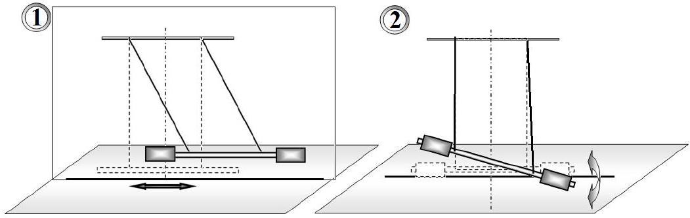
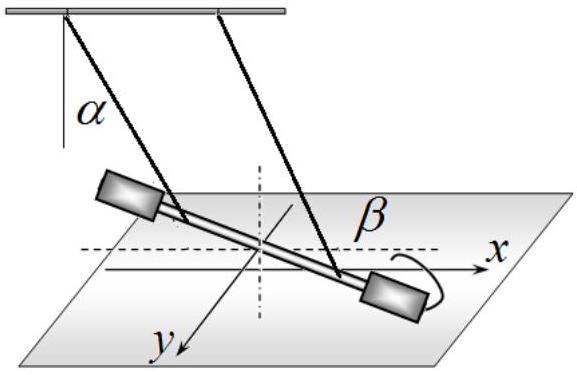
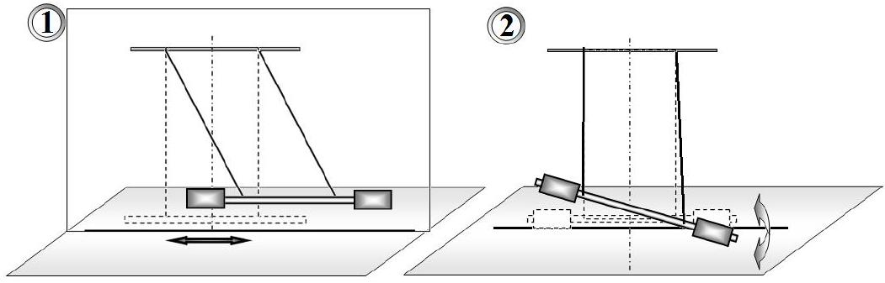
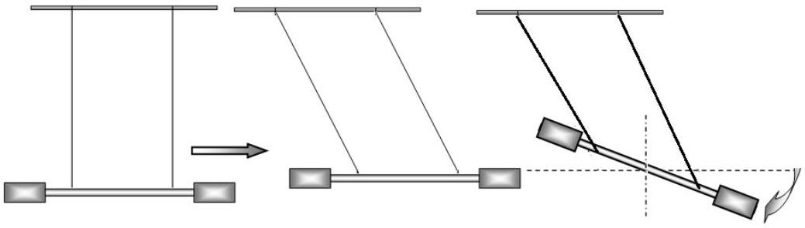
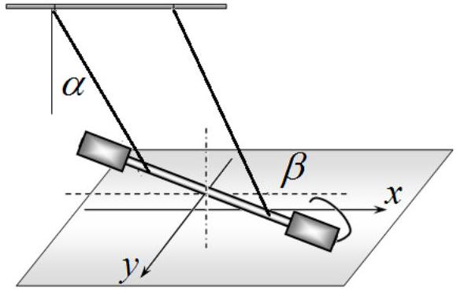
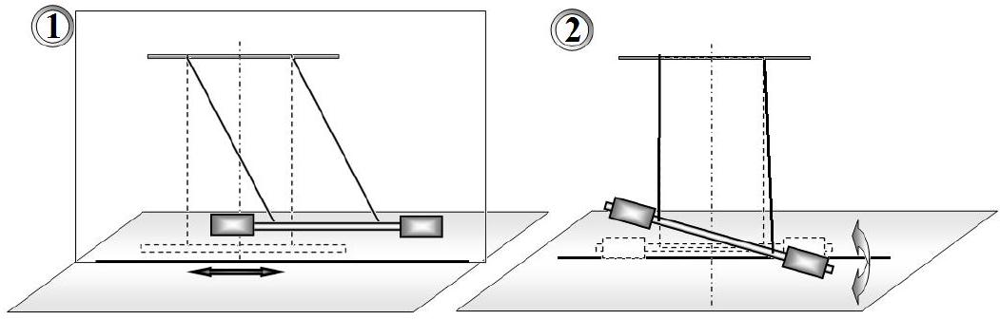
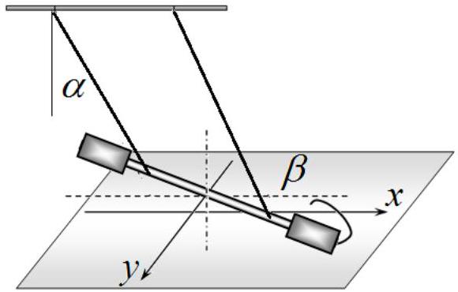

## EXPERIMENTAL COMPETITION

January 10, 2024

## Please read the instructions first:

1. The Experimental competition consists of one problem. This part of the competition lasts 3 hours.
2. Please only use the pen that is provided to you.
3. You can use your own non-programmable calculator for numerical calculations. If you don't have one, please ask for it from Olympiad organizers.
4. You are provided with Writing sheet and additional papers. You can use the additional paper for drafts of your solutions but these papers will not be checked. Your final solutions which will be evaluated should be on the Writing sheets. Please use as little text as possible. You should mostly use equations, numbers, figures and plots.
5. Use only the front side of Writing sheets. Write only inside the bordered area.
6. Fill the boxes at the top of each sheet of paper with your country (Country), your student code (Student Code), the question number (Question Number), the progressive number of each sheet (Page Number), and the total number of Writing sheets (Total Number of Pages). If you use some blank Writing sheets for notes that you do not wish to be evaluated, put a large X across the entire sheet and do not include it in your numbering.
7. At the end of the exam, arrange all sheets for each problem in the following order:
    - Used Writing sheets in order.
    - The sheets you do not wish to be evaluated.
    - Unused sheets.
    - The printed problems.

Place the papers inside the envelope and leave everything on your desk. You are not allowed to take any paper or equipment out of the room.

## Superposition of oscillations

Devices and equipment: tripod, complex pendulum, ruler of 30 cm, electronic stopwatch.
The oscillatory system is a torsion pendulum, which consists of a metal screw-threaded rod 1, suspended on two threads 2 and 3 of equal length, the threads are tied to a horizontal rod 4, fixed in the tripod leg. On the movable rod 1 there are two elongated screw nuts 5 and 6, which can be freely moved along the rod.

In all experiments, the lengths of the threads must remain unchanged, and they themselves must be strictly vertical in a state of equilibrium and located symmetrically relative to the center of the rod $C$. We denote the distance between the threads as $a$.

The screw nuts should also be positioned symmetrically relative to the center of the rod. The position of the nuts is determined by the distance $z$ from the rod center to the middle of the nut. For precise positioning of the nuts, it is recommended to use a rod thread with a pitch of 1.0 mm. For convenience, one of the faces of the nut is sealed with a strip of paper on which its middle is clearly marked, so that when the nut is turned one turn, it moves along the rod by a distance of 1.0 mm.

In this experiment you need to study two types of the rod oscillations:

- longitudinal oscillations (1 in the figure below), in which the rod and threads always move in the same vertical plane;
- torsional oscillations (2 in the figure below), in which the rod rotates around a fixed vertical axis passing through the rod center.

If the rod is deflected in a vertical plane and released, it then performs longitudinal oscillations. If the rod is rotated at a certain angle around the vertical axis and released, it then performs torsional oscillations.

In addition, this experiment is aimed at studying the superposition of longitudinal and torsional oscillations, which can be excited by displacing the rod along its axis and rotating it at a certain angle relative to the vertical axis. We call such oscillations mixed.

For convenience, secure the pendulum in a tripod so that the rod moves in close proximity to the table surface. Place a sheet of paper on the table, on which you have to draw a straight line corresponding to the rod equilibrium position. During longitudinal oscillations, the rod must move along this straight line; during torsional oscillations, the center of the rod must be located on the same vertical.

During the experiments, the angles of deviation of the threads from the vertical during longitudinal oscillations and the angles of rod rotation during torsional oscillations should lie in the range of 20°-30°.

Successful completion of this experiment requires high precision measurements, so be extremely careful and accurate! Release the rod without any additional push!

## Part1. Observation of the effect and its theoretical description

Place the threads at a distance of $a=20 \mathrm{~cm}$, their lengths should approximately be $L=45 \mathrm{~cm}$, and the screw nuts should be placed at the ends of the movable rod. Excite mixed oscillations of the rod and carefully observe the movement of one of its ends. Since, with the selected system parameters, the frequencies of longitudinal and torsional oscillations are close, the shape of the trajectory of the rod end changes slowly and regularly, periodically returning to the initial one. Let us call the process of sequential restoration of the original shape of the trajectory a cycle, the corresponding time as the cycle time $T_{C}$, and the number of complete longitudinal oscillations corresponding to it as $N_{C}$.
1.1 Draw several successive characteristic shapes of the rod end trajectories in one cycle.

We introduce a coordinate system on the horizontal plane: the $x$ axis is directed along the rod in the position of its equilibrium, the $y$ axis is perpendicular to it, and the origin is placed under the center of the rod in the position of its equilibrium.

We also denote the angle of deflection of the threads during longitudinal oscillations as $\alpha$, the angle of rod rotation during torsional oscillations as $\beta$, the period of longitudinal oscillations as $T_{0}$, the period of torsional oscillations as $T_{1}$, the length of the threads as $L$, and the length

of the rod as $l$.
1.2 Write down the exact dependences of the coordinates of the rod end $x(t)$ and $y(t)$ on time $t$, and then obtain the corresponding approximate expressions for the conditions of this experiment.
1.3 Within the framework of the proposed model, obtain a formula for the cycle period $T_{C}$, expressing it through the periods of longitudinal $T_{0}$ and torsional $T_{1}$ oscillations.
1.4 Write down the formula for the number of longitudinal oscillations in the cycle $N_{C}$, expressing it in terms of periods $T_{0}$ and $T_{1}$.

## Part 2. Longitudinal oscillations

2.1 Measure the period of longitudinal oscillations $T_{0}$ with the possible minimal error. Calculate the instrumental, random and total errors of the measured value of the period $\Delta T_{0}$.

## Part 3. Torsional oscillations

The period of torsional oscillations can be described by the formula:

$$
\frac{T_{1}}{T_{0}}=a^{q} F(z),
$$

where $z$ signifies the distance from the rod center to the centers of the nuts, and $F(z)$ stands for a function that depends on $z$ only.
3.1 Measure the dependence of the period of torsional oscillations $T_{1}$ on the distance between the threads $a$, plot a graph of the resulting dependence. Take measurements when the nuts are at the rod ends with $z=17 \mathrm{~cm}$.
3.2 Based on experimental data, prove the validity of formula (1) and determine the exponent $q$. An error estimate is not required here.

It can be shown that the function $F(z)$ in formula (1) has the following form

$$
F(z)=\sqrt{A+B z^{2}},
$$

where $A, B$ refer to some constant values independent of the parameters $a$ and $z$.
3.3 Fix the suspension threads at a distance of $a=10 \mathrm{~cm}$. Measure the period of torsional oscillations as a function of the position of the nuts $z$. Plot a graph of the resulting relationship. It is unnecessary to take measurements when the nuts are closer to the center of the rod than the threads.
3.4 Prove the applicability of formula (2) to describe your experimental data.
3.5 Calculate the values of the coefficients $A, B$ and estimate their errors. Please note that $a, z$ values must be measured in centimeters.

## Part 4. Mixed oscillations

Place the threads at a distance of $a=20 \mathrm{~cm}$. Investigate the mixed oscillations described in Part 1 for different positions of the nuts with $z>10 \mathrm{~cm}$.
4.1 Measure the dependence of the number of longitudinal oscillations in the cycle $N_{C}$ on the position of the nuts $z$. You may not be able to do this for all $z$ values!
4.2 Based on the results of parts 2 and 3, calculate the periods of torsional oscillations for all values of $z$ at which the measurements have carried out in section 4.1.
4.3 Present the measurement results in such a graphical form that they confirm the validity of the formula for the $N_{C}$ value obtained in part 1.

## 10 каңтар 2024 жыл

## Алдымен төмендегілерді оқып алыңыз:

1. Тәжірибелік сайыс бір есептен тұрады. Сайыстың ұзақтығы 3 сағат.
2. Өзіңіз әкелген қаламсабыңызды пайдалануыңызға болады.
3. Сандық есептеулер жасау үшін өздеріңіздің бағдарланбайтын калькуляторларыңызды пайдалануларыңызға болады. Егер өзіңізде ол жоқ болса, оны олимпиаданы ұйымдастырушылардан сұрап алуларыңызға болады.
4. Сіздерге таза парақтар және Жазбалар yuiiн napaқтар (Writing sheets) берілген. Таза парақтар сіздерге аралық жазбаларыңызды жасау үшін берілген, оны өз қалауларыңызша пайдаланасыздар, бұл парақтар тексерілмейді. Ал Writing sheets -ке қазылар алқасы тексеретін шешімдерді жазуға тиіссіздер. Шешімдерде қара сөзден көрі теңдеулерді, өрнектерді, суреттерді, сызбаларды қолданған дұрыс.
5. Writing sheets - тің тек алғашқы бетін пайдаланасыздар. Жазбаларыңызды белгіленген рамканың сыртына шығармай жазыңыздар.
6. Жазбаға пайдаланылған әрбір Writing sheets, -тің жоғарғы жағында өзіңіздің еліңізді (Country), жеке кодыңызды (Student Code), әрбір парақтың номерін (Page Number) және парақтардың жалпы санын (Total Number of Pages) жазуға тиіссіз. Егер қандай да бір Writing sheets-ті жауаптарға қосқыңыз келмесе, онда ол парақты үлкен крестпен сызып тастап, парақтардың жалпы санына қоспаңыз.
7. Сайыс аяқталған кезде барлық парақтарды төмендегі ретпен жинақтаңыз:
    - Нөмерленіп реттелген Writing sheets.
    - Аралық есептеулер жазылған парақтар.
    - Пайдаланылмаған парақтар.
    - Есептердің берілген шарттары.

Барлық парақтар конвертке салынып, стол үстінде қалдырылуы тиіс.

## Тербелістердің суперпозициясы

Құрал және жабдықтар: штатив, күрделі маятник, линейка 30 см, электрондық секундомер.
Зерттелетін жүйе - айналмалы маятник. Ол штативке бекітілген горизонталь стерженнен (4), оған байланған, ұзындығы бірдей екі (2) және (3) жіптен, ол жіптерге ілінген резбалы металл стерженнен (1) тұрады. Тербелетін резбалы стерженге екі жағынан бұрамалы гайка (5) және (6) кигізілген.

Тәжірибе кезінде жіптердің ұзындығы өзгеріссіз қалуы, тепе теңдік жағдайында қатаң вертикаль болуы және стерженнің центрі С нүктесіне қатысты симметриялы түрде орналасуы тиіс. Жіптердің ара қашықтығын $a$ деп белгілейміз.

Гайкалар стерженнің центріне қатысты симметриялы орналасуы тиіс. Олардың орыны стерженнің центрінен гайкалардың центріне дейінгі $z$ ара қашықтығымен анықталады. Гайкаларды дәл орналастыру үшін стерженнің резбасының 1,0 мм болатын қадамын пайдалану ұсынылады. Ыңғайлы болу үшін гайканың бір қырына оның дәл ортасын көрсететін қағаз жапсырылған, гайка бір айналғанда ол стержень бойымен 1 мм ге ығысады.

Бұл жұмыста сіздерге стерженнің екі түрлі тербелісін зерттеу қажет болады:

- кума тербелістер (), бұл жағдайда стержень және жіптер әрқашан бір вертикаль жазықтықта қозғалады;
- айналмалы тербелістер (төмендегі 2 сурет), бұл жағдайда стержень оның центрі арқылы өтетін тұрақты вертикаль осьтің маңында айналады.

Егер стерженді вертикаль остің бойымен біршама ауытқытып, жіберсек ол кума тербелістер жасайды. Ал егер оны вертикаль оське қатысты біршама бұрышқа бұрып, жіберсек ол айналмалы тербеліс жасай бастайды.

Сонымен қатар бұл жұмыста сіздерге кума және айналмалы тербелістердің суперпозициясын зерттеу ұсынылады.Мұндай тербелісті стерженді жазықтықта біршама ығыстырып, және айландырып алуға болады. Мұндай қозғалысты аралас

тербеліс деп атайды.

Ыңғайлы болуы үшін маятникті штативке стержень столдың бетіне жақын жерде тербелетіндей етіп орналастырыңыздар. Столға таза парақ төсеп, тепе теңдікте тұрған стерженнің бойымен түзу сызық сызыңыз. Қума қозғалыстар кезінде стержень осы түзудің бойымен тербелуі тиіс. Ал айналмалы тербеліс кезінде стерженнің центрі бір вертикальдің бойында болуы міндет.

Тәжірибе барысында жіптің вертикальдан ауытку бұрышы және айналмалы тербелістің ауытку бұрышы $20^{\circ}-30^{\circ}$ ауқымында жатуы тиіс.

Бұл тапсырмаларды орындау өлшеудің үлкен дәлдігін талап етеді, сондықтан барынша мұқият және ұқыпты болыңыздар! Стерженді босатқан кезде итермеціздер!

Жіптерді ара қашықтықтары $a=20 с м$ болатындай етіп орналастырыңыздар, олардың ұзындығы шамамен $L=45 с м$ болғаны жөн, гайкаларды стерженнің ұштарына орналастырыңыздар. Аралас тербеліс қоздырып, стерженнің бір ұшының қозғалысын мұқият бақлаңыз. Жүйенің сіздер пайдаланып жатқан параметрлерінде кума және айналмалы тербелістердің периодтары бір біріне жақын болғандықтан стержен ұшының траекториясының формасы баяу өзгере отырып, периодты түрде бастапқы қалыпына оралып отырады.Траекторияның бастапқы күйіне қайта оралу процессін цикл деп, оған қажетті $T_{C}$, уақытын цикл уақыты деп атап, ал оған сәйкес келетін толық қума тербелістер санын $N_{C}$ деп белгілейміз.
1.1 Бір цикл кезіндегі стержень ұшының траекториясының бірнеше айқын ерекшеленетін формаларының суретін сызыңыз.

Горизонталь жазықтықтағы санақ жүйесін енгіземіз: $x$ осін тепе-теңдікте тұрған стержень бойымен бағыттаймыз, ал $y$ осін оған перпендикуляр бағытта, координаттың бас нүктесі тыныштықтағы стерженнің центрімен сәйкес болатындай етіп орналастырамыз.

Қума тербелістер кезіндегі жіптің ауыткуын $\alpha$ деп, айналмалы тербеліс кезіндегі стерженнің бұрылу бұрышын $\beta$ деп, қума тербелістердің периодын $T_{0}$ деп, айналмалы тербелістердікін -

$T_{0}$ деп, жіптің ұзындығын $-L$ деп, ал стерженнің ұзындығын $-l$ деп белгілейміз.
1.2 Стерженнің ұшының $x(t)$ және $y(t)$ координаттарының $t$ уақыттан нақты тәуелділігін жазыңыз, ал сонан соң осы тәжірибенің шарты үшін сәйкес жуық мәндерін анықтаңыз.
1.3 Ұсынған моделдеріңіздің негізінде циклдің $T_{C}$ периодының өрнегінқума тербелістің $T_{0}$ және айналмалы тербелістің $T_{1}$ периодтары арқылы анықтаңыз.
1.4 Циклдағы қума тербелістердің $N_{C}$ санын $T_{0}$ және $T_{1}$ периодтары арқылы өрнектеп жазыңыз.

## 2 бөлім. Қума тербелістер.

2.1 Қателіктеріңіз өте аз болатындай етіп қума тербелістердің $T_{0}$ периодын өлшеңіздер. Қондырғы қателігі, кездейсоқ және $\Delta T_{0}$ толық қателікті анықтаңыз.

## 3 бөлім. Айналмалы тербелістер.

Айналмалы тербелістің периоды мына өрнекпен анықталады:

$$
\frac{T_{1}}{T_{0}}=a^{q} F(z),
$$

мұндағы $z$ - тербелетін стерженнің центрінен гайканың центріне дейінгі ара қашықтық, ал $F(z)$ - тек $z$-тен ғана тәуелді қандай да бір функция.
3.1 Айналмалы тербелістің $T_{1}$ периодының жіптердің $a$ ара қашықтығынан тәуелділігін өлшеп, графигін тұрғызыңыз. Өлшеуді гайкалар стерженнің ұшында болатын $z=17$ см үшін жүргізіңіз.
3.2 Жүргізген өлшеулеріңіздің нәтижесінде (1) өрнектің дұрыс екенін көрсетіңіз және $q$ дәреже көрсеткішін анықтаңыз. Бұл пункте қателіктерді бағалап қажет емес.

Жоғарыдағы (1) өрнегіндегі $F(z)$ функциясының түрі мынадай

$$
F(z)=\sqrt{A+B z^{2}},
$$

Мұндағы $A, B$ - қандай да бір тұрақты шамалар, олар $a$ және $z$ параметрлерінен тәуелді емес
3.3 Ілу жіптерін ара қашықтығы $a=10$ см болатындай етіп бекітіңіздер. Айналмалы тербеліс периодының $z$ гайкалар орнынан тәуелділігін өлшеңіз. Алынған тәуелділіктің графигін тұрғызыңыз. Гайкалардың орыны стержень центріне ілінген жіптердің орынынан жақын болатын жағдайлар үшін өлшеулер жүргізіп қажет емес.
3.4 Сіздердің тәжірибелеріңізді сипаттау үшін (2) өрнекті қолдануға болатынын дәлелдеп көрсетіңіздер.
3.5 Жоғарыдағы $A, B$ параметрлерін есептеп, оның қателіктерін бағалаңыз. Ал $a, z$ шамаларының сантиметрмен өлшенетінін назардан шығармаңыздар.

## 4 бөлім. Аралас тербелістер.

Жіптерді ара қашықтығы $a=20 с м$ болатындай етіп орналастырыңыздар. Жоғарыдағы 1 бөлімде сипатталған аралас тербелісті гайканың орнының $z>10$ см болатын әртүрлі мәндерінде зерттеңіз.
4.1 Циклдағы қума тербелістердің $N_{C}$ санының гайканың $z$ орынынан тәуелділігін өлшеңіз. Бұл $z$-тің барлық мәндері үшін анықтала бермеуі мүмкін.
4.2 Жоғарыдағы 2 және 3 бөлімдердің нәтижелерін пайдалана отырып $z$-тің 4.1-пункттегі өлшеу жүргізілген барлық мәндері үшін айналмалы тербелістің периодын есептеңіз.
4.3 Өлшеудің нәтижелерін 1 бөлімде $N_{C}$ шамасы үшін алынған өрнектің дұрыс екенін көрсете алатындай графиктік формада келтіріңіз.

## 10 января 2024 года

## Сначала, пожалуйста, прочитайте следующее:

1. Экспериментальный тур состоит из одной задачи. Продолжительность тура 3 часа.
2. Пользуйтесь только той ручкой, которая Вам предоставлена.
3. Для расчетов Вы можете использовать свой непрограммируемый калькулятор. Если своего у вас нет, тогда Вы можете попросить его у организаторов олимпиады.
4. Вам предоставлены чистые листы бумаги и Листы для записи (Writing sheets). Чистые листы бумаги предназначены для черновых записей, их Вы можете использовать по Вашему усмотрению, они не проверяются. На Writing sheets следует записывать решения задач, которые будут оценены при проверке работы. В решениях как можно меньше используйте словесные описания. В основном Вы должны использовать уравнения, числа, буквенные обозначения, рисунки и графики.
5. Используйте только лицевую сторону Writing sheets. При записи не выходите за пределы отмеченной рамки.
6. На каждом использованном Writing sheets, в отведенных для этого графах, необходимо указать Вашу страну (Country), Ваш код (Student Code), текущий номер каждого листа (Page Number) и полное количество листов, использованных при решении всех задач (Total Number of Pages). Если Вы не хотите, чтобы какие-нибудь использованные Writing sheets были включены в ответ, тогда перечеркните их большим крестом на весь лист и не включайте их в Ваш подсчёт полного количества листов.
7. Когда Вы закончите тур, разложите все листы в следующем порядке:
    - Пронумерованные по порядку Writing sheets.
    - Черновые листы.
    - Неиспользованные листы.
    - Отпечатанные условия задачи.

Положите все листы бумаги в конверт и оставьте на столе. Вам не разрешается выносить из аудитории любые листы бумаги, приборы, материалы и принадлежности.

## Суперпозиция колебаний

Приборы и оборудование: штатив, сложный маятник, линейка 30 см, секундомер электронный.

Колебательная система представляет собой крутильный маятник, который состоит из металлического стержня 1 с резьбой, подвешенного на двух нитях 2 и 3 одинаковой длины, нити привязаны к горизонтальному стержню 4 , закрепленному в лапке штатива. На подвижном стержне 1 располагаются две удлиненных гайки 5 и 6 , которые можно перемещать по стержню.

Во всех экспериментах длины нитей должны оставаться неизменными, а сами они должны быть строго вертикальны в состоянии равновесия и располагаться симметрично относительно центра стержня $C$. Расстояние между нитями обозначим $a$.

Гайки должны располагаться симметрично относительно центра стержня. Положение гаек определяется расстоянием $z$ от центра стержня до середины гайки. Для точного расположения гаек рекомендуется использовать резьбу стержня, шаг которой равен 1,0 мм. Для удобства одна из граней гайки заклеена полоской бумаги, на которой отмечена ее середина, так что при повороте гайки на один оборот она смещается по стержню на расстояние 1,0 мм.

В работе Вам необходимо исследовать два типа колебаний стержня:

- продольные колебания (1 на рисунке ниже), при которых стержень и нити все время движутся в одной вертикальной плоскости;
- крутильные колебания (2 на рисунке ниже), при которых стержень вращается вокруг неподвижной вертикальной оси, проходящей через центр стержня.

Если отклонить стержень в вертикальной плоскости и его отпустить, то он будет совершать продольные колебания. Если стержень повернуть на некоторый угол вокруг вертикальной оси и отпустить, то он будет совершать крутильные колебания.

Кроме того, в работе Вам предлагается изучить суперпозицию продольных и крутильных колебаний, которые можно возбудить смещением стержня вдоль своей оси и его поворотом на некоторый угол относительно вертикальной оси.

Назовем такие колебания смешанными.

Для удобства закрепите маятник в штативе так, чтобы стержень двигался в непосредственной близости от поверхности стола. Положите на стол лист бумаги, на которой нарисуйте прямую линию, вдоль которой располагается стержень в положении равновесия. При продольных колебаниях стержень должен двигаться вдоль этой прямой, при крутильных колебаниях центр стержня должен располагаться на одной вертикали.

В ходе экспериментов углы отклонения нитей от вертикали при продольных колебаниях и углы поворота стержня при крутильных колебаниях должны лежать в диапазоне $20^{\circ}-30^{\circ}$.

Успешное выполнение данного задания требует высокой точности измерений, поэтому будьте предельно внимательны и аккуратны! Стержень освобождайте без дополнительного толчка!

## Часть 1. Наблюдение эффекта и его теоретическое описание.

Расположите нити на расстоянии $a=20$ см, их длины должны примерно составлять $L=45$ см, а гайки размещаться на концах подвижного стержня. Возбудите смешанные колебания стержня и внимательно наблюдайте за движением одного из его концов. Так как при выбранных параметрах системы частоты продольных и крутильных колебаний близки, то форма траектории конца стержня медленно и закономерно изменяется, периодически возвращаясь к начальной. Назовем процесс последовательного восстановления исходной формы траектории циклом, соответствующее время - временем цикла $T_{C}$, а число соответствующих ему полных продольных колебаний как $N_{C}$.
1.1 Нарисуйте несколько последовательных характерных форм траекторий конца стержня за один цикл.

На горизонтальной плоскости введем систему координат: ось $x$ направим вдоль стержня в положении его равновесия, ось $y$ - перпендикулярно ей, а начало отсчета поместим под центром стержня в положении его равновесия.

Обозначим угол отклонения нитей при продольных колебаниях $\alpha$, угол поворота стержня при крутильных колебаниях $\beta$, период продольных колебаний $-T_{0}$, период крутильных

колебаний $-T_{1}$, длину нитей $-L$, а длину стержня $-l$.
1.2 Запишите точные зависимости координат конца стержня $x(t)$ и $y(t)$ от времени $t$, а затем получите соответствующие приближенные выражения для условий данного эксперимента.
1.3 В рамках предлагаемой модели, получите формулу для периода цикла $T_{C}$, выразив его через периоды продольных $T_{0}$ и крутильных $T_{1}$ колебаний.
1.4 Запишите формулу для числа продольных колебаний в цикле $N_{C}$, выразив его через периоды $T_{0}$ и $T_{1}$.

## Часть 2. Продольные колебания.

2.1 Измерьте с минимальной погрешностью период продольных колебаний $T_{0}$. Рассчитайте приборную, случайную и полную погрешность измеренного значения периода $\Delta T_{0}$.

## Часть 3. Крутильные колебания.

Период крутильных колебаний может быть описан формулой:

$$
\frac{T_{1}}{T_{0}}=a^{q} F(z),
$$

где $z$ - расстояние от центра подвижного стержня до центров гаек, а $F(z)$ - некоторая функция, зависящая только от $z$.
3.1 Проведите измерения зависимости периода крутильных колебаний $T_{1}$ от расстояния между нитями $a$, постройте график полученной зависимости. Измерения проведите, когда гайки находятся на концах стержня при $z=17$ см.
3.2 На основании экспериментальных данных докажите справедливость формулы (1) и определите показатель степени $q$. Оценка погрешности в данном пункте не требуется.

Можно показать, что функция $F(z)$ в формуле (1) имеет вид

$$
F(z)=\sqrt{A+B z^{2}},
$$

где $A, B$ - некоторые постоянные величины, не зависящие от параметров $a$ и $z$.
3.3 Закрепите нити подвеса на расстоянии $a=10 с м$. Проведите измерения периода крутильных колебаний от положения гаек $z$. Постройте график полученной зависимости. Проводить измерения, когда гайки находятся ближе к центру стержня чем нити, не требуется.
3.4 Докажите применимость формулы (2) для описания ваших экспериментов.
3.5 Рассчитайте значения коэффициентов $A, B$ и оцените их погрешности. Обратите внимание на то, что величины $a, z$ должны измеряться в сантиметрах.

## Часть 4. Смешанные колебания.

Расположите нити на расстоянии $a=20 с м$. Исследуйте смешанные колебания, описанные в Части 1 , при различных положениях гаек с $z>10$ см.
4.1 Измерьте зависимость числа продольных колебаний в цикле $N_{C}$ от положения гаек $z$. Возможно, что не для всех значений $z$ вам удастся это сделать!
4.2 На основании результатов частей 2 и 3 рассчитайте периоды крутильных колебаний для всех значений $z$, при которых были проведены измерения в п. 4.1.
4.3 Представьте результаты измерений в такой графической форме, чтобы они подтверждали справедливость формулы для величины $N_{C}$, полученной в части 1.
