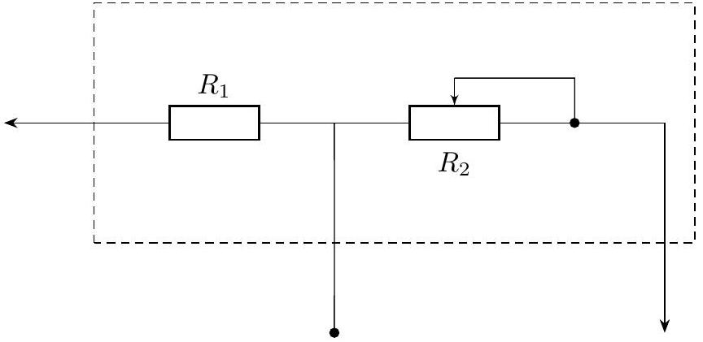
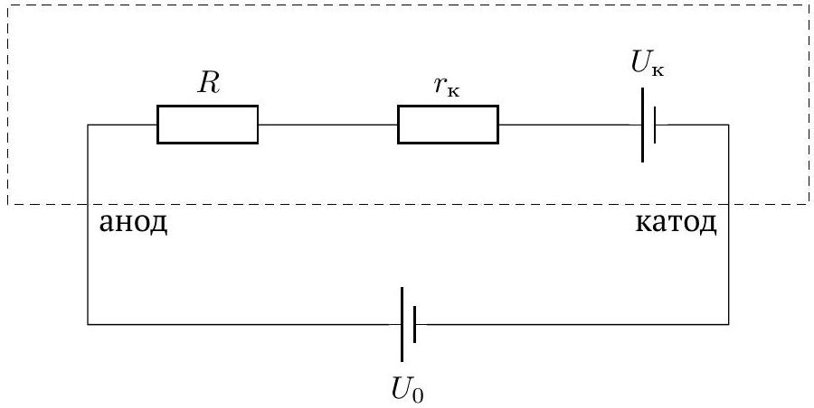
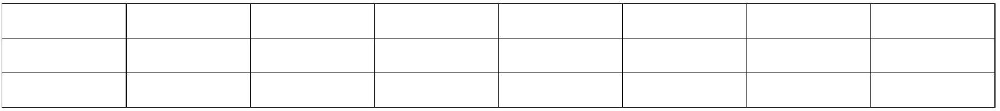

## Road to IPhO

## Главное - не пересолить

1. Лаборатоный источник питания (выставьте ограничение по напряжению в 4.5 В)
2. Блок регулировки и измерения напряжения с тремя выводами, схема которого представлена на рисунке (центральный выход - чёрный, выход потенциометра $R_{2}=100$ Ом - красный, выход ограничительного резистора $R_{1}=10$ Ом - белый)
3. Соединительные провода ( $3 \times$ крокодил-крокодил, $4 \times$ крокодил-банан)
4. Стеклянный шприц с металлическими поршнем и подыгольным конусом
5. Мультиметры ( $\times 2$ )
6. Стакан с трёхпроцентным раствором соли
7. Контейнер с чистой водой (для промывки шприца)
8. Линейка
9. Салфетки для поддержания чистоты на рабочем месте
10. Контейнер для слива отработанного раствора (общий на полу, не показан на фотографии)

Рис. 1

Зависимость силы тока от напряжения (вольтамперная характеристика, ВАХ) в растворах солей не подчиняется закону Ома. Это происходит вследствие химических процессов, происходящих на металлических контактах (катоде и аноде), погруженных в раствор для его подключения к электрической цепи. Возможный вариант моделирования электрических свойств такой системы представлен на рис. 2. Возникающая на электродах контактная разность потенциалов $U_{к}$ включена навстречу внешнему напряжению $U_{0}$. Наличие постоянного контактного сопротивления $r_{\mathrm{K}}$ обусловлено механизмами переноса тока непосредственно в контактных областях и не связано с сопротивлением объёма раствора, которое на рис. 1 представлено резистором величиной $R$.

Рис. 2

В данной работе погрешности оценивать не требуется!

## Road to IPhO

Для предоставленного вам трёхпроцентного (по массе) раствора NaCl в воде:

| A1 | Измерьте омметром сопротивление ограничительного резистора $R_{1}$ (см. оборудование). Ниже указано его приблизительное значение 10 Ом, однако в расчётах используйте полученное вами более точное значение. | 0.0 |
| :--- | :--- | :--- |
| A2 | Экспериментально подтвердите справедливость предложенной модели. Для этого исследуйте BAX раствора при 5-ти различных расстояниях между электродами. | 1.0 |
| A3 | Оцените величину контактной разности потенциалов $U_{\mathrm{K}}$. | 0.3 |
| A4 | Определите величину контактного сопротивления $r_{\mathrm{K}}$. | 0.5 |
| A5 | Рассчитайте удельную проводимость $\sigma$ трёхпроцентного раствора хлорида натрия в воде. | 0.2 |
| A6 | Вычислите подвижность $\mu$ ионов натрия и хлора в этом растворе. | 0.5 |

## Справочные данные

- Молярная масса NaCl: 58.4 г/моль
- Элементарный заряд: $1.6 \cdot 10^{-19}$ Кл
- Число Авогадро: $6.02 \cdot 10^{23}$ моль ${ }^{-1}$
- Плотность раствора считать равной $\rho=1$ г/см ${ }^{3}$

## Примечания

1. Работоспособность мультиметра в режиме амперметра НЕ ГАРАНТИРОВАНА!
2. Удельной проводимостью $\sigma$ называется величина, обратная удельному сопротивлению $\rho$.
3. Подвижностью $\mu$ носителей электрического заряда в проводнике называется коэффициент пропорциональности между напряжённостью электрического поля $E$ и скоростью дрейфа носителей $v=\mu E$.
4. Электрическое поле внутри шприца считайте однородным.
5. Подвижности ионов натрия и ионов хлора при данной концентрации раствора можно приближённо считать одинаковыми.
6. Положительный полюс источника напряжения соединяйте с поршнем шприца, а отрицательный - с подыгольным конусом.
7. При пропускании тока через раствор в шприце располагайте последний горизонтально и старайтесь избегать соприкосновения образующегося внутри газового пузыря с электродами (пузырь должен располагаться посередине между электродами).
8. Каждую новую серию измерений проводите, используя свежий раствор соли.
9. Измерения для каждой порции раствора проводите достаточно быстро, избегая образования большого количества газа в объёме.
10. Для расчётов $\sigma$ и $R$ используйте площадь внутреннего сечения шприца $S$, несмотря на то, что площадь электрода, соединённого с подыгольным конусом, значительно меньше $S$.
11. Подкладывайте многократно сложенную салфетку под открытый подыгольный конус шприца.

## Главное - не пересолить

| A2 |  |  |  |  |  |  |  |  |
| :--- | :--- | :--- | :--- | :--- | :--- | :--- | :--- | :--- |
|  |  |  |  |  |  |  |  |  |
|  |  |  |  |  |  |  |  |  |
|  |  |  |  |  |  |  |  |  |
|  |  |  |  |  |  |  |  |  |
|  |  |  |  |  |  |  |  |  |
|  |  |  |  |  |  |  |  |  |
|  |  |  |  |  |  |  |  |  |
|  |  |  |  |  |  |  |  |  |
|  |  |  |  |  |  |  |  |  |
|  |  |  |  |  |  |  |  |  |
|  |  |  |  |  |  |  |  |  |
|  |  |  |  |  |  |  |  |  |
|  |  |  |  |  |  |  |  |  |
|  |  |  |  |  |  |  |  |  |
|  |  |  |  |  |  |  |  |  |
|  |  |  |  |  |  |  |  |  |
|  |  |  |  |  |  |  |  |  |
|  |  |  |  |  |  |  |  |  |
|  |  |  |  |  |  |  |  |  |
|  |  |  |  |  |  |  |  |  |
|  |  |  |  |  |  |  |  |  |
|  |  |  |  |  |  |  |  |  |
|  |  |  |  |  |  |  |  |  |
|  |  |  |  |  |  |  |  |  |
|  |  |  |  |  |  |  |  |  |
|  |  |  |  |  |  |  |  |  |

| A1 $R_{1}=$ |
| :--- |
| A3 $U_{\mathrm{K}}=$ |
| A4 $r_{\mathrm{K}}=$ |
| A5 $\sigma=$ |
| A6 $\mu=$ |
