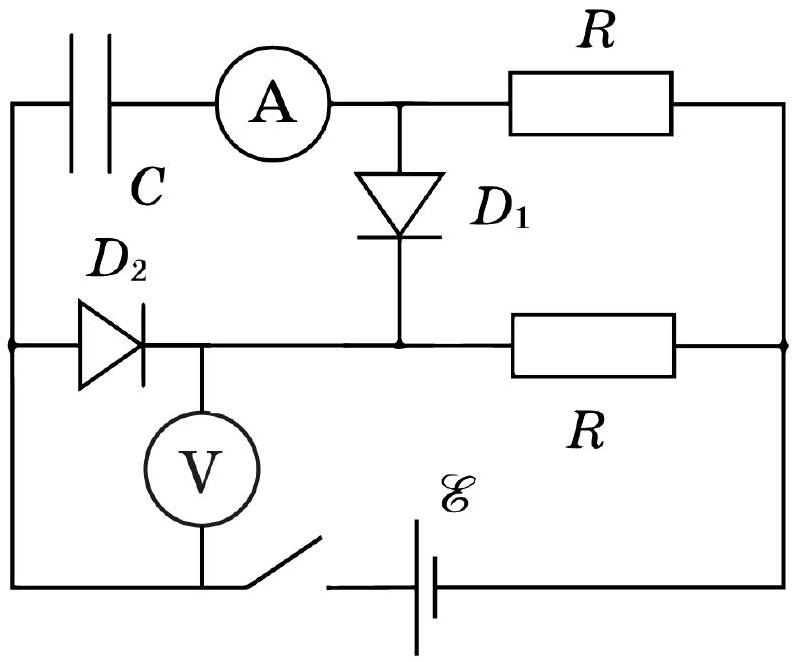

На рисунке изображена схема электрической цепи, состоящая из идеального источника постоянного напряжения $\mathcal{E}=9,6 \mathrm{~B}$, двух одинаковых диодов, конденсатора с ёмкостью $C$ и двух одинаковых резисторов с сопротивлением $R$. В начальный момент конденсатор был не заряжен, а ключ разомкнут. $B$ задаче не нужно оценивать погрешности.

А0 Снимите зависимость показаний амперметра и вольтметра от времени после замыкания ключа.
А1 ${ }^{1.50}$ Найдите сопротивления резисторов $R$.
A2 ${ }^{2.50}$ Найдите ёмкость конденсатора $C$.
A3 ${ }^{4.00}$ Получите зависимость силы тока в диодах от напряжения на нём в максимально широком диапазоне. В качестве ответа принимаются два столбца таблицы. Эти два столбца должны быть вами отмечены звездочкой в листе ответов.

А4 ${ }^{2,00}$ Постройте график зависимости силы тока в диоде от напряжения.
