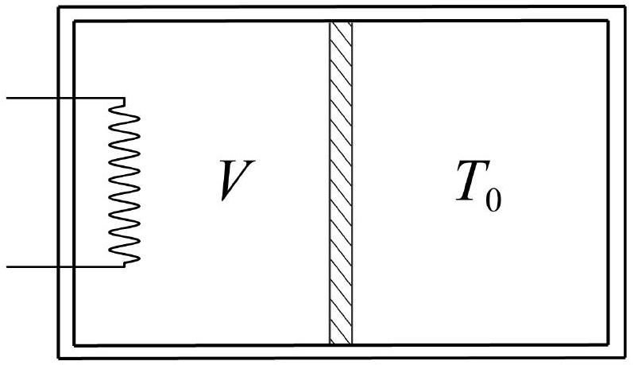

Горизонтально расположенный цилиндрический сосуд объёма $2 V_{0}$ разделён на две равные части подвижным поршнем и заполнен одноатомным идеальным газом. Поршень перемещается без трения. Левая стенка, боковая поверхность всего сосуда и поршень не проводят тепло. Температура правой стенки поддерживается постоянной и равной начальной температуре газа $T_{0}$ в обеих частях сосуда. Начальное давление газа в обеих частях равно $p_{0}$. После включения нагревателя в левой части сосуда поршень начинает медленно перемещаться.

А1 ${ }^{3,00}$ Определите зависимость давления газа $p$ от температуры $T$ в левой части сосуда.
А2 ${ }^{7,00}$ Для этого процесса определите, как теплоёмкость газа в левой части сосуда зависит его объёма $V$.
