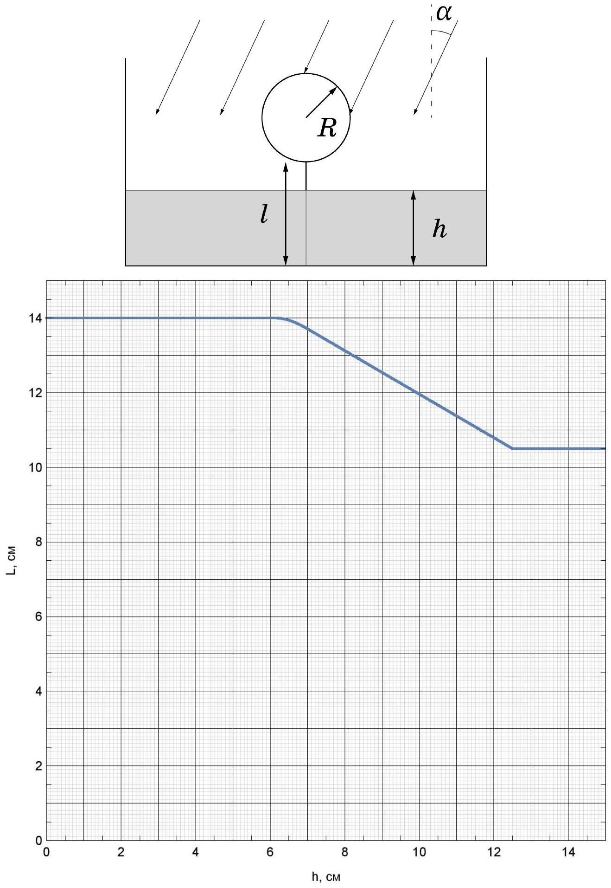

В рамках данной задачи вам предстоит исследовать, как длина тени лёгкого чёрного шара, привязанного ко дну широкого сосуда ниткой и освещаемого солнечным светом зависит от уровня прозрачной жидкости $h$ в сосуде. Длина тени определяется как максимальное расстояние между её граничными точками. Считайте, что сила Архимеда, действующая на шар в воздухе достаточна для того, чтобы нить была натянута.
В дальнейшем используйте следующие обозначения:

1. Длина нити $l$
2. Радиус шара $R$
3. Угол падения лучей на поверхность жидкости $\alpha$
4. Угол преломления лучей $\beta$
5. Длина тени $L$

На графике представлена зависимость длины тени от уровня жидкости в сосуде.

Часть А. До излома
А1 ${ }^{0,20}$ Выразите $L$ через $R$ и $\alpha$ при $h=0$.
Пусть $h_{1}$ - уровень воды в сосуде в момент, когда на графике начинается излом.
А2 ${ }^{0.30}$ Выразите $L$ через $R, \alpha, \beta, l$ и $h$ при $0<h<h_{1}$.
А3 ${ }^{1.00}$ Выразите $h_{1}$ через $l, R, \alpha$ и $\beta$.
Часть В. Исследование излома
Пусть $h_{2}$ - уровень воды в момент, когда излом переходит в линейный участок зависимости.
В1 ${ }^{2.50}$ При $h_{1}<h<h_{2}$ получите зависимость длины тени от $l, R, \alpha, \beta$ и $h$.
В2 ${ }^{1.00}$ Выразите $h_{2}$ через $l, R, \alpha, \beta$.
Часть С. Линейный участок
Пусть $h_{3}$ - уровень жидкости в момент, когда длина тени перестаёт меняться.
С1 ${ }^{1.30}$ Поскольку участок линейный, зависимость $L(h)$ имеет вид $L=L_{0}-k h$. Выразите $L_{0}$ и $k$ через $l, R$, $\alpha$ и $\beta$.

Часть D. Численные значения

D1 ${ }^{1.50}$ Найдите численные значения $\cos \alpha$ и $\cos \beta$.

D2 ${ }^{0.50}$ Найдите радиус шарика $R$.

D3 ${ }^{0.50}$ Найдите показатель преломления жидкости $n$.

D4 ${ }^{0.50}$ Найдите длину нити $l$.
