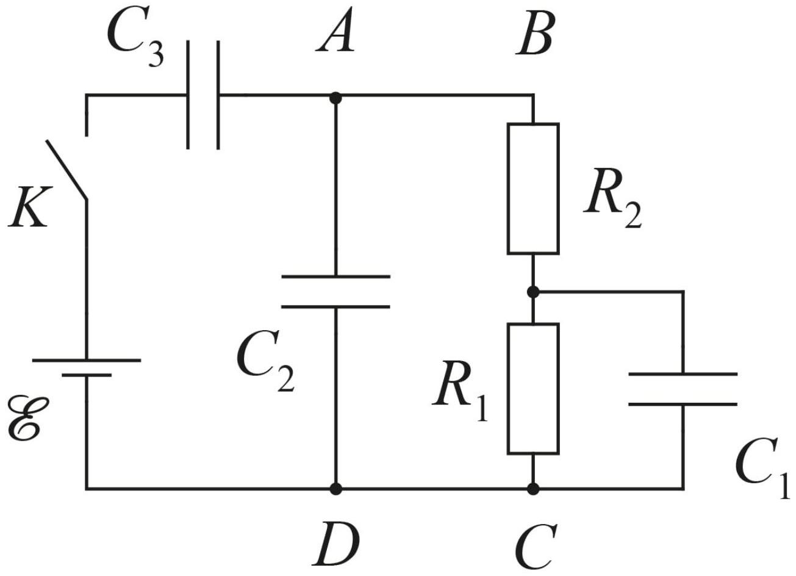

Электрическая цепь, представленная на рисунке, состоит из трёх конденсаторов $C_{1}=C_{2}=C_{3}=C$, двух одинаковых резисторов $R_{1}=R_{2}=R$, источника постоянного напряжения $\mathcal{E}$ с нулевым внутренним сопротивлением и ключа $K$. Пока ключ был разомкнут, конденсаторы были не заряжены.
Обозначим за $t$ время после замыкания ключа, заряды конденсаторов за $q_{1}, q_{2}$ и $q_{3}$ и силы тока в них $(I=d q / d t) I_{1}, I_{2}$ и $I_{3}$ в соответствии с их номерами.

А1 ${ }^{0.60}$ Найдите заряды конденсаторов $q_{10}, q_{20}$ и $q_{30}$ при $t \rightarrow 0$.
А2 ${ }^{0.60}$ Найдите заряды конденсаторов $q_{1_{\infty}}, q_{2_{\infty}}$ и $q_{3_{\infty}}$ при $t \rightarrow \infty$.
А3 ${ }^{0.40}$ Найдите количество теплоты $Q_{0}$, выделившееся в системе за время $t \rightarrow 0$.
A4 ${ }^{0.40}$ Найдите количество теплоты $Q_{\infty}$, выделившееся в системе за время $t \rightarrow \infty$.
Перейдём к нахождению временной зависимости заряда первого конденсатора $q_{1}(t)$.
A5 ${ }^{0.50}$ Из первого закона Кирхгофа, записанного для узла $A$, выразите $I_{2}$ через $I_{1}, q_{1}, R$ и $C$.
А6 ${ }^{0.50}$ Из второго закона Кирхгофа, записанного для контура $A B C D$, выразите $q_{2}$ через $I_{1}, q_{1}, R$ и $C$.
Найдите также $I_{2}$, дифференцируя $q_{2}$ по времени. Ответ выразите через $\frac{d I_{1}}{d t}, I_{1}, R$ и $C$.
А7 ${ }^{0.40}$ Приравнивая выражения для $I_{2}$, полученные в пунктах А5 и А6, покажите, что дифференциальное уравнение, описывающее зависимость $q_{1}(t)$ имеет следующий вид

$$
\alpha \frac{d^{2} q_{1}}{d t^{2}}+\beta \frac{d q_{1}}{d t}+q_{1}=0 .
$$

Выразите также $\alpha$ и $\beta$ через $R$ и $C$.
Далее считайте известным, что решение данного дифференциального уравнения нужно искать в виде

$$
q_{1}(t)=A e^{\lambda t}
$$

где $\lambda$ зависит только от $R$ и $C$, а $A$ - от начальных условий.
А8 ${ }^{0.50}$ Найдите $\lambda_{1}$ и $\lambda_{2}$, удовлетворяющие уравнению, полученному в пункте А7. Ответы выразите через $R$ и $C$.
В качестве $\lambda_{1}$ выберите большее из значений.
В действительности, зависимость $q_{1}(t)$ представляется в виде суммы найденных решений

$$
q_{1}(t)=A_{1} e^{\lambda_{1} t}+A_{2} e^{\lambda_{2} t}
$$

A9 ${ }^{0.80}$ Из начальных условий найдите $A_{1}$ и $A_{2}$. Ответы выразите через $C$ и $\mathcal{E}$.
А10 ${ }^{1.30}$ Найдите количества теплоты $Q_{R_{1}}$ и $Q_{R_{2}}$, выделившиеся в резисторах за время $t \rightarrow \infty$. Ответы выразите через $C$ и $\mathcal{E}$.
Примечание : $\int e^{a x} d x=\frac{e^{a x}}{a}+C$
