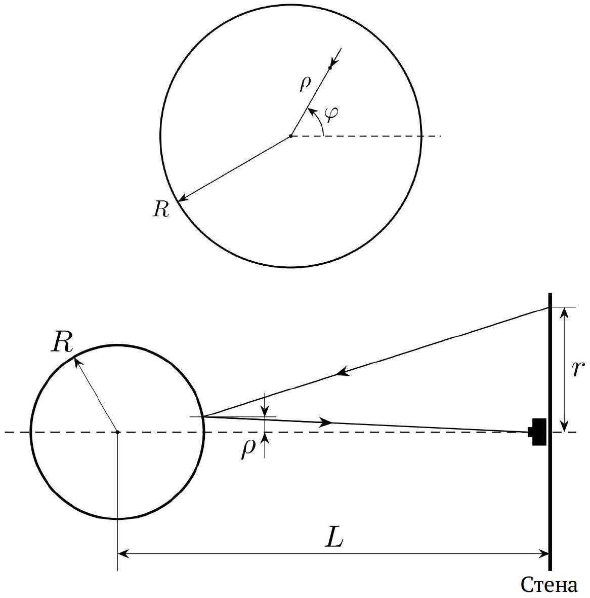
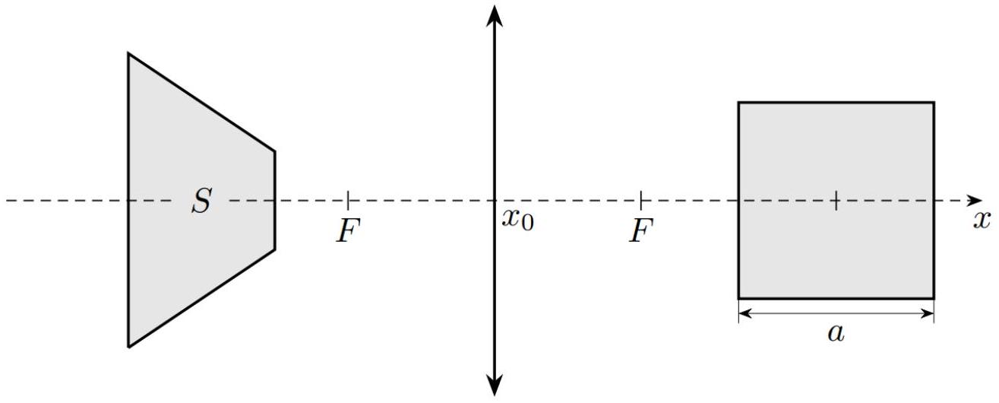

Как вы знаете, отражения повседневных объектов в зеркалах и их изображения в линзах могут иметь довольно причудливую форму. Но и в этих случаях можно восстановить форму исходного объекта. Этому и будет посвящена данная задача.

Часть А. Фото в пузыре (4 балла)

Иногда на фотографиях мыльных пузырей можно заметить искажённые изображения объектов позади фотоаппарата. Исследованию таких искажений посвящена первая часть задачи.
Пузырь радиуса $R$ фотографируют с расстояния $L \gg R$, и в нём отражается объект неправильной формы, нарисованный на вертикальной стене. Линия, соединяющая пузырь и фотоаппарат, перпендикулярна стене; фотоаппарат поставлен к стене вплотную.

Точка на стене на расстоянии $r$ от фотоаппарата видна на фотографии на расстоянии $\rho$ от центра изображения пузыря.

А1 ${ }^{0.50}$ Выразите $r$ через $\rho, R$ и $L$.
А2 ${ }^{1.00}$ Выразите малый элемент площади объекта $\mathrm{d} S$ через параметры соответствующего участка изображения. В ответ могут входить величины $\rho, R, L$, а также дифференциал расстояния $\mathrm{d} \rho$ и дифференциал полярного угла $\mathrm{d} \varphi$.

А3 ${ }^{2.50}$ В листе ответов приведена фотография пузыря в натуральный размер. Как можно точнее найдите площадь объекта на стене. Численное значение $L=1 \mathrm{м}$.

Примечание: Удобно представить ответ как площадь под некоторым графиком. Миллиметровая бумага для построения графика приведена в листе ответов.
Часть В. Площадь квадрата (6 балла)
Квадрат со стороной $a$ помещают на ось собирающей линзы с фокусным расстоянием $F$. Две стороны квадрата параллельны оптической оси, другие две -перпендикулярны. Положение центра квадрата задаётся координатой $x$ вдоль оптической оси, центр линзы находится в точке $x_{0}$. Изображение квадрата -трапеция, зависимость площади которой $S(x)$ исследуется в этой части задачи.

Примечание: При решении этой задачи можете использовать формулу тонкой линзы, согласно которой расстояние $u$ от линзы до источника света, расстояние $v$ от линзы до изображения и фокусное расстояние линзы $F$ связаны друг с другом соотношением:

$$
\frac{1}{u}+\frac{1}{v}=\frac{1}{F} .
$$

Также при решении считайте известным, что изображение отрезка в линзе также представляет собой отрезок, если он не пересекает фокальную плоскость.

В1 ${ }^{1.00}$ Получите теоретическую формулу для площади $S(x)$ изображения квадрата. Считайте, что $x-x_{0}>F+a / 2$.
В листе ответов приведена зависимость $S(x)$, причём в точке $x=16$ см площадь изображения становится неизмеримо большой. Эту зависимость намного удобнее анализировать, если в ней отсутствует расходимость (т.е. она всегда принимает конечные значения).

В2 ${ }^{1.00}$ Чтобы зависимость не имела расходимости при $x=16$ см, её удобно домножить на некоторую функцию $f(x)$, которая в этой точке обращается в 0. Предложите такую функцию. Пересчитайте точки для $f(x) S(x)$.

Для дальнейшей обработки удобно восстановить значение $f(x) S(x)$ в точке $x=16$ см. Это можно сделать, экстраполировав (продлив) зависимость $f(x) S(x)$

Вз ${ }^{1.00}$ Получите экстраполированное значение $C=f(x) S(x)$ в точке $x=16$ см.
Примечание: Учтите, что зависимость может не быть линейной в окрестности этой точки
В4 ${ }^{0.50}$ Пересчитайте точки для $f(x) S(x) / C$.
Каждая точка полученной зависимости позволяет найти $a, F$ и координату $x_{0}$ центра линзы.
B5 ${ }^{2.50}$ Для каждой точки найдите $a, F$ и $x_{0}$. Также приведите в листе ответов усреднённые результаты $\bar{a}, \bar{F}$ и $\bar{x}_{0}$.

- Website in English

2020 - Мы те, кого должны превзойти.
