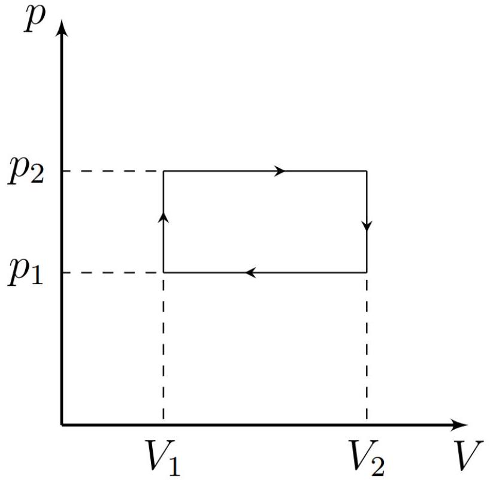

Как известно, КПД является отношением полезной работы, совершаемой рабочим телом, к количеству подведённой к нему теплоты. Нестрого говоря, этот коэффициент определяет то, насколько эффективно «переводится» в работу поступающее от некоторого нагревателя тепло.

В данной задаче рассматривается цикл, проводимый с идеальным газом, состоящий из двух изобар и двух изохор (см. рис. 1). Показатель адиабаты газа известен и равен $\gamma$. Предположим, что отведение тепла от газа происходит с помощью холодильной машины, работающей по обратному циклу Карно между газом и окружающей средой. Пусть $A_{\text {г }}$ - работа, совершаемая газом за один описанный цикл, а $A_{\text {хм }}$ - работа, совершаемая над рабочим телом холодильной машины за один цикл рабочего тела. При этом подвод тепла к газу осуществляется за счет теплообмена с окружающей средой. В этом случае логично ввести вместо КПД «эффективность» цикла $\eta$ :

$$
\eta=\frac{A_{\Gamma}}{A_{\mathrm{xM}}} .
$$

Считайте, что изменение температуры газа за один цикл холодильной машины пренебрежимо мало.

Рис. 1

A1 ${ }^{0.50}$ Выразите молярную теплоёмкость используемого газа в изобарном процессе $C_{P}$ и в изохорном процессе $C_{V}$ через $R$ и $\gamma$.
Пусть максимальная температура в цикле равна температуре окружающей среды $T$, при изохорном охлаждении температура уменьшается с $T$ до $T-t_{1}$, при изобарном охлаждении - с $T-t_{1}$ до $T-t$.

д2 ${ }^{0.50}$ Выразите отношения $p_{2} / p_{1}$ и $V_{2} / V_{1}$ (обозначения рис. 1) через $T, t_{1}$ и $t$.
Пусть количество газа равно $\nu$.
А3 ${ }^{1.00}$ Выразите работу $A_{\Gamma}$ через $\nu, R, T, t_{1}$ и $t$.
Для холодильной машины определяется холодильный коэффициент $\chi$ по формуле:

$$
\chi=\frac{Q_{-}}{A_{\mathrm{xM}}},
$$

где $Q_{-}$- отведенная от газа за один цикл теплота.
A4 ${ }^{0.50}$ Определите $\chi$ в момент, когда температура газа равна $T-\tau$. Ответ выразите через $\tau, T$.
A5 ${ }^{1.50}$ Определите $A_{\text {XM }}$. Ответ выразите через $\nu, R, \gamma, T, t_{1} n t$.
Введём обозначения $y=t / T$ и $x=t_{1} / t$.
А6 ${ }^{1.00}$ Выразите $\eta$ для описанной системы через $x, \gamma$ и $y$. Вычислите его значение для $\gamma=5 / 3, x=0.5, y=0.5$.
Теперь проанализируем, какая максимальная $\eta$ может быть получена при различных значениях $y$ и $x$. Считайте известным, что наилучшая $\eta$ достигается при $y \ll 1$.

А7 ${ }^{1.00}$ Найдите зависимость $\eta(x)$ при $y \ll 1$. Ответ выразите через $\gamma$ и $x$.
При необходимости вы можете использовать формулу: $\ln (1+\xi) \approx \xi-\xi^{2} / 2$ при $\xi \ll 1$.
А8 ${ }^{1.00}$ Определите, при каком $x$ эффективность $\eta$ будет максимальна. Ответ выразите через $\gamma$.
А9 ${ }^{1.00}$ Найдите максимально возможную эффективность $\eta_{\max }$. Ответ выразите через $\gamma$. Вычислите ее значение для $\gamma=5 / 3$.
