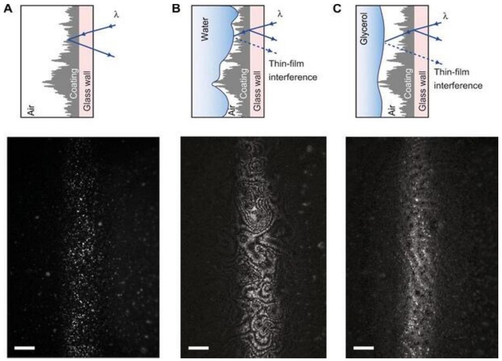

## Road to IPhO

## Измерение вязкости смеси

В этой задаче исследуется зависимость вязкости смеси глицерина и воды от температуры и их относительной концентрации. Вязкость - это способность жидкости сопротивляться течению. Чем жидкость более вязкая, тем труднее ее прокачать по трубам, а значит, возникает необходимость применять более мощные насосы и более крепкие трубы, рассчитанные на повышенное давление.

## Примечание для обработки данных

Существует несколько способов численного решения уравнений. Метод простой итерации (МПИ) - один из простейших методов численного решения уравнений. Его удобно использовать для численного нахождения величин, заданных неявно как решение некоторого уравнения. Чтобы решить уравнение с помощью МПИ, его необходимо представить в виде

$$
x=f(x) .
$$

Подставляя в качестве аргумента функции начальное приближение $x_{0}$, мы получим первое приближение $x_{1}$. Далее, подставляя $x_{1}$ в качестве аргумента функции, мы получим уже второе приближение $x_{2}$, и т.д. Функцию $f(x)$ всегда можно выбрать так, чтобы разница между последовательными приближениями уменьшалась, а результат вычислений становился всё ближе к правильному ответу. Для этого нужно, чтобы в достаточно большой окрестности правильного ответа производная функции $f(x)$ была по модулю меньше единицы. Если это не так, самый простой способ - переопределить $f(x)$ :

$$
f(x) \rightarrow a x+(1-a) f(x) .
$$

Это преобразование инвариантно относительно уравнения (1) и на практике почти всегда позволяет достичь сходимости при должном подборе $a \in \mathbb{R}$. Поскольку для хранения промежуточного значения в калькуляторе используется переменная Ans, практическая реализация МПИ состоит в том, чтобы приравнять Ans к начальному приближению и начать много раз вычислять $f(\mathrm{Ans})$. При правильном подборе функции $f(x)$ результат вычислений быстро сойдётся к правильному ответу. Другой популярный метод численного решения уравнений - метод деления отрезка. Чаще всего встречается деление отрезка пополам. Суть метода состоит в последовательном уменьшении отрезка, внутри которого лежит искомое решение уравнения. Для этого на каждой итерации этот отрезок делится на равные части, левая и правая части уравнения вычисляются в полученных точках, и в качестве нового отрезка выбирается тот, на котором разность левой и правой частей меняет знак. В качестве оценки для корня обычно выбирают середину отрезка. Один из вариантов практической реализации деления отрезка - использование режима Table, который поддерживают некоторые модели калькуляторов. Этот режим позволяет рассчитать значения заданной функции с равным шагом в заданном диапазоне аргумента. Обычно памяти калькулятора хватает на вычисление функции примерно в 20-25 точках, поэтому на каждой итерации можно эффективно делить отрезок примерно в 20 раз.

## Введение

Для смеси воды и глицерина зависимость температуры стеклования от массовой доли глицерина $w_{g}$ можно с хорошей точностью описать многочленом:

$$
T_{g}(\mathrm{~K})=140.3+35.272 w_{g}-3.879 w_{g}^{2}+23.467 w_{g}^{3} .
$$

Используя данное выражение и зная температуру стеклования, можно определить значение концентрации методом простой итерации.

Считайте известными следующие численные данные:

- Плотность глицерина при $T=25{ }^{\circ} C$ равна $\rho_{g}=1260 \mathrm{кг} / \mathrm{м}^{3}$;
- Плотность воды $\rho_{g}=1000 \mathrm{кг} / \mathrm{м}^{3}$;
- Молярная масса глицерина $\mu_{g}=92$ г/моль;
- Молярная масса воды $\mu_{w}=18$ г/моль.

Во всех частях задачи вы можете считать объем смеси равным сумме объемов составляющих этой смеси.

## Road to IPhO

## Часть А. Зависимость вязкости от концентрации (3.5 балла)

В общем случае задачу о вязкости смеси веществ решить не представляется возможным, однако для смеси воды и глицерина можно воспользоваться эмпирической формулой:

$$
\eta=\xi \cdot \frac{\exp \left(-k n_{w}\right)}{1+a \cdot \exp \left(-b n_{w}\right)} .
$$

Если значение молярной доли воды в смеси достаточно мало, то можно считать, что $a \cdot \exp \left(-b n_{w}\right) \ll 1$. Поэтому для упрощения анализа представленной зависимости предлагается использовать приближение, работающее только при малых молярных долях воды:

$$
\eta=\xi \cdot \exp \left(-k n_{w}\right) .
$$

В таблице представлена экспериментальная зависимость вязкости от температуры стеклования смеси глицерина и воды. Измерения производились при температуре $T=25^{\circ} \mathrm{C}$.

| A1 | Выразите молярную долю воды $n_{w}$ в растворе через массовую долю глицерина $w_{g}, \mu_{w}$ и $\mu_{g}$. |
| :--- | :--- |
| A2 | Используя уравнение (1), пересчитайте значения $T_{g}$ в значения $w_{g}$. |
| A3 | Предложите линеаризацию, описывающую систему с малой молярной долей воды, с помощью которой можно будет определить параметры $\xi$ и $k$. Постройте график линеаризованной зависимости. Определите параметры $\xi$ и $k$, используя полученный график. |
| A4 | Зная параметры $\xi$ и $k$ предложите линеаризацию, позволяющую определить значения параметров $a$ и $b$. Постройте график линеаризованной зависимости. По прямолинейному участку определите $a$ и $b$. |

A5 Постройте на одной миллиметровке график теоретической и экспериментальной зависимости $\eta\left(n_{w}\right)$. Укажите диапазон применимости полученного уравнения.

## Часть В. А как зависит вязкость от температуры? (1.9 балла)

При низких температурах, близких к температуре стеклования удобно использовать уравнение ВогеляТаммана-Фульхера (VTF):

$$
\eta=\eta_{0} \cdot \exp \left(\frac{D T_{0}}{T-T_{0}}\right)
$$

для описания зависимости вязкости $\eta$ от температуры $T$, где $\eta_{0}$ и $T_{0}$ - константы, $D$ - константа, обратно пропорциональная хрупкости вещества. Значение $D$ положительно для всех веществ. В таблице представлена экспериментальная зависимость вязкости смеси от температуры. Измерения производились со смесью с объемной долей глицерина $c_{g}=0.5$.

| B1 | Используя уравнение (2), определите температуру стеклования раствора. | 0.4 |
| :--- | :--- | :--- |
| Теперь примите $\eta_{0}=3.33 \cdot 10^{-6}$ Па • с. |  |  |
| B2 | Предложите линеаризацию, позволяющую определить значения параметров $D$ и $T_{0}$. Построив график линеаризованной зависимости или используя метод наименьших квадратов (МНК), определите значения параметров. | 1.5 |

## Road to IPhO

Часть С. Определение вязкости разными способами (0.8 балла)
В данной части задачи предлагается найти численное значение вязкости смеси с помощью двух полученных ранее зависимостей. Для возможности сравнения полученных результатов в обоих случаях смесь находится в одинаковых условиях.

C1 Определите вязкость смеси $\eta_{n}$ при объемной доле глицерина $c_{g}=0.5$ и температуре $T=25^{\circ} \mathrm{C}$, используя зависимость от молярной доли воды.

C2 Определите вязкость смеси $\eta_{t}$ при тех же условиях, используя зависимость от температуры. 0.3

C3 Сравните полученные результаты. Если есть расхождения, объясните причину их возникновения. 0.2

Часть D. Течение вязкой смеси (3.8 балла)
Помимо снижения вязкости, ток жидкости можно улучшить при помощи супергидрофобной поверхности. Такие поверхности не смачиваются водой: капли на них остаются лежать в виде шарика. Между шершавой гидрофобной поверхностью определенного вида и жидкостью возникает воздушный зазор - пластрон, который уменьшает площадь контакта двух сред и облегчает протекание. Ученые под руководством Майи Вуковач (Maja Vuckovac) из Университета Аалто изучали взаимодействия шершавой супергидрофобной поверхности с густыми жидкостями. Исследователи соорудили вертикальные капилляры из коммерчески доступного супергидрофобного материала (Hydrobead), закрытые с одной или с двух сторон. В эти капилляры заливали жидкости с разной вязкостью, в том числе воду, глицерин и полиэтиленгликоль, которые затем стекали вниз под действием силы тяжести. В итоге физики обнаружили, что в такой конфигурации поток тем быстрее, чем выше вязкость. Для того чтобы объяснить феномен, исследователи ввели в жидкости частицы-трекеры и начали наблюдать за стекающими каплями на микроуровне, в том числе за потоками внутри самой капли. Оказалось, что в каплях с низкой и средней вязкостью возникает асимметричный круговой поток, как если бы внутри бутылки вода шла от дна к горлышку по одной стенке и обратно по другой. Чем гуще жидкость, тем слабее этот эффект, поэтому при слишком больших вязкостях жидкости в гидрофильном и гидрофобном капиллярах ведут себя одинаково.

Рис.1. Течение жидкости под микроскопом

## Road to IPhO

В следующем эксперименте использовались 2 одинаковых цилиндрических капилляра, поверхность одного из которых гладкая, а другая гидрофобная. По этим капиллярам течет смесь воды и глицерина. В случае гидрофильного капилляра зависимость объёмного расхода жидкости от вязкости представляется уравнением:

$$
Q=\frac{\pi r^{4} \Delta P}{8 \eta L},
$$

где $r$ - радиус капилляра, $L$ - его длина, $\Delta P=\rho g L$ - разность давлений на концах капилляра, $\rho$ - плотность смеси. Все параметры, кроме вязкости и плотности смеси поддерживаются постоянными и одинаковыми для обоих капилляров. Вы можете пользоваться уравнением, связывающим вязкость смеси и молярную концентрацию воды, полученным в части A, считая, что температуры смесей в частях A и D совпадают. Плотность смеси не постоянна т.к. концентрации глицерина в смеси разные, однако при $\eta>\xi$ считайте плотность смеси равной плотности глицерина $\rho=\rho_{g}$. Были получены зависимости скоростей течения в гидрофобном капилляре $v_{1}(\eta)$ и в гидрофильном - $v_{2}(\eta)$. Полученные данные представлены в таблице ниже:

D1 Восстановите недостающие значения $v_{2}$ в таблице. Используйте для этого линеаризованный график зависимости $v_{2}(\eta)$. Используйте пустые столбцы таблицы в листе ответов для пересчета необходимых величин.

Теперь вы можете восстановить зависимость $v_{1}(\eta)$. Эта зависимость имеет несколько характерных особенностей при сильно разных (отличающихся на несколько порядков) значениях вязкости, что затрудняет графический анализ этой зависимости.

D2 Постройте график $v_{1}(\eta)$ в диапазоне от $\eta_{1}=10^{-3} \Pi \mathrm{a} \cdot$ с до $\eta_{2}=10^{3} \Pi \mathrm{a} \cdot \mathrm{c}$ в максимально удобных для графического анализа координатах. Все точки, нанесенные на график, должны быть занесены в таблицу в листе ответов.

D3 Определите значение вязкости смеси $\eta_{\max }$ такое, что значение $v_{2}\left(\eta_{\max }\right)$ максимально. 0.3
