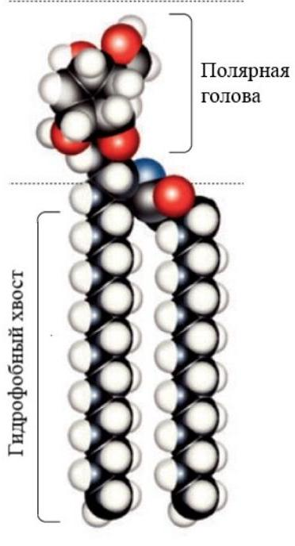
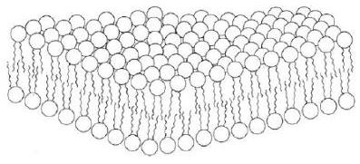
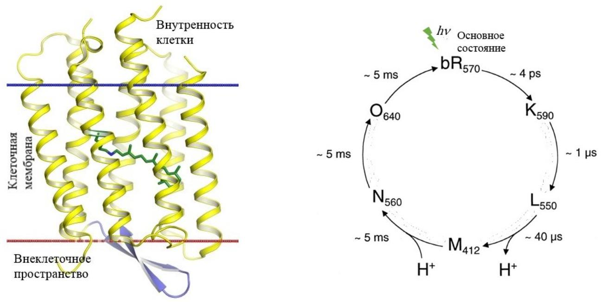
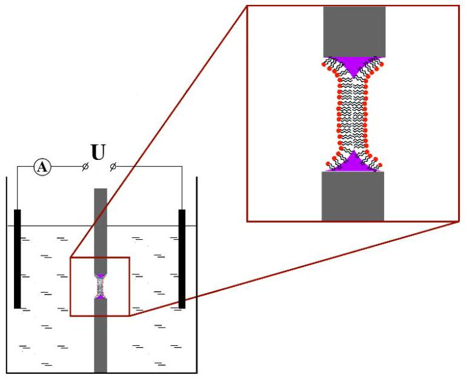
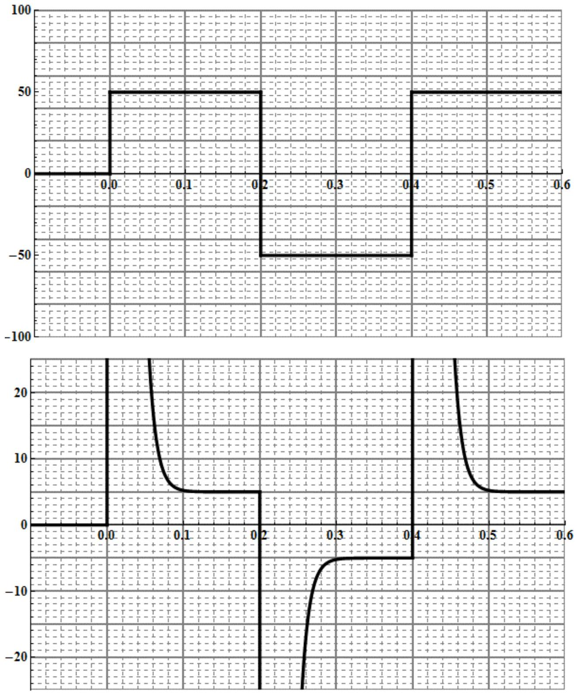
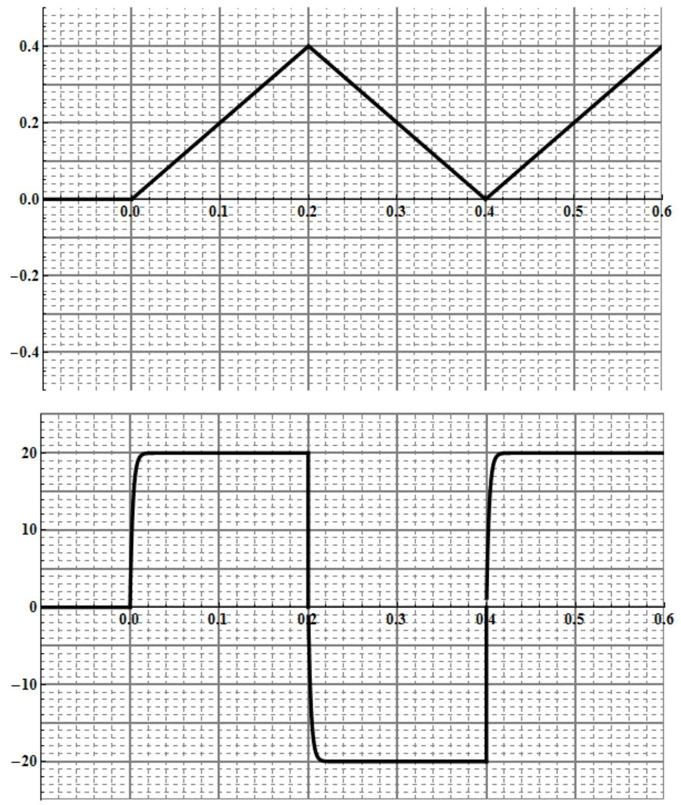
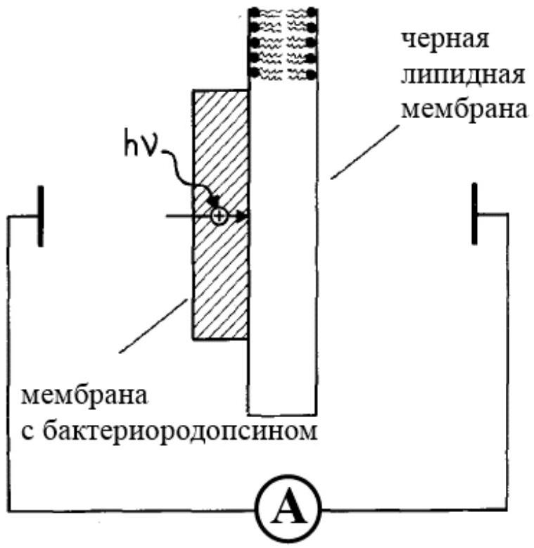
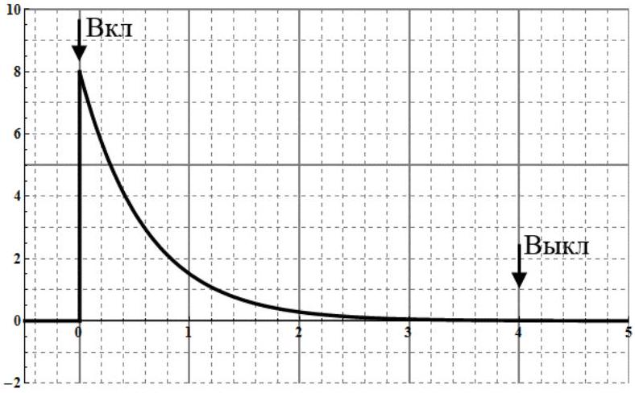
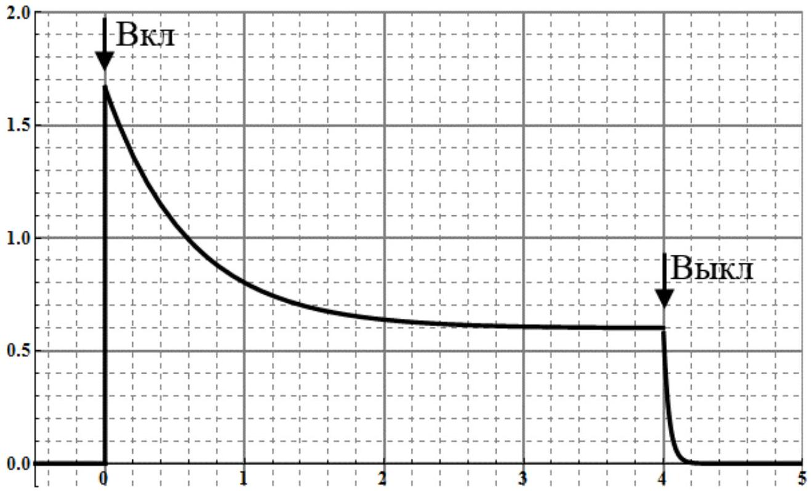
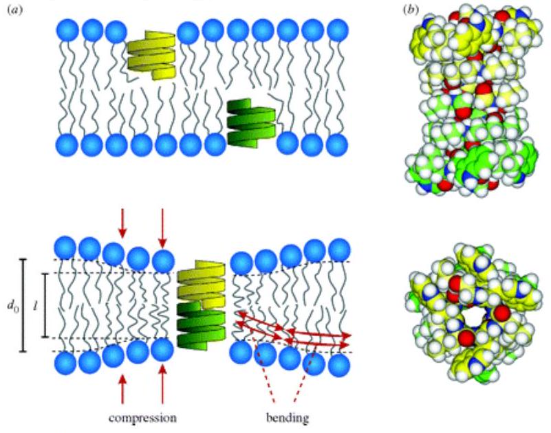

В этой задаче мы коснемся вопросов исследования фотоактивных мембранных белков. Эти исследования происходили на заре биофизики, в 1970-80-х годах. Везде, где в этой задаче требуется произвести численные оценки, вы можете использовать данные графиков и схем, приведенных в условии, а также результаты расчетов предыдущих пунктов задачи.
Для начала рассмотрим модель клеточной мембраны - липидный бислой. Молекула липида состоит из полярной головы и гидрофобных хвостов (остатки жирных кислот) (Рис. 1). Если молекулы липида попытаться растворить в воде (полярном растворителе), то они могут образовывать различные структуры, которые минимизируют энергию системы. Т.е. полярные головы молекул стремятся образовать контакты с водой, а гидрофобные хвосты - укрыться от воды.

Рис.1. Молекула липида

Липидный бислой - это тонкая полярная мембрана, состоящая из двух слоев липида (Рис. 2). Этот бислой, составляющий клеточную мембрану, позволяет удержать в клетке различные ионы, белки и другие молекулы.

Рис.2. Липидный бислой

Чтобы живая клетка могла существовать, ей нужно каким-либо образом производить энергию внутри себя. Например, клетка может поглощать молекулы сахара, расщеплять их и с помощью молекулярных механизмов запасать энергию в виде АТФ (Аденозинтрифосфа́т -универсальный источник энергии для всех биохимических процессов, протекающих в живых системах. АТФ является основным переносчиком энергии в клетке.). Но что делать, если питание сахарами недоступно? При исследовании бактерий, живущих в экстремально соленых водоемах (20\% соли), был обнаружен мембранный белок, бактериородопсин (Рис. 3).

Рис. 3. Молекула бактериородопсина. Рис. 4. Фотоцикл бактериородопсина

Бактериородопсин оказался фотоактивным протонным насосом. При поглощении фотона белок переносит один протон изнутри клетки наружу. При постоянной работе белка на клеточной мембране создается дополнительная разность потенциалов, которую бактерия может превратить в энергию и запасти ее в виде АТФ для своих нужд. Если эти бактерии механически разрушить, то можно выделить плоские куски мембран, содержащие бактериородопсин в большом количестве. Это рассматривается как альтернатива солнечным батареям, работающим на полупроводниковых элементах.
Бактериородопсин, поглотив фотон, проходит через ряд промежуточных состояний (совершает фотоцикл, Рис. 4).
Сначала он выбрасывает наружу протон $\mathrm{H}^{+}$(L - состояние), который находится внутри белка, а затем на его место приходит протон $\mathrm{H}^{+}$изнутри клетки (M состояние). И пока белок не вернулся в основное состояние, поглотить новый фотон он не может. На схеме буквами показаны промежуточные состояния, а также характерные времена перехода между ними.

А1 ${ }^{0.50}$ Пусть плоские куски мембран, содержащие бактериородопсин, освещаются достаточно мощным светом. Какой ток $I_{b R}$ течет через 1 мм ${ }^{2}$ таких мембран (в мкА/ММ ${ }^{2}$ )? Из исследования этих мембран методом электронной микроскопии известно, что плотность белковых молекул в них $9 \cdot 10^{12} \mathrm{~cm}^{-2}$

Для функционального исследования различных белков-ионных насосов используются различные модельные мембраны. Черная липидная мембрана (BLM) - одна из таких модельных систем (Рис. 5).
Экспериментальная установка представляет собой два раздельных резервуара с хорошо проводящим раствором. Между резервуарами сделано небольшое отверстие площадью $S_{m}=1 \mathrm{~mm}^{2}$. На это отверстие помещается липидный бислой. В оба резервуара помещаются электроды, которые соединяются между собой через амперметр и, в ряде случаев, источник. Липидная мембрана имеет электрические характеристики: емкость $C_{m}$ и проводимость $G_{m}\left(=1 / R_{m}\right)$, где $R_{m}$ - сопротивление мембраны. Вам предстоит определить их. Если источник подает периодический сигнал прямоугольной формы, то амперметр регистрирует затухающий сигнал (Рис. 6). Если же другой источник подает периодический сигнал треугольной формы, то амперметр регистрирует практически прямоугольный сигнал (Рис. 7). Амперметр можно считать идеальным.

Рис. 5. Схема установки, содержащей черную липидную мембрану

Рис. 6. Прямоугольный сигнал $U$ и сигнал амперметра $I$

Рис. 7. Треугольный сигнал $U$ и сигнал амперметра $I$

В1 ${ }^{0.50}$ Нарисуйте простейшую эквивалентную электрическую схему мембраны, которая хорошо описывает полученные результаты. Нарисуйте эквивалентную электрическую схему эксперимента, описанного выше.

В2 ${ }^{1.00}$ Используя Рис. 6 и 7, оцените емкость $C_{m}$ мембраны. С помощью формул, графиков и диаграмм объясните свое решение

В3 ${ }^{0.50}$ Используя Рис. 6 и 7, оцените проводимость $G_{m}$ мембраны. С помощью формул, графиков и диаграмм объясните свое решение.

Чтобы количественно характеризовать прокачку протонов белком, мембраны, содержащие бактериородопсин прикрепляют к черной липидной мембране (Рис. 8).
Мембраны с белком могут прикрепляться к черной мембране в произвольном направлении, т.е. вероятностно половина мембран качала бы протоны к черной мембране, а другая половина от мембраны. Таким образом мы бы не смогли увидеть никакого эффекта создания тока белком. Чтобы этого не происходило, к липидам черной мембраны добавляются заряженные молекулы, которые заставляют часть мембран с белком ориентироваться преимущественным образом. При дальнейших расчетах считайте, что ко всей поверхности черной мембраны (с одной стороны) прикреплены мембраны с бактериородопсином.

Рис. 8. Схема установки, где мембраны с белком прикреплены к черной мембране

С1 ${ }^{0.50}$ Пусть описанная система мембран освещается достаточно мощным светом, таким, что суммарный ток, создаваемый всеми белками постоянен и равен $I_{p}$, а через амперметр течет ток $I$. Нарисуйте эквивалентную электрическую схему для такого эксперимента.

С2 ${ }^{2.00}$ Получите теоретическое выражение для фототока $I(t)$, измеряемого амперметром, в зависимости от времени. Ответ выразите через суммарный ток белков $I_{p}$, электрические характеристики мембраны с белком $C_{p}$ и $G_{p}$ и электрические характеристики черной липидной мембраны $C_{m}$ и $G_{m}$. Начало отсчета времени $t=0$ возьмите в момент включения света.

В непосредственном эксперименте, описанном выше, измеренная зависимость фототока от времени получилась такой, как показано на Рис. 9. На рисунке отмечены времена включения и выключения света.
Анализируя Рис. 9, вы должны использовать результат пункта C2.

Если провести эксперимент аналогичный части В этой задачи, то отношение емкостей мембран с бактериородопсином и сплошных мембран, используемых для приготовления черной мембраны, будет $C_{p} / C_{m} \approx 5$

Рис. 9. Зависимость тока, текущего через амперметр, от времени

с3 ${ }^{0.50}$ Используя Рис. 9 и численные данные полученные ранее, оцените проводимость $G_{p}$ мембран с белком. С помощью формул, графиков и диаграмм объясните свое решение.

C4 ${ }^{0.20}$ Вычислите отношение проводимости черной липидной мембраны и мембран с белком, т.е. найдите $G_{m} / G_{p}$.
С5 ${ }^{0.50}$ Используя Рис. 9 и численные данные полученные ранее, оцените суммарный ток $I_{p}$, создаваемый белками. С помощью формул, графиков и диаграмм объясните свое решение.

C6 ${ }^{0.30}$ Рассчитайте, какая доля мембран $\alpha$ была ориентирована преимущественным образом на черной мембране. Найдите отношение количества белков, качающих протоны к мембране, к их общему количеству.

Чтобы исследовать насыщаемость тока, создаваемого белками, снималась зависимость фототока от времени при меняющейся интенсивности падающего света. При малых интенсивностях можно считать, что ток, создаваемый белками, $I_{p}$ пропорционален интенсивности падающего света.

Рис. 10. Зависимость тока, текущего через амперметр, от времени при изменяющейся интенсивности падающего света

D1 ${ }^{0.20}$ Используя результат пункта C4, сделав необходимые пренебрежения, нарисуйте эквивалентную электрическую схему эксперимента.
D2 ${ }^{1.00}$ Получите выражение для тока, создаваемого белками, $I_{p}(t)$, считая известным измеряемый амперметром фототок $I(t)$. Ответ выразите через фототок $I(t)$ и электрические характеристики мембран с белком и черной мембраны. Начало отсчета времени $t=0$ возьмите в момент включения света.

D3 ${ }^{1.30}$ Используя результат из пункта D2 и Рис. 10, численно постройте график зависимости тока $I_{p}$ от времени $t$. С точностью до коэффициента пропорциональности это будет график зависимости интенсивности падающего света от времени

Проводимость черной мембраны, оказывается можно менять с помощью, например, бактерицидного антибиотика, грамицидина $A$. Когда эти молекулы попадают в мембрану, они образуют в ней пору (Рис. 11), через которую могут проходить ионы натрия и калия, а также протоны.
Добавление этих молекул к мембране увеличило ее проводимость до $G_{m}^{G R}=10^{-8} \mathrm{Om}^{-1}$

Рис. 11. Модель молекулы грамицидина А

E1 ${ }^{1.00}$ В условиях эксперимента из части С этой задачи, но с увеличенной проводимостью черной липидной мембраны, перерисуйте Рис. 9. Т.е. схематично изобразите зависимость фототока $I^{G R}(t)$ от времени $t$, считая, что доля мембран с белком, ориентированных преимущественным образом, осталась той же, а мощности падающего света достаточно, чтобы все белки прокачивали протоны.

- Website in English

2020 - Мы те, кого должны превзойти.
