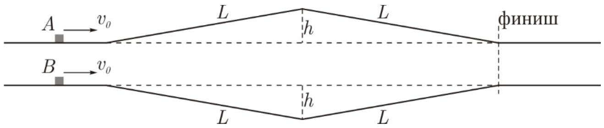

Тела $A$ и $B$ движутся по соседним трассам, длина $L$ подъема которых равна длине спуска. Высота $h$ горки и глубина $h$ впадины таковы, что $h \ll L$. Исходные скорости $v_{0}$ тел одинаковы и удовлетворяет условию: $v_{0}^{2} \gg g h$.

A1 ${ }^{3.00}$ Какое из тел раньше достигнет финиша? Найдите время $\Delta t$ запаздывания «медленного» тела на финише.
