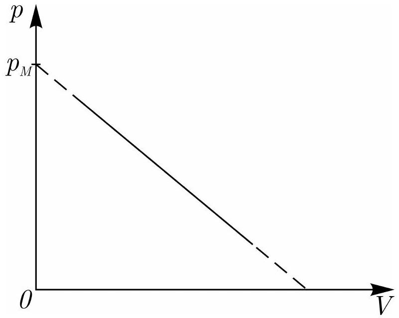

Идеальный многоатомный газ участвует в процессе, состояния которого изображены на рисунке точками на прямой $p=p_{M}(1-\alpha V)$, где $\alpha$ - некоторый постоянный коэффициент, $V$ - текущее значение объема. Молярная теплоемкость $C_{V}$ не зависит от температуры.

А1 ${ }^{2.00}$ При каком давлении $p_{0}$ теплоемкость газа обращается в ноль?
А2 ${ }^{3.00}$ В процессе участвуют идеальный газ Клаузиуса, его уравнением состояния

$$
p=\frac{R T}{V-b} .
$$

У какого из этих газов больше температура в точке, соответствующей максимальной теплоемкости? Вычислите разность температур $\Delta T$ для этих точек. Известно, что $b=44 \mathrm{~cm}^{3} /$ моль, $R=8.314$ Дж/(моль • К), $p_{M}=1.51$ МПа, $b \ll V_{M}$, где $V_{M}=p_{M} / \alpha$ - некоторый фиксированный объем.

АЗ ${ }^{2.00}$ К какому значению стремится молярная теплоемкость $C$ идеального многоатомного газа, участвующего в процессе, описанном в пункте A1, при стремлении объема к нулю?
