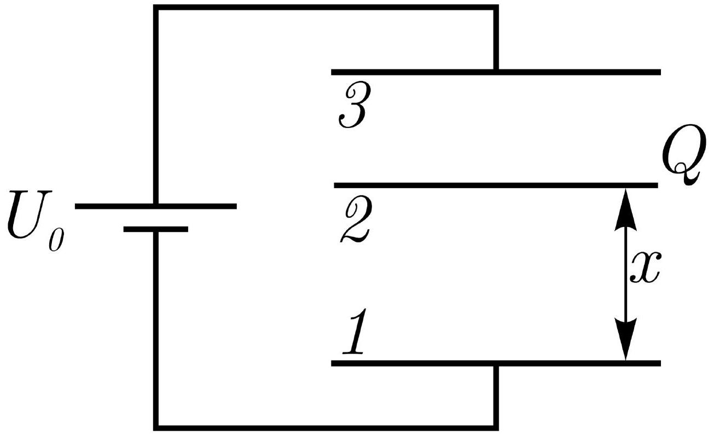
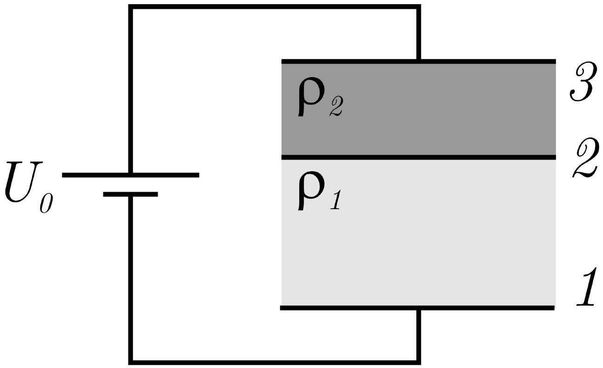

Заряд конденсатора
Между пластинами 1 и 3 плоского конденсатора поместили параллельно обкладкам конденсатора тонкую металлическую пластину 2 с зарядом $Q$ (Рис. 1). Конденсатор подключен к батарее с ЭДС равной $U_{0}$. Площади всех трёх пластин одинаковы и равны $S$, а расстояние между ними много меньше $\sqrt{S}$.

Рис. 1

А1 ${ }^{1.00}$ Найдите заряды на пластинах 1 и 3 конденсатора в зависимости от расстояния $x$ между пластинами 1 и 2.
А2 ${ }^{1.00}$ Какую работу $A$ нужно совершить, чтобы переместить пластину 2 от пластины 1 до пластины 3?
Пластину 2 разрядили, а объемы между пластинами заполнили диэлектрическими жидкостями (Рис. 2) с одинаковой диэлектрической проницаемостью $\varepsilon$ но с разными удельными сопротивлениями $\rho_{1}$ и $\rho_{2}$ ( $\rho_{1}<\rho_{2}$ ).

Рис. 2

А3 ${ }^{3.00}$ Найдите величину и направление силы, действующей на пластину 2 со стороны электрического поля.
