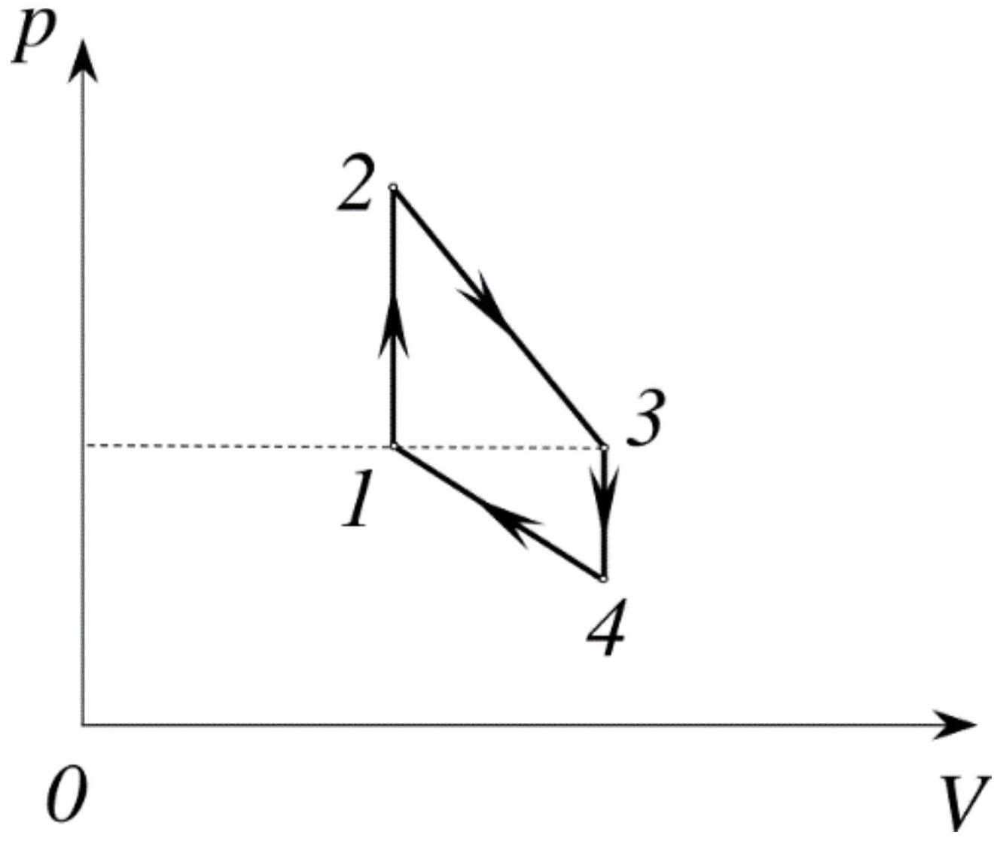

Моль идеального одноатомного газа участвует в циклическом процессе $1-2-3-4-1$, график которого представлен на рисунке. Давление в точках 1 и 3 равны. Температуры $T_{1}=4 T_{0} ; T_{2}=8 T_{0} ; T_{3}=6 T_{0} ; T_{4}=3 T_{0}$, где $T_{0}$ - известная величина. Универсальная газовая постоянная равна $R$.

А1 ${ }^{1.60}$ Вычислите работу газа $A$ за цикл.
А2 ${ }^{6,40}$ Найдите КПД цикла $\eta$.
