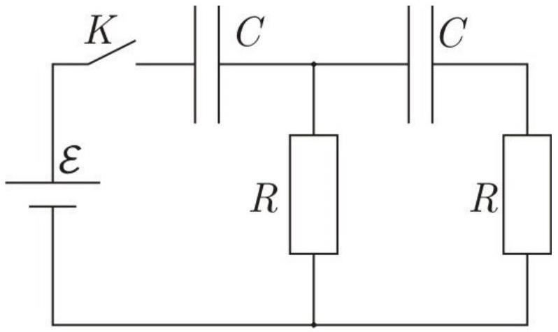

В электрической цепи, схема которой приведена на рисунке, вначале ключ разомкнут, заряд на конденсаторах отсутствует. ЭДС источника $\mathcal{E}=10 \mathrm{~B}$, сопротивления резисторов одинаковы и равны $R=1,0$ кОм, электроемкости конденсаторов одинаковы и равны $C=1,0$ мкФ. Источник тока идеальный. Ключ замыкают.

А1 ${ }^{1.60}$ Чему равна сила зарядного тока через каждый из конденсаторов сразу после замыкания ключа? Запишите формулы и приведите численные значения.

A2 ${ }^{1.60}$ Чему равны напряжения на конденсаторах через интервал времени $\tau=1,0$ с? Запишите формулы и приведите численные значения.
А3 ${ }^{4.00}$ Изобразите на одном графике качественно зависимость $U(t)$ напряжения от времени на каждом из четырех элементов цепи. Укажите на графике асимптоты и особые точки (пересечения с нулем и экстремумы) для каждой из зависимостей.

А4 ${ }^{2.80}$ Если хотя бы для двух разных зависимостей какие-либо из особых точек приходятся на один и тот же момент времени, определите соответствующие значения времени и напряжений. Точное решение является достаточно сложной задачей, поэтому вам необходимо использовать методы численных приближений. Допустимая погрешность - 10\%.
