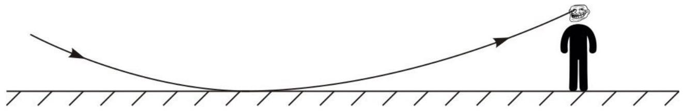

В жаркий летний день, когда воздух прогрелся до $t_{1}=35^{\circ} \mathrm{C}$ температура асфальт на солнце и тонкий слой воздуха над ним составила $t_{2}=65^{\circ} \mathrm{C}$. При ходьбе по шоссе в такую сухую погоду на дороге часто бывают видны «лужи». Показатель преломления воздуха линейно зависит от плотности воздуха: $n=1+k \rho$. При $t_{0}=0^{\circ} \mathrm{C}, n_{0}=1.000292$. Считайте, что рост человека $H=1.8$ м.

А1 ${ }^{5.00}$ На каком минимальном расстоянии $L_{\text {min }}$ можно увидеть «лужу»? Выразите ответ через $H, n_{0}, T_{0}, T_{1}, T_{2}$ и рассчитайте полученное значение.
