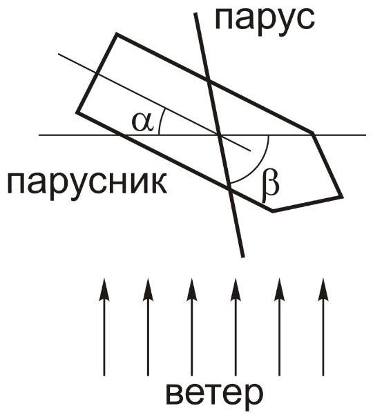

Известно, что на парусном судне можно двигаться против ветра (зигзагами). Средняя скорость движения парусника в направлении против ветра называется дрейфовой.

Указание: Примите скорость судна пренебрежимо малой по сравнению со скоростью ветра. Считайте парус плоским и совершенно не пропускающим воздух, так что налетающая струя воздуха передает парусу всю нормальную к нему составляющую своего импульса. Считайте, что парусник может двигаться только вдоль линии корма-нос, при этом сила сопротивления воды пропорциональная скорости.

