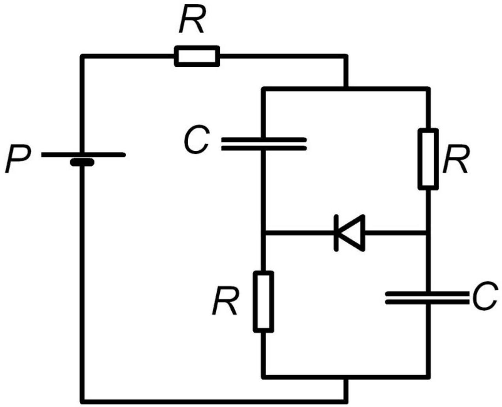

«Хитрый» источник обеспечивает постоянную мощность $P$ во внешней цепи.
A1 ${ }^{0.50}$ Найдите силу тока через источник и напряжение на нём в зависимости от времени, если его подключили к резистору с сопротивлением $R$.
A2 ${ }^{0.50}$ Найдите силу тока через источник и напряжение на нём в зависимости от времени, если его подключили к конденсатору ёмкости $C$.
Теперь к «хитрому» источнику подключили цепь, схема которой приведена на рисунке. $R=50 \mathrm{~m}, P=8$ Вт, напряжение открытия диода $U_{0}=2 \mathrm{~B}$.

В $1^{3.00}$ Найдите силу тока и напряжение на каждом элементе цепи в момент открытия диода.
В2 ${ }^{3.00}$ Будет ли достигнут установившийся режим? Если да, то рассчитайте силу тока и напряжение на каждом элементе цепи в установившемся режиме.
