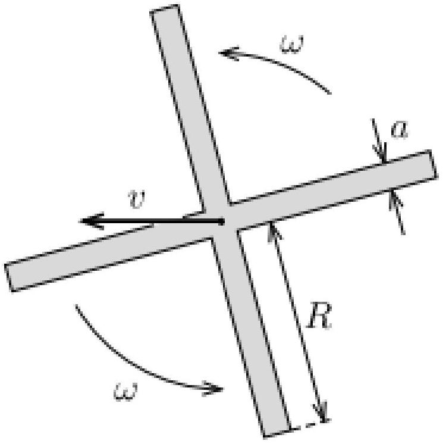

В этой задаче мы исследуем движение бумеранга. Его точное движение описать сложно, но при определенных допущениях мы сможем понять, почему бумеранг возвращается в точку броска.
Рассмотрим симметричный бумеранг крестообразной формы с однородным распределением массы. Полная масса бумеранга - $M$, длина и ширина лопастей -$R$ и $a \ll R$ соответственно. Толщиной бумеранга можно пренебречь по сравнению с этими величинами.
Бумеранг бросают так, что его плоскость вертикальна. В результате броска бумеранг начинает вращаться с угловой скоростью $\omega$ относительно оси симметрии, перпендикулярной плоскости бумеранга. Центр масс бумеранга начинает двигаться с горизонтальной скоростью $v$, лежащей в плоскости бумеранга.
Во время движения на лопасти бумеранга действует гидродинамическая сила. Эта сила перпендикулярна плоскости лопастей. Если бумеранг вращается так, как показано на рисунке, то эта сила направлена от нас. Гидродинамическая сила, действующая на малый элемент площади лопасти $\Delta A$ равна

$$
F=\gamma v_{\perp}^{2} \Delta A .
$$

где $v_{\perp}$ - компонента скорости воздуха относительно этого элемента площади, направленная перпендикулярно краю лопасти. Постоянная $\gamma$ пропорциональна плотности воздуха (которая считается постоянной) и зависит от формы бумеранга.
Возникновение данной гидродинамической силы обусловлено небольшим изгибом поверхности бумеранга, в результате чего налетающий на его поверхность воздух воздействует на поверхность в перпендикулярном ей направлении. Изгибом поверхности бумеранга в рамках данной задачи можно пренебречь. Также можно пренебречь силой тяжести и сопротивлением воздуха.

А1 ${ }^{2.50}$ Найдите полную гидродинамическую силу $\langle F\rangle$, действующую на бумеранг, усредненную по времени за один оборот. Выразите ответ через $v, \omega, R, a$ и $\gamma$.

A2 ${ }^{2.50}$ Найдите суммарный момент гидродинамических сил $\langle\vec{\tau}\rangle$, действующих на бумеранг, относительно его центра. Момент нужно усреднить по времени за один оборот. Выразите ответ через $v, \omega, R, a$ и $\gamma$. Укажите, как направлен усреднённый момент относительно направления вектора скорости его центра.

АЗ ${ }^{3.00}$ Чему должно быть равно отношение $v /(\omega R)$ в момент броска бумеранга, чтобы в течение последующего движения центр бумеранга двигался по горизонтальной круговой траектории?
Считайте, что период вращения бумеранга $2 \pi / \omega$ много меньше периода кругового движения центра масс. Это позволяет использовать найденные ранее усреднённые по периоду величины $\langle F\rangle$ и $\langle\vec{\tau}\rangle$.

А4 ${ }^{1.50}$ Выразите радиус $r$ траектории центра масс бумеранга через $\gamma$ и параметры бумеранга.
А5º.50 Предположим, что мы сделали два похожих бумеранга из одинакового материала, таких, что каждый размер одного из них в два раза меньше соответствующего размера второго. Чему равно отношение радиусов $r_{2} / r_{1}$ их круговых траекторий?
