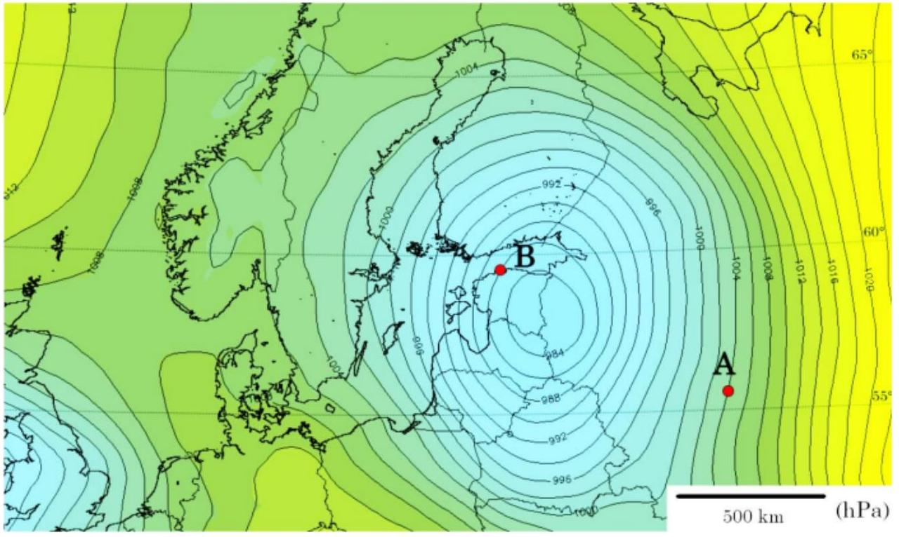
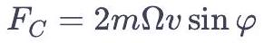
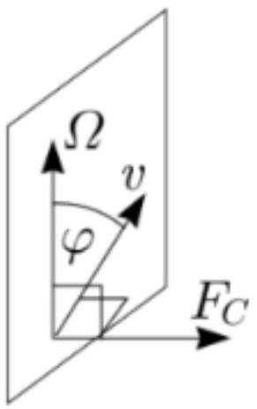

На карте ниже изображены изобары (для одной и той же высоты, примерно на уровне моря). Считайте, что диаграмма изобар стационарна (медленно меняется во времени).

А1 ${ }^{1.00}$ Схематично изобразите направление ветра в точках $A$ и $B$.
А2 ${ }^{2.00}$ Оцените скорость ветра $v_{A}$ в точке $A$. Считайте изобары прямыми в районе этой точки. Плотность воздуха $\rho=1.23$ кг/м ${ }^{3}$.
А3 ${ }^{3.00}$ Оцените скорость ветра $v_{B}$ в точке $B$.
Примечание: Когда тело массы $m$ (например, слой воздуха) движется со скоростью $v$ во вращающейся системе отсчета (вращается с угловой скоростью $\Omega$ ), на него действует некая фиктивная сила, которая называется силой Кориолиса:

