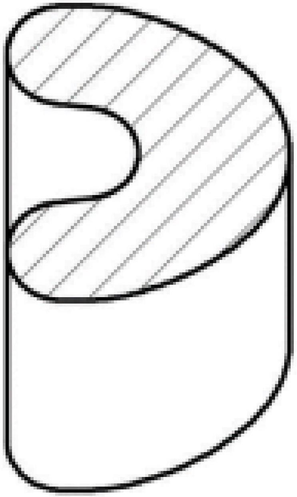

Цилиндрический сосуд высотой $H=50 \mathrm{~cm}$ с зеркальными стенками заполнен прозрачной жидкостью, показатель преломления которой уменьшается с высотой по линейному закону. Вблизи дна цилиндра находится точечный источник света мощностью $P=100$ Вт. Показатель преломления жидкости вблизи дна равен $n_{1}=1.50$, а у поверхности $n_{2}=1.44$. Дно сосуда и его крышка покрыты веществом, которое поглощает всё излучение, попавшее на него

А1 Какая мощность излучения $P_{\text {д }}$ поглощается дном цилиндра?
А2 Допустим, некоторый луч проходит вблизи крышки цилиндра. Каков при этом радиус кривизны $R_{\text {кр }}$ этого луча?
А3 Каков радиус кривизны $R_{\text {д }}$ этого же луча непосредственно вблизи источника?
