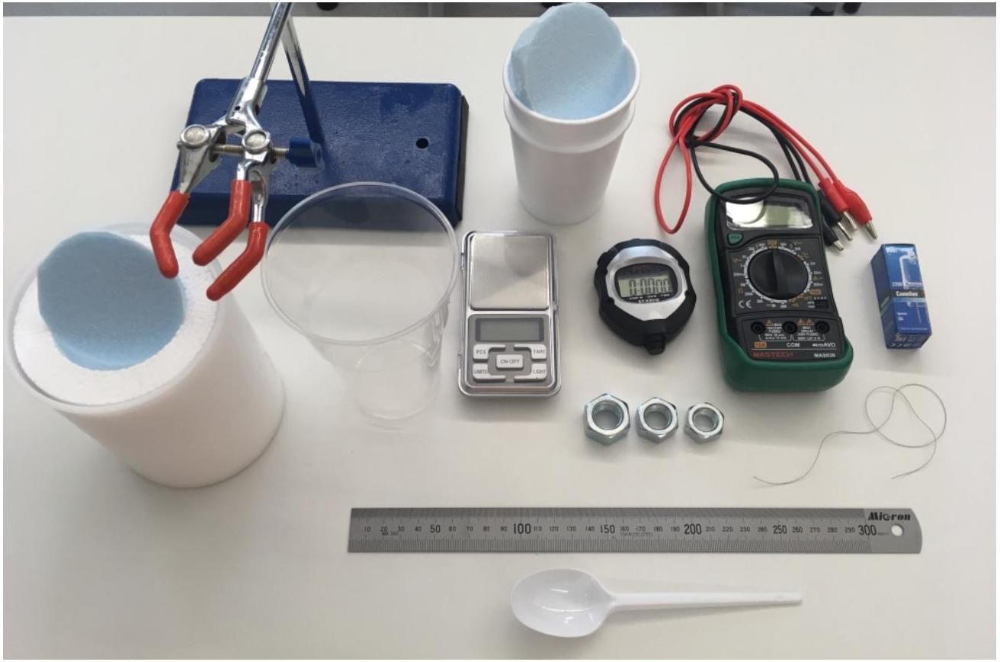
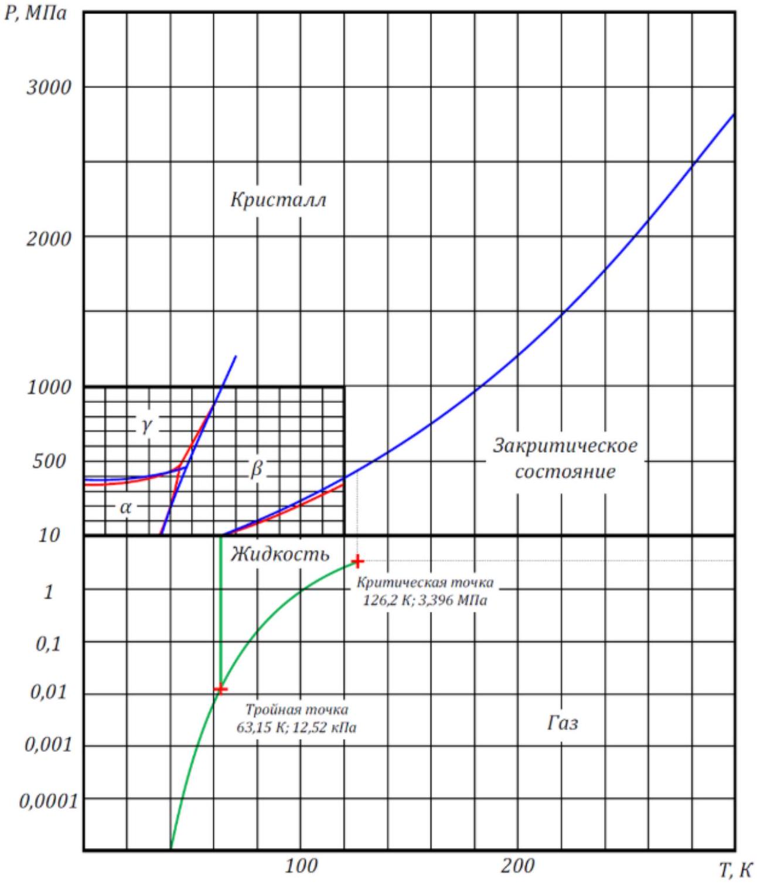

Основные результаты данной работы носят оценочный характер и поэтому оценку погрешностей можно не делать.
В настоящей экспериментальной работе вам предстоит исследовать некоторые свойства жидкого азота, а также особенности поведения веществ при низких температурах (вплоть до температуры кипения жидкого азота). Для выполнения работы вам может потребоваться следующее оборудование (см. рисунок):

два стакана из вспененного полистирола с теплоизолирующей крышкой (в них можно наливать воду и азот);
толстостенный пенопластовый стакан с крышкой (термостат) для жидкого азота;
вода, лёд (по требованию);
жидкий азот (по требованию);
стальные гайки разной массы;
электронные весы;
цифровой секундомер;
мультиметр с проводами;
галогенная лампа накаливания с вольфрамовой нитью;
штатив с лапкой;
пластиковый стакан для слива использованной воды;
пластиковая ложечка;
бумажные полотенца или салфетки (по требованию);
нитки;
линейка;
штангенциркуль, ножницы (по требованию).
Жидкий азот - криогенная жидкость: при атмосферном давлении температура кипения жидкого азота составляет около $-196^{\circ} \mathrm{C}$ ! Азот, налитый в пенопластовый стакан (термостат), испаряется за счет теплообмена с окружающей средой через стенки термостата, и его масса уменьшается с некоторой скоростью. Если для проведения необходимых измерений в азот опустить образец (гайку, галогенную лампу), начальная температура которого существенно выше температуры жидкого азота, то начнется бурное кипение, которое будет продолжаться до тех пор, пока образец не охладится до температуры кипения азота. Признаком завершения процесса охлаждения образца может служить кратковременный выброс из термостата некоторой дополнительной порции газообразного азота. Это связано с исчезновением газообразной прослойки между охлаждающимся образцом и жидким азотом. Не забывайте, что во время и после охлаждения образца азот испаряется также за счёт теплоподвода через стенки термостата.

При работе с жидким азотом будьте особенно осторожны!
Избегайте попадания жидкого азота на открытые части тела и одежду!
По требованию жидкий азот будет вам выдан не более двух раз в объеме не более 100 мл за один раз. Азот выдается в течение 5 минут после запроса. Азот выдается в ваш толстостенный пенопластовый стакан.

Справочные данные, константы:
Плотность воды: $\rho_{0}=1$ г/см ${ }^{3}$;
Удельная теплота плавления льда: $\lambda_{0}=334$ Дж/г;
Универсальная газовая постоянная: $R=8.31$ Дж/(моль • К);
Число Авогадро: $N_{A}=6.02 \cdot 10^{23}$ моль $^{-1}$;
Молярная масса молекулярного азота ( $\left.N_{2}\right): \mu_{N}=28$ г/моль;
Молярная масса воздуха: $\mu_{в}=29$ г/моль;

Молярная масса железа: $\mu_{F e}=56$ г/моль;
Газокинетический диаметр молекул воздуха: $d \sim 3 \cdot 10^{-8}$ см;

Температура кипения жидкого азота при нормальном давлении: $T_{N}=77.4$ К;
Нормальное атмосферное давление: $P_{0}=0.1013$ МПа;

Тройная точка азота: $T_{\text {тр }}=63.15$ К, $P_{\text {тр }}=12.53$ кПа.
На рисунке ниже приведена полная фазовая ( $T, P$ )-диаграмма азота:

Вам могут потребоваться также значение температуры и атмосферного давления в аудитории, в которой вы проводите эксперимент: атмосферное давление сегодня $P_{\text {атм }}=760 \mathrm{мм}$. рт. ст. (1 мм. рт. ст. $\approx 133$ Па); комнатная температура $t_{\text {комн }}=24^{\circ} \mathrm{C}$.

Часть А. Плотность жидкого азота
А1 ${ }^{1.00}$ Определите плотность $\rho_{N}$ жидкого азота. Опишите метод; результаты измерений и расчетов занесите в лист ответов.
Часть В. Скорость испарения жидкого азота
Налейте жидкий азот в термостат, прикройте его крышкой и поставьте на весы (азота должно быть такое количество, чтобы весы не «зашкаливали»).
В $1^{3.00}$ Снимите зависимость $m(t)$ массы термостата с азотом от времени и по графику зависимости $m(t)$ определите среднюю скорость испарения азота $\varphi=\Delta m_{N} / \Delta t$ за время измерения $t \sim 7-10$ мин.

Часть С. Теплота парообразования жидкого азота
С1 ${ }^{1.00}$ Предложите методику для определения удельной теплоты парообразования жидкого азота. С помощью рисунков, схем и формул объясните свои действия.

C2 ${ }^{2.00}$ Проведите измерения и рассчитайте значение удельную теплоту парообразования жидкого азота $r_{N}$.
Известно, что температура $T$ фазового перехода 1 -го рода (плавление, кипение) зависит от внешнего давления $P$. Эта зависимость выражается формулой Клапейрона-Клаузиуса, которая определяет угол наклона касательной в каждой точке кривой равновесия двух фаз на фазовой $(T, P)$-диаграмме (см. рис.):

$$
\frac{d P}{d T}=\frac{q_{12}}{T\left(v_{2}-v_{1}\right)},
$$

где $q_{12}$ - удельная теплота фазового перехода $1 \rightarrow 2, v_{1}$ и $v_{2}$ - удельные объёмы фаз 1 и 2, соответственно.
С3 ${ }^{1.00}$ С помощью уравнения Клапейрона-Клаузиуса, используя справочные данные и данные фазовой ( $\mathrm{T}, P$ )-диаграммы азота, сделайте теоретическую оценку величины $r_{\text {теор }}$ удельной теплоты парообразования жидкого азота, считая её постоянной в интервале температур от тройной точки до $\sim 100$ К. В лист ответов занесите рабочую формулу для расчёта $r_{\text {теор }}$ и его численное значение.

C4 ${ }^{0.20}$ Сравните теоретическое значение теплоты испарения азота с экспериментальным. Результат сравнения отразите в листе ответов в виде отношения $r_{N} / r_{\text {теор }}$. Сделайте вывод.

Часть D. Температура Эйнштейна для стали (железа)
Если при комнатных температурах (и выше) теплоёмкость твёрдого тела является величиной практический постоянной, то при низких температурах наблюдается сильная зависимость теплоёмкости от температуры, причём, при абсолютном нуле, как известно, теплоёмкости всех тел стремятся к нулю. Согласно модели Эйнштейна, хорошо работающей на практике, температурную зависимость молярной теплоёмкости тела можно представить в виде:

$$
C(T)=3 R\left(\frac{\Theta_{\ni}}{T}\right)^{2} \frac{e^{\Theta_{\ni} / T}}{\left(e^{\Theta_{\ni} / T}-1\right)^{2}}
$$

где $\Theta_{Э}$ - характеристическая температура Эйнштейна разная для разных тел. Обычно температура Эйнштейна составляет несколько сотен кельвинов.
D1 ${ }^{1.50}$ Определите экспериментально количество теплоты $Q_{\text {экс, }}$ которое получает стальная гайка при нагреве от азотной $T_{N}$ до температуры $T_{0}$ тающего льда.

D2 ${ }^{1.50}$ Используя формулу теплоёмкости Эйнштейна, получите теоретическое значение $Q_{\text {теор. }}$. При расчетах считайте, что $e^{\Theta_{Э} / T_{N}} \gg e^{\Theta_{Э} / T_{0}}>1$.
D3 ${ }^{2.00}$ Подберите значение температуры Эйнштейна $\Theta_{Э}$, при котором наилучшим образом выполняется равенство: $Q_{\text {экс }}=Q_{\text {теор }}$.
Часть Е. Коэффициент теплопроводности пенопласта
Поток тепла через плоскую стенку толщиной $\delta$ для стационарного случая определяется законом теплопроводности Фурье:

$$
j=-\kappa \frac{\Delta T}{\delta}
$$

,
где $j$ - плотность мощности теплового потока (поток тепла в единицу времени через единичную перпендикулярную площадку), $\Delta T$ - перепад температур, $\kappa$ - коэффициент теплопроводности вещества (в нашем случае - пенопласта).

Е1 ${ }^{1.00}$ С помощью рисунков, схем, формул опишите методику для оценки величины коэффициента теплопроводности $\kappa$ пенопласта при перепаде температур от комнатной $T_{\text {комн }}$ до температуры кипения жидкого азота $T_{N}$.

E2 ${ }^{1.50}$ Проведите измерения и оцените величину коэффициента теплопроводности $\kappa$ пенопласта.
E3 ${ }^{0.50}$ Определите коэффициент теплопроводности воздуха при комнатных условиях, рассчитав его по газокинетической формуле: $\kappa_{\text {возд }}=\frac{1}{3} \rho c_{V} \lambda v_{T}$, где $\rho$ - плотность воздуха, $c_{V}$ - удельная теплоёмкость воздуха при постоянном объёме, $\lambda$ - длина свободного пробега молекул воздуха, $v_{T}$ - скорость теплового движения молекул.

E4 ${ }^{0.30}$ Сравните коэффициент теплопроводности пенопласта с коэффициентом теплопроводности воздуха при комнатных условиях.
Часть F. Электросопротивление вольфрама при высоких и низких температурах
Для выполнения заданий этого пункта вам могут потребоваться некоторые характеристики имеющейся в вашем оборудовании галогенной лампы накаливания с цоколем G4: рабочее напряжение лампы: $U=220$ В; номинальная мощность лампы: $W=35$ Вт; температура нити накала в рабочем режиме: $T_{\mathrm{p}} \approx 3000^{\circ} \mathrm{C}$.

Известно, что сопротивление металлов в достаточно широком интервале температур изменяется по линейному закону: $R(t)=R_{0}(1+\alpha t)$, где $R_{0}-$ сопротивление при температуре $0^{\circ} \mathrm{C}, \alpha$ - температурный коэффициент сопротивления, $t$ - температура по шкале Цельсия.

F1 ${ }^{1.00}$ Оцените температурный коэффициент сопротивления $\alpha$ вольфрама, измерив сопротивление $R\left(t_{\text {комн }}\right)$ спирали лампы при комнатной температуре и при температуре тающего льда $R_{0}$. С помощью рисунков, схем, формул поясните, как вы это делаете.

F2 ${ }^{1.00}$ Экстраполируя линейную зависимость с полученным значением $\alpha$ в область высоких температур, выясните, «работает» ли линейная зависимость $R(t)$ вплоть до рабочей температуры лампы $\sim T_{\mathrm{p}}$. С помощью рисунков, схем, формул поясните, как вы это проверяете.

F3 ${ }^{1.50}$ Экстраполируя линейную зависимость с полученным значением $\alpha$ в область низких температур, выясните, «работает» ли линейная зависимость $R(t)$ при низких температурах (вплоть до азотной температуры $\sim T_{N}$ ). помощью рисунков, схем, формул поясните, как вы это проверяете.
