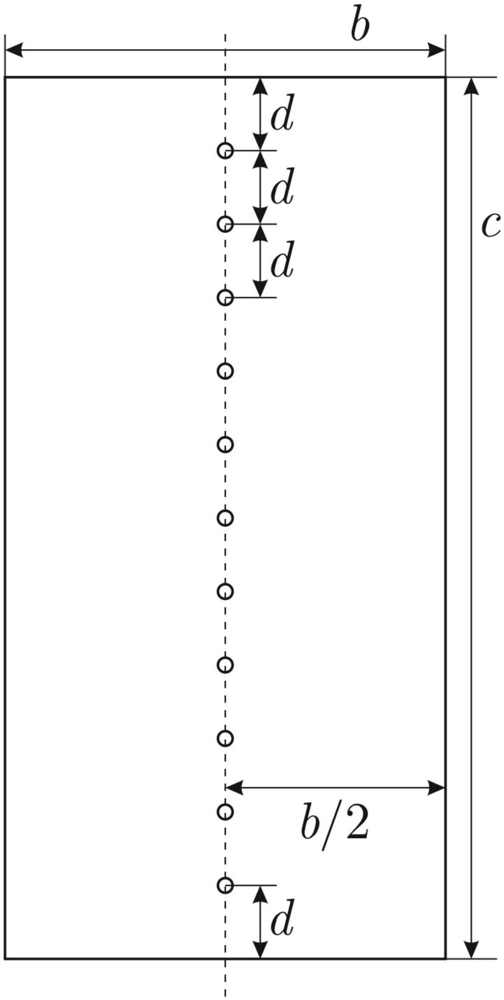

Оборудование: пластина с неизвестными размерами, булавка, струбцина, секундомер, брусок (в качестве линейки без делений).

А1 ${ }^{10.00}$ По середине однородной пластины находятся отверстия. Они расположены на равном расстоянии друг от друга (и от границ, см. рис). Определите как можно точнее ширину пластины $b$ и длину пластины $c$. Для измерений используйте только измерительные приборы, указанные в оборудовании. Ускорение свободного падения $g=9.8 \mathrm{~m} / \mathrm{c}^{2}$.
