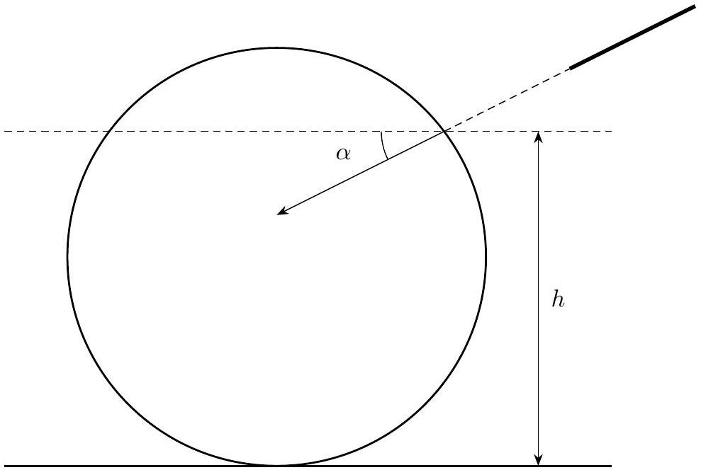
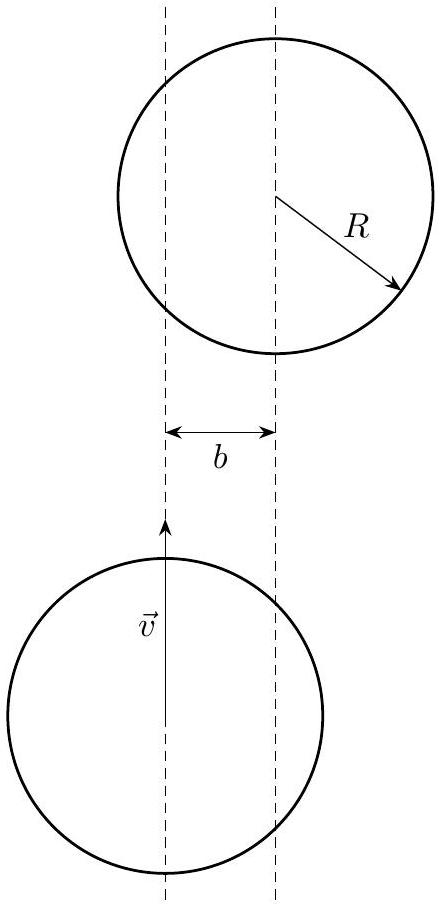
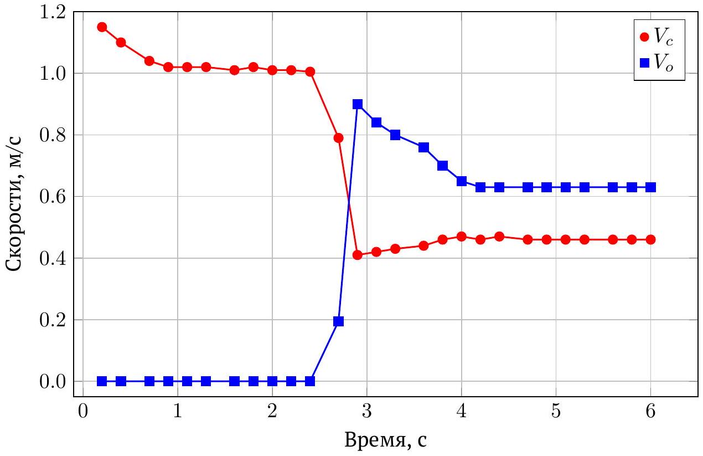

## Road to IPhO

## Физика бильярдных шаров

Бильярд - собирательное название нескольких настольных игр с различными правилами, в которых игрок использует деревянный стержень - кий для передвижения шаров по поверхности стола. Опытный игрок в бильярд знает, насколько важны для правильной игры физические характеристики шаров и кия и как во время игры можно использовать законы физики в свою пользу. В этой задаче мы исследуем некоторые сюжеты, связанные с физикой бильярдных шаров.

Во всех пунктах мы считаем бильярдный шар однородным телом радиуса $R$ с моментом инерции $I=\frac{2}{5} m R^{2}$ относительно любой оси, проходящей через центр.

## Часть A. Sweet spot (1.5 балла)

После удара кием о шар в общем случае шар может потерять часть своей начальной скорости, пока устанавливается движение, за счет трения при проскальзывании. Однако, хорошим игрокам в бильярд известна точка («sweet spot»), при ударе в которую шар не будет терять скорости при движении.

Будем считать, что удар по шару сосредоточен в некоторой точке на высоте $h$ от стола; кий при этом ориентирован под углом $\alpha$ к поверхности стола $(-\pi / 2 \leq \alpha \leq \pi / 2$, см. рис.). Считайте, что сила удара такова, что при любых $\alpha$ шар не отрывается от стола. Трением о поверхность в этом пункте можно пренебречь.

А1 Определите, при каком соотношении между $h$ и $\alpha$ после удара шар будет двигаться без проскальзывания. 1.0

A2 Нарисуйте (качественно) график зависимости $\alpha(h / R)$ с указанием точек, соответствующих $\alpha=0$ и $h=R$. $\mathbf{0 . 5}$

## Road to IPhO

Часть В. Столкновение бильярдных шаров на столе (4.5 балла)
В этой части задачи рассматривается столкновение двух бильярдных шаров. Трением между шарами при столкновении можно пренебречь, а удар - абсолютно упругий. Для начала также пренебрежем и трением о стол.

Пусть бильярдный шар («биток») налетает на такой же покоящийся со скоростью $\vec{v}$; относительный прицельный параметр (величина, отмеченная на рис.) равен $\frac{b}{R}<2$.

В1 Найдите скорости шаров после разлёта (модули и направления). 1.0

В2 Какой угол образуют скорости шаров после разлёта в такой модели? 0.5

Простое предсказание, полученное в предыдущем пункте и часто используемое игроками в бильярд как эмпирическое правило, значительно меняется при учёте трения о поверхность стола. Особенно заметно влияние его на движение «битка».

B3 Рассмотрим вспомогательную задачу: шар на горизонтальном столе в начальный момент имеет поступательную скорость $\vec{v}=\binom{v_{x}}{v_{y}}$ и угловую скорость $\vec{\omega}=\binom{\omega_{x}}{\omega_{y}}$ (вектора $\vec{v}$ и $\vec{\omega}$ лежат в плоскости стола). Имеется трение о поверхность, которое прекращается, как только исчезает проскальзывание. Какова будет установившаяся скорость шара (модуль и направление)?
В4 Вернемся к столкновению двух шаров; пусть до удара «биток» двигался без проскальзывания. Под какими углами к начальной скорости теперь направлены установившиеся скорости шаров?
В5 Определите угол $\varphi$ между установившимися скоростями шаров как функцию прицельного параметра $\frac{b}{R}$. 0.5
B6 Нарисуйте качественный график зависимости $\varphi(b / R)$. 0.5

## Road to IPhO

Часть С. Анализ экспериментальных данных (2 балла)
Обратимся к экспериментальным данным, чтобы проверить рассмотренные нами модели. С помощью высокоскоростной съемки была получена зависимость скорости двух сталкивающихся шаров от времени; на графике обозначено $V_{c}$ - скорость «битка» (cue ball), $V_{o}$ - скорость изначально неподвижного шара (object ball).

С1 Определите коэффициент трения скольжения. Оцените погрешность полученного значения. 0.5

C2 Оцените относительные потери энергии при столкновении шаров. 0.5

C3 Определите относительный прицельный параметр $b / R$ для столкновения, используя данные для обоих 1.0 шаров. Оцените погрешность полученного значения.

Часть D. Модуль Юнга материала бильярдного шара (2 балла)
Известно, что сила $F$, действующая между двумя телами сферической формы, прижатыми друг к другу, зависит от деформации (расстояния, на которое сближаются центры шаров) $h$ как (формула Герца)

$$
F=k E R^{1 / 2} h^{3 / 2},
$$

где $k$ - численный коэффициент, $k \approx 1, E$ - модуль Юнга материала, из которого сделаны шары, $R$ - радиус шара.

D1 Рассмотрим центральный удар ( $b=0$ ) двух одинаковых шаров массы $M$. Первый шар налетает на второй 1.5 со скоростью $V$. Считая скорость налетающего шара много меньшей скорости звука в материале шара, найдите время столкновения $\tau$ и максимальную деформацию $h_{\mathrm{m}}$.

Указание: считайте известным значение интеграла

$$
\int_{0}^{1} \frac{\mathrm{~d} x}{\sqrt{1-x^{5 / 2}}} \approx 1.5
$$

D2 Оцените модуль Юнга материала шара, исходя из экспериментальных значений: $\tau=310$ мкс, $V=7.0$ м/с, $\mathbf{0 . 5}$ $M=280$ г, $R=6.8$ см.
