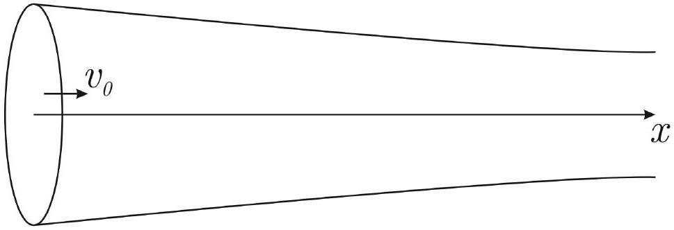
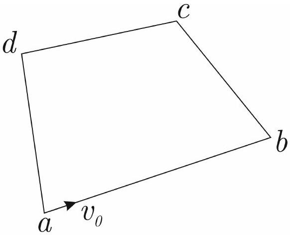

## Road to IPhO

## Газовый четырехугольник

Часть А. Движение газа вдоль трубы переменного сечения (5 баллов)
В этой части задачи газ молярной массы $\mu$ стационарно движется по прямолинейной горизонтальной трубе без трения о её стенки. Входные параметры газа $v_{0}, T_{0}, S_{0}, \rho_{0}$, а также $C_{p}$ считайте заданными. Также считайте любое сечение симметричным и пренебрегайте составляющими скорости, которые перпендикулярны оси симметрии.

А1 Пусть труба адиабатически изолирована. Получите зависимость скорости газа от его температуры. 0.8

А2 Покажите, что при течении газа выполняется соотношение 0.7

$$
v \frac{\mathrm{~d} v}{\mathrm{~d} x}=-\frac{1}{\rho} \frac{\mathrm{~d} P}{\mathrm{~d} x} .
$$

A3 Теперь к любому участку трубы длиной $L$ подводится тепловая мощность $N=k L$. Получите выражение 0.5 для скорости газа как функцию от $x$ и $T$.

A4 Теперь и температура газа линейно зависит от $x$ по закону $T=T_{0}+\alpha x$. Покажите, что газ движется по $\mathbf{0 . 5}$ трубе равноускоренно и найдите это ускорение $a$.

А5 Получите уравнение политропного процесса с постоянной молярной теплоёмкостью $C$ в координатах $\mathbf{0 . 5}$ $(P, \rho)$.

A6 Покажите, что в условиях пункта A4 газ движется так, будто бы находится в политропном процессе. 1.2

А7 Получите выражение для плотности газа как функцию $x$. 0.8

Часть В. Замкнутая труба (5 баллов)
Рассмотрим четырёхугольник $a b c d$, по которому стационарно движется некоторая масса газа. Введём обозначения: $a b=L_{1}, b c=L_{2}$, $c d=L_{3}, d a=L_{4}$. На участке $a b$ :

$$
\frac{\mathrm{d} T}{\mathrm{~d} x}=A, \quad \frac{\mathrm{~d} N}{\mathrm{~d} x}=\alpha ;
$$

на участке $b c$ :

$$
\frac{\mathrm{d} T}{\mathrm{~d} x}=B, \quad \frac{\mathrm{~d} N}{\mathrm{~d} x}=\beta ;
$$

$v_{a}, S_{a}, T_{a}, \rho_{a}, \mu, C_{P}, \alpha$ и $A$ считайте заданными. Для участка $c d$ :

$$
\frac{\mathrm{d} T}{\mathrm{~d} x}=-A, \quad \frac{\mathrm{~d} N}{\mathrm{~d} x}=-\alpha
$$

и для $d a$ :

$$
\frac{\mathrm{d} T}{\mathrm{~d} x}=-B, \quad \frac{\mathrm{~d} N}{\mathrm{~d} x}=-\beta .
$$

Ось $x$ направлена для каждой трубы от первой точки участка ко второй (например, для $a b$ от $a$ к $b$ ).

## Road to IPhO

| B1 | Найдите массовый расход газа $\dot{m}$. | 0.1 |
| :--- | :--- | :--- |
| B2 | Найдите теплоты $\delta Q_{a b}, \delta Q_{b c}, \delta Q_{c d}, \delta Q_{d a}$, полученные порцией газа массой $\mathrm{d} m$ на данных участках четырехугольника. Ответы могут быть выражены через $v_{a}, S_{a}, T_{a}, \rho_{a}, \mu, C_{P}, \alpha, A, L_{1}, L_{2}, L_{3}, L_{4}$ и $\mathrm{d} m$. | 0.8 |
| B3 | Получите $\beta$ и $B$ через $v_{a}, S_{a}, T_{a}, \rho_{a}, \mu, C_{P}, \alpha, A, L_{1}, L_{2}, L_{3}, L_{4}$. | 1.0 |
| B4 | Докажите, что для стационарности такой системы необходимо, чтобы молярная теплоёмкость газа была постоянна в течении всего цикла. | 1.5 |
| B5 | Найдите ускорения $a_{a b}$ и $a_{b c}$ через $v_{a}, S_{a}, T_{a}, \rho_{a}, \mu, C_{P}, \alpha, A, L_{1}, L_{2}, L_{3}, L_{4}$. | 0.7 |
| B6 | Найдите скорости $v_{b}, v_{c}$ и $v_{d}$ через $v_{a}, S_{a}, T_{a}, \rho_{a}, \mu, C_{P}, \alpha, A, L_{1}, L_{2}, L_{3}, L_{4}$. | 0.5 |
| B7 | Найдите минимальное время $t$, через которое газ возвращается в начальное положение. Ответ выразите через скорости в точках пересечения труб и ускорения в трубах (пункт не оценивается, если не выполнены B5 и B6). | 0.2 |
| B8 | Найдите массу газа в трубе. Ответ выразите через $\dot{m}$ и $t$ (пункт не оценивается, если не выполнены В5 и B6). | 0.2 |
