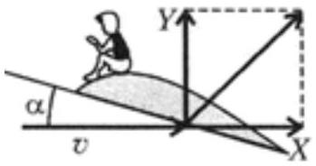
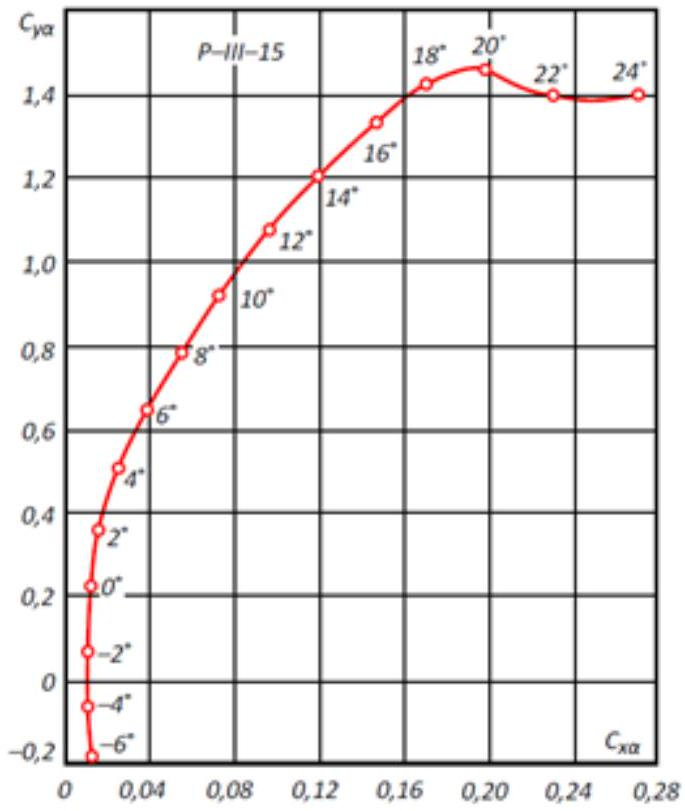
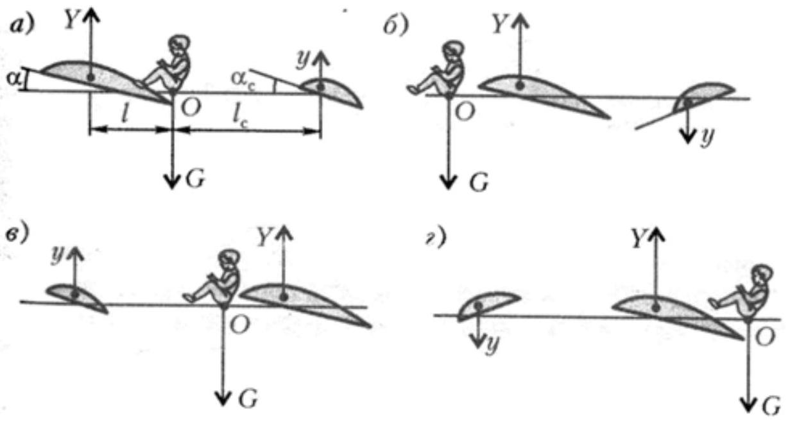

Часть А. Аэродинамическая сила, планирование, полет
На тело, равномерно движущееся в среде (например, крыло самолёта в воздухе), действует аэродинамическая сила $F_{\mathrm{A}}$. Из общих соображений понятно, что величина этой силы зависит от скорости среды относительно тела $v$, плотности среды $\rho$ и размера тела $L$. То есть $F_{\mathrm{A}}=c \rho^{p} v^{q} L^{r}$, где $c$ - некоторый коэффициент.

А1 ${ }^{0.20}$ Найдите степени $p, q, r$.
Аэродинамическую силу $F_{\mathrm{A}}$ принято раскладывать на две составляющие: подъёмная сила $Y=c_{y} \rho^{p} v^{q} L^{r}$ направлена перпендикулярно вектору скорости, сила сопротивления $X=c_{x} \rho^{p} v^{q} L^{r}$ направлена вдоль вектора скорости (рис. 1). Здесь мы ввели безразмерные коэффициенты: $c_{y}$ - коэффициент подъемной силы, $c_{x}$ - коэффициент сопротивления, которые зависят от формы тела и направления скорости относительно тела.

А2 ${ }^{0.30}$ Для некоторого самолёта при горизонтальном полёте оказалось $K=c_{y} / c_{x}=15$. Определите, чему в этом случае равна сила тяги $F$, направленная горизонтально, если масса самолёта $m=15$ т, ускорение свободного падения $g=9.8 \mathrm{~m} / \mathrm{c}^{2}$.

Коэффициенты $c_{x}$ и $c_{y}$ зависят от угла атаки - угла, между плоскостью крыла и направлением скорости (рис. 1). Эту зависимость можно отобразить на параметрическом графике, где разные точки кривой соответствуют разным углам атаки, а по осям отложены $c_{x}$ и $c_{y}$.

А3 ${ }^{1.00}$ С помощью указанного графика (рис. 2), определите, на какое максимальное расстояние $S$ по горизонтали может переместиться самолёт при планировании, если по вертикали он опустится на расстояние $H=1$ кМ. При планировании двигатели самолёта выключены, то есть сила тяги равна нулю, а скорость самолета постоянна.

В момент прямолинейного разбега самолёта при взлёте его скорость направлена горизонтально, и на него действует постоянная сила тяги $F_{\mathrm{T}}$.

А4 ${ }^{1.50}$ Зная, что сила сопротивления $X=c_{x} \rho^{p} v^{q} L^{r}=\beta v^{q}$, найдите, как скорость самолёта $v$ зависит от пройденного расстояния $s$. Считайте, что в начальный момент скорость равна нулю. Ответ выразите через силу тяги $F_{\mathrm{T}}$, коэффициент $\beta$, массу самолёта $m$, пройденное расстояние $s$.

Мощность двигателей самолёта $N$, аэродинамическое качество $K=c_{y} / c_{x}$, массовый расход топлива $\mu$, ускорение свободного падения $g$, отношение конечной и начальной массы самолёта $m_{1} / m_{0}$.

A5 ${ }^{1.50}$ Определите дальность полёта $S$.

Часть В. Устойчивость полета

Одного крыла недостаточно для устойчивого и управляемого полёта, используется ещё одна горизонтальная аэродинамическая плоскость: стабилизатор. На пассажирском самолёте это маленькое «крыло» сзади. Возможно 4 принципиальных аэродинамических схемы, которые различаются положением (спереди/ сзади) и углом атаки стабилизатора (рис. 3). На рис. З показаны положения равновесия при горизонтальном полёте для различных схем.
 отклоняются от горизонтального положения), безразличными (ни то, ни другое)? Считайте, что $\left|\alpha_{c}\right|=\alpha$, и что силы $Y$ и у линейно зависят от $\alpha$. Ответ обоснуйте с помощью формул, схем или рисунков.

Часть С. Полет в разреженной атмосфере
Предположим, что летательный аппарат движется высоко (длина свободного пробега молекул намного больше размеров аппарата) и скорость его движения $v_{1}$ намного больше тепловых скоростей молекул. Пусть его крыло представляет собой плоскость площадью $S$ с углом атаки $\alpha$. Угол атаки - угол между плоскостью крыла и скоростью, которая горизонтальна.

С1 ${ }^{1.00}$ Определите подъёмную силу крыла $Y$, если плотность окружающей среды $\rho$. Считайте, что удары молекул абсолютно упругие.
С2 ${ }^{0.50}$ При каком угле атаки крыла $\alpha_{M}$ подъемная сила максимальна? Определите это максимальное значение подъемной силы.
Одна из проблем создания воздушно-космического самолёта - защита аппарата от перегрева при спуске в плотных слоях атмосферы. Для решения проблемы используются керамические теплоизоляционные материалы с коэффициентом теплопроводности $\lambda=0.01 \mathrm{Вт} /(\mathrm{м} \cdot \mathrm{K})$, плотностью $\rho=100$ кг $^{3} \mathrm{м}^{3}$, удельной теплоёмкостью $c=10^{3}$ Дж/(кг ⋅ К). Характерное время в течении которого аппарат находится в плотных слоях атмосферы $\tau=10^{3} \mathrm{c}$.

с3 ${ }^{0.50}$ Оцените по порядку, чему должна быть равна толщина теплоизоляции $h$, чтобы температура теплоизоляции (и аппарата) не успела выровняться.
Часть D. Эффект Магнуса
На вращающийся цилиндр, который движется со скоростью $\vec{v}$ в жидкости или газе плотностью $\rho$ действует сила $\vec{F}=2 \pi R^{2} L \rho[\vec{\omega} \times \vec{v}]$. Здесь $R$ - радиус цилиндра, $L$ - длина цилиндра, $\vec{\omega}$ - угловая скорость вращения цилиндра. Возникновение этой силы и называется эффектом Магнуса.

В этой части задачи не учитывайте силу сопротивления воздуха, а также считайте, что угловая скорость вращения цилиндра постоянна.
D1 ${ }^{0.30}$ Найдите модуль и направление скорости цилиндра, при которой он будет двигаться горизонтально без ускорения. Масса цилиндра $M$. Ускорение свободного падения $g$.

D2 ${ }^{1.50}$ Вращающийся цилиндр отпустили в поле тяжести без начальной скорости. Укажите зависимости координат $x$ и $y$ от времени $t$. Качественно нарисуйте траекторию движения цилиндра.

D3 ${ }^{0.50}$ Определите максимальную скорость $v_{\max }$ центра цилиндра для движения, описанного в D2.

- Website in English

2020 - Мы те, кого должны превзойти.
