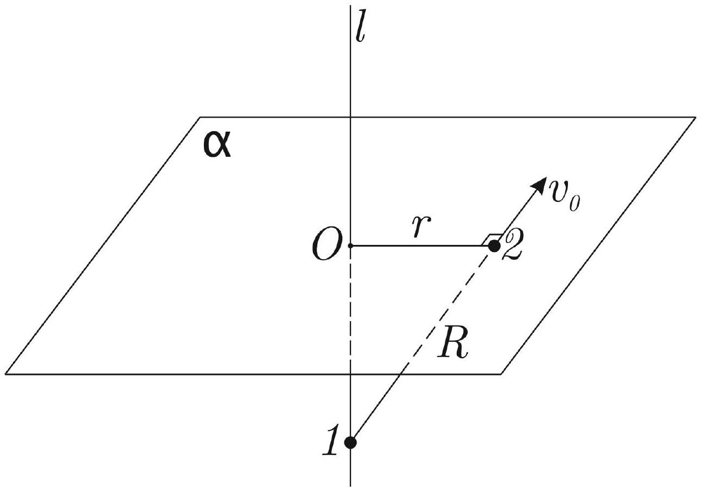

Есть прямая $l$ и плоскость $a$. Они перпендикулярны. По прямой может двигаться частица 1, а по плоскости - частица 2, масса каждой частицы $m$. Частицы притягиваются по закону гравитации. Трения нет.

А1 ${ }^{3.00}$ Изначально частица 1 покоится, а вторую приводят в движение. Её скорость перпендикулярна линии, соединяющей частицы, а расстояние между частицами равно $R$. Найдите минимальное значение скорости второй частицы $v_{02}$, при котором частицы окажутся на бесконечном удалении друг от друга.

Теперь частицы находятся на равных расстояниях от точки пересечения прямой и плоскости, расстояние между ними равно $R$. Частицам сообщают равные скорости $v_{0}$, лежащие в одной плоскости, перпендикулярной плоскости $\alpha$.

А2 ${ }^{3.00}$ Найдите значение $v_{0}$, при котором частица 2 спустя большое время окончательно остановится на конечном расстоянии от начала координат и значение скорости $v_{1}$ первой частицы при этом.
