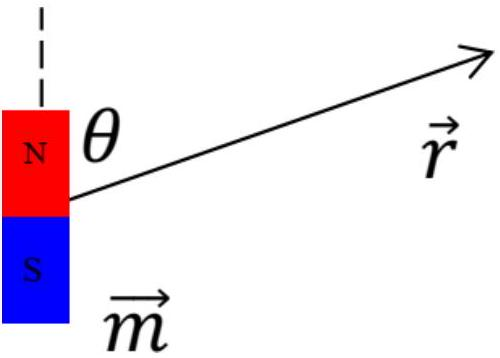
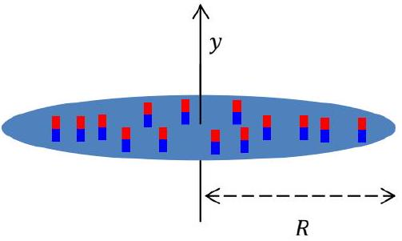
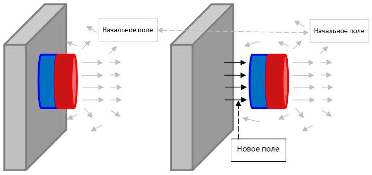
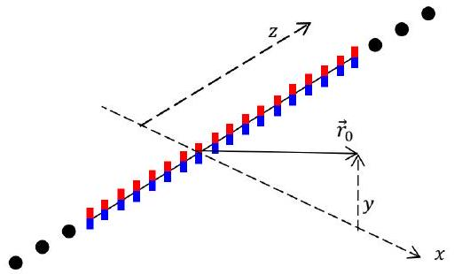
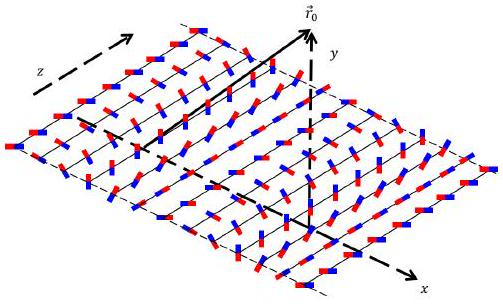
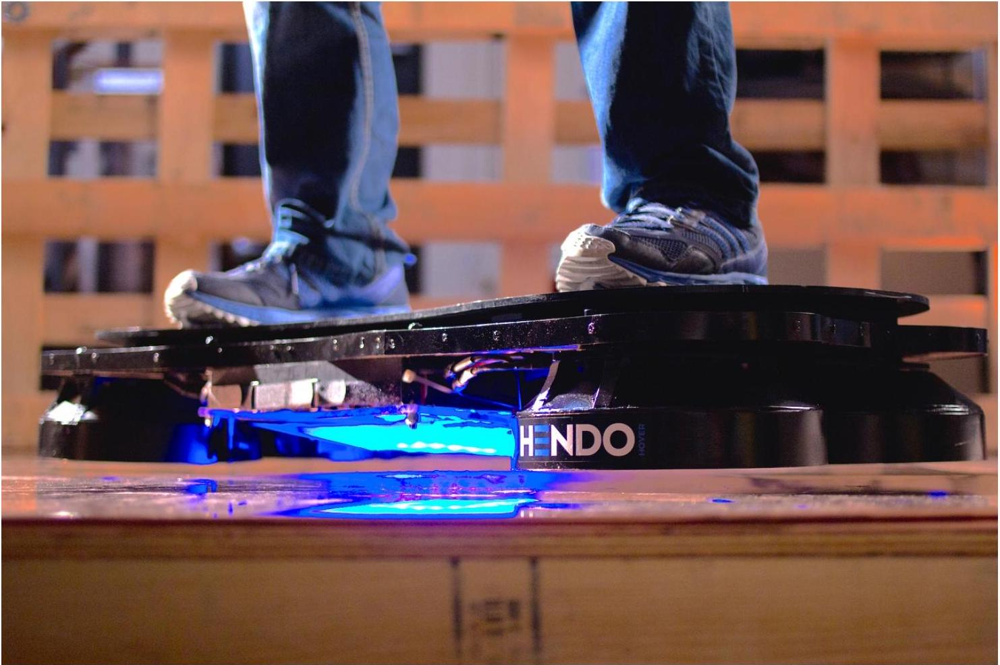

## Road to IPhO

## Магнитная сборка Халбаха

Магнитная сборка Халбаха - особая конфигурация постоянных магнитов, характеризующаяся тем, что магнитное поле с одной из её сторон практически полностью отсутствует благодаря особому расположению элементов сборки. В этой задаче мы исследуем это явление.

## Часть А. Магнитные диполи (0.5 балла)

Диполем называется точечный магнитный элемент (например, маленькая петля с током. Ее дипольный момент $I \vec{S}$, где $I$ - это ток, бегуший по петле, а $\vec{S}$ - ориентированная площадь). Поле, создаваемое магнитным диполем, описывается следующей формулой:

$$
\vec{B}(\vec{r})=\frac{\mu_{0}}{4 \pi}\left(\frac{3 \vec{r}(\vec{m} \cdot \vec{r})}{r^{5}}-\frac{\vec{m}}{r^{3}}\right),
$$

где $m$ - дипольный момент, $\vec{r}$ - радиус-вектор точки в пространстве относительно диполя. $\mu_{0}=4 \pi \cdot 10^{-7}$ Гн/м. На рисунке изображены диполь,

вектор и угол между ними.

А1 Магнитное поле ослабляется с увеличением расстояния, для заданного угла $\theta$ найдите зависимость магнитного поля $B$ на расстоянии $r$ от диполя.

## Часть В. Магнитная шайба (2.5 балла)

Рассмотрим лёгкий магнит, представляющий собой плоский цилиндр радиуса $R$ и толщиной $h \ll R$ с поверхностной плотностью магнитного момента $\vec{\sigma}$. Вектор поверхностной плотности ориентирован вдоль оси диска.

B1 Выразите магнитное поле $B(y)$ вдоль оси, перпендикулярной магниту, на расстоянии $y$ от центра. 1.5

Если приблизить маленький круглый магнит к металлической двери холодильника, магнит притягивается к ней с силой, зависящей от размеров и типа материала магнита, а также толщины двери. В этом пункте считайте толщину двери много большей линейных размеров магнита. Рассмотрим цилиндрический магнит с объемной плотностью дипольного момента $\rho=1.05 \cdot 10^{6} \frac{\text { Тл. М }}{\text { Гн }}$ толщиной $t=2$ мм и диаметром $D=20$ мм.

В2 Оцените величину магнитного поля вблизи поверхности магнита. Ответ выразите через величины $t, D, \rho, \mu_{0}$.

Чтобы определить силу взаимодействия магнита и двери холодильника, необходимо воспользоваться законом сохранения энергии. Когда магнит отрывают от двери, между ними возникает поле, приблизительно равное полю с другой стороны магнита. Остальная часть поля (включая и то, что внутри двери) почти не меняется. Выражение для объёмной плотности энергии магнитного поля в воздухе: $w=\frac{B^{2}}{2 \mu_{0}}$.

B3 Получите выражение и численное значение силы взаимодействия $F_{0}$ между дверью и прижатым к ней магнитом, также вычислите давление $P_{0}$ магнита на дверь.

## Road to IPhO

Часть С. Магнитная сборка Халбаха (7 баллов)

Для того чтобы получить выражение магнитного поля в сборке Халбаха, найдем поле длинного ряда магнитов, как показано на рисунке. Линейная плотность дипольного момента ряда $\rho_{L}$, направление - вдоль оси $y$.

C1 Запишите выражение для поля $\vec{B}\left(\vec{r}_{0}, y\right)$ которое создает ряд магнитов. (Для удобства поле выражается и через $\vec{r}_{0}$, и через $y$, хотя технически $y=\left(\vec{r}_{0}\right)_{y}$.)

В плоской магнитной сборке Халбаха направление поляризации маленького элемента площади непрерывно вращается. Его положение меняется в соответствии с формулой:

$$
\beta(x, z)=\beta_{0}+k \cdot x, k=2 \pi / \lambda, t \ll \lambda
$$

Здесь $\beta$ - это угол между направлением диполя и перпендикуляром к плоскости, этот угол вращается в плоскости $x y$. Длина $\lambda$ - это шаг сборки, а $t$ - толщина сборки.

С2 Найдите магнитного поля с двух сторон от сборки. Ответ дать в виде некоторого интеграла. 1.0

Один из этих интегралов нужен для решения этого пункта:

$$
\begin{gathered}
\int_{-\pi / 2}^{\pi / 2} d x \cdot \cos (2 x) \cdot \cos (c \cdot \tan x)=\frac{c \cdot \pi}{e^{c}}=\int_{-\pi / 2}^{\pi / 2} d x \cdot \sin (2 x) \cdot \sin (c \cdot \tan x) \\
\frac{\pi}{e^{d}}=\int_{-\infty}^{\infty} d x \cdot \frac{\cos x}{d^{2}+x^{2}} \\
\frac{\pi}{a \cdot e^{a}}=\int_{-\infty}^{\infty} d x \cdot \frac{2 x \cdot \sin (2 x)}{\left(a^{2}+x^{2}\right)^{2}} \\
\frac{(b+1) \pi}{e^{b}}=\int_{-\infty}^{\infty} d x \cdot \frac{2 b^{3} x \cdot \cos (x)}{\left(b^{2}+x^{2}\right)^{2}}
\end{gathered}
$$

C3 Покажите, что с одной стороны идеальной сборки магнитное поле стремится к нулю. 1.0

C4 Запишите выражение для поля с другой стороны. 1.0

C5 На основании выражения поля найдите среднее давление $P$ такого магнита на дверь холодильника. Возьмите следующие параметры: толщина $t=0.5 \mathrm{~mm}$, объемная плотность магнитного диполя $\rho=2 \cdot 10^{5} \frac{\mathrm{~T} л \cdot \mathrm{~m}}{\Gamma \mathrm{H}}$, шаг сборки $\lambda=5 \mathrm{~mm}$.

С6 Найдите соотношение между давлением, которое создает магнитная сборка Халбаха и давлением, которое создает обычный магнит из того же материала, с теми же радиусом и толщиной. Здесь тоже следует пренебречь эффектами на периметре кружка и и толщиной магнита.

## Road to IPhO

Вы могли подумать, что ни в чем более инновационном, чем магнитики для холодильника, сборка Халбаха не применяется. Однако компания Hendo разработала на ее основе разработала целый ховерборд (тот самый, что был в фильме «Назад в будущее»). Используя кольцевую сборку Халбаха из электромагнитов, Hendo добились подъемной силы достаточной, чтобы заставить человека средней массы подняться над землей! Но только над медью.

