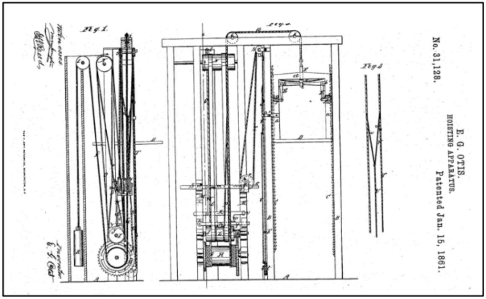
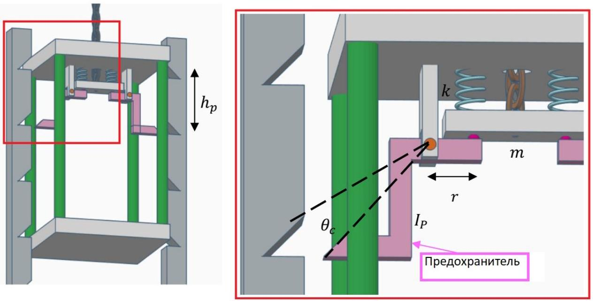
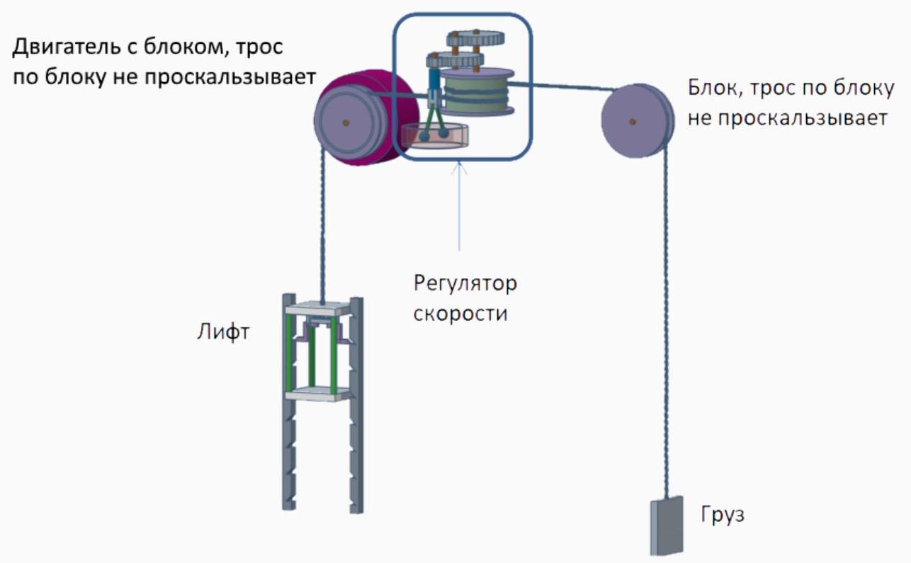
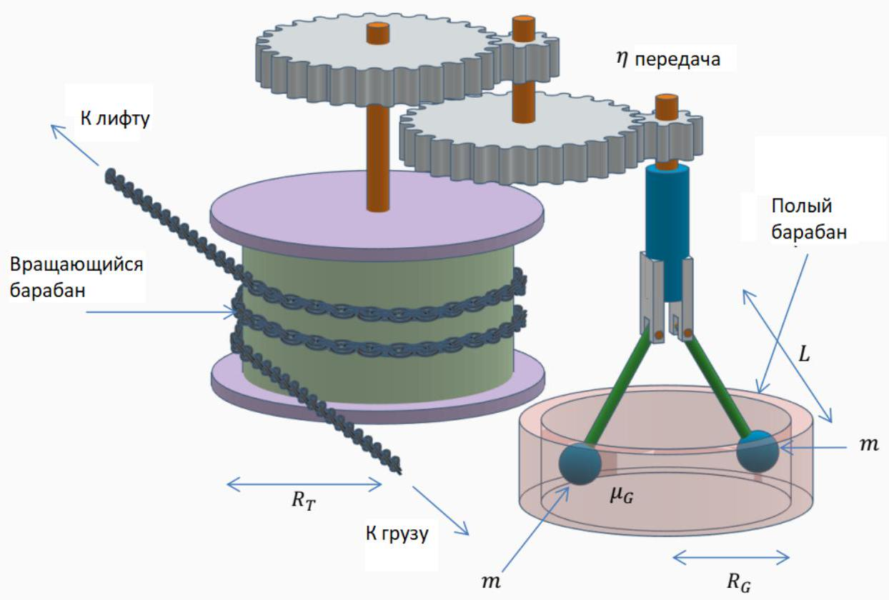

В 1854 году на Всемирной выставке в Нью-Йорке Элиша Отис под аплодисменты публики впервые продемонстрировал механизм страховки своего лифта. Элиша поднялся на лифте на высоту четвертого этажа, а его помощник тем временем отрезал трос, который держал лифт - все это пока сам Элиша находился внутри лифта!
К счастью, механизм страховки сработал и лифт остановился после короткого падения. Механизм страховки таким образом несколько раз подряд спас жизнь своего изобретателя.

В этой задаче мы рассмотрим два механизма страховки лифтов.
Часть А. Экстренный тормоз
Та часть, которую столь драматически демонстрировали на выставке, являлась экстренным тормозом.

Принцип действия механизма:
В нормальном состоянии трос, который держит лифт, сильно натянут и сжимает две пружины (каждая с коэффициентом упругости $k=30 \mathrm{кН} / \mathrm{м}$ ).
Когда трос отрезан, пружины освобождаются и балка весом $m=10$ кг, опускается вниз относительно лифта. Она, в свою очередь, заставляет предохранители повернуться так, что их концы встают в углубления в рельсах по обе стороны лифта. Углубления расположены на одинаковом расстоянии $h_{p}=0.15$ м по всей высоте рельсов. Момент инерции каждого предохранителя (относительно оси вращения) $I_{p}=3$ кг ⋅ $\mathrm{m}^{2}$. Расстояние от оси до точки давления на предохранители со стороны балки $r=0.3$ м Для того чтобы предохранитель пришёл в углубление напротив, он должна провернуться на угол $\theta=6^{\circ}$ от изначального состояния.

Если предохранитель был бы повернут на угол $12^{\circ}=2 \theta \ll 90^{\circ}$, то пружины были бы полностью нерастянуты.
Масса пустого лифта $M=300$ кг, а масса Отиса вместе с его пожитками $m_{1}=200$ кг.
Ускорение свободного падения $g=10 \mathrm{~m} / \mathrm{c}^{2}$.
А1 ${ }^{2.00}$ Лифт покоится, Отис внутри. В некоторый момент трос перерезают. На какую максимальная высоту $\Delta y$ упадет лифт до тех пор, пока механизм страховки не сработает не остановит лифт?

A2 ${ }^{1.50}$ Рассмотрим другую ситуацию: трос не перерезается, но передача от него к двигателю ломается. Это приводит к тому, что сила натяжения меньше, чем сила, удерживающая лифт в состоянии покоя. Каково максимальное ускорение $a_{1}$, с которым лифт будет падать вниз в такой ситуации? (Отис все еще внутри).

А3 ${ }^{0.50}$ Каково максимальное ускорение $a_{2}$, с которым лифт будет двигаться, в случае, если лифт пуст?
Часть В. Регулятор скорости
Из предыдущих пунктов ясно, что лифт следует снабдить дополнительными средствами защиты от падения с большой скоростью. Регулятор скорости и есть тот механизм, который предоставит соответствующую защиту.

Ниже данные для параметров изображенных на рисунке:

$$
R_{T}=1.1 \mathrm{м}, R_{G}=0.4 \mathrm{м}, \mu_{G}=0.3, L=0.5 \mathrm{м}, m=12 \text { кг, } \eta=6 .
$$

Регулятор скорости состоит из нескольких частей:

- Вращающийся барабан, на который наматывается трос. С одной стороны на тросе подвешен лифт, а с другой - уравновешивающий груз. Барабан очень шершавый так что нет проскальзывания между ним и тросом.
- Передача с передаточным отношением $\eta$, которая связывает вращающийся барабан с быстро вращающейся осью.
- Быстро вращающаяся ось, на ней шарнирно закреплены два штифта (стержня) с грузами на нижних концах.

Штифты могут откидываться от оси в зависимости от угловой скорости, с которой они движутся.

- Полый барабан внутри которого вращаются штифты.

Передача создает ситуацию, при которой грузы движутся с большей угловой скоростью, чем скорость вращения вращающегося барабана. Скорость достаточно высока, для того чтобы грузы раскрывались и касались внутренних стенок барабана и трение между грузами и барабаном способно регулировать скорость лифта, чтобы она не была слишком большой.

В1 ${ }^{1.00}$ Запишите выражение и вычислите критическую скорость движения лифта $v_{0}$, при которой грузы регулятора скорости будут касаться барабана.
В2 ${ }^{1.00}$ Вычислите наибольшую скорость $v_{\max }$, при которой лифт может двигаться против регулятора, когда лифт полностью загружен, уравновешивающие грузы отключены и двигатель тоже отключен.

Часть С. Потребление энергии
Современные лифты предназначены для работы с наименьшим, насколько это возможно, потреблением электроэнергии. Исследуем потребление энергии лифтом в современном офисном здании.

Высота здания $H=43$ м.
Масса пустого лифта $M_{E}=800$ кг, дополнительно лифт способен нести максимум $M_{\max }=1200$ кг.
Номинальная скорость движения лифта $v=1.25 \mathrm{~m} / \mathrm{c}$, номинальное ускорение лифта $a=1.0 \mathrm{~m} / \mathrm{c}^{2}$ Масса уравновешивающего груза $M_{c}=1300$ кг.
КПД электрического двигателя лифта $\eta=0.83$.
С1 ${ }^{1.00}$ Какова максимально потребляемая мощность двигателя $P_{\text {max }}$, который приводит в движение лифт?
Часть времени, когда лифт движется в течение суток $D=10 \%$.
Для простоты примем что половину времени лифт едет полностью загруженный, а половину времени - пустой. За каждую поездку лифт проезжает всю высоту здания, количество подъемов равно количеству спусков.
В этой модели лифт работает исключительно как потребитель энергии, то есть торможение он производит с помощью тормозов, которые превращают всю кинетическую энергию от движения лифта в тепло. Также, когда лифт спускается полным, двигатель не поставляет электричество, но тормоза должны работать и во время спуска.

С2 ${ }^{1.00}$ Каково среднее потребление мощности $P_{\text {avg }}$ двигателем лифта в сутки?
Средний тариф за электричество: $\frac{C}{E}=6 \frac{\text { руб }}{\text { кВт.ч }}$.

Для того чтобы уменьшить эти расходы, можно приобрести лифт с системой аккумуляции энергии (например с батареей, маховым колесом, суперконденсаторами), которые позволят тратить меньше энергии. В такой системе электрический двигатель, который приводит лифт в движение будет выступать в качестве генератора в ситуации, когда механическая энергия лифта уменьшается (например когда лифт спускается при полной загрузке). КПД генератора равен КПД электрического двигателя: $\eta_{g e n}=\eta=0.83$.

C4 ${ }^{1.00}$ Получите оптимистическую оценку месячной стоимости $C_{1}$ эксплуатации экономной модели лифта.
T
Механика
Динамика
2020
Сборы XY
X
Вращательное движение
Заимствование
Блоки

Website in English
2020 - Мы те, кого должны превзойти.
