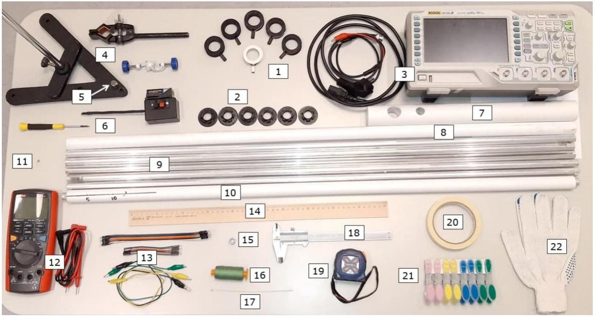
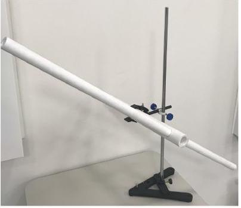
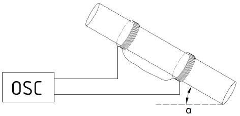
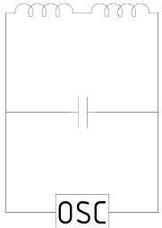

Эта задача посвящена эффектам, связанным с движением магнита в проводящих трубках. Хорошо известно о возникающих при таком движении токах Фуко, которые взаимодействуют с движущимся магнитом и замедляют его движение. Силы сопротивления оказываются пропорциональными скорости движения.

Задача состоит из пяти последовательных частей:

1. Вводная часть, чтобы научиться работать с предоставленным оборудованием
2. Определение магнитного момента
3. Исследование эффектов в сплошной трубе
4. Исследование эффектов в трубах с продольным разрезом
5. Изучение черного ящика

## Оборудование

1. Катушки
2. Адаптеры для катушек
3. Осциллограф с проводом питания и проводом «BNC-крокодил»
4. Штатив с лапкой и муфтой
5. Магнит
6. Датчик Холла (с элементом питания) и отвертка для подстройки
7. Держатель труб
8. Пластиковая трубка
9. Металлические трубки сплошная и с продольными разрезами
10. «Черный ящик»
11. Конденсатор
12. Мультиметр с проводами
13. Соединительные провода
14. Линейка 50 см
15. Гайка
16. Нитки
17. Пластиковая стяжка
18. Штангенциркуль
19. Рулетка
20. Малярный скотч узкий
21. Прищепки бельевые
22. Перчатки рабочие

## Важные замечания для успеха эксперимента

1. Выданный вам неодимовый магнит, конечно, твердый, но хрупкий. Если он на большой скорости столкнется с железной поверхностью (например, рамой стола, основанием или стойкой штатива), он может расколоться. Новый магнит вам не выдадут, а с осколками выполнить эксперимент невозможно.
2. У выданных вам катушек есть выводные разъемы ("мама"). В ходе эксперимента в них вставляются штыревые разъемы соединительных проводов ("папа"). Не нужно прикладывать большое усилие, чтобы вставить штыревые разъемы в разъемы катушки. Если вы чувствуете, что штырь не вставляется, вытащите его, поверните вокруг его оси на 90 градусов и попробуйте еще. Существует такое положение штыревого разъема, когда он легко входит в разъем катушки.
3. Если вы приложите сверх-усилие, чтобы вставить штырь в катушку, контактная планка в разъеме катушки может сместится вглубь разъема. Электрический контакт будет отсутствовать, катушка станет непригодной для работы. Новую катушку вам не выдадут.
4. В работе присутствуют алюминиевые трубы, в которых сделан продольный разрез. Разрез может быть острым. Поэтому надевайте предоставленные строительные перчатки, если вы что-то делаете с трубами с разрезом.
5. Эффекты, которые наблюдаются в трубах с разрезом, достаточно тонкие, и они зависят от ширины разреза. Не гните, не разгибайте - в общем, никаким образом не меняйте ширину разреза в трубках.

## 00 Перечислите все предметы оборудования и вашего рабочего места, к которым магнитится выданный вам магнит.

$01^{-1.00}$ Запрещено наносить какие-либо надписи напрямую на алюминиевые или пластиковые трубы. Если вам необходимо нанести какие-то отметки, приклейте малярный скотч вдоль трубы или сделайте наклейки в нужных вам местах. Ручкой и карандашом можно писать только на малярном скотче. Дежурный по аудитории имеет право в любой момент проверить наличие надписей на трубах. В случае обнаружения надписей, дежурный немедленно ставит штрафной балл в лист ответов. Утверждение, что вы сотрете надписи позже, не принимается. Штрафной балл можно получить до 20 раз.

Базовая установка этой работы представлена на рисунке ниже.

- Труба закреплена в держателе (Рис. 1А), на трубу надеты от одной до шести катушек, катушки последовательно соединены друг с другом, а система целиком подключена к осциллографу (Рис. 1B).
- В зависимости от диаметра труб, можно использовать адаптеры для катушек.
- Для фиксации положения катушек на трубе используйте прищепки.
- Если через катушку пролетает магнит, в ней возникает ЭДС индукции $\mathcal{E}_{\text {инд }}$ из-за изменения потока магнитного поля, это фиксируется осциллографом.
- Длинные металлические трубы фактически являются антеннами, поэтому на осциллографе можно наблюдать высокочастотные помехи, ухудшающие

соотношение сигнал-шум. Чтобы избавиться от высокочастотной компоненты сигнала, подключите параллельно системе катушек выданный вам конденсатор емкости $C=0.1$ мкФ (Рис. 1С). Для гармоник высокой частоты он фактически выполняет роль перемычки. Соотношение сигнал-шум после этого должно значительно улучшиться.

- Помните, что исследуемые объекты должны находиться как можно дальше от металлических предметов, чтобы они оказывали минимальное влияние на эксперимент.

A

B

C

## Часть А. Необычный секундомер (3.5 балла)

В этой части задачи вам предстоит определить ускорение свободного падения $g$ с помощью осциллографа.
Закрепите держатель труб в лапке штатива. Установите пустую пластиковую трубу в держатель. Труба должна быть наклонена под некоторым углом к горизонту. Наденьте на трубу 2 катушки и разместите их на некотором расстоянии друг от друга (> 50 см).

А1 Измерьте расстояния от верхнего края трубы до середины первой катушки $L_{1}$ и от середины первой катушки до середины второй $L_{2}$ и занесите их в лист ответов.

А2 ${ }^{0.50}$ Найдите время $t$, за которое магнит пролетает между центрами двух катушек. Выразите $t$ через $L_{1}, L_{2}, \mu_{1}, g$, $\alpha$, где $\mu_{1}$ - коэффициент трения скольжения между трубкой и магнитом.

По показаниям осциллографа можно определить время $t$, за которое магнит пролетит расстояние между центрами катушек.
А3 ${ }^{0.50}$ На листе ответов качественно изобразите картину сигнала, регистрируемого осциллографом. Укажите, как вы измеряете время $t$ по осциллограмме.
А4 ${ }^{1.40}$ Снимите зависимость времени $t$ от угла наклона $\alpha$ пластиковой трубы для 7 различных углов. Диапазон углов должен быть в интервале $(\pi / 4 ; \pi / 2)$.
А5 ${ }^{0,20}$ Предложите линеаризацию зависимости, полученной в пункте А2.
A6 ${ }^{0.50}$ Постройте график в координатах, соответствующих линеаризации в пункте A5.
A7 ${ }^{0.40}$ Используя график, определите $g$. Оцените погрешность.

## Часть В. Магнитный момент (2 балла)

Выданный вам магнит можно рассматривать как магнитный диполь. Поле, создаваемое магнитом можно исследовать с помощью датчика Холла. Он измеряет компоненту магнитного поля, перпендикулярную плоскости датчика. Дополнительная разность потенциалов, которая возникает из-за магнитного поля, связана с его индукцией соотношением $U=\chi B$, где $\chi=50$ В/Тл. Базовая линия (показания вольтметра в отсутствии поля) для большинства датчиков - это 0 . Если это не 0 , это явно указано на датчике (изменения напряжения нужно считать от базовой линии). Базовая линия может «плыть» от разных параметров. Базовую линию можно подрегулировать отверткой. Рабочий диапазон датчика - [-4.5; 4.5] В для датчиков с базовой линией 0, и [0; |9|] В для датчиков с базовой линией |4.5 B|.

В1 ${ }^{2.00}$ Измерьте радиус магнита $R$ и его высоту $H$. Определите дипольный момент магнита $M$. С помощью схем, диаграмм, графиков поясните, как вы это делаете.

## Часть С. Установившееся движение в алюминиевой трубе (5 баллов)

При падении магнита в алюминиевой трубке на него действует сила торможения, которая возникает из-за вихревых токов. В нашей задаче скорость магнита достаточная чтобы использовать следующее приближение:

$$
F_{\text {сопр }}=k v_{\text {магн, где }} k=\frac{\left(\mu_{0} M\right)^{2} \sigma w f(H / a)}{8 \pi(a H)^{2}},
$$

а $m$ - масса магнита, $\sigma$ - удельная проводимость материала трубы, $a$ - внутренний радиус трубы, $M$ - магнитный момент магнита, $w$ - толщина стенок трубы, $f(H / a)$ - некоторая функция. В данной задаче можно считать, что $f(H / a)=1.75 . \mu_{0}=4 \pi \cdot 10^{-7}$ Гн $/$ м, $m=21.0$ г.

С1 ${ }^{0.50}$ Найдите зависимость скорости магнита $v_{\text {магн }}$ от времени через $t, g, k, \mu_{2}, \alpha$, где $\mu_{2}$ - коэффициент трения скольжения между алюминиевой трубкой и магнитом.

С2 ${ }^{0.50}$ Выразите установившуюся скорость $u$ через $g, k, \mu_{2}, \alpha$.
с3 ${ }^{0.50}$ Схематично изобразите экспериментальную установку, с помощью которой можно измерить установившуюся скорость на нескольких интервалах. Поясните с помощью диаграмм, графиков, осциллограмм, что и как вы измеряете, чтобы рассчитать установившуюся скорость.

После того, как магнит пройдёт определённое расстояние можно считать, что в пределах погрешности он движется с установившейся скоростью.
С4 ${ }^{0.50}$ Каким образом вы проверяете, что на исследуемом участке скорость можно считать установившейся? Объясните с помощью диаграмм, графиков, осциллограмм.

С5 $1^{1.00}$ Снимите зависимость установившейся скорости движения магнита от угла наклона алюминиевой трубы для не менее 7 углов наклона. Для каждого угла наклона усредните установившуюся скорость по не менее трем интервалам. В таблицах указывайте первичные данные, снимаемые с приборов.

C6 ${ }^{0.50}$ Предложите линеаризацию зависимости, полученной в пункте C2, чтобы можно было определить коэффициент трения скольжения $\mu_{2}$ и коэффициент в силе сопротивления $k$.

C7 ${ }^{0.50}$ В соответстви с С6 постройте график зависимости для определения $\mu_{2}$ и $k$.
С8 ${ }^{0.50}$ Используя график, определите $\mu_{2}$ и $k$.

Часть D. Движение в трубах с разрезами (5.5 баллов)

D1 ${ }^{4.00}$
Для каждой трубы определите соответствующий коэффициент в силе сопротивления $k_{i}(i=2,3,4,5)$. Будьте внимательны, эффекты проявляющиеся здесь, очень тонкие. Следите за качеством снимаемых с установки данных и их оптимальной обработкой.

D2 ${ }^{1.00}$
Измерьте ширину разреза $x$ и постройте график зависимости $k_{i}$ от $x$.

D3 ${ }^{0.50}$
Определите параметры зависимости, полученной в пункте D2.

Часть Е. Металлический черный ящик (4.0 балла)
Внутри черного ящика находится алюминиевая трубка, в которой участки с разрезами чередуются со сплошными участками. Начало координат находится на краю алюминиевой трубки, а направление обозначено на пластиковой.

E1 ${ }^{4.00}$
Найдите положение и ширину разрезов. С помощью формул и картинок поясните, как вы это делаете и приведите расчеты.

Website in English
2020 - Мы те, кого должны превзойти.
