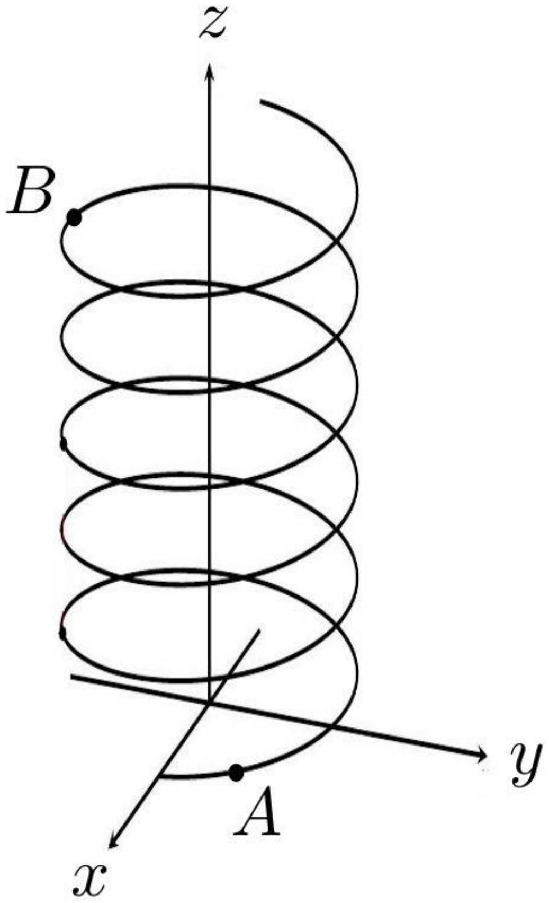
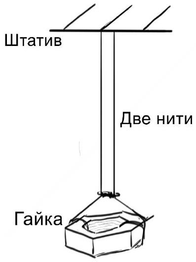
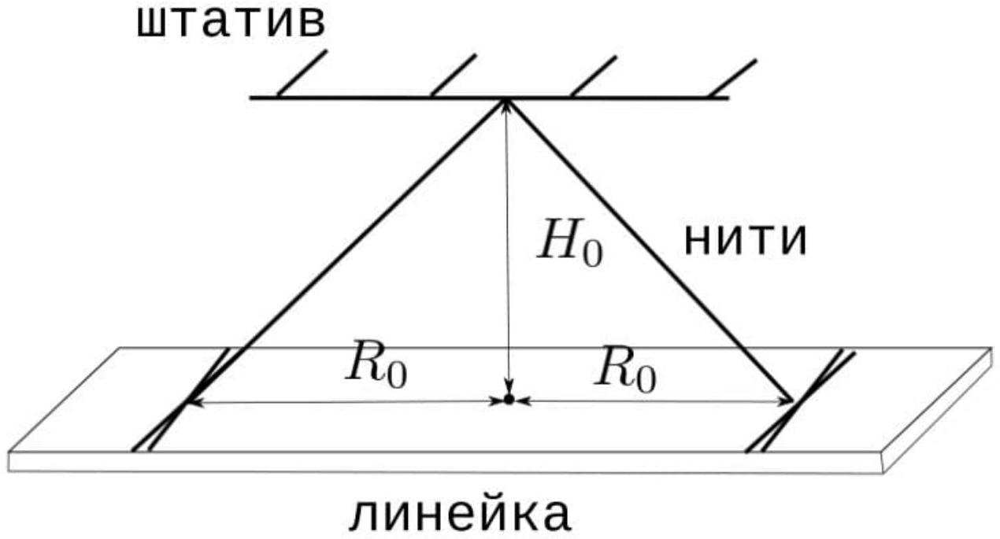

В данной работе вам потребуется определить радиус выданной нити тремя различными способами. Так как измеряемые эффекты достаточно тонкие, далее вам потребуется постичь дзен.

Оборудование

1. Катушка с ниткой
2. Две одинаковых гайки
3. Штатив с лапкой и муфтой
4. Линейка
5. Секундомер
6. Весы
7. Клейкая масса
8. Мерная лента
9. Ножницы и скотч по требованию

Часть А. Геометрия винтовых линий (1 балл)
Винтовой линией на поверхности цилиндра радиуса $R$ называется такая кривая, что в любой её точке касательная к ней составляет одинаковый угол с осью симметрии цилиндра (см. рис). Координаты $x$ и $y$ точек винтовой линии определяются выражениями

$$
x=R \cos (\varphi) ; y=R \sin (\varphi)
$$

Во всех пунктах данной части длина кривой равняется $l$.

А1 ${ }^{0.20}$ Пусть кривая совершает один оборот вокруг цилиндра радиуса $R<\frac{l}{2 \pi}$
(т.е $\varphi_{B}-\varphi_{A}=2 \pi$ )

Найдите угол между касательной к кривой и осью симметрии цилиндра.
А2 ${ }^{0.40}$ Пусть $\varphi_{B}-\varphi_{A}=\Delta \varphi$.
Выразите $z_{B}-z_{A}$ через $l, R$ и $\Delta \varphi$
А3 ${ }^{0.40}$ Для $\frac{R \Delta \varphi}{l} \ll 1$ покажите, что

$$
z_{B}-z_{A}=l-\frac{(R \Delta \varphi)^{2}}{2 l}
$$

Полученные формулы пригодятся в дальнейших частях задачи.

В2 ${ }^{0.90}$ Измерьте радиус нити $r_{1}$ методом рядов.

ВЗ ${ }^{3.00}$ Измерьте момент инерции гайки относительно её главной оси.
Считайте, что $g=9,8 \mathrm{~m} / \mathrm{c}^{2}$.
Часть С. Крутим гайку ( баллов)
Соберите установку по схеме ниже. Длина нитей должна быть равна 30-45 см. В верхней точке расстояние между нитями должно быть порядка 1 мм или меньше. Точка скрепления нитей должна быть зафиксирована. Обратите внимание, что в положении равновесия нити закручены на какой-то угол.

C1 Запишите расстояние $L$ от точки подвеса до точки скрепления для вашей установки.

с2 ${ }^{1.70}$ При закручивании нитей на угол $\varphi$ гайка поднимается на высоту $h$. Снимите зависимость $h(\varphi)$ в максимально широком диапазоне (до углов порядка $500 \pi$ ), закручивая гайку против часовой стрелки, если смотреть на на неё сверху вниз. В дальнейшем будем называть это направление закрутки правым. Следите за тем, чтобы отрезки нитей ниже точки скрепления не перекручивались. На нитях не должны появляться узелки и катышки.

С3 ${ }^{1.10}$ Снимите аналогичную зависимость для закручивания в другую сторону. Убедитесь в асимметрии установки.

ВАЖНО: Все дальнейшие измерения проводите при закручивании гайки против часовой стрелки, если смотреть на установку сверху.
ВАЖНО: при построении всех дальнейших теоретических зависимостей считайте нити нерастяжимыми.
C4 ${ }^{0.30}$ Выведите теоретическую зависимость $h(\varphi)$. Пользуясь этим, линеаризуйте зависимость, полученную в пункте С2.

С5 ${ }^{1.20}$ Для правой закрутки нити постройте график зависимости $h(\varphi)$ в координатах, в которых он является линейным. Из углового коэффициента еще раз определите радиус нити $r_{2}$.

с6 ${ }^{0.70}$ Получите теоретическую зависимость $\tau$ от параметров установки, где $\tau(h)$ - время, за которое гайка останавливается, если её отпустить с высоты $h$.

С7 ${ }^{1.00}$ Для правой закрутки экспериментально получите зависимость $\tau(h)$.

С8 ${ }^{2.50}$ Снимите зависимость $\tau(L)$. Постройте линеаризованный график.

с9 ${ }^{1.20}$ Модулем кручения $f$ однородного стержня называют коэффициент пропорциональности в формуле $M=f \cdot \varphi$, где $M$ - закручивающий момент сил, приложенных к основанию стержня, $\varphi$ - угол поворота основания стержня. Определите коэффициент $C$ в зависимости $f=C / L$, где $f$ - собственный модуль кручения одной нити, $L$ - длина нити. Опишите метод. Оцените отношение $\frac{C}{m g r^{2}}$. Убедитесь, что рассмотренный эффект почти не влияет на полученные результаты.

С10 ${ }^{0.30}$ Заметьте, что гайка раскручивается до неразличимых глазом угловых скоростей. Оцените по порядку, с какой максимальной угловой скоростью она вращается.

Часть D. Крутим линейку (5 баллов)
В этой части задачи используется экспериментальная установка, изображенная на рисунке ниже. Линейка подвешена на двух нитях параллельно полу, причём расстояние между концами нити на штативе мало, а на линейке - велико. Обозначим как $\tau^{\prime}(\varphi)$ время, нужное системе, закрученной на угол $\varphi$, чтобы снова остановиться.

Перейдем к построению теоретической модели. Пусть линейка изначально повернута на угол $\varphi_{0}$ от положения равновесия.

$$
h=A \varphi,
$$

выразите $A$ через $R_{0}, H_{0}$ и $r$.
D2 ${ }^{0.80}$ Получите теоретическую зависимость $\tau^{\prime}\left(\varphi_{0}\right)$, где $\tau^{\prime}$ - время от начала движения линейки до момента ее первой остановки, $\varphi_{0}$ - начальный угол закручивания нитей.

Соберите установку, изображенную на рисунке. Используйте $R_{0} \approx 24$ см, $H_{0}<40$ см.
D3 ${ }^{1.50}$ Снимите зависимость $\tau^{\prime}\left(\varphi_{0}\right)$, где $\tau^{\prime}$ - время от начала движения линейки до момента ее первой остановки, $\varphi_{0}$ - начальный угол закручивания нитей. Измерения проводите в диапазоне $\varphi_{0} \in[\pi ; 10 \pi]$.

D4 ${ }^{1.50}$ Постройте линеаризованный график и в третий раз определите радиус нити $r_{3}$.
E
Механика
Физмаятник
Бифилярный подвес
2021
Сборы XY
X
