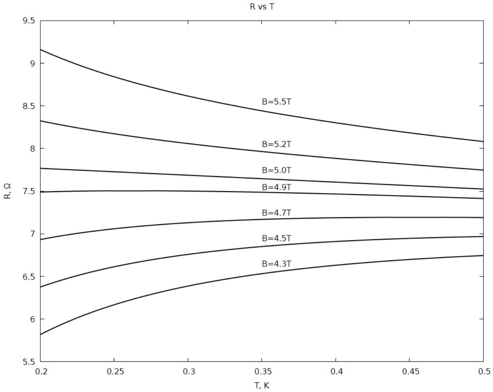

В тонких пленках In - О при низких температурах (порядка 1 K) наблюдается управляемый внешним магнитным полем фазовый переход сверхпроводникдиэлектрик (переход происходит при изменении внешнего магнитного поля $B$ ).

Часть А. Критические параметры (6.8 балла)
В таблице «Экспериментальные данные» представлены измерения зависимостей $R(T)$, где $R$ - сопротивление образца, $T$ - температура, при разных внешних магнитных полях $B$. Погрешность измерения сопротивления $\varepsilon(R)=0.5 \%$.
На графике (см. рис) приведены примерные виды зависимостей $R(T)$ для некоторых значений $B$, указанных в таблице.
Предположим, что зависимость сопротивления $R(T, B)$ имеет следующий вид:

$$
R(T, B)=R_{C}-\gamma T+A\left(B-B_{C}\right) T^{\alpha}
$$

где $A, R_{C}, B_{C}$ - некоторые параметры, связанные со свойствами образца.
Если на кривой $R(T)$ есть точка перегиба (то есть $\frac{\partial R}{\partial T}=0$ ), то обозначим ее координаты, как ( $T_{п}, R_{п}$ ).
Примечание: Для функции двух переменных аналогом производной выступает частная производная согласно определениям:

$$
\frac{d}{d x} f(x)=\lim _{\Delta x \rightarrow 0} \frac{f(x+\Delta x)-f(x)}{\Delta x}
$$

$$
\frac{\partial}{\partial x} f(x, y)=\lim _{\Delta x \rightarrow 0} \frac{f(x+\Delta x, y)-f(x, y)}{\Delta x}
$$

Фактически, при вычислении частой производной по $x$ мы полагаем $y$ константой и наоборот, например:

$$
f(x, y)=3 x^{2}+2 x y, \quad \frac{\partial}{\partial x} f(x, y)=6 x+2 y, \quad \frac{\partial}{\partial y} f(x, y)=2 x
$$

А1 ${ }^{1.00}$ Выведите аналитическую зависимость $R_{\Pi}\left(T_{\text {п }}\right)$.
A2 ${ }^{0.40}$ Определите $B_{C}$.
А3 ${ }^{2.60}$ Определите $R_{C}$ двумя способами.
A4 ${ }^{2,80}$ Определите параметры $\gamma$ и $\alpha$.
Часть В.Вероятность описания эксперимента (3.2 балла)
Оценка погрешности физической величины $X$ позволяет рассчитывать вероятность, с которой ее значение лежит в интервале $[a, b]$. Для оценки вероятности $p$ того, что результат эксперимента описывается математическим выражением используется критерий $\chi^{2}$ (хи-квадрат), рассчитываемый по следующей формуле:

$$
\chi^{2}=\sum_{i=1}^{N}\left(\frac{R_{\text {теор }}-R_{\text {эксп }}}{\Delta R}\right)^{2}
$$

При количестве точек $N=150$ таблица соответствия $p$ и $\chi^{2}$ :
(Таблица вероятностей)
В1 ${ }^{2.20}$ Посчитайте $\chi^{2}$ (определение в примечании) зависимостей $R(T)$ для каждого $B$.
В2 ${ }^{1.00}$ Используя таблицу из примечания, оцените вероятность согласно которой формула $f=R(T, B)$ описывает зависимость $R(T, B)$ для любых (укажите каких) 150 точек.

Website in English
2020 - Мы те, кого должны превзойти.
