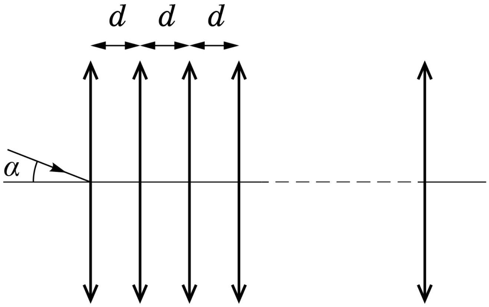

Оптическая система состоит из большого количества собирающих линз с фокусным расстоянием $F$ с общей главной оптической осью. Центры соседних линз находятся на одинаковом расстоянии $d \ll F$ друг от друга, при этом толщиной линзы можно пренебречь по сравнению с $d$. Луч перед преломлением в центре первой линзы пересекает главную оптическую ось под углом $\alpha \ll 1$, и сразу после преломления в последней пересекает главную оптическую ось под тем же углом.

А1 ${ }^{5.00}$ Найдите минимально возможное расстояние $L$ между крайними линзами.
