Введение
Внимание!
В данной работе не требуется рассчитывать погрешности, за исключением части A.
В повседневной жизни мы часто наблюдаем, что поток жидкости "прилипает" к твердой поверхности. Этот эффект обычно называют « teapot effect », и он имеет место в следующих процессах: струйная печать и экструзия - получение изделий путём продавливания вязкого расплава материала или густой пасты через формирующее отверстие. В данной работе мы будем количественно изучать «teapot effect» проявляющийся во взаимодействии цилиндрической стеклянной трубки и потока воды, и, как следствие, мы получим спираль жидкости обвитую вокруг трубки.

Оборудование

1. Сосуд Мариотта с выходом в виде шланга с насадкой и краном
2. Кран на шланге
3. Три штатива
4. Четыре лапки
5. Четыре муфты
6. Большой контейнер
7. Салфетки
8. 6 пробирок разного диаметра
9. Листы миллиметровки
10. Лист картона
11. Транспортир
12. Мерный стакан
13. Ножницы
14. Секундомер
15. U-образный указатель
16. Экран с параллельными линиями
17. Клипсы

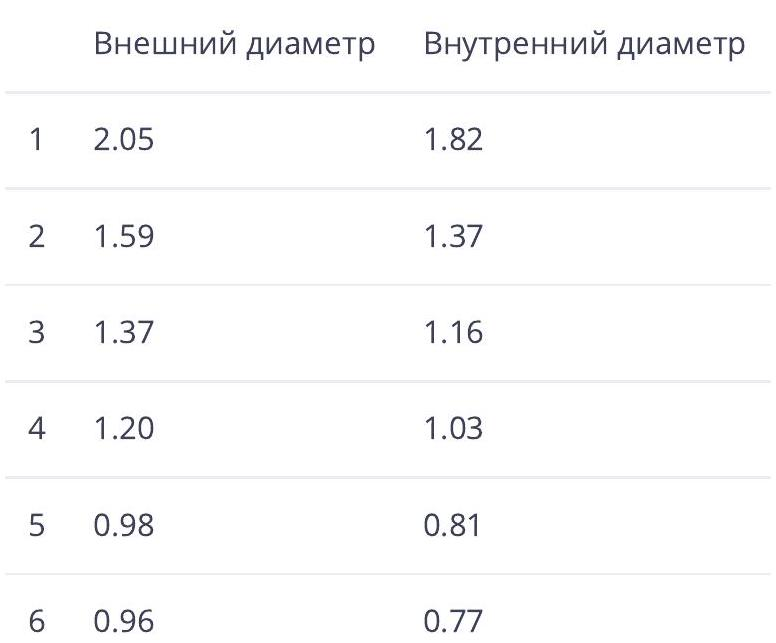
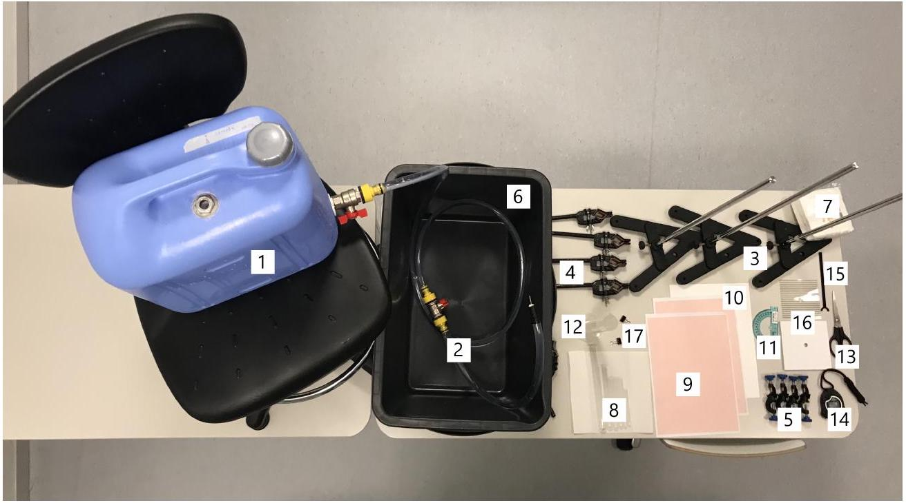

Часть А. Кинематика струи
Струя, вылетающая из насадки, отклоняется от прямого направления под действием гравитации. Мы можем использовать этот факт для нахождения начальной скорости потока $U_{0}$. Обозначим траекторию капель воды, как $z(x)$, где $z$ - вертикальная координата, $x$ - горизонтальная координата в плоскости кривой.
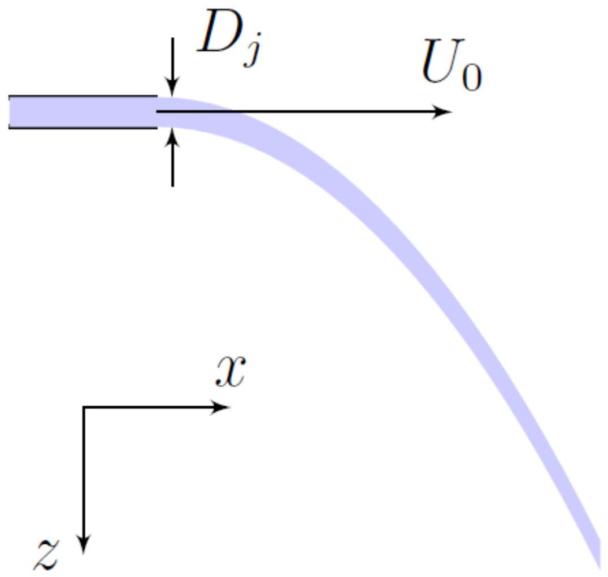

Часть В. Спираль
Зафиксируйте пробирку в вертикальном положении и направьте струю воды как на рисунке. Добейтесь того, чтобы струя сделала как можно больше оборотов по поверхности пробирки, для этого можете менять положение иглы по вертикали, чтобы увеличить или уменьшить скорость потока и двигать пробирку, чтобы поток воды был направлен максимально близко к касательной.

Внимание!

1. В частях В и С струя должна попадать на пробирку горизонтально.
2. В частях В и С необходимо сохранять одни и те же начальные условия с высокой точностью. В качестве возможного варианта решения данной проблемы предлагается установить иглу горизонтально, а также поднести её максимально близко к пробирке, что будет гарантировать постоянное значение $U_{0}$.
3. После измерения последней точки поставьте U-образный указатель так, как показано на фотографии ниже и закройте кран. Не двигайте ни один из штативов до того, пока не выполните все измерения в частях В и С.
4. В данном эксперименте очень важна ламинарность потока воды, поэтому убедитесь, что на исследуемой вами высоте, струя ламинарная на протяжении 20 сантиметров. Это достигается подбором высоты, на которой закреплена игла.
5. Сосуд Мариотта подразумевает герметичность, поэтому по мере вытекания воды время от времени должны издаваться характерные звуки (пробулькивание). Если этого не происходит через 10 минут после открытия обоих кранов, обратитесь к дежурному по аудитории.

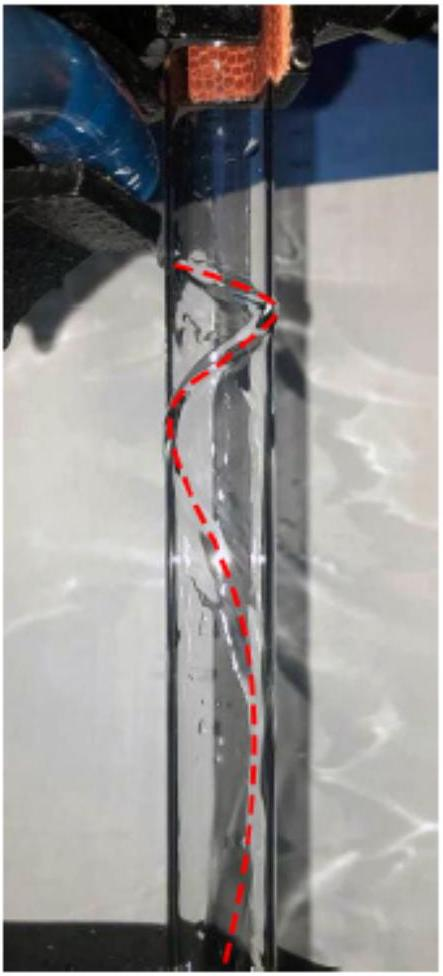
(a) Хорошая спираль

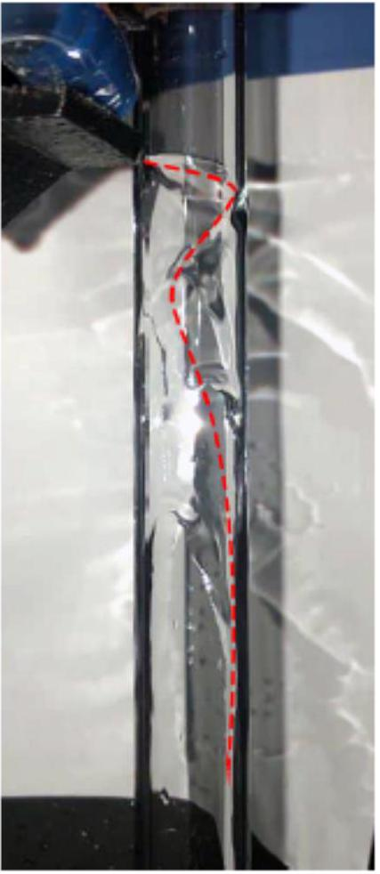
(b) Плохая спираль

Теперь временно закройте кран. Для количественного описания и введем следующие обозначения. Пусть струя жидкости плотности $\rho$ с объемным расходом $Q$ двигается со скоростью $U$ по спирали, накрученной на поверхность вертикально расположенного цилиндра. Угол между вертикалью и направлением струи назовем $\psi$. Пусть ширина струи $W$, а площадь ее сечения $A$.
При этом из-за наличия вязкости внутри струи вдоль ее толщины есть некоторое распределение скоростей, поэтому скорость $U$, которую мы ввели ранее, является в некотором роде фиктивной величиной и просто связывает объемный расход $Q$ и площадь струи $A$ по формуле $Q=A U$.
Спираль опишем с помощью координат ( $X(s), z(s)$ ), где $s$ - натуральная параметризация, т.е. $d s^{2}=d X^{2}+d z^{2}$. В декартовой системе координат тогда спираль будет иметь вид:

$$
\vec{r}(s)=\left(\begin{array}{c}
R \sin \left(\frac{X(s)}{R}\right) \\
R \cos \left(\frac{X(s)}{R}\right) \\
z(s)
\end{array}\right)
$$

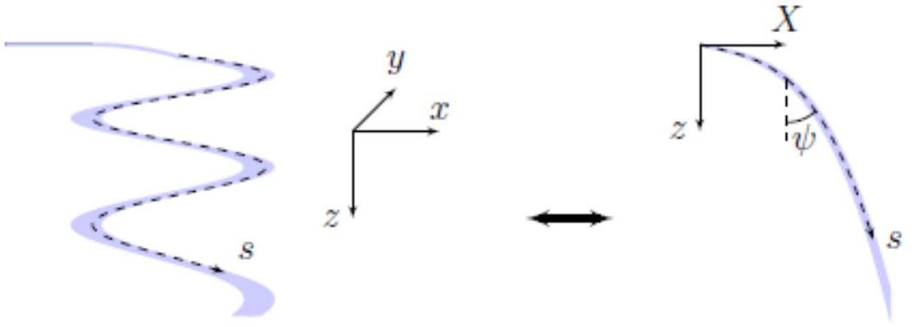

Вам предлагается экспериментально изучить зависимость $z(X)$. Предлагается следующий метод: на листе миллиметровки сделайте дополнительные пометки, чтобы Вам было легче ориентироваться, далее сверните ее и вставьте в пробирку так, чтобы лист плотно прилегал к ней.
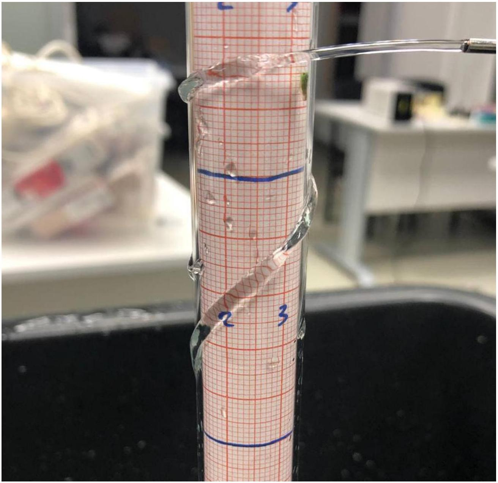

В1 ${ }^{1.50}$ Экспериментально получите зависимость $z(X)$, сделайте не менее 30 измерений. Прочитайте предупреждение ниже.
Внимание!
1.) В частях В и С струя должна попадать на пробирку горизонтально.
2.) В частях В и С необходимо сохранять одни и те же начальные условия с высокой точностью. В качестве возможного варианта решения данной проблемы предлагается установить иглу горизонтально, а также поднести её максимально близко к пробирке, что будет гарантировать постоянное значение $U_{0}$.
3.) После измерения последней точки поставьте U-образный указатель так, как показано на фотографии ниже и закройте кран. Не двигайте ни один из штативов до того, пока не выполните все измерения в частях B и C.
4.) В данном эксперименте очень важна ламинарность потока воды, поэтому убедитесь, что на исследуемой вами высоте, струя ламинарна на протяжении 20 сантиметров.
5.) Сосуд Мариотта подразумевает гермитичность, поэтому при открытых кранах из сосуда время от времени должны издаваться характерные звуки. Если этого не происходит через 10 минут после открытия обоих кранов, то необходимо обратиться к дежурному по аудитории.
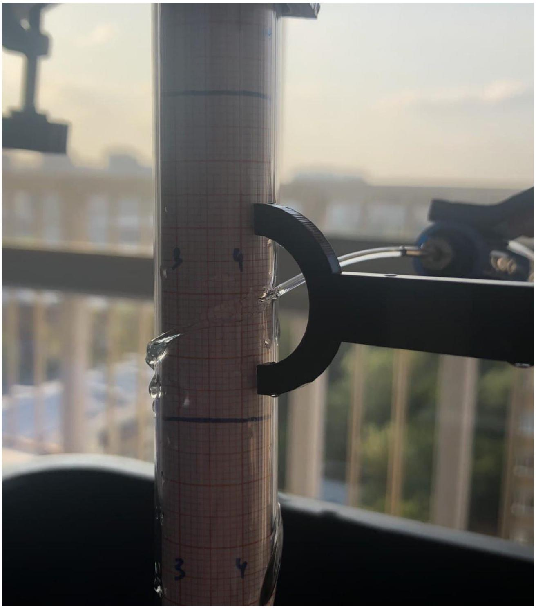

## Часть С. Зависимость формы струи от радиуса пробирки

Теория, которая будет развита нами в части $D$ предсказывает неинтуитивную зависимость $z(X)$ от радиуса пробирки $R$ при фиксированных начальных условиях $U_{0}, \psi_{0}$. Однако, для удобства проведения эксперимента, мы предлагаем измерить до начала теоретических выкладок, как влияет $R$ на параметр струи $\lambda$ - высоту, на которую опускается вода, текущая по спирали, за один целый оборот.
При попытке получить спираль на пробирке меньшего радиуса Вы можете получить просто струю, отклоняющуюся на какой-то угол. В таком случае, Вы можете прислонить струю ближе к пробирке, т.е. игнорировать тот факт, что струя обязана быть максимальна близка к касанию с пробиркой.
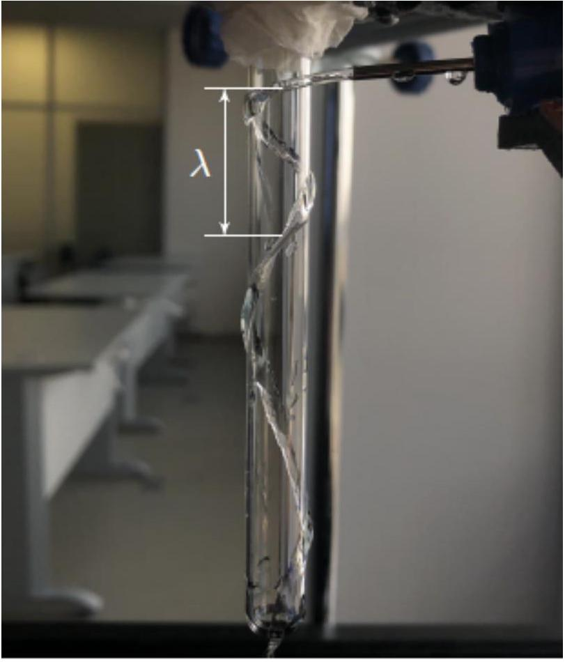

## Часть D. Теоретический расчёт формы струи

В этой части работы все численные расчёты предлагается выполнить используя необходимые данные из части В.
Для дальнейшей работы с теорией предлагается аппроксимировать зависимость $\psi(s)$ параболой. Сейчас мы опишем, как это сделать в случае, когда экстремум находится далеко от $x=0$.

1. Опишем множество пар $\left\{x_{i} ; y_{i}\right\}$ формулой $y=a x^{2}+b x+c$.
2. Запишем функцию отклонения:

$$
\sigma\left(a, b, c,\left\{x_{i}, y_{i}\right\}\right)=\sum_{i}\left(y\left(x_{i}\right)-y_{i}\right)^{2}=\sum_{i}\left(a x_{i}^{2}+b x_{i}+c-y_{i}\right)^{2}
$$

3. Приравняем к нулю частные производные $\frac{\partial \sigma}{\partial a}=\frac{\partial \sigma}{\partial b}=\frac{\partial \sigma}{\partial c}=0$. Решение данной системы уравнений будет является минимумом функции $\sigma\left(a ; b ; c ;\left\{x_{i}, y_{i}\right\}\right)$, так как она является квадратичной формой относительно $a, b$ и $c$ и устремление $a \rightarrow \infty, b \rightarrow \infty$ или $c \rightarrow \infty$ очевидным образом устремляет $\sigma \rightarrow \infty$.
4. Из полученной системы линейных уравнений найдём $a, b$ и $c$. Оптимальность коэффициентов $a, b$ и $c$ гарантируется минимальностью функции ошибок.

D1 ${ }^{2.00}$ Получите коэффициенты $a, b$ и $c$ для параболического приближения зависимости $\psi(s)=a s^{2}+b s+c$.
Для построения теории будем использовать следующие тезисы:

1. «Прижатие» потока воды к пробирке обеспечивает разность давлений $\Delta P$ между внутренней и внешней частями струи.
2. На струю действует сила вязкого трения с коэффициентом вязкости $\eta$. Вязкость определим через силу, действующую на единицу площади жидкости вследствие наличия некоторого градиента параллельной составляющей скорости этой поверхности:

$$
F_{\text {вяз }}=\eta S \cdot \frac{d v}{d z} .
$$

Отвлечемся от нашей спирали для решения небольшого вспомогательного вопроса.
D2 ${ }^{0.70}$ Допустим, что по плоской поверхности твердого тела стационарно и однородно течет слой воды высотой $H$. Можно считать, что разность давлений между точками, лежащими на разных торцах и одной линии тока не зависят от этой линии тока, т.к. иначе они бы искривились. Найдите распределение скорости $u(h)$ внутри этого слоя, где $h$ - высота над поверхностью. Ответ выразите через скорость воды у поверхности $U_{\text {пов }}, h$ и $H$. Выразите силу вязкого трения $F_{\text {вяз, } 1}$, действующую на участок слоя ширины $W$ и длины $L$ со стороны поверхности, через $U_{\text {пов }}, A, W, L, \eta$, где $A=W H$ - площадь сечения.
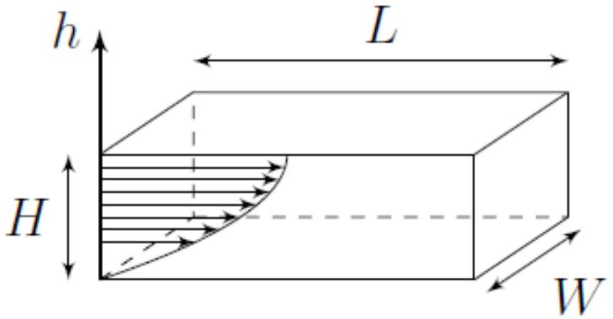

Будем считать, что распределение $u(h)$ внутри нашей струи совпадает с описанным в пункте В1. Отличие геометрии сечения от прямоугольника просто учтем в виде постоянного безразмерного множителя $C$, т.е. если у вас в D2 получился ответ $F_{\text {вяз, } 1}=f\left(U_{\text {пов }}, H, W, L, \eta\right)$, то на участок струи длиной $L$ действует сила $F_{\text {вяз, } 2}=C \cdot f\left(U_{\text {пов }}, H, W, L, \eta\right)$. Также будем считать, что ширина струи $W$ при движении вдоль спирали не меняется и равна диаметру струи $W=D_{j}$ на выходе из источника.

Примечание: Если Вы не сделали пункт А3, то считайте известным $D_{j}=(2.00 \pm 0.04)$ мм.
D3 ${ }^{0.60}$ Выразите $U_{\text {пов }}$ через $U$.

Напомним, что $U$ - некоторая характерная величина, определяемая через выражение $Q=A U$.
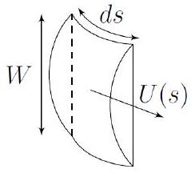
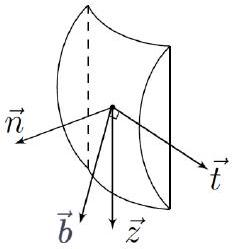
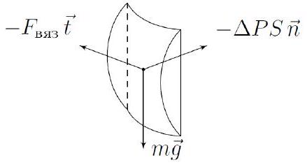

В пунктах D4 - D8 мы будем описывать динамику участка спирали воды длиной $d s$.
D4 ${ }^{0.20}$ Сформулируйте закон сохранения массы для данного кусочка. Выразите ответ через $U, A, d s, \rho$.
D5 ${ }^{1.50}$ Запишите векторный II закон Ньютона в импульсной форме. Возьмите в качестве базиса ортонормированную тройку векторов $(\vec{t}(s), \vec{n}(s), \vec{b}(s)): \vec{t}$ направлен вдоль струи; $\vec{n}$ - направлен перпендикулярно поверхности пробирки от нее; $\vec{b}$ - их ортогональное дополнение (в касательной плоскости перпендикулярно $\vec{t}$ ). При записи изменения импульса струи пренебрегайте распределением скоростей внутри нее и считайте ее равномерным по сечению потоком, двигающимся со скоростью $U(s)$, это приближение можно использовать в силу того, что учет неравномерности скорости в данном члене дает поправку, очень близкую к 1. Воспользуйтесь пунктом $D 4$ для упрощения данного выражения.

D6 ${ }^{0.20}$ Исключите время из уравнения, воспользовавшись тождественностью операторов

$$
\frac{d}{d t} \equiv U \cdot \frac{d}{d s}
$$

D7 ${ }^{0.60}$ Найдите проекции $\frac{d}{d s}(U \vec{t})$ на $\vec{t}$ и $\vec{b}$. Выразите ответы через функции от $U, \psi$ и их производные по $s$.
D8 ${ }^{0.60}$ Воспользовавшись результатами пунктов D4-D7, получите систему из двух диф.уравнений на $U$ и $\psi$ такого вида:

$$
\left\{\begin{array}{l}
\frac{d U}{d s}=-\alpha_{1} U^{2}+\frac{\alpha_{2} \cos \psi}{U} \\
\frac{d \psi}{d s}=-\frac{\beta \sin \psi}{U^{2}},
\end{array}\right.
$$

где $\alpha_{1}, \alpha_{2}$ и $\beta$ - некоторые положительные константы. Выразите их через следующие постоянные: $\eta, U_{0}, D_{j}, \rho, g, C$.
D9 ${ }^{1.20}$ Рассчитайте значение $U$ в экспериментальных точках опираясь на параболическое приближение $\psi(s)$ (пункт D1). Погрешность $U$ можно не оценивать. Постройте график $U(s)$.

D10 ${ }^{0.80}$ Оцените значение $C$.
Для проверки полученного значения $C$ численно решим систему уравнений, полученную в пункте D8 итерационно:

$$
\left\{\begin{array}{l}
U(s+\Delta s) \approx U(s)+\frac{d U}{d s} \Delta s \\
\psi(s+\Delta s) \approx \psi(s)+\frac{d \psi}{d s} \Delta s
\end{array}\right.
$$

D11 ${ }^{1.20}$ Приближенно численно решите дифференциальные уравнения. Найдите вид «теоретической» зависимости $U_{t}(s), \psi_{t}(s), X_{t}(z)$ в не менее чем 15-ти точках.

D12 ${ }^{0.90}$ На графиках $z(X), \psi(s), U(s)$ отметьте точки теоретического моделирования $z_{t}(X), \psi_{t}(s), U_{t}(s)$.

## Часть Е. Наблюдаемость спирали

Будем исследовать наблюдаемость спирали в зависимости от начальной скорости потока $U_{0}$. Рассмотрим ситуацию, когда скорость потока настолько большая, что спираль не образуется, а поток воды просто отклоняется на какой-то угол $\alpha$ от начального направления. Постарайтесь, чтобы поток воды при касании с пробиркой был максимально близок к горизонтальному, а его начальное направление было максимально близко к касательной.
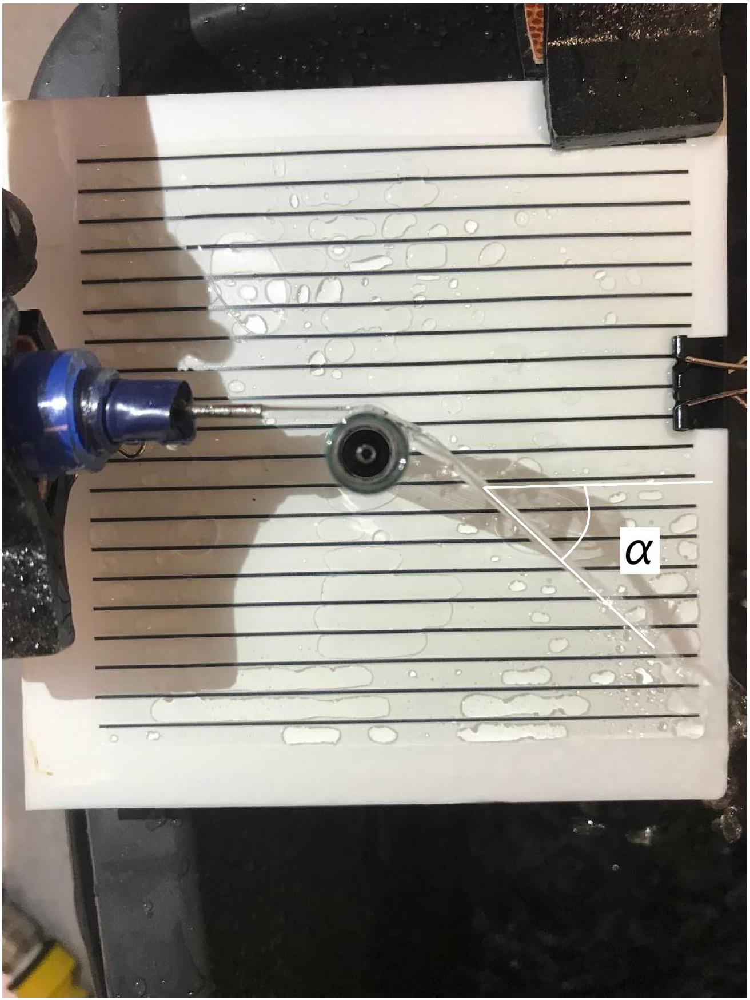

E1 ${ }^{1.50}$ Экспериментально исследуйте зависимость $\alpha\left(U_{0}\right)$, постройте ее график. Сделайте не менее 13 измерений. Подробно опишите методику.
E2 ${ }^{0.50}$ При каком максимальном $U_{\text {крит }}$ наблюдается спираль?

## Константы

$$
\begin{aligned}
& \rho=1.00 \text { кг } / \mathrm{m}^{3} \\
& \eta=8.9 \cdot 10^{-4} \text { Па } \cdot \text { с } \\
& g=9.8 \mathrm{~m} / \mathrm{c}^{2}
\end{aligned}
$$

- Website in English

2020 - Мы те, кого должны превзойти.
